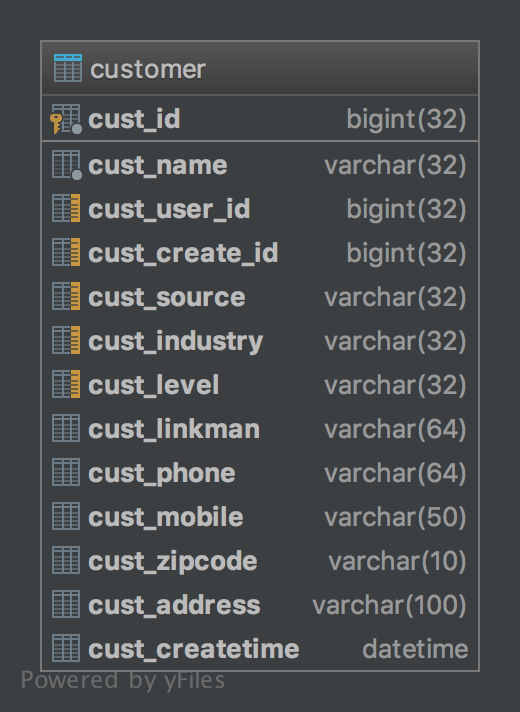

# Java_RunoobTutorial

## 01 Basic Grammer 

一个 Java 程序可以认为是一系列对象的集合，而这些对象通过调用彼此的方法来协同工作。下面简要介绍下类、对象、方法和实例变量的概念。

- **对象**：对象是类的一个实例，有状态和行为。例如，一条狗是一个对象，它的状态有：颜色、名字、品种；行为有：摇尾巴、叫、吃等。
- **类**：类是一个模板，它描述一类对象的行为和状态。
- **方法**：方法就是行为，一个类可以有很多方法。逻辑运算、数据修改以及所有动作都是在方法中完成的。
- **实例变量**：每个对象都有独特的实例变量，对象的状态由这些实例变量的值决定。

### 1.1 第一个 Java 程序

```java
package com.lightwing.ch01_BasicGrammer;

public class HelloWorld {
    /* 这是第一个 Java 程序
     * 它将打印 Hello World
     * 这是一个多行注释的示例
     */
    public static void main(String[] args) {
        // 这是单行注释的示例
        /* 这个也是单行注释的示例 */
        System.out.println("Hello World");
    }
}
```

下面将逐步介绍如何保存、编译以及运行这个程序：

- 打开 SublimeText，把上面的代码添加进去；
- 把文件名保存为：HelloWorld.java；
- 打开 cmd 命令窗口，进入目标文件所在的位置，假设是 C:\
- 在命令行窗口键入 javac HelloWorld.java  按下 enter 键编译代码。如果代码没有错误，cmd 命令提示符会进入下一行。（假设环境变量都设置好了）。
- 再键入 java HelloWorld 按下 Enter 键就可以运行程序了

你将会在窗口看到 Hello World

### 1.2 基本语法

编写 Java 程序时，应注意以下几点：

- **大小写敏感**：Java 是大小写敏感的，这就意味着标识符 Hello 与 hello 是不同的。
- **类名**：对于所有的类来说，类名的首字母应该大写。如果类名由若干单词组成，那么每个单词的首字母应该大写，例如 MyFirstJavaClass 。
- **方法名**：所有的方法名都应该以小写字母开头。如果方法名含有若干单词，则后面的每个单词首字母大写。
- **源文件名**：源文件名必须和类名相同。当保存文件的时候，你应该使用类名作为文件名保存（切记 Java 是大小写敏感的），文件名的后缀为.java。（如果文件名和类名不相同则会导致编译错误）。
- **主方法入口**：所有的 Java 程序由**public static void main(String []args)**方法开始执行。

### 1.3 Java 标识符

Java 所有的组成部分都需要名字。类名、变量名以及方法名都被称为标识符。

关于 Java 标识符，有以下几点需要注意：

- 所有的标识符都应该以字母（A-Z 或者 a-z）,美元符（$）、或者下划线（_）开始
- 首字符之后可以是字母（A-Z 或者 a-z）,美元符（$）、下划线（_）或数字的任何字符组合
- 关键字不能用作标识符
- 标识符是大小写敏感的
- 合法标识符举例：age、$salary、_value、__1_value
- 非法标识符举例：123abc、-salary

### 1.4 Java 修饰符

- 访问控制修饰符 : default, public , protected, private
- 非访问控制修饰符 : final, abstract, strictfp

在后面的章节中我们会深入讨论 Java 修饰符。

### 1.5 Java 变量

Java 中主要有如下几种类型的变量

- 局部变量
- 类变量（静态变量）
- 成员变量（非静态变量）

### 1.6 Java 数组

数组是储存在堆上的对象，可以保存多个同类型变量。在后面的章节中，我们将会学到如何声明、构造以及初始化一个数组。

### 1.7 Java 枚举

Java 5.0引入了枚举，枚举限制变量只能是预先设定好的值。使用枚举可以减少代码中的 bug。

例如，我们为果汁店设计一个程序，它将限制果汁为小杯、中杯、大杯。这就意味着它不允许顾客点除了这三种尺寸外的果汁。

```java
package com.lightwing.ch01_BasicGrammer;

class FreshJuice {
    enum FreshJuiceSize {
        SMALL, MEDIUM, LARGE
    }

    FreshJuiceSize size;
}

class FreshJuiceTest {
    public static void main(String[] args) {
        FreshJuice juice = new FreshJuice();
        juice.size = FreshJuice.FreshJuiceSize.MEDIUM;
    }
}
```

**注意：**枚举可以单独声明或者声明在类里面。方法、变量、构造函数也可以在枚举中定义。 

### 1.8 Java 关键字

下面列出了 Java 关键字。这些保留字不能用于常量、变量、和任何标识符的名称。

| **类别**             | 关键字                       | 说明                 |
| -------------------- | ---------------------------- | -------------------- |
| **访问控制**         | `private`                    | 私有的               |
| |`protected`            | 受保护的                     |
| |`public`               | 公共的                       |
| 类、**方法和变量修饰符** | `abstract`                   | 声明抽象             |
| | `class`              | 类                           |
| | `extends`            | 扩允,继承                    |
| | `final`              | 最终值,不可改变的            |
| | `implements`         | 实现（接口）                 |
| | `interface`          | 接口                         |
| | `native`             | 本地，原生方法（非 Java 实现） |
| | `new`                | 新,创建                      |
| |`static`               | 静态                         |
| | `strictfp`           | 严格,精准                    |
| | `synchronized`       | 线程,同步                    |
| | `transient`          | 短暂                         |
| |`volatile`             | 易失                         |
| **程序控制语句**     | `break`                      | 跳出循环             |
| | `case`               | 定义一个值以供 switch 选择     |
| | `continue`           | 继续                         |
| | `default`            | 默认                         |
| | `do`                 | 运行                         |
| | `else`               | 否则                         |
| | `for`                | 循环                         |
| | `if`                 | 如果                         |
| | `instanceof`         | 实例                         |
| | `return`             | 返回                         |
| | `switch`             | 根据值选择执行               |
| | `while`              | 循环                         |
| **错误处理**         | `assert`                     | 断言表达式是否为真   |
| | `catch`              | 捕捉异常                     |
| | `finally`            | 有没有异常都执行             |
| | `throw`              | 抛出一个异常对象             |
| | `throws`             | 声明一个异常可能被抛出       |
| | `try`                | 捕获异常                     |
| **包相关**           | `import`                     | 引入                 |
| | `package`            | 包                           |
| **基本类型**         | `boolean`                    | 布尔型               |
| | `byte`               | 字节型                       |
| | `char`               | 字符型                       |
| | `double`             | 双精度浮点                   |
| | `float`              | 单精度浮点                   |
| | `int`                | 整型                         |
| | `long`               | 长整型                       |
| | `short`              | 短整型                       |
| **变量引用**         | `super`                      | 父类,超类            |
| | `this`               | 本类                         |
| | `void`               | 无返回值                     |
| **保留关键字**       | `goto`                       | 是关键字，但不能使用 |
|  | `const` | 是关键字，但不能使用 |
| | `null`          | 空        |

### 1.9 Java 注释

```java
package com.lightwing.ch01_BasicGrammer;

public class HelloWorld {
    /* 这是第一个 Java 程序
     * 它将打印 Hello World
     * 这是一个多行注释的示例
     */
    public static void main(String[] args) {
        // 这是单行注释的示例
        /* 这个也是单行注释的示例 */
        System.out.println("Hello World");
    }
}
```

### 1.10 Java 空行

空白行，或者有注释的行，Java 编译器都会忽略掉。

### 1.11 继承

在 Java 中，一个类可以由其他类派生。如果你要创建一个类，而且已经存在一个类具有你所需要的属性或方法，那么你可以将新创建的类继承该类。

利用继承的方法，可以重用已存在类的方法和属性，而不用重写这些代码。被继承的类称为超类（super class），派生类称为子类（subclass）。

### 1.12 接口

在 Java 中，接口可理解为对象间相互通信的协议。接口在继承中扮演着很重要的角色。

接口只定义派生要用到的方法，但是方法的具体实现完全取决于派生类。

### 1.13 Java 源程序与编译型运行区别


## 02 Object Class

Java 作为一种面向对象语言。支持以下基本概念：

- 多态
- 继承
- 封装
- 抽象
- 类
- 对象
- 实例
- 方法
- 重载

本节我们重点研究对象和类的概念。

- **对象**：对象是类的一个实例（**对象不是找个女朋友**），有状态和行为。例如，一条狗是一个对象，它的状态有：颜色、名字、品种；行为有：摇尾巴、叫、吃等。
- **类**：类是一个模板，它描述一类对象的行为和状态。

### 2.1 Java 中的对象

现在让我们深入了解什么是对象。看看周围真实的世界，会发现身边有很多对象，车，狗，人等等。所有这些对象都有自己的状态和行为。

拿一条狗来举例，它的状态有：名字、品种、颜色，行为有：叫、摇尾巴和跑。

对比现实对象和软件对象，它们之间十分相似。

软件对象也有状态和行为。软件对象的状态就是属性，行为通过方法体现。

在软件开发中，方法操作对象内部状态的改变，对象的相互调用也是通过方法来完成。

### 2.2 Java 中的类

类可以看成是创建 Java 对象的模板。

通过下面一个简单的类来理解下 Java 中类的定义：

```java
public class Dog {
    String breed;
    int age;
    String color;

    void barking() {
    }

    void hungry() {
    }

    void sleeping() {
    }
}
```

一个类可以包含以下类型变量：

- **局部变量**：在方法、构造方法或者语句块中定义的变量被称为局部变量。变量声明和初始化都是在方法中，方法结束后，变量就会自动销毁。
- **成员变量**：成员变量是定义在类中，方法体之外的变量。这种变量在创建对象的时候实例化。成员变量可以被类中方法、构造方法和特定类的语句块访问。
- **类变量**：类变量也声明在类中，方法体之外，但必须声明为 static 类型。

一个类可以拥有多个方法，在上面的例子中：barking()、hungry()和 sleeping()都是 Dog 类的方法。

### 2.3 构造方法

每个类都有构造方法。如果没有显式地为类定义构造方法，Java 编译器将会为该类提供一个默认构造方法。

在创建一个对象的时候，至少要调用一个构造方法。构造方法的名称必须与类同名，一个类可以有多个构造方法。

下面是一个构造方法示例：

```java
public class Puppy {
    public Puppy() {
    }

    public Puppy(String name) {
        // 这个构造器仅有一个参数：name
    }
}
```

### 2.4 创建对象

对象是根据类创建的。在 Java 中，使用关键字 new 来创建一个新的对象。创建对象需要以下三步：

- **声明**：声明一个对象，包括对象名称和对象类型。
- **实例化**：使用关键字 new 来创建一个对象。
- **初始化**：使用 new 创建对象时，会调用构造方法初始化对象。

下面是一个创建对象的例子：

```java

```

编译并运行上面的程序，会打印出下面的结果：

```powershell

```

### 2.5 访问实例变量和方法

通过已创建的对象来访问成员变量和成员方法，如下所示：

```java
 /* 实例化对象 */
ObjectReference = new Constructor();
/* 访问类中的变量 */
/* 访问类中的方法 */
ObjectReference.methodName();
```

### 2.6 实例

下面的例子展示如何访问实例变量和调用成员方法：

```java
public class Puppy {
    private int puppyAge;

    private Puppy(String name) {
        // 这个构造器仅有一个参数：name
        System.out.println("小狗的名字是: " + name);
    }

    private void setAge() {
        puppyAge = 2;
    }

    private void getAge() {
        System.out.println("小狗的年龄为: " + puppyAge);
    }

    public static void main(String[] args) {
        // 创建对象
        Puppy myPuppy = new Puppy("tommy");
        // 通过方法来设定 age
        myPuppy.setAge();
        // 调用另一个方法获取 age
        myPuppy.getAge();
        // 你也可以像下面这样访问成员变量
        System.out.println("变量值: " + myPuppy.puppyAge);
    }
}
```

编译并运行上面的程序，产生如下结果：

```powershell
小狗的名字是: Tommy
小狗的年龄为: 2
变量值: 2
```

### 2.7 源文件声明规则 

在本节的最后部分，我们将学习源文件的声明规则。当在一个源文件中定义多个类，并且还有 import 语句和 package 语句时，要特别注意这些规则。

- 一个源文件中只能有一个 public 类
- 一个源文件可以有多个非 public 类
- 源文件的名称应该和 public 类的类名保持一致。例如：源文件中 public 类的类名是 Employee，那么源文件应该命名为 Employee.java。
- 如果一个类定义在某个包中，那么 package 语句应该在源文件的首行。
- 如果源文件包含 import 语句，那么应该放在 package 语句和类定义之间。如果没有 package 语句，那么 import 语句应该在源文件中最前面。
- import 语句和 package 语句对源文件中定义的所有类都有效。在同一源文件中，不能给不同的类不同的包声明。

类有若干种访问级别，并且类也分不同的类型：抽象类和 final 类等。这些将在访问控制章节介绍。

除了上面提到的几种类型，Java 还有一些特殊的类，如：内部类、匿名类。

### 2.8 Java 包

包主要用来对类和接口进行分类。当开发 Java 程序时，可能编写成百上千的类，因此很有必要对类和接口进行分类。

### 2.9 Import 语句

在 Java 中，如果给出一个完整的限定名，包括包名、类名，那么 Java 编译器就可以很容易地定位到源代码或者类。Import 语句就是用来提供一个合理的路径，使得编译器可以找到某个类。

例如，下面的命令行将会命令编译器载入 `java_installation/java/io` 路径下的所有类

```java
import java.io.*;
```

### 2.10 一个简单的例子

在该例子中，我们创建两个类：**`Employee`** 和 `**EmployeeTest**`。

首先打开文本编辑器，把下面的代码粘贴进去。注意将文件保存为 Employee.java。

Employee 类有四个成员变量：name、age、designation 和 salary。该类显式声明了一个构造方法，该方法只有一个参数。

```java
public class Employee {
    private String name;
    private int age;
    private String designation;
    private double salary;

    // Employee 类的构造器
    public Employee(String name) {
        this.name = name;
    }

    // 设置 age 的值
    void empAge(int empAge) {
        age = empAge;
    }

    // 设置 designation 的值
    void empDesignation(String empDesig) {
        designation = empDesig;
    }

    // 设置 salary 的值
    void empSalary(double empSalary) {
        salary = empSalary;
    }

    // 打印信息
    void printEmployee() {
        System.out.println("Name: " + name);
        System.out.println("Age: " + age);
        System.out.println("Position: " + designation);
        System.out.println("Salary: " + String.format("%,.2f", salary));
    }
}
```

程序都是从 main 方法开始执行。为了能运行这个程序，必须包含 main 方法并且创建一个实例对象。

下面给出 EmployeeTest 类，该类实例化2个 Employee 类的实例，并调用方法设置变量的值。

将下面的代码保存在 EmployeeTest.java 文件中。

```java
public class EmployeeTest {
    public static void main(String[] args) {
        // 使用构造器创建两个对象
        Employee empOne = new Employee("Lightwing Ng");
        Employee empTwo = new Employee("Jason Wong");

        // 调用这两个对象的成员方法
        empOne.empAge(26);
        empOne.empDesignation("Advanced Programmer");
        empOne.empSalary(19000);
        empOne.printEmployee();

        empTwo.empAge(21);
        empTwo.empDesignation("Starter Programmer");
        empTwo.empSalary(2500);
        empTwo.printEmployee();
    }
}
```

编译这两个文件并且运行 EmployeeTest 类，可以看到如下结果：

```powershell
Name: Lightwing Ng
Age: 26
Position: Advanced Programmer
Salary: 19,000.00
Name: Jason Wong
Age: 21
Position: Starter Programmer
Salary: 2,500.00
```

## 03 Basic Data Type

变量就是申请内存来存储值。也就是说，当创建变量的时候，需要在内存中申请空间。

内存管理系统根据变量的类型为变量分配存储空间，分配的空间只能用来储存该类型数据。


因此，通过定义不同类型的变量，可以在内存中储存整数、小数或者字符。

Java 的两大数据类型:

- 内置数据类型
- 引用数据类型

### 3.1 内置数据类型

Java 语言提供了8种基本类型。6种数字类型（4个整数型，2个浮点型），一种字符类型，还有一种布尔型。

#### **byte**

- byte 数据类型是8位、有符号的，以二进制补码表示的整数；
- 最小值是 `-128（-2^7）`；
- 最大值是 `127（2^7-1）`；
- 默认值是 `0`；
- byte 类型用在大型数组中节约空间，主要代替整数，因为 byte 变量占用的空间只有 int 类型的四分之一；
- 例子：byte a = 100，byte b = -50。

#### short

- short 数据类型是 16 位、有符号的以二进制补码表示的整数
- 最小值是 `-32768（-2^15）`；
- 最大值是 `32767（2^15 - 1）`；
- Short 数据类型也可以像 byte 那样节省空间。一个 short 变量是 int 型变量所占空间的二分之一；
- 默认值是 0；
- 例子：short s = 1000，short r = -20000。

#### int

- int 数据类型是32位、有符号的以二进制补码表示的整数；
- 最小值是 `-2,147,483,648（-2^31）`；
- 最大值是 `2,147,483,647（2^31 - 1）`；
- 一般地整型变量默认为 int 类型；
- 默认值是 0 ；
- 例子：int a = 100000, int b = -200000。

#### long

- long 数据类型是 64 位、有符号的以二进制补码表示的整数；
- 最小值是 `-9,223,372,036,854,775,808（-2^63）`；
- 最大值是 `9,223,372,036,854,775,807（2^63 -1）`；
- 这种类型主要使用在需要比较大整数的系统上；
- 默认值是 0L；
- 例子： long a = 100000L，Long b = -200000L。
  "L"理论上不分大小写，但是若写成"l"容易与数字"1"混淆，不容易分辩。所以最好大写。

#### float

- float 数据类型是单精度、32位、符合 IEEE 754标准的浮点数；
- float 在储存大型浮点数组的时候可节省内存空间；
- 默认值是 `0.0f`；
- 浮点数不能用来表示精确的值，如货币；
- 例子：float f1 = 234.5f。

#### double

- double 数据类型是双精度、64 位、符合 IEEE 754标准的浮点数；
- 浮点数的默认类型为 double 类型；
- double 类型同样不能表示精确的值，如货币；
- 默认值是 `0.0d`；
- 例子：double d1 = 123.4。

#### boolean

- boolean 数据类型表示一位的信息；
- 只有两个取值：true 和 false；
- 这种类型只作为一种标志来记录 true/false 情况；
- 默认值是 `false`；
- 例子：boolean one = true。

#### char

- char 类型是一个单一的 16 位 Unicode 字符；
- 最小值是 `\u0000`（即为0）；
- 最大值是 `\uffff`（即为65,535）；
- char 数据类型可以储存任何字符；
- 例子：char letter = 'A';。

### 3.2 实例

对于数值类型的基本类型的取值范围，我们无需强制去记忆，因为它们的值都已经以常量的形式定义在对应的包装类中了。请看下面的例子：

```java
public class PrimitiveTypeTest {
    public static void main(String[] args) {
        // byte
        System.out.println("基本类型：byte 二进制位数：" + Byte.SIZE);
        System.out.println("包装类：java.lang.Byte");
        System.out.println("最小值：Byte.MIN_VALUE=" + Byte.MIN_VALUE);
        System.out.println("最大值：Byte.MAX_VALUE=" + Byte.MAX_VALUE);
        System.out.println();

        // short
        System.out.println("基本类型：short 二进制位数：" + Short.SIZE);
        System.out.println("包装类：java.lang.Short");
        System.out.println("最小值：Short.MIN_VALUE=" + Short.MIN_VALUE);
        System.out.println("最大值：Short.MAX_VALUE=" + Short.MAX_VALUE);
        System.out.println();

        // int
        System.out.println("基本类型：int 二进制位数：" + Integer.SIZE);
        System.out.println("包装类：java.lang.Integer");
        System.out.println("最小值：Integer.MIN_VALUE=" + Integer.MIN_VALUE);
        System.out.println("最大值：Integer.MAX_VALUE=" + Integer.MAX_VALUE);
        System.out.println();

        // long
        System.out.println("基本类型：long 二进制位数：" + Long.SIZE);
        System.out.println("包装类：java.lang.Long");
        System.out.println("最小值：Long.MIN_VALUE=" + Long.MIN_VALUE);
        System.out.println("最大值：Long.MAX_VALUE=" + Long.MAX_VALUE);
        System.out.println();

        // float
        System.out.println("基本类型：float 二进制位数：" + Float.SIZE);
        System.out.println("包装类：java.lang.Float");
        System.out.println("最小值：Float.MIN_VALUE=" + Float.MIN_VALUE);
        System.out.println("最大值：Float.MAX_VALUE=" + Float.MAX_VALUE);
        System.out.println();

        // double
        System.out.println("基本类型：double 二进制位数：" + Double.SIZE);
        System.out.println("包装类：java.lang.Double");
        System.out.println("最小值：Double.MIN_VALUE=" + Double.MIN_VALUE);
        System.out.println("最大值：Double.MAX_VALUE=" + Double.MAX_VALUE);
        System.out.println();

        // char
        System.out.println("基本类型：char 二进制位数：" + Character.SIZE);
        System.out.println("包装类：java.lang.Character");
        // 以数值形式而不是字符形式将 Character.MIN_VALUE 输出到控制台
        System.out.println("最小值：Character.MIN_VALUE="
                + (int) Character.MIN_VALUE);
        // 以数值形式而不是字符形式将 Character.MAX_VALUE 输出到控制台
        System.out.println("最大值：Character.MAX_VALUE="
                + (int) Character.MAX_VALUE);
    }
}
```

编译以上代码输出结果如下所示：

```powershell
基本类型：byte 二进制位数：8
包装类：java.lang.Byte
最小值：Byte.MIN_VALUE=-128
最大值：Byte.MAX_VALUE=127

基本类型：short 二进制位数：16
包装类：java.lang.Short
最小值：Short.MIN_VALUE=-32768
最大值：Short.MAX_VALUE=32767

基本类型：int 二进制位数：32
包装类：java.lang.Integer
最小值：Integer.MIN_VALUE=-2147483648
最大值：Integer.MAX_VALUE=2147483647

基本类型：long 二进制位数：64
包装类：java.lang.Long
最小值：Long.MIN_VALUE=-9223372036854775808
最大值：Long.MAX_VALUE=9223372036854775807

基本类型：float 二进制位数：32
包装类：java.lang.Float
最小值：Float.MIN_VALUE=1.4E-45
最大值：Float.MAX_VALUE=3.4028235E38

基本类型：double 二进制位数：64
包装类：java.lang.Double
最小值：Double.MIN_VALUE=4.9E-324
最大值：Double.MAX_VALUE=1.7976931348623157E308

基本类型：char 二进制位数：16
包装类：java.lang.Character
最小值：Character.MIN_VALUE=0
最大值：Character.MAX_VALUE=65535
```

Float 和 Double 的最小值和最大值都是以科学记数法的形式输出的，结尾的"E+数字"表示 E 之前的数字要乘以10的多少次方。比如3.14E3就是3.14 × 103 =3140，3
.14E-3 就是 3.14 x 10-3 =0.00314。

实际上，Java 中还存在另外一种基本类型 void，它也有对应的包装类 `java.lang.Void`，不过我们无法直接对它们进行操作。

### 3.3 引用类型

- 在 Java 中，**引用类型的变量非常类似于 C/C++ 的指针**。引用类型指向一个对象，指向对象的变量是引用变量。这些变量在声明时被指定为一个特定的类型，比如 Employee、Puppy 
等。变量一旦声明后，类型就不能被改变了。
- 对象、数组都是引用数据类型。
- 所有引用类型的默认值都是 null。
- 一个引用变量可以用来引用任何与之兼容的类型。
- 例子：`Site site = new Site("Runoob")`。

### 3.4 Java 常量

常量在程序运行时是不能被修改的。

在 Java 中使用 final 关键字来修饰常量，声明方式和变量类似：

```java
final double PI = 3.1415927;
```

虽然常量名也可以用小写，但为了便于识别，通常使用大写字母表示常量。

字面量可以赋给任何内置类型的变量。例如：

```java
byte a = 68;
char a = 'A'
```

byte、int、long、和 short 都可以用十进制、16进制以及8进制的方式来表示。

当使用常量的时候，前缀 0 表示 8 进制，而前缀 0x 代表 16 进制, 例如：

```java
int decimal = 100;
int octal = 0144;
int hexa =  0x64;
```

和其他语言一样，Java 的字符串常量也是包含在两个引号之间的字符序列。下面是字符串型字面量的例子：

```java
"Hello World"
"two\nlines"
"\"This is in quotes\""
```

字符串常量和字符常量都可以包含任何 Unicode 字符。例如：

```java
char a = '\u0001';
String a = "\u0001";
```

Java 语言支持一些特殊的转义字符序列。

| 符号   | 字符含义                 |
| ------ | ------------------------ |
| \n     | 换行 (0x0a)              |
| \r     | 回车 (0x0d)              |
| \f     | 换页符(0x0c)             |
| \b     | 退格 (0x08)              |
| \0     | 空字符 (0x20)            |
| \s     | 字符串                   |
| \t     | 制表符                   |
| \"     | 双引号                   |
| \'     | 单引号                   |
| \\     | 反斜杠                   |
| \ddd   | 八进制字符 (ddd)         |
| \uxxxx | 16进制 Unicode 字符 (xxxx) |

### 3.5 自动类型转换

**整型、实型（常量）、字符型数据可以混合运算。运算中，不同类型的数据先转化为同一类型，然后进行运算。**

转换从低级到高级。

```java
低  ------------------------------------>  高

byte, short, char —> int —> long—> float —> double 
```

数据类型转换必须满足如下规则：

1. 不能对 boolean 类型进行类型转换。
2. 不能把对象类型转换成不相关类的对象。
3. 在把容量大的类型转换为容量小的类型时必须使用强制类型转换。
4. 转换过程中可能导致溢出或损失精度，例如：

```java
int i =128;   
byte b = (byte)i;
```

因为 byte 类型是 8 位，最大值为127，所以当 int 强制转换为 byte 类型时，值 128 时候就会导致溢出。

5. 浮点数到整数的转换是通过舍弃小数得到，而不是四舍五入，例如：

```java
(int)23.7 == 23;        
(int)-45.89f == -45
```

必须满足转换前的数据类型的位数要低于转换后的数据类型，例如: short 数据类型的位数为16位，就可以自动转换位数为32的 int 类型，同样 float 数据类型的位数为32，可以自动转换为64
位的 double 类型。

```java
public class AutomaticTypeConversion {
    public static void main(String[] args) {
        // char 自动类型转换为 int
        int i1 = 'a';
        System.out.println("char 自动类型转换为 int 后的值等于" + i1);
        // 定义一个 char 类型
        char c2 = 'A';
        // char 类型和 int 类型计算
        int i2 = c2 + 1;
        System.out.println("char 类型和 int 计算后的值等于" + i2);
    }
}
```

运行结果为:

```powershell
char 自动类型转换为 int 后的值等于97
char 类型和 int 计算后的值等于66
```

**解析：**c1 的值为字符 **a** ,查 ASCII 码表可知对应的 int 类型值为 97， A 对应值为 65，所以 i2=65+1=66。

### 3.6 强制类型转换

1. 条件是转换的数据类型必须是兼容的。
2. 格式：`(type)value type` 是要强制类型转换后的数据类型，实例：

```java
public class ForcedTypeConversion {
    public static void main(String[] args) {
        int i1 = 123;
        // 强制类型转换为 byte
        byte b = (byte) i1;
        System.out.println("int 强制类型转换为 byte 后的值等于" + b);
    }
}
```

运行结果：

```powershell
int 强制类型转换为 byte 后的值等于123
```

### 3.7 隐含强制类型转换

1. 整数的默认类型是 int。
2. 浮点型不存在这种情况，因为在定义 float 类型时必须在数字后面跟上 F 或者 f。

这一节讲解了 Java 的基本数据类型。下一节将探讨不同的变量类型以及它们的用法。

## 04 Variable Type

在 Java 语言中，所有的变量在使用前必须声明。声明变量的基本格式如下：

```java
type identifier [ = value][, identifier [= value] ...] ;
```

格式说明：type 为 Java 数据类型。identifier 是变量名。可以使用逗号隔开来声明多个同类型变量。

以下列出了一些变量的声明实例。注意有些包含了初始化过程。

```java
int a, b, c;         // 声明三个 int 型整数：a、 b、c
int d = 3, e = 4, f = 5; // 声明三个整数并赋予初值
byte z = 22;         // 声明并初始化 z
String s = "runoob"; // 声明并初始化字符串 s
double pi = 3.14159; // 声明了双精度浮点型变量 pi
char x = 'x';        // 声明变量 x 的值是字符 'x'。
```

Java 语言支持的变量类型有：

- 类变量：独立于方法之外的变量，用 `static` 修饰。
- 实例变量：独立于方法之外的变量，不过没有 `static` 修饰。
- 局部变量：**类的方法中**的变量。

```java
public class Variable {
    static int allClicks = 0;   // 类变量
    String str = "hello world"; // 实例变量
    public void method() {
        int i = 0;              // 局部变量
    }
}
```

### 4.1 Java 局部变量

- 局部变量声明在方法、构造方法或者语句块中；
- 局部变量在方法、构造方法、或者语句块被执行的时候创建，当它们执行完成后，变量将会被销毁；
- 访问修饰符不能用于局部变量；
- 局部变量只在声明它的方法、构造方法或者语句块中可见；
- 局部变量是在栈上分配的。
- 局部变量没有默认值，所以局部变量被声明后，必须经过初始化，才可以使用。

#### 4.1.1 实例1

在以下实例中 age 是一个局部变量。定义在 pupAge() 方法中，它的作用域就限制在这个方法中。

```java
public class Test {
    public void pupAge() {
        int age = 0;
        age += 7;
        System.out.println("小狗的年龄是: " + age);
    }
    public static void main(String[] args) {
        Test test = new Test();
        test.pupAge();
    }
}
```

以上实例编译运行结果如下:

```shell
小狗的年龄是: 7
```

#### 4.1.2 实例2

在下面的例子中 age 变量没有初始化，所以在编译时会出错：

```java
public class Test {
    public void pupAge() {
        int age;
        age = age + 7;
        System.out.println("小狗的年龄是 : " + age);
    }
    public static void main(String[] args) {
        Test test = new Test();
        test.pupAge();
    }
}
```

以上实例编译运行结果如下:

```powershell
Test.java:4:variable number might not have been initialized
age = age + 7;
         ^
1 error
```

### 4.2 Java 实例变量

- 实例变量声明在一个类中，但在方法、构造方法和语句块之外；
- 当一个对象被实例化之后，每个实例变量的值就跟着确定；
- 实例变量在对象创建的时候创建，在对象被销毁的时候销毁；
- 实例变量的值应该至少被一个方法、构造方法或者语句块引用，使得外部能够通过这些方式获取实例变量信息；
- 实例变量可以声明在使用前或者使用后；
- 访问修饰符可以修饰实例变量；
- 实例变量对于类中的方法、构造方法或者语句块是可见的。一般情况下应该把实例变量设为私有。通过使用访问修饰符可以使实例变量对子类可见；
- 实例变量具有默认值。数值型变量的默认值是0，布尔型变量的默认值是 false，引用类型变量的默认值是 null。变量的值可以在声明时指定，也可以在构造方法中指定；
- 实例变量可以直接通过变量名访问。但在静态方法以及其他类中，就应该使用完全限定名：`ObejectReference.VariableName`。

#### 实例

```java
public class Employee {
    // 这个实例变量对子类可见
    private String name;
    // 私有变量，仅在该类可见
    private double salary;

    // 在构造器中对 name 赋值
    private Employee(String empName) {
        name = empName;
    }

    // 设定 salary 的值
    private void setSalary() {
        salary = (double) 28850;
    }

    // 打印信息
    private void printEmp() {
        System.out.println("Name: " + name);
        System.out.println("Salary: " + String.format("%,.2f", salary));
    }

    public static void main(String[] args) {
        Employee empOne = new Employee("Lightwing Ng");
        empOne.setSalary();
        empOne.printEmp();
    }
}
```

以上实例编译运行结果如下:

```powershell
Name: Lightwing Ng
Salary: 28,850.00
```

### 4.3 Java 类变量（静态变量）

- 类变量也称为静态变量，在类中以 static 关键字声明，但必须在方法构造方法和语句块之外。
- 无论一个类创建了多少个对象，类只拥有类变量的一份拷贝。
- 静态变量除了被声明为常量外很少使用。常量是指声明为 public/private，final 和 static 类型的变量。常量初始化后不可改变。
- 静态变量储存在静态存储区。经常被声明为常量，很少单独使用 static 声明变量。
- 静态变量在第一次被访问时创建，在程序结束时销毁。
- 与实例变量具有相似的可见性。但为了对类的使用者可见，大多数静态变量声明为 public 类型。
- 默认值和实例变量相似。数值型变量默认值是0，布尔型默认值是 false，引用类型默认值是 null。变量的值可以在声明的时候指定，也可以在构造方法中指定。此外，静态变量还可以在静态语句块中初始化。
- 静态变量可以通过：*`ClassName.VariableName`* 的方式访问。
- 类变量被声明为 public static final 类型时，类变量名称一般建议使用大写字母。如果静态变量不是 public 和 final 
类型，其命名方式与实例变量以及局部变量的命名方式一致。

#### 实例

```java
public class StaticEmployee {
    // DEPARTMENT 是一个常量
    private static final String DEPARTMENT = "开发人员";

    public static void main(String[] args) {
        // salary 是静态的私有变量
        double salary = 10000;
        System.out.println(DEPARTMENT + "平均工资: " + String.format("%,.2f", salary));
    }
}
```

以上实例编译运行结果如下:

```powershell
开发人员平均工资: 10,000.00
```

**注意：**如果其他类想要访问该变量，可以这样访问：**`Employee.DEPARTMENT`**。

本章节中我们学习了 Java 的变量类型，下一章节中我们将介绍 Java 修饰符的使用。

## 05 Modifier

Java 语言提供了很多修饰符，主要分为以下两类：

- 访问修饰符
- 非访问修饰符

修饰符用来定义类、方法或者变量，通常放在语句的最前端。我们通过下面的例子来说明：

```java
public class className {
	// ...
}
private boolean myFlag;
static final double weeks = 9.5;
protected static final int BOXWIDTH = 42;
public static void main(String[] arguments) {
	// 方法体
}
```

### 5.1 访问控制修饰符

Java 中，可以使用访问控制符来保护对类、变量、方法和构造方法的访问。Java 支持 4 种不同的访问权限。

- **`default`** (即缺省，什么也不写）: 在同一包内可见，不使用任何修饰符。使用对象：类、接口、变量、方法。
- **`private`** : 在同一类内可见。使用对象：变量、方法。 **注意：不能修饰类（外部类）**
- **`public`** : 对所有类可见。使用对象：类、接口、变量、方法
- **`protected`** : 对同一包内的类和所有子类可见。使用对象：变量、方法。 **注意：不能修饰类（外部类）**。

我们可以通过以下表来说明访问权限：

| 修饰符      | 当前类 | 同一包内 | 子孙类(同一包) | 子孙类(不同包)                                               | 其他包 |
| ----------- | ------ | -------- | -------------- | ------------------------------------------------------------ | ------ |
| `public`    | Y      | Y        | Y              | Y                                                            | Y      |
| `protected` | Y      | Y        | Y              | Y/N（[说明](http://www.runoob.com/java/java-modifier-types.html#protected-desc)） | N      |
| `default`   | Y      | Y        | Y              | N                                                            | N      |
| `private`   | Y      | N        | N              | N                                                            | N      |

#### 5.1.1 默认访问修饰符-不使用任何关键字

使用默认访问修饰符声明的变量和方法，对同一个包内的类是可见的。接口里的变量都隐式声明为 public static final,而接口里的方法默认情况下访问权限为 public。

如下例所示，变量和方法的声明可以不使用任何修饰符。

```java
String version = "1.5.1";
boolean processOrder() {
    return true;
}
```

#### 5.1.2 私有访问修饰符-private

私有访问修饰符是最严格的访问级别，所以被声明为 **private** 的方法、变量和构造方法只能被所属类访问，并且类和接口不能声明为 **private**。

声明为私有访问类型的变量只能通过类中公共的 getter 方法被外部类访问。

Private 访问修饰符的使用主要用来隐藏类的实现细节和保护类的数据。

下面的类使用了私有访问修饰符：

```java
public class Logger {
    private String format;
    public String getFormat() {
        return this.format;
    }
    public void setFormat(String format) {
        this.format = format;
    }
}
```

实例中，Logger 类中的 format 变量为私有变量，所以其他类不能直接得到和设置该变量的值。为了使其他类能够操作该变量，定义了两个 public 方法：getFormat() （返回 
format 的值）和 setFormat(String)（设置 format 的值）

#### 5.1.3 公有访问修饰符-public

被声明为 public 的类、方法、构造方法和接口能够被任何其他类访问。

如果几个相互访问的 public 类分布在不同的包中，则需要导入相应 public 类所在的包。由于类的继承性，类所有的公有方法和变量都能被其子类继承。

以下函数使用了公有访问控制：

```java
public static void main(String[] arguments) {
    // ...
}
```

**Java 程序的 main() 方法必须设置成公有的，否则，Java 解释器将不能运行该类。**

#### 5.1.4 受保护的访问修饰符-protected

protected 需要从以下两个点来分析说明：

- **子类与基类在同一包中**：被声明为 protected 的变量、方法和构造器能被同一个包中的任何其他类访问；
- **子类与基类不在同一包中**：那么在子类中，子类实例可以访问其从基类继承而来的 protected 方法，而不能访问基类实例的 protected 方法。

protected 访问修饰符可以修饰类及其方法和成员变量能够声明，但是接口及接口的成员变量和成员方法不能声明为 protected。 可以看看以下颜色图理解：


子类能访问 protected 修饰符声明的方法和变量，这样就能保护不相关的类使用这些方法和变量。

下面的父类使用了 protected 访问修饰符，子类重写了父类的 openSpeaker() 方法。

```java
class AudioPlayer {
    protected boolean openSpeaker(Speaker sp) {
        // 实现细节
    }
}
class StreamingAudioPlayer extends AudioPlayer {
    protected boolean openSpeaker(Speaker sp) {
        // 实现细节
    }
}
```

如果把 openSpeaker() 方法声明为 private，那么除了 AudioPlayer 之外的类将不能访问该方法。

如果把 openSpeaker() 声明为 public，那么所有的类都能够访问该方法。

如果我们只想让该方法对其所在类的子类可见，则将该方法声明为 protected。

#### 5.1.5 访问控制和继承

请注意以下方法继承的规则：

- 父类中声明为 public 的方法在子类中也必须为 public。
- 父类中声明为 protected 的方法在子类中要么声明为 protected，要么声明为 public，不能声明为 private。
- 父类中声明为 private 的方法，不能够被继承。

### 5.2 非访问修饰符

为了实现一些其他的功能，Java 也提供了许多非访问修饰符。

static 修饰符，用来修饰类方法和类变量。

final 修饰符，用来修饰类、方法和变量，final 修饰的类不能够被继承，修饰的方法不能被继承类重新定义，修饰的变量为常量，是不可修改的。

abstract 修饰符，用来创建抽象类和抽象方法。

synchronized 和 volatile 修饰符，主要用于线程的编程。

#### 5.2.1 static 修饰符

- **静态变量：**

  static 关键字用来声明独立于对象的静态变量，无论一个类实例化多少对象，它的静态变量只有一份拷贝。 静态变量也被称为类变量。局部变量不能被声明为 static 变量。

- **静态方法：**

  static 关键字用来声明独立于对象的静态方法。静态方法不能使用类的非静态变量。静态方法从参数列表得到数据，然后计算这些数据。

对类变量和方法的访问可以直接使用 **`classname.variablename`** 和 **`classname.methodname`** 的方式访问。

如下例所示，static 修饰符用来创建类方法和类变量。

```java
public class InstanceCounter {
    private static int numInstances = 0;

    private static int getCount() {
        return numInstances;
    }

    private static void addInstance() {
        numInstances++;
    }

    private InstanceCounter() {
        InstanceCounter.addInstance();
    }

    public static void main(String[] arguments) {
        System.out.println("Starting with " +
                InstanceCounter.getCount() + " instances");
        for (int i = 0; i < 500; ++i)
            new InstanceCounter();

        System.out.println("Created " +
                InstanceCounter.getCount() + " instances");
    }
}
```

以上实例运行编辑结果如下:

```powershell
Starting with 0 instances
Created 500 instances
```

#### 5.2.2 final 修饰符

##### 5.2.2.1 **final** 变量

final 变量能被显式地初始化并且只能初始化一次。被声明为 final 的对象的引用不能指向不同的对象。但是 final 对象里的数据可以被改变。也就是说 final 对象的引用不能改变，但是里面的值可以改变。

final 修饰符通常和 static 修饰符一起使用来创建类常量。

```java
public class Test {
    final int value = 10;
    // 下面是声明常量的实例
    public static final int BOXWIDTH = 6;
    static final String TITLE = "Manager";
    public void changeValue() {
        value = 12; // 将输出一个错误
    }
}
```

##### 5.2.2.2 **final 方法**

类中的 final 方法可以被子类继承，但是不能被子类修改。

声明 final 方法的主要目的是防止该方法的内容被修改。

如下所示，使用 final 修饰符声明方法。

```java
public class Test {
    public final void changeName() {
        // 方法体
    }
}
```

##### 5.2.2.3 **final 类**

final 类不能被继承，没有类能够继承 final 类的任何特性。

```java
public final class Test {
    // 类体
}
```

#### 5.2.3 abstract 修饰符

##### 5.2.3.1 **抽象类：**

抽象类不能用来实例化对象，声明抽象类的唯一目的是为了将来对该类进行扩充。

一个类不能同时被 abstract 和 final 修饰。如果一个类包含抽象方法，那么该类一定要声明为抽象类，否则将出现编译错误。

抽象类可以包含抽象方法和非抽象方法。

```java
abstract class Caravan {
    private double price;
    private String model;
    private String year;

    // 抽象方法
    public abstract void goFast();
    public abstract void changeColor();
}
```

##### 5.2.3.2 **抽象方法**

抽象方法是一种没有任何实现的方法，该方法的的具体实现由子类提供。

抽象方法不能被声明成 final 和 static。

任何继承抽象类的子类必须实现父类的所有抽象方法，除非该子类也是抽象类。

如果一个类包含若干个抽象方法，那么该类必须声明为抽象类。抽象类可以不包含抽象方法。

抽象方法的声明以分号结尾，例如：`**public abstract sample()`;**。

```java
public abstract class SuperClass {
    abstract void m(); // 抽象方法
}
class SubClass extends SuperClass {
    // 实现抽象方法
    void m() {
        ...
    }
}
```

#### 5.2.4 synchronized 修饰符

synchronized 关键字声明的方法同一时间只能被一个线程访问。synchronized 修饰符可以应用于四个访问修饰符。

```java
public synchronized void showDetails() {
    ...
}
```

#### 5.2.5 transient 修饰符

序列化的对象包含被 transient 修饰的实例变量时，java 虚拟机(JVM)跳过该特定的变量。

该修饰符包含在定义变量的语句中，用来预处理类和变量的数据类型。

```java
public transient int limit = 55; // 不会持久化
public int b; // 持久化
```

#### 5.2.6 volatile 修饰符

volatile 修饰的成员变量在每次被线程访问时，都强制从共享内存中重新读取该成员变量的值。而且，当成员变量发生变化时，会强制线程将变化值回写到共享内存。这样在任何时刻，两个不同的线程总是看到某个成员变量的同一个值。

一个 volatile 对象引用可能是 null。

```java
public class MyRunnable implements Runnable {
    private volatile boolean active;

    public void run() {
        active = true;
        int i = 0;
        while (active) {
            // 第一行
            System.out.println(++i);
        }
    }

    public void stop() {
        active = false; // 第二行
    }
}
```

通常情况下，在一个线程调用 run() 方法（在 Runnable 开启的线程），在另一个线程调用 stop() 方法。 如果 **第一行** 中缓冲区的 active 值被使用，那么在 **第二行** 的 active 值为 false 时循环不会停止。

但是以上代码中我们使用了 volatile 修饰 active，所以该循环会停止。

## 06 Operator

计算机的最基本用途之一就是执行数学运算，作为一门计算机语言，Java 也提供了一套丰富的运算符来操纵变量。我们可以把运算符分成以下几组：

- 算术运算符
- 关系运算符
- 位运算符
- 逻辑运算符
- 赋值运算符
- 其他运算符

### 6.1 算术运算符

算术运算符用在数学表达式中，它们的作用和在数学中的作用一样。下表列出了所有的算术运算符。

表格中的实例假设整数变量 A 的值为10，变量 B 的值为20：

| 操作符 | 描述                              | 例子                               |
| ------ | --------------------------------- | ---------------------------------- |
| +      | 加法 - 相加运算符两侧的值         | A + B 等于 30                      |
| -      | 减法 - 左操作数减去右操作数       | A – B 等于 -10                     |
| *      | 乘法 - 相乘操作符两侧的值         | A * B 等于200                       |
| /      | 除法 - 左操作数除以右操作数       | B / A 等于2                         |
| ％     | 取余 - 左操作数除以右操作数的余数 | B % A 等于0                           |
| ++     | 自增: 操作数的值增加1             | B++ 或 ++B 等于 21（区别详见下文） |
| --     | 自减: 操作数的值减少1             | B-- 或 --B 等于 19（区别详见下文） |

#### 实例

下面的简单示例程序演示了算术运算符。复制并粘贴下面的 Java 程序并保存为 Test.java 文件，然后编译并运行这个程序：

```java
public class Test {
    public static void main(String[] args) {
        int a = 10;
        int b = 20;
        int c = 25;
        int d = 25;
        System.out.println("a + b = " + (a + b));
        System.out.println("a - b = " + (a - b));
        System.out.println("a * b = " + (a * b));
        System.out.println("b / a = " + (b / a));
        System.out.println("b % a = " + (b % a));
        System.out.println("c % a = " + (c % a));
        System.out.println("a++ = " + (a++));
        System.out.println("a-- = " + (a--));
        // 查看  d++ 与 ++d 的不同
        System.out.println("d++ = " + (d++));
        System.out.println("++d = " + (++d));
    }
}
```

 以上实例编译运行结果如下：

```powershell
a + b = 30
a - b = -10
a * b = 200
b / a = 2
b % a = 0
c % a = 5
a++ = 10
a-- = 11
d++ = 25
++d = 27
```

#### 自增自减运算符

1. 自增（++）自减（--）运算符是一种特殊的算术运算符，在算术运算符中需要两个操作数来进行运算，而自增自减运算符是一个操作数。

```java
public class selfAddMinus_1 {
    public static void main(String[] args) {
        // 定义一个变量
        int a = 3;
        // 自增运算
        int b = ++a;
        int c = 3;
        // 自减运算
        int d = --c;
        System.out.println("进行自增运算后的值等于" + b);
        System.out.println("进行自减运算后的值等于" + d);
    }
}
```

运行结果为：

```powershell
进行自增运算后的值等于4
进行自减运算后的值等于2
```

解析：

- int b = ++a; 拆分运算过程为: a=a+1=4; b=a=4, 最后结果为 b=4,a=4
- int d = --c; 拆分运算过程为: c=c-1=2; d=c=2, 最后结果为 d=2,c=2

2. 前缀自增自减法(++a,--a): 先进行自增或者自减运算，再进行表达式运算。
3. 后缀自增自减法(a++,a--): 先进行表达式运算，再进行自增或者自减运算 实例：

```java
public class selfAddMinus_2 {
    public static void main(String[] args) {
        // 定义一个变量；
        int a = 5;
        int b = 5;
        int x = 2 * ++a;
        int y = 2 * b++;
        System.out.println("自增运算符前缀运算后 a = " + a + ", x = " + x);
        System.out.println("自增运算符后缀运算后 b = " + b + ", y = " + y);
    }
}
```

运行结果为：

```powershell
自增运算符前缀运算后 a = 6, x = 12
自增运算符后缀运算后 b = 6, y = 10
```

### 6.2 关系运算符

下表为 Java 支持的关系运算符

表格中的实例整数变量 A 的值为10，变量 B 的值为20：

| 运算符 | 描述                                                         | 例子                  |
| ------ | ------------------------------------------------------------ | --------------------- |
| ==     | 检查如果两个操作数的值是否相等，如果相等则条件为真。         | (A == B) 为假(非真)。 |
| !=     | 检查如果两个操作数的值是否相等，如果值不相等则条件为真。     | (A != B) 为真。       |
| >      | 检查左操作数的值是否大于右操作数的值，如果是那么条件为真。   | (A> B) 非真。         |
| <      | 检查左操作数的值是否小于右操作数的值，如果是那么条件为真。   | (A <B) 为真。         |
| >=     | 检查左操作数的值是否大于或等于右操作数的值，如果是那么条件为真。 | (A> = B) 为假。       |
| <=     | 检查左操作数的值是否小于或等于右操作数的值，如果是那么条件为真。 | (A <= B) 为真。       |

#### 实例

下面的简单示例程序演示了关系运算符。复制并粘贴下面的 Java 程序并保存为 Test.java 文件，然后编译并运行这个程序：

```java
public class RelationshipTest {
    public static void main(String[] args) {
        int a = 10;
        int b = 20;
        System.out.println("a == b = " + (a == b));
        System.out.println("a != b = " + (a != b));
        System.out.println("a > b = " + (a > b));
        System.out.println("a < b = " + (a < b));
        System.out.println("b >= a = " + (b >= a));
        System.out.println("b <= a = " + (b <= a));
    }
}
```

以上实例编译运行结果如下：

```powershell
a == b = false
a != b = true
a > b = false
a < b = true
b >= a = true
b <= a = false
```

### 6.3 位运算符

Java 定义了位运算符，应用于整数类型(int)，长整型(long)，短整型(short)，字符型(char)，和字节型(byte)等类型。

位运算符作用在所有的位上，并且按位运算。假设 a = 60，b = 13;它们的二进制格式表示将如下：

```powershell
A = 0011 1100
B = 0000 1101
-----------------
A&b = 0000 1100
A | B = 0011 1101
A ^ B = 0011 0001
~A= 1100 0011
```

下表列出了位运算符的基本运算,假设整数变量 A 的值为60和变量 B 的值为13：

| 操作符 | 描述                                                         | 例子                           |
| ------ | ------------------------------------------------------------ | ------------------------------ |
| ＆     | 如果相对应位都是1，则结果为1，否则为0                        | （A＆B），得到12，即0000 1100  |
| \|     | 如果相对应位都是0，则结果为0，否则为1                        | （A \| B）得到61，即 0011 1101 |
| ^      | 如果相对应位值相同，则结果为0，否则为1                       | （A ^ B）得到49，即 0011 0001  |
| 〜     | 按位取反运算符翻转操作数的每一位，即0变成1，1变成0。         | （〜A）得到-61，即1100 0011    |
| <<     | 按位左移运算符。左操作数按位左移右操作数指定的位数。         | A << 2得到240，即 1111 0000    |
| >>     | 按位右移运算符。左操作数按位右移右操作数指定的位数。         | A >> 2得到15即 1111            |
| >>>    | 按位右移补零操作符。左操作数的值按右操作数指定的位数右移，移动得到的空位以零填充。 | A>>>2得到15即0000 1111         |

#### 实例

下面的简单示例程序演示了位运算符。复制并粘贴下面的 Java 程序并保存为 Test.java 文件，然后编译并运行这个程序：

```java
public class BitTest {
    public static void main(String[] args) {
        // 60 = 0011 1100
        int a = 60;
        // 13 = 0000 1101
        int b = 13;
        int c;
        c = a & b;       /* 12 = 0000 1100 */
        System.out.println("a & b = " + c);

        c = a | b;       /* 61 = 0011 1101 */
        System.out.println("a | b = " + c);

        c = a ^ b;       /* 49 = 0011 0001 */
        System.out.println("a ^ b = " + c);

        c = ~a;          /*-61 = 1100 0011 */
        System.out.println("~a = " + c);

        c = a << 2;     /* 240 = 1111 0000 */
        System.out.println("a << 2 = " + c);

        c = a >> 2;     /* 15 = 1111 */
        System.out.println("a >> 2  = " + c);

        c = a >>> 2;     /* 15 = 0000 1111 */
        System.out.println("a >>> 2 = " + c);
    }
}
```

以上实例编译运行结果如下：

```powershell
a & b = 12
a | b = 61
a ^ b = 49
~a = -61
a << 2 = 240
a >> 2  = 15
a >>> 2 = 15
```
### 6.4 逻辑运算符

下表列出了逻辑运算符的基本运算，假设布尔变量 A 为真，变量 B 为假

| 操作符 | 描述                                                         | 例子               |
| ------ | ------------------------------------------------------------ | ------------------ |
| &&     | 称为逻辑与运算符。当且仅当两个操作数都为真，条件才为真。     | (A && B) 为假。    |
| \| \|  | 称为逻辑或操作符。如果任何两个操作数任何一个为真，条件为真。 | (A \| \| B) 为真。 |
| ！     | 称为逻辑非运算符。用来反转操作数的逻辑状态。如果条件为 true，则逻辑非运算符将得到 false。 | !(A && B) 为真。   |

#### 实例

下面的简单示例程序演示了逻辑运算符。复制并粘贴下面的 Java 程序并保存为 Test.java 文件，然后编译并运行这个程序：

```java
public class LogicTest {
    public static void main(String[] args) {
        boolean a = true;
        boolean b = false;
        System.out.println("a && b = " + (a && b));
        System.out.println("a || b = " + (a || b));
        System.out.println("!(a && b) = " + !(a && b));
    }
}
```

以上实例编译运行结果如下：

```powershell
a && b = false
a || b = true
!(a && b) = true
```

#### 短路逻辑运算符

当使用与逻辑运算符时，在两个操作数都为 true 时，结果才为 true，但是当得到第一个操作为 false 时，其结果就必定是 false，这时候就不会再判断第二个操作了。

##### 实例

```java
public class LogicShortCircuit {
    public static void main(String[] args) {
        // 定义一个变量；
        int a = 5;
        boolean b = (a < 4) && (a++ < 10);
        System.out.println("使用短路逻辑运算符的结果为 " + b);
        System.out.println("a 的结果为" + a);
    }
}
```

运行结果为：

```powershell
使用短路逻辑运算符的结果为 false
a 的结果为5
```

> **解析：** 该程序使用到了短路逻辑运算符(&&)，首先判断 a<4 的结果为 false，则 b 的结果必定是 false，所以不再执行第二个操作 a++<10 的判断，所以 a 的值为 5。

### 6.5 赋值运算符

下面是 Java 语言支持的赋值运算符：

| 操作符  | 描述                                                         | 例子                            |
| ------- | ------------------------------------------------------------ | ------------------------------- |
| =       | 简单的赋值运算符，将右操作数的值赋给左侧操作数               | C = A + B 将把 A + B 得到的值赋给 C |
| + =     | 加和赋值操作符，它把左操作数和右操作数相加赋值给左操作数     | C + = A 等价于 C = C + A          |
| - =     | 减和赋值操作符，它把左操作数和右操作数相减赋值给左操作数     | C - = A 等价于 C = C -  A         |
| * =     | 乘和赋值操作符，它把左操作数和右操作数相乘赋值给左操作数     | C * = A 等价于 C = C * A          |
| / =     | 除和赋值操作符，它把左操作数和右操作数相除赋值给左操作数     | C / = A 等价于 C = C / A          |
| （％）= | 取模和赋值操作符，它把左操作数和右操作数取模后赋值给左操作数 | C％= A 等价于 C = C％A            |
| << =    | 左移位赋值运算符                                             | C << = 2 等价于 C = C << 2        |
| >> =    | 右移位赋值运算符                                             | C >> = 2 等价于 C = C >> 2        |
| ＆=     | 按位与赋值运算符                                             | C＆= 2 等价于 C = C＆2            |
| ^ =     | 按位异或赋值操作符                                           | C ^ = 2 等价于 C = C ^ 2          |
| \| =    | 按位或赋值操作符                                             | C \| = 2等价于 C = C \| 2        |

#### 实例

面的简单示例程序演示了赋值运算符。复制并粘贴下面的 Java 程序并保存为 Test.java 文件，然后编译并运行这个程序：

```java
public class AssignmentTest {
    public static void main(String[] args) {
        int a = 10;
        int b = 20;
        int c;
        c = a + b;
        System.out.println("c = a + b = " + c);
        c += a;
        System.out.println("c += a  = " + c);
        c -= a;
        System.out.println("c -= a = " + c);
        c *= a;
        System.out.println("c *= a = " + c);
        a = 10;
        c = 15;
        c /= a;
        System.out.println("c /= a = " + c);
        a = 10;
        c = 15;
        c %= a;
        System.out.println("c %= a  = " + c);
        c <<= 2;
        System.out.println("c <<= 2 = " + c);
        c >>= 2;
        System.out.println("c >>= 2 = " + c);
        c >>= 2;
        System.out.println("c >>= a = " + c);
        c &= a;
        System.out.println("c &= 2  = " + c);
        c ^= a;
        System.out.println("c ^= a   = " + c);
        c |= a;
        System.out.println("c |= a   = " + c);
    }
}
```

以上实例编译运行结果如下：

```powershell
c = a + b = 30
c += a  = 40
c -= a = 30
c *= a = 300
c /= a = 1
c %= a  = 5
c <<= 2 = 20
c >>= 2 = 5
c >>= a = 1
c &= 2  = 0
c ^= a  = 10
c |= a  = 10
```

### 6.6 条件运算符（?:）

条件运算符也被称为三元运算符。该运算符有3个操作数，并且需要判断布尔表达式的值。该运算符的主要是决定哪个值应该赋值给变量。

```java
variable x = (expression) ? value if true : value if false
```

#### 实例

```java
public class ConditionOperatorTest {
    public static void main(String[] args) {
        int a, b;
        a = 10;
        // 如果 a 等于 1 成立，则设置 b 为 20，否则为 30
        b = (a == 1) ? 20 : 30;
        System.out.println("Value of b is: " + b);

        // 如果 a 等于 10 成立，则设置 b 为 20，否则为 30
        b = (a == 10) ? 20 : 30;
        System.out.println("Value of b is: " + b);
    }
}
```

以上实例编译运行结果如下：

```powershell
Value of b is: 30
Value of b is: 20
```

### 6.7 `instanceof` 运算符

该运算符用于操作对象实例，检查该对象是否是一个特定类型（类类型或接口类型）。

instanceof 运算符使用格式如下：

```java
( Object reference variable ) instanceof  (class/interface type)
```

如果运算符左侧变量所指的对象，是操作符右侧类或接口(class/interface)的一个对象，那么结果为真。

下面是一个例子：

```java
String name = "James";
boolean result = name instanceof String; // 由于 name 是 String 类型，所以返回真
```

如果被比较的对象兼容于右侧类型,该运算符仍然返回 true。

看下面的例子：

```java
class Vehicle {
}

public class Car extends Vehicle {
    public static void main(String[] args) {
        Vehicle a = new Car();
        boolean result = a instanceof Car;
        System.out.println(result);
    }
}
```

以上实例编译运行结果如下：

```powershell
true
```

### 6.8 Java 运算符优先级

当多个运算符出现在一个表达式中，谁先谁后呢？这就涉及到运算符的优先级别的问题。在一个多运算符的表达式中，运算符优先级不同会导致最后得出的结果差别甚大。

例如，（1+3）＋（3+2）*2，这个表达式如果按加号最优先计算，答案就是 18，如果按照乘号最优先，答案则是 14。

再如，x = 7 + 3 * 2;这里 x 得到13，而不是20，因为乘法运算符比加法运算符有较高的优先级，所以先计算3 * 2得到6，然后再加7。

下表中具有最高优先级的运算符在的表的最上面，最低优先级的在表的底部。

| 类别     | 操作符                                     | 关联性   |
| -------- | ------------------------------------------ | -------- |
| 后缀     | () [] . (点操作符)                         | 左到右   |
| 一元     | + + - ！〜                                 | 从右到左 |
| 乘性     | * /％                                      | 左到右   |
| 加性     | + -                                        | 左到右   |
| 移位     | >> >>>  <<                                 | 左到右   |
| 关系     | >> = << =                                  | 左到右   |
| 相等     | ==  !=                                     | 左到右   |
| 按位与   | ＆                                         | 左到右   |
| 按位异或 | ^                                          | 左到右   |
| 按位或   | \|                                         | 左到右   |
| 逻辑与   | &&                                         | 左到右   |
| 逻辑或   | \| \|                                      | 左到右   |
| 条件     | ？：                                       | 从右到左 |
| 赋值     | = + = - = * = / =％= >> = << =＆= ^ = \| = | 从右到左 |
| 逗号     | ，                                         | 左到右   |

## 07 Loop Structure

顺序结构的程序语句只能被执行一次。如果您想要同样的操作执行多次,，就需要使用循环结构。

Java 中有三种主要的循环结构：

- **while** 循环
- **do…while** 循环
- **for** 循环

在 Java5中引入了一种主要用于数组的增强型 for 循环。

### 7.1 while 循环

while 是最基本的循环，它的结构为：

```java
while( 布尔表达式 ) { //循环内容 }
```

只要布尔表达式为 true，循环就会一直执行下去。

#### 实例

```java
public class WhileTest {
    public static void main(String args[]) {
        int x = 10;
        while (x < 20) {
            System.out.print("value of x: " + x);
            x++;
            System.out.print("\n");
        }
    }
}
```

以上实例编译运行结果如下：

```powershell
value of x: 10
value of x: 11
value of x: 12
value of x: 13
value of x: 14
value of x: 15
value of x: 16
value of x: 17
value of x: 18
value of x: 19
```

### 7.2 do…while 循环

对于 while 语句而言，如果不满足条件，则不能进入循环。但有时候我们需要即使不满足条件，也至少执行一次。

do…while 循环和 while 循环相似，不同的是，do…while 循环至少会执行一次。

```java
do {
    // 代码语句
} while(布尔表达式);
```

**注意：**布尔表达式在循环体的后面，所以语句块在检测布尔表达式之前已经执行了。 如果布尔表达式的值为 true，则语句块一直执行，直到布尔表达式的值为 false。

#### 实例

```java
public class DoWhileTest {
    public static void main(String args[]) {
        int x = 10;
        do {
            System.out.print("value of x: " + x);
            x++;
            System.out.print("\n");
        } while (x < 20);
    }
}
```

以上实例编译运行结果如下：

```powershell
value of x: 10
value of x: 11
value of x: 12
value of x: 13
value of x: 14
value of x: 15
value of x: 16
value of x: 17
value of x: 18
value of x: 19
```

### 7.3 for 循环

虽然所有循环结构都可以用 while 或者 do...while 表示，但 Java 提供了另一种语句 —— for 循环，使一些循环结构变得更加简单。

for 循环执行的次数是在执行前就确定的。语法格式如下：

```java
for(初始化; 布尔表达式; 更新) { 
    // 代码语句 
}
```

关于 for 循环有以下几点说明：

- 最先执行初始化步骤。可以声明一种类型，但可初始化一个或多个循环控制变量，也可以是空语句。
- 然后，检测布尔表达式的值。如果为 true，循环体被执行。如果为 false，循环终止，开始执行循环体后面的语句。
- 执行一次循环后，更新循环控制变量。
- 再次检测布尔表达式。循环执行上面的过程。

#### 实例

```java
public class ForTest {
    public static void main(String args[]) {
        for (int x = 10; x < 20; x = x + 1) {
            System.out.print("value of x: " + x);
            System.out.print("\n");
        }
    }
}
```

以上实例编译运行结果如下：

```powershell
value of x: 10
value of x: 11
value of x: 12
value of x: 13
value of x: 14
value of x: 15
value of x: 16
value of x: 17
value of x: 18
value of x: 19
```

### 7.4 Java 增强 for 循环

Java5 引入了一种主要用于数组的增强型 for 循环。

Java 增强 for 循环语法格式如下:

```java
for(声明语句 : 表达式) { 
    // 代码句子 
}
```

**声明语句：**声明新的局部变量，该变量的类型必须和数组元素的类型匹配。其作用域限定在循环语句块，其值与此时数组元素的值相等。

**表达式：**表达式是要访问的数组名，或者是返回值为数组的方法。

#### 实例

```java
public class AugmentedForTest {
    public static void main(String args[]) {
        int[] numbers = {10, 20, 30, 40, 50};

        for (int x : numbers)
            System.out.print(x + ", ");

        System.out.print("\n");
        String[] names = {"James", "Larry", "Tom", "Lacy"};
        for (String name : names)
            System.out.print(name + ", ");
    }
}
```

以上实例编译运行结果如下：

```powershell
10, 20, 30, 40, 50, 
James, Larry, Tom, Lacy,
```

### 7.5 break 关键字

break 主要用在循环语句或者 switch 语句中，用来跳出整个语句块。

break 跳出最里层的循环，并且继续执行该循环下面的语句。

#### 语法

break 的用法很简单，就是循环结构中的一条语句：

```java
break;
```

#### 实例

```java
public class BreakTest {
    public static void main(String args[]) {
        int[] numbers = {10, 20, 30, 40, 50};

        for (int x : numbers) {
            // x 等于 30 时跳出循环
            if (x == 30)
                break;

            System.out.print(x);
            System.out.print("\n");
        }
    }
}
```

以上实例编译运行结果如下：

```powershell
10
20
```

### 7.6 continue 关键字

continue 适用于任何循环控制结构中。作用是让程序立刻跳转到下一次循环的迭代。

在 for 循环中，continue 语句使程序立即跳转到更新语句。

在 while 或者 do…while 循环中，程序立即跳转到布尔表达式的判断语句。

#### 语法

continue 就是循环体中一条简单的语句：

```java
continue;
```

#### 实例

```java
public class ContinueTest {
    public static void main(String args[]) {
        int[] numbers = {10, 20, 30, 40, 50};

        for (int x : numbers) {
            if (x == 30)
                continue;

            System.out.print(x);
            System.out.print("\n");
        }
    }
}
```

以上实例编译运行结果如下：

```powershell
10
20
40
50
```

## 08 Branch Structure

顺序结构只能顺序执行，不能进行判断和选择，因此需要分支结构。

Java 有两种分支结构：

- **if** 语句
- **switch** 语句

### 8.1 if 语句

一个 if 语句包含一个布尔表达式和一条或多条语句。

#### 8.1.1 语法

if 语句的用语法如下：

```java
if(布尔表达式) { 
	// 如果布尔表达式为 true 将执行的语句 
}
```

如果布尔表达式的值为 true，则执行 if 语句中的代码块，否则执行 if 语句块后面的代码。

```java
public class IfTest {
    public static void main(String args[]) {
        int x = 10;
        if (x < 20)
            System.out.print("这是 if 语句");
    }
}
```

以上代码编译运行结果如下：

```powershell
这是 if 语句
```

### 8.2 if...else 语句

if 语句后面可以跟 else 语句，当 if 语句的布尔表达式值为 false 时，else 语句块会被执行。

#### 8.2.1 语法

if…else 的用法如下：

```java
if(布尔表达式) { 
	// 如果布尔表达式的值为 true 
} else { 
	// 如果布尔表达式的值为 false 
}
```

#### 8.2.2 实例

```java
public class IfElseTest {
    public static void main(String args[]) {
        int x = 30;
        if (x < 20)
            System.out.print("这是 if 语句");
        else
            System.out.print("这是 else 语句");
    }
}
```

以上代码编译运行结果如下：

```powershell
这是 else 语句
```

### 8.3 if...else if...else 语句

if 语句后面可以跟 elseif…else 语句，这种语句可以检测到多种可能的情况。

使用 if，else if，else 语句的时候，需要注意下面几点：

- if 语句至多有 1 个 else 语句，else 语句在所有的 elseif 语句之后。
- if 语句可以有若干个 elseif 语句，它们必须在 else 语句之前。
- 一旦其中一个 else if 语句检测为 true，其他的 else if 以及 else 语句都将跳过执行。

#### 8.3.1 语法

if...else 语法格式如下:

```java
if (布尔表达式 1) {
    // 如果布尔表达式 1的值为 true 执行代码
} else if (布尔表达式 2) {
    // 如果布尔表达式 2的值为 true 执行代码
} else if (布尔表达式 3) {
    // 如果布尔表达式 3的值为 true 执行代码
} else {
    // 如果以上布尔表达式都不为 true 执行代码
}
```

### 8.3.2 实例

```java
public class IfElseifElse {
    public static void main(String args[]) {
        int x = 30;
        if (x == 10) {
            System.out.print("Value of X is 10");
        } else if (x == 20) {
            System.out.print("Value of X is 20");
        } else if (x == 30) {
            System.out.print("Value of X is 30");
        } else {
            System.out.print("这是 else 语句");
        }
    }
}
```

以上代码编译运行结果如下：

```powershell
Value of X is 30
```

### 8.4 嵌套的 if…else 语句

使用嵌套的 if…else 语句是合法的。也就是说你可以在另一个 if 或者 elseif 语句中使用 if 或者 elseif 语句。

#### 8.4.1 语法

嵌套的 if…else 语法格式如下：

```java
if (布尔表达式 1) {
    // 如果布尔表达式 1的值为 true 执行代码
    if (布尔表达式 2) {
        // 如果布尔表达式 2的值为 true 执行代码
    }
}
```

你可以像 if 语句一样嵌套 else if...else。

### 8.4.2 实例

```java
public class NestedTest {
    public static void main(String args[]) {
        int x = 30, y = 10;

        if (x == 30)
            if (y == 10)
                System.out.print("X = 30 and Y = 10");
    }
}
```

以上代码编译运行结果如下：

```powershell
X = 30 and Y = 10
```

### 8.2 switch 语句

switch 语句判断一个变量与一系列值中某个值是否相等，每个值称为一个分支。

#### 8.2.1 语法

switch 语法格式如下：

```java
switch (expression) {
case value :
    // 语句
    break; // 可选
case value :
    // 语句
    break; // 可选
// 你可以有任意数量的 case 语句
default : // 可选
    // 语句
}
```

switch 语句有如下规则：

- switch 语句中的变量类型可以是： byte、short、int 或者 char。从 Java SE 7 开始，switch 支持字符串类型了，同时 case 标签必须为字符串常量或字面量。
- switch 语句可以拥有多个 case 语句。每个 case 后面跟一个要比较的值和冒号。
- case 语句中的值的数据类型必须与变量的数据类型相同，而且只能是常量或者字面常量。
- 当变量的值与 case 语句的值相等时，那么 case 语句之后的语句开始执行，直到 break 语句出现才会跳出 switch 语句。
- 当遇到 break 语句时，switch 语句终止。程序跳转到 switch 语句后面的语句执行。case 语句不必须要包含 break 语句。如果没有 break 语句出现，程序会继续执行下一条 case 语句，直到出现 break 语句。
- switch 语句可以包含一个 default 分支，该分支必须是 switch 语句的最后一个分支。default 在没有 case 语句的值和变量值相等的时候执行。default 分支不需要 break 语句。

### 8.2.2 实例

```java
public class SwitchTest {
    public static void main(String args[]) {
        // char grade = args[0].charAt(0);
        char grade = 'C';

        switch (grade) {
            case 'A':
                System.out.println("优秀");
                break;
            case 'B':
            case 'C':
                System.out.println("良好");
                break;
            case 'D':
                System.out.println("及格");
            case 'F':
                System.out.println("你需要再努力努力");
                break;
            default:
                System.out.println("未知等级");
        }
        System.out.println("你的等级是 " + grade);
    }
}
```

以上代码编译运行结果如下：

```powershell
良好
你的等级是 C
```

## 09 Number&Math

一般地，当需要使用数字的时候，我们通常使用内置数据类型，如：**byte、int、long、double** 等。

### 实例

```java
int a = 5000; 
float b = 13.65f; 
byte c = 0x4a;
```

然而，在实际开发过程中，我们经常会遇到需要使用对象，而不是内置数据类型的情形。为了解决这个问题，Java 语言为每一个内置数据类型提供了对应的包装类。

所有的包装类**（Integer、Long、Byte、Double、Float、Short）**都是抽象类 Number 的子类。


这种由编译器特别支持的包装称为装箱，所以当内置数据类型被当作对象使用的时候，编译器会把内置类型装箱为包装类。相似的，编译器也可以把一个对象拆箱为内置类型。Number 类属于 java.lang 包。

下面是一个使用 Integer 对象的实例：

```java
public class IntegerTest {
    public static void main(String args[]) {
        Integer x = 5;
        x += 10;
        System.out.println(x);
    }
}
```

以上实例编译运行结果如下：

```powershell
15
```

当 x 被赋为整型值时，由于 x 是一个对象，所以编译器要对 x 进行装箱。然后，为了使 x 能进行加运算，所以要对 x 进行拆箱。

### 9.1 Java Math 类

Java 的 Math 包含了用于执行基本数学运算的属性和方法，如初等指数、对数、平方根和三角函数。

Math 的方法都被定义为 static 形式，通过 Math 类可以在主函数中直接调用。

```java
public class MathTest {
    public static void main(String[] args) {
        System.out.println("90度的正弦值：" + Math.sin(Math.PI / 2));
        System.out.println("0度的余弦值：" + Math.cos(0));
        System.out.println("60度的正切值：" + Math.tan(Math.PI / 3));
        System.out.println("1的反正切值： " + Math.atan(1));
        System.out.println("π/2的角度值：" + Math.toDegrees(Math.PI / 2));
        System.out.println(Math.PI);
    }
}
```

以上实例编译运行结果如下：

```powershell
90度的正弦值：1.0
0度的余弦值：1.0
60度的正切值：1.7320508075688767
1的反正切值： 0.7853981633974483
π/2的角度值：90.0
3.141592653589793
```

### 9.2 Number & Math 类方法

下面的表中列出的是 Number & Math 类常用的一些方法：

| 序号 | 方法与描述                                                   |
| ---- | ------------------------------------------------------------ |
| 1    | [xxxValue()](http://www.runoob.com/java/number-xxxvalue.html) 将 Number 对象转换为 xxx 数据类型的值并返回。 |
| 2    | [compareTo()](http://www.runoob.com/java/number-compareto.html) 将 Number 对象与参数比较。 |
| 3    | [equals()](http://www.runoob.com/java/number-equals.html) 判断 Number 对象是否与参数相等。 |
| 4    | [valueOf()](http://www.runoob.com/java/number-valueof.html) 返回一个 Number 对象指定的内置数据类型 |
| 5    | [toString()](http://www.runoob.com/java/number-tostring.html) 以字符串形式返回值。 |
| 6    | [parseInt()](http://www.runoob.com/java/number-parseInt.html) 将字符串解析为 int 类型。 |
| 7    | [abs()](http://www.runoob.com/java/number-abs.html) 返回参数的绝对值。 |
| 8    | [ceil()](http://www.runoob.com/java/number-ceil.html) 返回大于等于( >= )给定参数的的最小整数。 |
| 9    | [floor()](http://www.runoob.com/java/number-floor.html) 返回小于等于（<=）给定参数的最大整数 。 |
| 10   | [rint()](http://www.runoob.com/java/number-rint.html) 返回与参数最接近的整数。返回类型为 double。 |
| 11   | [round()](http://www.runoob.com/java/number-round.html) 它表示**四舍五入**，算法为 Math.floor(x+0.5)，即将原来的数字加上 0.5 后再向下取整，所以，Math.round(11.5) 的结果为12，Math.round(-11.5) 的结果为-11。 |
| 12   | [min()](http://www.runoob.com/java/number-min.html) 返回两个参数中的最小值。 |
| 13   | [max()](http://www.runoob.com/java/number-max.html) 返回两个参数中的最大值。 |
| 14   | [exp()](http://www.runoob.com/java/number-exp.html) 返回自然数底数 e 的参数次方。 |
| 15   | [log()](http://www.runoob.com/java/number-log.html) 返回参数的自然数底数的对数值。 |
| 16   | [pow()](http://www.runoob.com/java/number-pow.html) 返回第一个参数的第二个参数次方。 |
| 17   | [sqrt()](http://www.runoob.com/java/number-sqrt.html) 求参数的算术平方根。 |
| 18   | [sin()](http://www.runoob.com/java/number-sin.html) 求指定 double 类型参数的正弦值。 |
| 19   | [cos()](http://www.runoob.com/java/number-cos.html) 求指定 double 类型参数的余弦值。 |
| 20   | [tan()](http://www.runoob.com/java/number-tan.html) 求指定 double 类型参数的正切值。 |
| 21   | [asin()](http://www.runoob.com/java/number-asin.html) 求指定 double 类型参数的反正弦值。 |
| 22   | [acos()](http://www.runoob.com/java/number-acos.html) 求指定 double 类型参数的反余弦值。 |
| 23   | [atan()](http://www.runoob.com/java/number-atan.html) 求指定 double 类型参数的反正切值。 |
| 24   | [atan2()](http://www.runoob.com/java/number-atan2.html) 将笛卡尔坐标转换为极坐标，并返回极坐标的角度值。 |
| 25   | [toDegrees()](http://www.runoob.com/java/number-todegrees.html) 将参数转化为角度。 |
| 26   | [toRadians()](http://www.runoob.com/java/number-toradians.html) 将角度转换为弧度。 |
| 27   | [random()](http://www.runoob.com/java/number-random.html) 返回一个随机数。 |

### 9.3 Math 的 floor,round 和 ceil 方法实例比较

| 参数 | Math.floor | Math.round | Math.ceil |
| ---- | ---------- | ---------- | --------- |
| 1.4  | 1          | 1          | 2         |
| 1.5  | 1          | 2          | 2         |
| 1.6  | 1          | 2          | 2         |
| -1.4 | -2         | -1         | -1        |
| -1.5 | -2         | -1         | -1        |
| -1.6 | -2         | -2         | -1        |

### 9.4 floor, round 和 ceil 实例：

```java
public class FloorRoundCeilTest {
    public static void main(String[] args) {
        double[] nums = {
                1.4, 1.5, 1.6, -1.4, -1.5, -1.6
        };
        for (double num : nums)
            test(num);
    }

    private static void test(double num) {
        System.out.println("Math.floor(" + num + ")=" + Math.floor(num));
        System.out.println("Math.round(" + num + ")=" + Math.round(num));
        System.out.println("Math.ceil(" + num + ")=" + Math.ceil(num));
    }
}
```

以上实例执行输出结果为：

```powershell
Math.floor(1.4)=1.0
Math.round(1.4)=1
Math.ceil(1.4)=2.0
Math.floor(1.5)=1.0
Math.round(1.5)=2
Math.ceil(1.5)=2.0
Math.floor(1.6)=1.0
Math.round(1.6)=2
Math.ceil(1.6)=2.0
Math.floor(-1.4)=-2.0
Math.round(-1.4)=-1
Math.ceil(-1.4)=-1.0
Math.floor(-1.5)=-2.0
Math.round(-1.5)=-1
Math.ceil(-1.5)=-1.0
Math.floor(-1.6)=-2.0
Math.round(-1.6)=-2
Math.ceil(-1.6)=-1.0
```

## 10 Character Class

Character 类用于对单个字符进行操作。

Character 类在对象中包装一个基本类型 **char** 的值

#### 实例

```java
char ch = 'a';
// Unicode 字符表示形式
char uniChar = '\u039A';
// 字符数组
char[] charArray = {
    'a', 'b', 'c', 'd', 'e'
};
```

然而，在实际开发过程中，我们经常会遇到需要使用对象，而不是内置数据类型的情况。为了解决这个问题，Java 语言为内置数据类型 char 提供了包装类 Character 类。

Character 类提供了一系列方法来操纵字符。你可以使用 Character 的构造方法创建一个 Character 类对象，例如：

```java
Character ch = new Character('a');
```

在某些情况下，Java 编译器会自动创建一个 Character 对象。

例如，将一个 char 类型的参数传递给需要一个 Character 类型参数的方法时，那么编译器会自动地将 char 类型参数转换为 Character 对象。 这种特征称为装箱，反过来称为拆箱。

#### 实例

```java
// 原始字符 'a' 装箱到 Character 对象 ch 中
Character ch = 'a';
// 原始字符 'x' 用 test 方法装箱
// 返回拆箱的值到 'c'
char c = test('x');
```

### 10.1 转义序列

前面有反斜杠（\）的字符代表转义字符，它对编译器来说是有特殊含义的。

下面列表展示了 Java 的转义序列：

| 转义序列 | 描述                     |
| -------- | ------------------------ |
| \t       | 在文中该处插入一个 tab 键  |
| \b       | 在文中该处插入一个后退键 |
| \n       | 在文中该处换行           |
| \r       | 在文中该处插入回车       |
| \f       | 在文中该处插入换页符     |
| \'       | 在文中该处插入单引号     |
| \"       | 在文中该处插入双引号     |
| \\       | 在文中该处插入反斜杠     |

#### 实例

当打印语句遇到一个转义序列时，编译器可以正确地对其进行解释。

以下实例转义双引号并输出：

```java
public class EscapeCharacterTest {
    public static void main(String args[]) {
        System.out.println("访问\"菜鸟教程!\"");
    }
}
```

以上实例编译运行结果如下：

```powershell
访问"菜鸟教程!"
```

### 10.2 Character 方法

下面是 Character 类的方法：

| 序号 | 方法与描述                                                   |
| ---- | ------------------------------------------------------------ |
| 1    | [isLetter()](http://www.runoob.com/java/character-isletter.html) 是否是一个字母 |
| 2    | [isDigit()](http://www.runoob.com/java/character-isdigit.html) 是否是一个数字字符 |
| 3    | [isWhitespace()](http://www.runoob.com/java/character-iswhitespace.html) 是否是一个空格 |
| 4    | [isUpperCase()](http://www.runoob.com/java/character-isuppercase.html) 是否是大写字母 |
| 5    | [isLowerCase()](http://www.runoob.com/java/character-islowercase.html) 是否是小写字母 |
| 6    | [toUpperCase()](http://www.runoob.com/java/character-touppercase.html) 指定字母的大写形式 |
| 7    | [toLowerCase](http://www.runoob.com/java/character-tolowercase.html)() 指定字母的小写形式 |
| 8    | [toString](http://www.runoob.com/java/character-tostring.html)() 返回字符的字符串形式，字符串的长度仅为1 |

## 11 Character Class

字符串广泛应用在 Java 编程中，在 Java 中字符串属于对象，Java 提供了 String 类来创建和操作字符串。

### 11.1 创建字符串

创建字符串最简单的方式如下:

```java
String greeting = "菜鸟教程";
```

在代码中遇到字符串常量时，这里的值是 "**菜鸟教程**""，编译器会使用该值创建一个 String 对象。

和其它对象一样，可以使用关键字和构造方法来创建 String 对象。

String 类有 11 种构造方法，这些方法提供不同的参数来初始化字符串，比如提供一个字符数组参数:

```java
public class StringDemo {
    public static void main(String args[]) {
        char[] helloArray = {
                'r', 'u', 'n', 'o', 'o', 'b'
        };
        String helloString = new String(helloArray);
        System.out.println(helloString);
    }
}
```

以上实例编译运行结果如下：

```powershell
runoob
```

**注意:**String 类是不可改变的，所以你一旦创建了 String 对象，那它的值就无法改变了（详看笔记部分解析）。

如果需要对字符串做很多修改，那么应该选择使用 [StringBuffer & StringBuilder 类](http://www.runoob.com/java/java-stringbuffer.html)。

### 11.2 字符串长度

用于获取有关对象的信息的方法称为访问器方法。

String 类的一个访问器方法是 length() 方法，它返回字符串对象包含的字符数。

下面的代码执行后，len 变量等于14:

```java
public class StringLength {
    public static void main(String args[]) {
        String site = "www.runoob.com";
        int len = site.length();
        System.out.println("菜鸟教程网址长度: " + len);
    }
}
```

以上实例编译运行结果如下：

```powershell
菜鸟教程网址长度 : 14
```

### 11.3 连接字符串

String 类提供了连接两个字符串的方法：

```java
string1.concat(string2);
```

返回 string2 连接 string1 的新字符串。也可以对字符串常量使用 concat() 方法，如：

```java
"我的名字是 ".concat("Runoob");
```

更常用的是使用'+'操作符来连接字符串，如：

```java
"Hello," + " runoob" + "!"
```

结果如下:

```java
"Hello, runoob!"
```

下面是一个例子:

```java
public class ConnectString {
    public static void main(String args[]) {
        String string1 = "菜鸟教程网址：";
        System.out.println("1) " + string1 + "www.runoob.com");
    }
}
```

以上实例编译运行结果如下：

```powershell
1、菜鸟教程网址：www.runoob.com
```

### 11.4 创建格式化字符串

我们知道输出格式化数字可以使用 printf() 和 format() 方法。

String 类使用静态方法 format() 返回一个 String 对象而不是 PrintStream 对象。

String 类的静态方法 format() 能用来创建可复用的格式化字符串，而不仅仅是用于一次打印输出。

如下所示：

```java
System.out.printf("浮点型变量的值为 " +
                  "%f, 整型变量的值为 " +
                  " %d, 字符串变量的值为 " +
                  "is %s", floatVar, intVar, stringVar);
```

你也可以这样写

```java
String fs;
fs = String.format("浮点型变量的值为 " +
                   "%f, 整型变量的值为 " +
                   " %d, 字符串变量的值为 " +
                   " %s", floatVar, intVar, stringVar);
```

### 11.5 String 方法

下面是 String 类支持的方法，更多详细，参看 [Java String API](http://www.runoob.com/manual/jdk1.6/java/lang/String.html) 文档:

| SN(序号) | 方法描述                                                     |
| -------- | ------------------------------------------------------------ |
| 1        | [char charAt(int index)](http://www.runoob.com/java/java-string-charat.html) 返回指定索引处的 char 值。 |
| 2        | [int compareTo(Object o)](http://www.runoob.com/java/java-string-compareto.html) 把这个字符串和另一个对象比较。 |
| 3        | [int compareTo(String anotherString)](http://www.runoob.com/java/java-string-compareto.html) 按字典顺序比较两个字符串。 |
| 4        | [int compareToIgnoreCase(String str)](http://www.runoob.com/java/java-string-comparetoignorecase.html) 按字典顺序比较两个字符串，不考虑大小写。 |
| 5        | [String concat(String str)](http://www.runoob.com/java/java-string-concat.html) 将指定字符串连接到此字符串的结尾。 |
| 6        | [boolean contentEquals(StringBuffer sb)](http://www.runoob.com/java/java-string-contentequals.html) 当且仅当字符串与指定的StringBuffer有相同顺序的字符时候返回真。 |
| 7        | [static String copyValueOf(char[\] data)](http://www.runoob.com/java/java-string-copyvalueof.html) 返回指定数组中表示该字符序列的 String。 |
| 8        | [static String copyValueOf(char[\] data, int offset, int count)](http://www.runoob.com/java/java-string-copyvalueof.html) 返回指定数组中表示该字符序列的 String。 |
| 9        | [boolean endsWith(String suffix)](http://www.runoob.com/java/java-string-endswith.html) 测试此字符串是否以指定的后缀结束。 |
| 10       | [boolean equals(Object anObject)](http://www.runoob.com/java/java-string-equals.html) 将此字符串与指定的对象比较。 |
| 11       | [boolean equalsIgnoreCase(String anotherString)](http://www.runoob.com/java/java-string-equalsignorecase.html) 将此 String 与另一个 String 比较，不考虑大小写。 |
| 12       | [byte[\] getBytes()](http://www.runoob.com/java/java-string-getbytes.html)  使用平台的默认字符集将此 String 编码为 byte 序列，并将结果存储到一个新的 byte 数组中。 |
| 13       | [byte[\] getBytes(String charsetName)](http://www.runoob.com/java/java-string-getbytes.html) 使用指定的字符集将此 String 编码为 byte 序列，并将结果存储到一个新的 byte 数组中。 |
| 14       | [void getChars(int srcBegin, int srcEnd, char[\] dst, int dstBegin)](http://www.runoob.com/java/java-string-getchars.html) 将字符从此字符串复制到目标字符数组。 |
| 15       | [int hashCode()](http://www.runoob.com/java/java-string-hashcode.html) 返回此字符串的哈希码。 |
| 16       | [int indexOf(int ch)](http://www.runoob.com/java/java-string-indexof.html) 返回指定字符在此字符串中第一次出现处的索引。 |
| 17       | [int indexOf(int ch, int fromIndex)](http://www.runoob.com/java/java-string-indexof.html) 返回在此字符串中第一次出现指定字符处的索引，从指定的索引开始搜索。 |
| 18       | [int indexOf(String str)](http://www.runoob.com/java/java-string-indexof.html)  返回指定子字符串在此字符串中第一次出现处的索引。 |
| 19       | [int indexOf(String str, int fromIndex)](http://www.runoob.com/java/java-string-indexof.html) 返回指定子字符串在此字符串中第一次出现处的索引，从指定的索引开始。 |
| 20       | [String intern()](http://www.runoob.com/java/java-string-intern.html)  返回字符串对象的规范化表示形式。 |
| 21       | [int lastIndexOf(int ch)](http://www.runoob.com/java/java-string-lastindexof.html)  返回指定字符在此字符串中最后一次出现处的索引。 |
| 22       | [int lastIndexOf(int ch, int fromIndex)](http://www.runoob.com/java/java-string-lastindexof.html) 返回指定字符在此字符串中最后一次出现处的索引，从指定的索引处开始进行反向搜索。 |
| 23       | [int lastIndexOf(String str)](http://www.runoob.com/java/java-string-lastindexof.html) 返回指定子字符串在此字符串中最右边出现处的索引。 |
| 24       | [int lastIndexOf(String str, int fromIndex)](http://www.runoob.com/java/java-string-lastindexof.html)  返回指定子字符串在此字符串中最后一次出现处的索引，从指定的索引开始反向搜索。 |
| 25       | [int length()](http://www.runoob.com/java/java-string-length.html) 返回此字符串的长度。 |
| 26       | [boolean matches(String regex)](http://www.runoob.com/java/java-string-matches.html) 告知此字符串是否匹配给定的正则表达式。 |
| 27       | [boolean regionMatches(boolean ignoreCase, int toffset, String other, int ooffset, int len)](http://www.runoob.com/java/java-string-regionmatches.html) 测试两个字符串区域是否相等。 |
| 28       | [boolean regionMatches(int toffset, String other, int ooffset, int len)](http://www.runoob.com/java/java-string-regionmatches.html) 测试两个字符串区域是否相等。 |
| 29       | [String replace(char oldChar, char newChar)](http://www.runoob.com/java/java-string-replace.html) 返回一个新的字符串，它是通过用 newChar 替换此字符串中出现的所有 oldChar 得到的。 |
| 30       | [String replaceAll(String regex, String replacement)](http://www.runoob.com/java/java-string-replaceall.html) 使用给定的 replacement 替换此字符串所有匹配给定的正则表达式的子字符串。 |
| 31       | [String replaceFirst(String regex, String replacement)](http://www.runoob.com/java/java-string-replacefirst.html)  使用给定的 replacement 替换此字符串匹配给定的正则表达式的第一个子字符串。 |
| 32       | [String[\] split(String regex)](http://www.runoob.com/java/java-string-split.html) 根据给定正则表达式的匹配拆分此字符串。 |
| 33       | [String[\] split(String regex, int limit)](http://www.runoob.com/java/java-string-split.html) 根据匹配给定的正则表达式来拆分此字符串。 |
| 34       | [boolean startsWith(String prefix)](http://www.runoob.com/java/java-string-startswith.html) 测试此字符串是否以指定的前缀开始。 |
| 35       | [boolean startsWith(String prefix, int toffset)](http://www.runoob.com/java/java-string-startswith.html) 测试此字符串从指定索引开始的子字符串是否以指定前缀开始。 |
| 36       | [CharSequence subSequence(int beginIndex, int endIndex)](http://www.runoob.com/java/java-string-subsequence.html)  返回一个新的字符序列，它是此序列的一个子序列。 |
| 37       | [String substring(int beginIndex)](http://www.runoob.com/java/java-string-substring.html) 返回一个新的字符串，它是此字符串的一个子字符串。 |
| 38       | [String substring(int beginIndex, int endIndex)](http://www.runoob.com/java/java-string-substring.html) 返回一个新字符串，它是此字符串的一个子字符串。 |
| 39       | [char[\] toCharArray()](http://www.runoob.com/java/java-string-tochararray.html) 将此字符串转换为一个新的字符数组。 |
| 40       | [String toLowerCase()](http://www.runoob.com/java/java-string-tolowercase.html) 使用默认语言环境的规则将此 String 中的所有字符都转换为小写。 |
| 41       | [String toLowerCase(Locale locale)](http://www.runoob.com/java/java-string-tolowercase.html)  使用给定 Locale 的规则将此 String 中的所有字符都转换为小写。 |
| 42       | [String toString()](http://www.runoob.com/java/java-string-tostring.html)  返回此对象本身（它已经是一个字符串！）。 |
| 43       | [String toUpperCase()](http://www.runoob.com/java/java-string-touppercase.html) 使用默认语言环境的规则将此 String 中的所有字符都转换为大写。 |
| 44       | [String toUpperCase(Locale locale)](http://www.runoob.com/java/java-string-touppercase.html) 使用给定 Locale 的规则将此 String 中的所有字符都转换为大写。 |
| 45       | [String trim()](http://www.runoob.com/java/java-string-trim.html) 返回字符串的副本，忽略前导空白和尾部空白。 |
| 46       | [static String valueOf(primitive data type x)](http://www.runoob.com/java/java-string-valueof.html) 返回给定data type类型x参数的字符串表示形式。 |

## 12 StringBuffer & StringBuilder

当对字符串进行修改的时候，需要使用 StringBuffer 和 StringBuilder 类。

和 String 类不同的是，StringBuffer 和 StringBuilder 类的对象能够被多次的修改，并且不产生新的未使用对象。

StringBuilder 类在 Java 5 中被提出，它和 StringBuffer 之间的最大不同在于 StringBuilder 的方法不是线程安全的（不能同步访问）。

由于 StringBuilder 相较于 StringBuffer 有速度优势，所以多数情况下建议使用 StringBuilder 类。然而在应用程序要求线程安全的情况下，则必须使用 StringBuffer 类。

```java
public class StringBufferTest {
    public static void main(String args[]) {
        StringBuffer sBuffer = new StringBuffer("菜鸟教程官网：");
        sBuffer.append("www");
        sBuffer.append(".runoob");
        sBuffer.append(".com");
        System.out.println(sBuffer);
    }
}
```

以上实例编译运行结果如下：

```powershell
菜鸟教程官网：www.runoob.com
```

### StringBuffer 方法

以下是 StringBuffer 类支持的主要方法：

| 序号 | 方法描述                                                     |
| ---- | ------------------------------------------------------------ |
| 1    | public StringBuffer append(String s) 将指定的字符串追加到此字符序列。 |
| 2    | public StringBuffer reverse()  将此字符序列用其反转形式取代。 |
| 3    | public delete(int start, int end) 移除此序列的子字符串中的字符。 |
| 4    | public insert(int offset, int i) 将 `int` 参数的字符串表示形式插入此序列中。 |
| 5    | replace(int start, int end, String str) 使用给定 `String` 中的字符替换此序列的子字符串中的字符。 |

下面的列表里的方法和 String 类的方法类似：

| 序号 | 方法描述                                                     |
| ---- | ------------------------------------------------------------ |
| 1    | int capacity() 返回当前容量。                                |
| 2    | char charAt(int index) 返回此序列中指定索引处的 `char` 值。  |
| 3    | void ensureCapacity(int minimumCapacity) 确保容量至少等于指定的最小值。 |
| 4    | void getChars(int srcBegin, int srcEnd, char[] dst, int dstBegin) 将字符从此序列复制到目标字符数组 `dst`。 |
| 5    | int indexOf(String str) 返回第一次出现的指定子字符串在该字符串中的索引。 |
| 6    | int indexOf(String str, int fromIndex) 从指定的索引处开始，返回第一次出现的指定子字符串在该字符串中的索引。 |
| 7    | int lastIndexOf(String str) 返回最右边出现的指定子字符串在此字符串中的索引。 |
| 8    | int lastIndexOf(String str, int fromIndex) 返回 String 对象中子字符串最后出现的位置。 |
| 9    | int length()  返回长度（字符数）。                           |
| 10   | void setCharAt(int index, char ch) 将给定索引处的字符设置为 `ch`。 |
| 11   | void setLength(int newLength) 设置字符序列的长度。           |
| 12   | CharSequence subSequence(int start, int end) 返回一个新的字符序列，该字符序列是此序列的子序列。 |
| 13   | String substring(int start) 返回一个新的 `String`，它包含此字符序列当前所包含的字符子序列。 |
| 14   | String substring(int start, int end) 返回一个新的 `String`，它包含此序列当前所包含的字符子序列。 |
| 15   | String toString() 返回此序列中数据的字符串表示形式。         |

## 13 Array

数组对于每一门编程语言来说都是重要的数据结构之一，当然不同语言对数组的实现及处理也不尽相同。

Java 语言中提供的数组是用来存储固定大小的同类型元素。

你可以声明一个数组变量，如 numbers[100] 来代替直接声明 100 个独立变量 number0，number1，....，number99。

本教程将为大家介绍 Java 数组的声明、创建和初始化，并给出其对应的代码。

### 13.1 声明数组变量

首先必须声明数组变量，才能在程序中使用数组。下面是声明数组变量的语法：

```java
dataType[] arrayRefVar;	// 首选的方法   或   
dataType arrayRefVar[];	// 效果相同，但不是首选方法
```

**注意:** 建议使用 **dataType[] arrayRefVar** 的声明风格声明数组变量。 dataType arrayRefVar[] 风格是来自 C/C++ 语言 ，在 
Java 中采用是为了让 C/C++ 程序员能够快速理解 Java 语言。

#### 实例

下面是这两种语法的代码示例：

```java
double[] myList; // 首选的方法   或   
double myList[]; // 效果相同，但不是首选方法
```

### 13.2 创建数组

Java 语言使用 new 操作符来创建数组，语法如下：

```java
arrayRefVar = new dataType[arraySize];
```

上面的语法语句做了两件事：

- 使用 dataType[arraySize] 创建了一个数组。
- 把新创建的数组的引用赋值给变量 arrayRefVar。

数组变量的声明，和创建数组可以用一条语句完成，如下所示：

```java
dataType[] arrayRefVar = new dataType[arraySize];
```

另外，你还可以使用如下的方式创建数组。

```java
dataType[] arrayRefVar = {value0, value1, ..., valuek};
```

数组的元素是通过索引访问的。数组索引从 0 开始，所以索引值从 0 到 arrayRefVar.length-1。

#### 实例

下面的语句首先声明了一个数组变量 myList，接着创建了一个包含 10 个 double 类型元素的数组，并且把它的引用赋值给 myList 变量。

```java
public class ArrayTest {
    public static void main(String[] args) {
        // 数组大小
        int size = 10;
        // 定义数组
        double[] myList = new double[size];
        myList[0] = 5.6;
        myList[1] = 4.5;
        myList[2] = 3.3;
        myList[3] = 13.2;
        myList[4] = 4.0;
        myList[5] = 34.33;
        myList[6] = 34.0;
        myList[7] = 45.45;
        myList[8] = 99.993;
        myList[9] = 11123;
        // 计算所有元素的总和
        double total = 0;
        for (int i = 0; i < size; i++)
            total += myList[i];

        System.out.println(
                "总和为: " + String.format("%,.2f", total)
        );
    }
}
```

以上实例输出结果为：

```powershell
总和为: 11,367.37
```

下面的图片描绘了数组 myList。这里 myList 数组里有 10 个 double 元素，它的下标从 0 到 9。


### 13.3 处理数组

数组的元素类型和数组的大小都是确定的，所以当处理数组元素时候，我们通常使用基本循环或者 foreach 循环。

#### 实例

该实例完整地展示了如何创建、初始化和操纵数组：

```java
public class ArrayProcess {
    public static void main(String[] args) {
        double[] myList = {
                1.9, 2.9, 3.4, 3.5
        };

        // 打印所有数组元素
        for (double aMyList : myList)
            System.out.println(aMyList + " ");

        // 计算所有元素的总和
        double total = 0;
        for (double aMyList : myList)
            total += aMyList;

        System.out.println("Total is " + total);
        // 查找最大元素
        double max = myList[0];
        for (int i = 1; i < myList.length; i++)
            if (myList[i] > max) max = myList[i];

        System.out.println("Max is " + max);
    }
}
```

以上实例编译运行结果如下：

```powershell
1.9
2.9
3.4
3.5
Total is 11.7
Max is 3.5
```

### 13. 4 foreach 循环

JDK 1.5 引进了一种新的循环类型，被称为 foreach 循环或者加强型循环，它能在不使用下标的情况下遍历数组。

#### 实例

该实例用来显示数组 myList 中的所有元素：

```java
public class ForEachTest {
    public static void main(String[] args) {
        double[] myList = {
                1.9, 2.9, 3.4, 3.5
        };

        // 打印所有数组元素
        for (double element : myList)
            System.out.println(element);
    }
}
```

以上实例编译运行结果如下：

```powershell
1.9
2.9
3.4
3.5
```

### 13.5 数组作为函数的参数

数组可以作为参数传递给方法。

例如，下面的例子就是一个打印 int 数组中元素的方法:

```java
public static void printArray(int[] array) {
    for (int i = 0; i < array.length; i++) {
        System.out.print(array[i] + " ");
    }
}
```

下面例子调用 printArray 方法打印出 3，1，2，6，4 和 2：

```java
printArray(new int[]{3, 1, 2, 6, 4, 2});
```

### 13.6 数组作为函数的返回值

```java
public static int[] reverse(int[] list) {
    int[] result = new int[list.length];
    for (int i = 0, j = result.length - 1; i < list.length; i++, j--) {
        result[j] = list[i];
    }
    return result;
}
```

以上实例中 result 数组作为函数的返回值。

### 13.7 多维数组

多维数组可以看成是数组的数组，比如二维数组就是一个特殊的一维数组，其每一个元素都是一个一维数组，例如：

```java
String str[][] = new String[3][4];
```

### 13.8 多维数组的动态初始化（以二维数组为例）

1. 直接为每一维分配空间，格式如下：

```java
type arrayName = new type[arraylenght1][arraylenght2];
```

type 可以为基本数据类型和复合数据类型，arraylenght1 和 arraylenght2 必须为正整数，arraylenght1 为行数，arraylenght2 为列数。

例如：

```java
int a[][] = new int[2][3];
```

解析：

二维数组 a 可以看成一个两行三列的数组。

2. 从最高维开始，分别为每一维分配空间，例如：

```java
String s[][] = new String[2][];
s[0] = new String[2]; 
s[1] = new String[3]; 
s[0][0] = new String("Good"); 
s[0][1] = new String("Luck"); 
s[1][0] = new String("to"); 
s[1][1] = new String("you"); 
s[1][2] = new String("!");
```

解析：

**s[0]=new String[2]** 和 **s[1]=new String[3]** 是为最高维分配引用空间，也就是为最高维限制其能保存数据的最长的长度，然后再为其每个数组元素单独分配空间 **s0=new String("Good")** 等操作。

### 13.9 多维数组的引用（以二维数组为例）

对二维数组中的每个元素，引用方式为 **arrayName[index1][index2]**，例如：

```java
num[1][0];
```

## 13.10 Arrays 类

java.util.Arrays 类能方便地操作数组，它提供的所有方法都是静态的。

具有以下功能：

- 给数组赋值：通过 fill 方法。
- 对数组排序：通过 sort 方法,按升序。
- 比较数组：通过 equals 方法比较数组中元素值是否相等。
- 查找数组元素：通过 binarySearch 方法能对排序好的数组进行二分查找法操作。

具体说明请查看下表：

| 序号 | 方法和说明                                                   |
| ---- | ------------------------------------------------------------ |
| 1    | **public static int binarySearch(Object[] a, Object key)** 用二分查找算法在给定数组中搜索给定值的对象(Byte,Int,double等)。数组在调用前必须排序好的。如果查找值包含在数组中，则返回搜索键的索引；否则返回 (-(*插入点*) - 1)。 |
| 2    | **public static boolean equals(long[] a, long[] a2)** 如果两个指定的 long 型数组彼此*相等*，则返回 true。如果两个数组包含相同数量的元素，并且两个数组中的所有相应元素对都是相等的，则认为这两个数组是相等的。换句话说，如果两个数组以相同顺序包含相同的元素，则两个数组是相等的。同样的方法适用于所有的其他基本数据类型（Byte，short，Int等）。 |
| 3    | **public static void fill(int[] a, int val)** 将指定的 int 值分配给指定 int 型数组指定范围中的每个元素。同样的方法适用于所有的其他基本数据类型（Byte，short，Int等）。 |
| 4    | **public static void sort(Object[] a)** 对指定对象数组根据其元素的自然顺序进行升序排列。同样的方法适用于所有的其他基本数据类型（Byte，short，Int等）。 |

## 14 Date Time

java.util 包提供了 Date 类来封装当前的日期和时间。 Date 类提供两个构造函数来实例化 Date 对象。

第一个构造函数使用当前日期和时间来初始化对象。

```java
Date()
```

第二个构造函数接收一个参数，该参数是从1970年1月1日起的毫秒数。

```java
Date(long millisec)
```

Date 对象创建以后，可以调用下面的方法。

| 序号 | 方法和描述                                                   |
| ---- | ------------------------------------------------------------ |
| 1    | **boolean after(Date date)** 若当调用此方法的 Date 对象在指定日期之后返回 true，否则返回false。 |
| 2    | **boolean before(Date date)** 若当调用此方法的 Date 对象在指定日期之前返回 true,否则返回 false。 |
| 3    | **Object clone( )** 返回此对象的副本。                       |
| 4    | **int compareTo(Date date)** 比较当调用此方法的 Date 对象和指定日期。两者相等时候返回0。调用对象在指定日期之前则返回负数。调用对象在指定日期之后则返回正数。 |
| 5    | **int compareTo(Object obj)** 若 obj 是 Date 类型则操作等同于 compareTo(Date) 。否则它抛出 ClassCastException。 |
| 6    | **boolean equals(Object date)** 当调用此方法的 Date 对象和指定日期相等时候返回 true，否则返回 false。 |
| 7    | **long getTime( )** 返回自 1970 年 1 月 1 日 00:00:00 GMT 以来此 Date 对象表示的毫秒数。 |
| 8    | **int hashCode( )**  返回此对象的哈希码值。                  |
| 9    | **void setTime(long time)**   用自1970年1月1日00:00:00 GMT以后time毫秒数设置时间和日期。 |
| 10   | **String toString( )** 把此 Date 对象转换为以下形式的 String： dow mon dd hh:mm:ss zzz yyyy 其中： dow 是一周中的某一天 (Sun, Mon, Tue, Wed, Thu, Fri, Sat)。 |

### 14.1 获取当前日期时间

Java 中获取当前日期和时间很简单，使用 Date 对象的 toString() 方法来打印当前日期和时间，如下所示：

#### 实例

```java
public class DateDemo {
    public static void main(String args[]) {
        // 初始化 Date 对象
        Date date = new Date();

        // 使用 toString() 函数显示日期时间
        System.out.println(date.toString());
    }
}
```

 以上实例编译运行结果如下:

```powershell
Wed Aug 08 17:12:34 CST 2018
```

### 14.2 日期比较

Java 使用以下三种方法来比较两个日期：

- 使用 getTime() 方法获取两个日期（自1970年1月1日经历的毫秒数值），然后比较这两个值。
- 使用方法 before()，after() 和 equals()。例如，一个月的12号比18号早，则 new Date(99, 2, 12).before(new Date (99, 2, 
18)) 返回 true。
- 使用 compareTo() 方法，它是由 Comparable 接口定义的，Date 类实现了这个接口。

### 14.3 使用 SimpleDateFormat 格式化日期

SimpleDateFormat 是一个以语言环境敏感的方式来格式化和分析日期的类。SimpleDateFormat 允许你选择任何用户自定义日期时间格式来运行。例如：

#### 实例

```java
import java.util.*;
import java.text.*;
public class DateDemo {
    public static void main(String args[]) {
        Date dNow = new Date();
        SimpleDateFormat ft = new SimpleDateFormat("E yyyy.MM.dd 'at' hh:mm:ss a zzz");
        System.out.println("Current Date: " + ft.format(dNow));
    }
}
```

输出

```powershell
SimpleDateFormat ft = new SimpleDateFormat ("E yyyy.MM.dd 'at' hh:mm:ss a zzz");
```

这一行代码确立了转换的格式，其中 yyyy 是完整的公元年，MM 是月份，dd 是日期，HH:mm:ss 是时、分、秒。

**注意**:有的格式大写，有的格式小写，例如 MM 是月份，mm 是分；HH 是 24 小时制，而 hh 是 12 小时制。

以上实例编译运行结果如下:

```
Current Date: Wed 2016.11.09 at 08:23:19 AM UTC
```

### 14.4 日期和时间的格式化编码

时间模式字符串用来指定时间格式。在此模式中，所有的 ASCII 字母被保留为模式字母，定义如下：

| **字母** | **描述**                 | **示例**                |
| -------- | ------------------------ | ----------------------- |
| G        | 纪元标记                 | AD                      |
| y        | 四位年份                 | 2001                    |
| M        | 月份                     | July or 07              |
| d        | 一个月的日期             | 10                      |
| h        | A.M./P.M. (1~12)格式小时 | 12                      |
| H        | 一天中的小时 (0~23)      | 22                      |
| m        | 分钟数                   | 30                      |
| s        | 秒数                     | 55                      |
| S        | 毫秒数                   | 234                     |
| E        | 星期几                   | Tuesday                 |
| D        | 一年中的日子             | 360                     |
| F        | 一个月中第几周的周几     | 2 (second Wed. in July) |
| w        | 一年中第几周             | 40                      |
| W        | 一个月中第几周           | 1                       |
| a        | A.M./P.M. 标记           | PM                      |
| k        | 一天中的小时(1~24)       | 24                      |
| K        | A.M./P.M. (0~11)格式小时 | 10                      |
| z        | 时区                     | Eastern Standard Time   |
| '        | 文字定界符               | Delimiter               |
| "        | 单引号                   | `                       |

### 14.5 使用 printf 格式化日期

printf 方法可以很轻松地格式化时间和日期。使用两个字母格式，它以 %t 开头并且以下面表格中的一个字母结尾。

| 转  换  符 | 说    明                    | 示    例                         |
| ---------- | --------------------------- | -------------------------------- |
| c          | 包括全部日期和时间信息      | 星期六 十月 27 14:21:20 CST 2007 |
| F          | "年-月-日"格式              | 2007-10-27                       |
| D          | "月/日/年"格式              | 10/27/07                         |
| r          | "HH:MM:SS PM"格式（12时制） | 02:25:51 下午                    |
| T          | "HH:MM:SS"格式（24时制）    | 14:28:16                         |
| R          | "HH:MM"格式（24时制）       | 14:28                            |

更多 **printf** 解析可以参见：[Java 格式化输出 printf 例子](http://www.runoob.com/w3cnote/java-printf-formate-demo.html)

#### 实例

```java
public class printfDemo_1 {
    public static void main(String args[]) {
        // 初始化 Date 对象
        Date date = new Date();

        // c 的使用
        System.out.printf("全部日期和时间信息：%tc%n", date);
        // f 的使用
        System.out.printf("年-月-日格式：%tF%n", date);
        // d 的使用
        System.out.printf("月/日/年格式：%tD%n", date);
        // r 的使用
        System.out.printf("HH:MM:SS PM 格式（12时制）：%tr%n", date);
        // t 的使用
        System.out.printf("HH:MM:SS 格式（24时制）：%tT%n", date);
        // R 的使用
        System.out.printf("HH:MM 格式（24时制）：%tR", date);
    }
}
```

以上实例编译运行结果如下:

```powershell
全部日期和时间信息：Wed Aug 08 17:18:40 CST 2018
年-月-日格式：2018-08-08
月/日/年格式：08/08/18
HH:MM:SS PM 格式（12时制）：05:18:40 PM
HH:MM:SS 格式（24时制）：17:18:40
HH:MM 格式（24时制）：17:18 
```

如果你需要重复提供日期，那么利用这种方式来格式化它的每一部分就有点复杂了。因此，可以利用一个格式化字符串指出要被格式化的参数的索引。

索引必须紧跟在%后面，而且必须以$结束。例如：

#### 实例

```java
public class printfDemo_2 {
    public static void main(String args[]) {
        // 初始化 Date 对象
        Date date = new Date();

        // 使用 toString()显示日期和时间
        System.out.printf("%1$s %2$tB %2$td, %2$tY",
                "Due date:", date);
    }
}
```

以上实例编译运行结果如下:

```powershell
Due date: August 08, 2018
```

或者，你可以使用 < 标志。它表明先前被格式化的参数要被再次使用。例如：

#### 实例

```java
public class printfDemo_3 {
    public static void main(String args[]) {
        // 初始化 Date 对象
        Date date = new Date();

        // 显示格式化时间
        System.out.printf("%s %tB %<te, %<tY",
                "Due date:", date);
    }
}
```

以上实例编译运行结果如下:

```powershell
Due date: August 8, 2018
```

定义日期格式的转换符可以使日期通过指定的转换符生成新字符串。这些日期转换符如下所示：

#### 实例

```java
public class printfDemo_4 {
    public static void main(String args[]) {
        Date date = new Date();
        // b 的使用，月份简称
        String str = String.format(Locale.US, "英文月份简称：%tb", date);
        System.out.println(str);
        System.out.printf("本地月份简称：%tb%n", date);
        // B 的使用，月份全称
        str = String.format(Locale.US, "英文月份全称：%tB", date);
        System.out.println(str);
        System.out.printf("本地月份全称：%tB%n", date);
        // a 的使用，星期简称
        str = String.format(Locale.US, "英文星期的简称：%ta", date);
        System.out.println(str);
        // A 的使用，星期全称
        System.out.printf("本地星期的简称：%tA%n", date);
        // C 的使用，年前两位
        System.out.printf("年的前两位数字（不足两位前面补0）：%tC%n", date);
        // y 的使用，年后两位
        System.out.printf("年的后两位数字（不足两位前面补0）：%ty%n", date);
        // j 的使用，一年的天数
        System.out.printf("一年中的天数（即年的第几天）：%tj%n", date);
        // m 的使用，月份
        System.out.printf("两位数字的月份（不足两位前面补0）：%tm%n", date);
        // d 的使用，日（二位，不够补零）
        System.out.printf("两位数字的日（不足两位前面补0）：%td%n", date);
        // e 的使用，日（一位不补零）
        System.out.printf("月份的日（前面不补0）：%te", date);
    }
}
```

输出结果为：

```powershell
英文月份简称：Aug
本地月份简称：Aug
英文月份全称：August
本地月份全称：August
英文星期的简称：Wed
本地星期的简称：Wednesday
年的前两位数字（不足两位前面补0）：20
年的后两位数字（不足两位前面补0）：18
一年中的天数（即年的第几天）：220
两位数字的月份（不足两位前面补0）：08
两位数字的日（不足两位前面补0）：08
月份的日（前面不补0）：8
```

### 14.6 解析字符串为时间

SimpleDateFormat 类有一些附加的方法，特别是 parse()，它试图按照给定的 SimpleDateFormat 对象的格式化存储来解析字符串。例如：

#### 实例

```java
public class ParsingStringToTime {
    public static void main(String args[]) {
        // SimpleDateFormat ft = new SimpleDateFormat("yyyy-MM-dd");
        String input = args.length == 0 ? "1818-11-11" : args[0];
        System.out.print(input + " Parses as ");

        Date t;

        // try {
            // t = ft.parse(input);
            // System.out.println(t);
        // } catch (ParseException e) {
            // System.out.println("Unparseable using " + ft);
        // }
    }
}
```

 以上实例编译运行结果如下:

```powershell
$ java DateDemo
1818-11-11 Parses as Wed Nov 11 00:00:00 GMT 1818
$ java DateDemo 2007-12-01
2007-12-01 Parses as Sat Dec 01 00:00:00 GMT 2007
```

### 14.7 Java 休眠(sleep)

sleep()使当前线程进入停滞状态（阻塞当前线程），让出 CPU 的使用、目的是不让当前线程独自霸占该进程所获的 CPU 资源，以留一定时间给其他线程执行的机会。

你可以让程序休眠一毫秒的时间或者到您的计算机的寿命长的任意段时间。例如，下面的程序会休眠3秒：

#### 实例

```java
public class SleepDemo {
    public static void main(String args[]) {
        try {
            System.out.println(new Date() + "\n");
            // 休眠3秒
            Thread.sleep(1000 * 3);
            System.out.println(new Date() + "\n");
        } catch (Exception e) {
            System.out.println("Got an exception!");
        }
    }
}
```

 以上实例编译运行结果如下:

```powershell
Wed Aug 08 17:24:13 CST 2018

Wed Aug 08 17:24:16 CST 2018
```

### 14.8 测量时间

下面的一个例子表明如何测量时间间隔（以毫秒为单位）：

#### 实例

```java
public class DiffDemo {
    public static void main(String args[]) {
        try {
            long start = System.currentTimeMillis();
            System.out.println(new Date() + "\n");
            Thread.sleep(5 * 60 * 10);
            System.out.println(new Date() + "\n");
            long end = System.currentTimeMillis();
            long diff = end - start;
            System.out.println("Difference is : " + diff);
        } catch (Exception e) {
            System.out.println("Got an exception!");
        }
    }
}
```

以上实例编译运行结果如下:

```powershell
Wed Aug 08 17:25:44 CST 2018

Wed Aug 08 17:25:47 CST 2018

Difference is : 3035

Process finished with exit code 0
```

### 14.9 Calendar 类

我们现在已经能够格式化并创建一个日期对象了，但是我们如何才能设置和获取日期数据的特定部分呢，比如说小时，日，或者分钟? 我们又如何在日期的这些部分加上或者减去值呢? 答案是使用 Calendar 类。

Calendar 类的功能要比 Date 类强大很多，而且在实现方式上也比 Date 类要复杂一些。

Calendar 类是一个抽象类，在实际使用时实现特定的子类的对象，创建对象的过程对程序员来说是透明的，只需要使用 getInstance 方法创建即可。

#### 14.9.1 创建一个代表系统当前日期的 Calendar 对象

```java
Calendar c = Calendar.getInstance(); // 默认是当前日期
```

#### 14.9.2 创建一个指定日期的 Calendar 对象

使用 Calendar 类代表特定的时间，需要首先创建一个 Calendar 的对象，然后再设定该对象中的年月日参数来完成。

```java
// 创建一个代表2009年6月12日的 Calendar 对象
Calendar c1 = Calendar.getInstance();
c1.set(2009, 6 - 1, 12);
```

#### 14.9.3 Calendar 类对象字段类型

Calendar 类中用以下这些常量表示不同的意义，JDK 内的很多类其实都是采用的这种思想

| 常量                  | 描述                           |
| --------------------- | ------------------------------ |
| Calendar.YEAR         | 年份                           |
| Calendar.MONTH        | 月份                           |
| Calendar.DATE         | 日期                           |
| Calendar.DAY_OF_MONTH | 日期，和上面的字段意义完全相同 |
| Calendar.HOUR         | 12小时制的小时                 |
| Calendar.HOUR_OF_DAY  | 24小时制的小时                 |
| Calendar.MINUTE       | 分钟                           |
| Calendar.SECOND       | 秒                             |
| Calendar.DAY_OF_WEEK  | 星期几                         |

#### 14.9.4 Calendar 类对象信息的设置

##### 14.9.4.1 **Set 设置**

如：

```java
Calendar c1 = Calendar.getInstance();
```

调用：

```java
public final void set(int year,int month,int date)
```

```java
c1.set(2009, 6 - 1, 12); // 把 Calendar 对象 c1的年月日分别设这为：2009、6、12
```

利用字段类型设置

如果只设定某个字段，例如日期的值，则可以使用如下 set 方法：

```java
public void set(int field, int value)
```

把 c1对象代表的日期设置为10号，其它所有的数值会被重新计算

```java
c1.set(Calendar.DATE, 10);
```

把 c1 对象代表的年份设置为2008年，其他的所有数值会被重新计算

```java
c1.set(Calendar.YEAR, 2008);
```

其他字段属性 set 的意义以此类推

##### 14.9.4.2 **Add 设置**

```java
Calendar c1 = Calendar.getInstance();
```

把 c1 对象的日期加上10，也就是 c1 也就表示为10天后的日期，其它所有的数值会被重新计算

```java
c1.add(Calendar.DATE, 10);
```

把 c1 对象的日期减去10，也就是 c1 也就表示为10天前的日期，其它所有的数值会被重新计算

```java
c1.add(Calendar.DATE, -10);
```

其他字段属性的 add 的意义以此类推

#### 14.9.5 Calendar 类对象信息的获得

```java
Calendar c1 = Calendar.getInstance(); 	// 获得年份
int year = c1.get(Calendar.YEAR); 		// 获得月份
int month = c1.get(Calendar.MONTH) + 1;	// 获得日期
int date = c1.get(Calendar.DATE); 		// 获得小时
int hour = c1.get(Calendar.HOUR_OF_DAY); // 获得分钟
int minute = c1.get(Calendar.MINUTE); 	// 获得秒
int second = c1.get(Calendar.SECOND); 	// 获得星期几（注意（这个与 Date 类是不同的）：1代表星期日、2代表星期1、3代表星期二，以此类推）
int day = c1.get(Calendar.DAY_OF_WEEK);
```

### 14.10 GregorianCalendar 类

Calendar 类实现了公历日历，GregorianCalendar 是 Calendar 类的一个具体实现。

Calendar 的 getInstance（）方法返回一个默认用当前的语言环境和时区初始化的 GregorianCalendar 对象。GregorianCalendar 定义了两个字段：AD
 和 BC
。这是代表公历定义的两个时代。

下面列出 GregorianCalendar 对象的几个构造方法：

| **序号** | **构造函数和说明**                                           |
| -------- | ------------------------------------------------------------ |
| 1        | **GregorianCalendar()**  在具有默认语言环境的默认时区内使用当前时间构造一个默认的 GregorianCalendar。 |
| 2        | **GregorianCalendar(int year, int month, int date)**  在具有默认语言环境的默认时区内构造一个带有给定日期设置的 GregorianCalendar |
| 3        | **GregorianCalendar(int year, int month, int date, int hour, int minute)**  为具有默认语言环境的默认时区构造一个具有给定日期和时间设置的 GregorianCalendar。 |
| 4        | **GregorianCalendar(int year, int month, int date, int hour, int minute, int second)**    为具有默认语言环境的默认时区构造一个具有给定日期和时间设置的 GregorianCalendar。 |
| 5        | **GregorianCalendar(Locale aLocale)**  在具有给定语言环境的默认时区内构造一个基于当前时间的 GregorianCalendar。 |
| 6        | **GregorianCalendar(TimeZone zone)**  在具有默认语言环境的给定时区内构造一个基于当前时间的 GregorianCalendar。 |
| 7        | **GregorianCalendar(TimeZone zone, Locale aLocale)**   在具有给定语言环境的给定时区内构造一个基于当前时间的 GregorianCalendar。 |

这里是 GregorianCalendar 类提供的一些有用的方法列表：

| **序号** | **方法和说明**                                               |
| -------- | ------------------------------------------------------------ |
| 1        | **void add(int field, int amount)**  根据日历规则，将指定的（有符号的）时间量添加到给定的日历字段中。 |
| 2        | **protected void computeFields()**  转换 UTC 毫秒值为时间域值  |
| 3        | **protected void computeTime()**  覆盖 Calendar ，转换时间域值为 UTC 毫秒值 |
| 4        | **boolean equals(Object obj)**  比较此 GregorianCalendar 与指定的 Object。 |
| 5        | **int get(int field)**  获取指定字段的时间值                 |
| 6        | **int getActualMaximum(int field)**  返回当前日期，给定字段的最大值 |
| 7        | **int getActualMinimum(int field)**  返回当前日期，给定字段的最小值 |
| 8        | **int getGreatestMinimum(int field)**   返回此 GregorianCalendar 实例给定日历字段的最高的最小值。 |
| 9        | **Date getGregorianChange()**  获得格里高利历的更改日期。    |
| 10       | **int getLeastMaximum(int field)**  返回此 GregorianCalendar 实例给定日历字段的最低的最大值 |
| 11       | **int getMaximum(int field)**  返回此 GregorianCalendar 实例的给定日历字段的最大值。 |
| 12       | **Date getTime()** 获取日历当前时间。                        |
| 13       | **long getTimeInMillis()**  获取用长整型表示的日历的当前时间 |
| 14       | **TimeZone getTimeZone()**  获取时区。                       |
| 15       | **int getMinimum(int field)**  返回给定字段的最小值。        |
| 16       | **int hashCode()**  重写 hashCode.                            |
| 17       | **boolean isLeapYear(int year)** 确定给定的年份是否为闰年。  |
| 18       | **void roll(int field, boolean up)**  在给定的时间字段上添加或减去（上/下）单个时间单元，不更改更大的字段。 |
| 19       | **void set(int field, int value)**  用给定的值设置时间字段。 |
| 20       | **void set(int year, int month, int date)**  设置年、月、日的值。 |
| 21       | **void set(int year, int month, int date, int hour, int minute)**  设置年、月、日、小时、分钟的值。 |
| 22       | **void set(int year, int month, int date, int hour, int minute, int second)**  设置年、月、日、小时、分钟、秒的值。 |
| 23       | **void setGregorianChange(Date date)**  设置 GregorianCalendar 的更改日期。 |
| 24       | **void setTime(Date date)**  用给定的日期设置 Calendar 的当前时间。 |
| 25       | **void setTimeInMillis(long millis)**  用给定的 long 型毫秒数设置 Calendar 的当前时间。 |
| 26       | **void setTimeZone(TimeZone value)**  用给定时区值设置当前时区。 |
| 27       | **String toString()**  返回代表日历的字符串。                |

#### 实例

```java
package com.lightwing.ch14_DateTime;

import java.util.Calendar;
import java.util.GregorianCalendar;

/**
 * @ClassName CalendarTest
 * @Description TODO
 * @Author Lightwing Ng
 * @DateTime 2018/8/7, 15:36
 * @Version 1.0
 **/
public class CalendarTest {
    public static void main(String args[]) {
        String months[] = {
                "Jan", "Feb", "Mar", "Apr",
                "May", "Jun", "Jul", "Aug",
                "Sep", "Oct", "Nov", "Dec"
        };

        int year;
        // 初始化 Gregorian 日历
        // 使用当前时间和日期
        // 默认为本地时间和时区
        GregorianCalendar gcalendar = new GregorianCalendar();
        // 显示当前时间和日期的信息
        System.out.print("Date: ");
        System.out.print(months[gcalendar.get(Calendar.MONTH)]);
        System.out.print(" " + gcalendar.get(Calendar.DATE) + " ");
        System.out.println(year = gcalendar.get(Calendar.YEAR));
        System.out.print("Time: ");
        System.out.print(gcalendar.get(Calendar.HOUR) + ":");
        System.out.print(gcalendar.get(Calendar.MINUTE) + ":");
        System.out.println(gcalendar.get(Calendar.SECOND));

        // 测试当前年份是否为闰年
        if (gcalendar.isLeapYear(year))
            System.out.println("当前年份是闰年");
        else
            System.out.println("当前年份不是闰年");
    }
}
```

以上实例编译运行结果如下：

```java
Date: Aug 8 2018
Time: 5:32:14
当前年份不是闰年
```

关于 Calender 类的完整列表，你可以参考标准的 [Java 文档](http://www.runoob.com/manual/jdk1.6/)。

## 15 Regular Expression

正则表达式定义了字符串的模式。

正则表达式可以用来搜索、编辑或处理文本。

正则表达式并不仅限于某一种语言，但是在每种语言中有细微的差别。

### 15.1 正则表达式实例

一个字符串其实就是一个简单的正则表达式，例如 **Hello World** 正则表达式匹配 「Hello World」 字符串。

**.**（点号）也是一个正则表达式，它匹配任何一个字符如："a" 或 "1"。

下表列出了一些正则表达式的实例及描述：

| 正则表达式       | 描述                                                         |
| ---------------- | ------------------------------------------------------------ |
| this is text     | 匹配字符串 "this is text"                                    |
| this\s+is\s+text | 注意字符串中的 **\s+**。匹配单词 "this" 后面的 **\s+** 可以匹配多个空格，之后匹配 is 字符串，再之后 **\s+** 匹配多个空格然后再跟上 text 字符串。可以匹配这个实例：this is text |
| ^\d+(\.\d+)?     | ^ 定义了以什么开始\d+ 匹配一个或多个数字? 设置括号内的选项是可选的\. 匹配 "."可以匹配的实例："5", "1.5" 和 "2.21"。 |

Java 正则表达式和 Perl 的是最为相似的。

`java.util.regex` 包主要包括以下三个类：

- Pattern 类：

  pattern 对象是一个正则表达式的编译表示。Pattern 类没有公共构造方法。要创建一个 Pattern 对象，你必须首先调用其公共静态编译方法，它返回一个 Pattern 对象。该方法接受一个正则表达式作为它的第一个参数。

- Matcher 类：

  Matcher 对象是对输入字符串进行解释和匹配操作的引擎。与 Pattern 类一样，Matcher 也没有公共构造方法。你需要调用 Pattern 对象的 matcher 方法来获得一个
   Matcher 对象。

- `PatternSyntaxException`：

  PatternSyntaxException 是一个非强制异常类，它表示一个正则表达式模式中的语法错误。

以下实例中使用了正则表达式 **.\*runoob.*** 用于查找字符串中是否包了 **runoob** 子串：

```java
public class RegexTest_1 {
    public static void main(String args[]) {
        String content = "The musical duo invokes disco funk sounds of the 70s, creating powerful" +
                " tunes that feature lush vocals paired with piano and guitar. Expect unique " +
                "takes on classic hits, such as Prince's 'Kiss,' as well as original compositions" +
                " on the group's 'Lust Calling' tour. " + "In the article posted on its official WeChat platform, the police department released its latest results on the crackdown of gropers in the city’s subway.";

        String pattern = ".*est.*";

        boolean isMatch = Pattern.matches(pattern, content);
        System.out.println("字符串中是否包含了 'est' 子字符串? \n" + isMatch);
    }
}
```

实例输出结果为：

```powershell
字符串中是否包含了 'est' 子字符串? 
true
```

### 15.2 捕获组

捕获组是把多个字符当一个单独单元进行处理的方法，它通过对括号内的字符分组来创建。

例如，正则表达式 (dog) 创建了单一分组，组里包含"d"，"o"，和"g"。

捕获组是通过从左至右计算其开括号来编号。例如，在表达式((A)(B(C)))，有四个这样的组：

- ((A)(B(C)))
- (A)
- (B(C))
- (C)

可以通过调用 matcher 对象的 groupCount 方法来查看表达式有多少个分组。groupCount 方法返回一个 int 值，表示 matcher 对象当前有多个捕获组。

还有一个特殊的组（group(0)），它总是代表整个表达式。该组不包括在 groupCount 的返回值中。

#### 实例

下面的例子说明如何从一个给定的字符串中找到数字串：

```java
public class RegexTest_2 {
    public static void main(String args[]) {
        // 按指定模式在字符串查找
        String line = "The musical duo invokes disco funk sounds of the 70s, creating powerful" +
                " tunes that feature lush vocals paired with piano and guitar. Expect unique " +
                "takes on classic hits, such as Prince's 'Kiss,' as well as original compositions" +
                " on the group's 'Lust Calling' tour. " + "In the article posted on its official WeChat platform, the police department released its latest results on the crackdown of gropers in the city’s subway.";
        String pattern = "(\\D*)(\\d+)(.*)";

        // 创建 Pattern 对象
        Pattern r = Pattern.compile(pattern);

        // 现在创建 matcher 对象
        Matcher m = r.matcher(line);
        if (m.find()) {
            System.out.println("Found value: " + m.group(0));
            System.out.println("Found value: " + m.group(1));
            System.out.println("Found value: " + m.group(2));
            System.out.println("Found value: " + m.group(3));
        } else {
            System.out.println("NO MATCH");
        }
    }
}
```

以上实例编译运行结果如下：

```powershell
Found value: The musical duo invokes disco funk sounds of the 70s, creating powerful tunes that feature lush vocals paired with piano and guitar. Expect unique takes on classic hits, such as Prince's 'Kiss,' as well as original compositions on the group's 'Lust Calling' tour. In the article posted on its official WeChat platform, the police department released its latest results on the crackdown of gropers in the city’s subway.
Found value: The musical duo invokes disco funk sounds of the 
Found value: 70
Found value: s, creating powerful tunes that feature lush vocals paired with piano and guitar. Expect unique takes on classic hits, such as Prince's 'Kiss,' as well as original compositions on the group's 'Lust Calling' tour. In the article posted on its official WeChat platform, the police department released its latest results on the crackdown of gropers in the city’s subway.
```

### 15.3 正则表达式语法

在其他语言中，\\ 表示：**我想要在正则表达式中插入一个普通的（字面上的）反斜杠，请不要给它任何特殊的意义。**

在 Java 中，\\ 表示：**我要插入一个正则表达式的反斜线，所以其后的字符具有特殊的意义。**

所以，在其他的语言中（如 Perl），一个反斜杠 \ 就足以具有转义的作用，而在 Java 中正则表达式中则需要有两个反斜杠才能被解析为其他语言中的转义作用。也可以简单的理解在 Java 
的正则表达式中，两个 \\ 代表其他语言中的一个 \，这也就是为什么表示一位数字的正则表达式是 \\d，而表示一个普通的反斜杠是 \\\\。

| 字符          | 说明                                                         |
| ------------- | ------------------------------------------------------------ |
| \             | 将下一字符标记为特殊字符、文本、反向引用或八进制转义符。例如，"n"匹配字符"n"。"\n"匹配换行符。序列"\\\\"匹配"\\"，"\\("匹配"("。 |
| ^             | 匹配输入字符串开始的位置。如果设置了 **RegExp** 对象的 **Multiline** 属性，^ 还会与"\n"或"\r"之后的位置匹配。 |
| $             | 匹配输入字符串结尾的位置。如果设置了 **RegExp** 对象的 **Multiline** 属性，$ 还会与"\n"或"\r"之前的位置匹配。 |
| *             | 零次或多次匹配前面的字符或子表达式。例如，zo* 匹配"z"和"zoo"。* 等效于 {0,}。 |
| +             | 一次或多次匹配前面的字符或子表达式。例如，"zo+"与"zo"和"zoo"匹配，但与"z"不匹配。+ 等效于 {1,}。 |
| ?             | 零次或一次匹配前面的字符或子表达式。例如，"do(es)?"匹配"do"或"does"中的"do"。? 等效于 {0,1}。 |
| {*n*}         | *n* 是非负整数。正好匹配 *n* 次。例如，"o{2}"与"Bob"中的"o"不匹配，但与"food"中的两个"o"匹配。 |
| {*n*,}        | *n* 是非负整数。至少匹配 *n* 次。例如，"o{2,}"不匹配"Bob"中的"o"，而匹配"foooood"中的所有 o。"o{1,}"等效于"o+"。"o{0,}"等效于"o*"。 |
| {*n*,*m*}     | *m* 和 *n* 是非负整数，其中 *n* <= *m*。匹配至少 *n* 次，至多 *m* 次。例如，"o{1,3}"匹配"fooooood"中的头三个 o。'o{0,1}' 等效于 'o?'。注意：您不能将空格插入逗号和数字之间。 |
| ?             | 当此字符紧随任何其他限定符（*、+、?、{*n*}、{*n*,}、{*n*,*m*}）之后时，匹配模式是"非贪心的"。"非贪心的"模式匹配搜索到的、尽可能短的字符串，而默认的"贪心的"模式匹配搜索到的、尽可能长的字符串。例如，在字符串"oooo"中，"o+?"只匹配单个"o"，而"o+"匹配所有"o"。 |
| .             | 匹配除"\r\n"之外的任何单个字符。若要匹配包括"\r\n"在内的任意字符，请使用诸如"[\s\S]"之类的模式。 |
| (*pattern*)   | 匹配 *pattern* 并捕获该匹配的子表达式。可以使用 **$0…$9** 属性从结果"匹配"集合中检索捕获的匹配。若要匹配括号字符 ( )，请使用"\("或者"\)"。 |
| (?:*pattern*) | 匹配 *pattern* 但不捕获该匹配的子表达式，即它是一个非捕获匹配，不存储供以后使用的匹配。这对于用"or"字符 (\|) 组合模式部件的情况很有用。例如，'industr(?:y\|ies) 是比 'industry\|industries' 更经济的表达式。 |
| (?=*pattern*) | 执行正向预测先行搜索的子表达式，该表达式匹配处于匹配 *pattern* 的字符串的起始点的字符串。它是一个非捕获匹配，即不能捕获供以后使用的匹配。例如，'Windows (?=95\|98\|NT\|2000)' 匹配"Windows 2000"中的"Windows"，但不匹配"Windows 3.1"中的"Windows"。预测先行不占用字符，即发生匹配后，下一匹配的搜索紧随上一匹配之后，而不是在组成预测先行的字符后。 |
| (?!*pattern*) | 执行反向预测先行搜索的子表达式，该表达式匹配不处于匹配 *pattern* 的字符串的起始点的搜索字符串。它是一个非捕获匹配，即不能捕获供以后使用的匹配。例如，'Windows (?!95\|98\|NT\|2000)' 匹配"Windows 3.1"中的 "Windows"，但不匹配"Windows 2000"中的"Windows"。预测先行不占用字符，即发生匹配后，下一匹配的搜索紧随上一匹配之后，而不是在组成预测先行的字符后。 |
| *x*\|*y*      | 匹配 *x* 或 *y*。例如，'z\|food' 匹配"z"或"food"。'(z\|f)ood' 匹配"zood"或"food"。 |
| [*xyz*]       | 字符集。匹配包含的任一字符。例如，"[abc]"匹配"plain"中的"a"。 |
| [^*xyz*]      | 反向字符集。匹配未包含的任何字符。例如，"[^abc]"匹配"plain"中"p"，"l"，"i"，"n"。 |
| [*a-z*]       | 字符范围。匹配指定范围内的任何字符。例如，"[a-z]"匹配"a"到"z"范围内的任何小写字母。 |
| [^*a-z*]      | 反向范围字符。匹配不在指定的范围内的任何字符。例如，"[^a-z]"匹配任何不在"a"到"z"范围内的任何字符。 |
| \b            | 匹配一个字边界，即字与空格间的位置。例如，"er\b"匹配"never"中的"er"，但不匹配"verb"中的"er"。 |
| \B            | 非字边界匹配。"er\B"匹配"verb"中的"er"，但不匹配"never"中的"er"。 |
| \c*x*         | 匹配 *x* 指示的控制字符。例如，\cM 匹配 Control-M 或回车符。*x* 的值必须在 A-Z 或 a-z 之间。如果不是这样，则假定 c 就是"c"字符本身。 |
| \d            | 数字字符匹配。等效于 [0-9]。                                 |
| \D            | 非数字字符匹配。等效于 [^0-9]。                              |
| \f            | 换页符匹配。等效于 \x0c 和 \cL。                             |
| \n            | 换行符匹配。等效于 \x0a 和 \cJ。                             |
| \r            | 匹配一个回车符。等效于 \x0d 和 \cM。                         |
| \s            | 匹配任何空白字符，包括空格、制表符、换页符等。与 [ \f\n\r\t\v] 等效。 |
| \S            | 匹配任何非空白字符。与 [^ \f\n\r\t\v] 等效。                 |
| \t            | 制表符匹配。与 \x09 和 \cI 等效。                            |
| \v            | 垂直制表符匹配。与 \x0b 和 \cK 等效。                        |
| \w            | 匹配任何字类字符，包括下划线。与"[A-Za-z0-9_]"等效。         |
| \W            | 与任何非单词字符匹配。与"[^A-Za-z0-9_]"等效。                |
| \x*n*         | 匹配 *n*，此处的 *n* 是一个十六进制转义码。十六进制转义码必须正好是两位数长。例如，"\x41"匹配"A"。"\x041"与"\x04"&"1"等效。允许在正则表达式中使用 ASCII 代码。 |
| \*num*        | 匹配 *num*，此处的 *num* 是一个正整数。到捕获匹配的反向引用。例如，"(.)\1"匹配两个连续的相同字符。 |
| \*n*          | 标识一个八进制转义码或反向引用。如果 \*n* 前面至少有 *n* 个捕获子表达式，那么 *n* 是反向引用。否则，如果 *n* 是八进制数 (0-7)，那么 *n* 是八进制转义码。 |
| \*nm*         | 标识一个八进制转义码或反向引用。如果 \*nm* 前面至少有 *nm* 个捕获子表达式，那么 *nm* 是反向引用。如果 \*nm* 前面至少有 *n* 个捕获，则 *n* 是反向引用，后面跟有字符 *m*。如果两种前面的情况都不存在，则 \*nm* 匹配八进制值 *nm*，其中 *n* 和 *m* 是八进制数字 (0-7)。 |
| \nml          | 当 *n* 是八进制数 (0-3)，*m* 和 *l* 是八进制数 (0-7) 时，匹配八进制转义码 *nml*。 |
| \u*n*         | 匹配 *n*，其中 *n* 是以四位十六进制数表示的 Unicode 字符。例如，\u00A9 匹配版权符号 (©)。 |

> 根据 Java Language Specification 的要求，Java 源代码的字符串中的反斜线被解释为 Unicode 转义或其他字符转义。因此必须在字符串字面值中使用两个反斜线，表示正则表达式受到保护，不被 Java 字节码编译器解释。例如，当解释为正则表达式时，字符串字面值 "\b" 与单个退格字符匹配，而 "\\b" 与单词边界匹配。字符串字面值 "\(hello\)" 是非法的，将导致编译时错误；要与字符串 (hello) 匹配，必须使用字符串字面值 "\\(hello\\)"。


### 15.4 Matcher 类的方法

#### 15.4.1 索引方法

索引方法提供了有用的索引值，精确表明输入字符串中在哪能找到匹配：

| **序号** | **方法及说明**                                               |
| -------- | ------------------------------------------------------------ |
| 1        | **`public int start()`**  返回以前匹配的初始索引。           |
| 2        | **public int start(int group)**  返回在以前的匹配操作期间，由给定组所捕获的子序列的初始索引 |
| 3        | **public int end()** 返回最后匹配字符之后的偏移量。          |
| 4        | **public int end(int group)** 返回在以前的匹配操作期间，由给定组所捕获子序列的最后字符之后的偏移量。 |

#### 15.4.2 研究方法

研究方法用来检查输入字符串并返回一个布尔值，表示是否找到该模式：

| **序号** | **方法及说明**                                               |
| -------- | ------------------------------------------------------------ |
| 1        | **public boolean lookingAt()**   尝试将从区域开头开始的输入序列与该模式匹配。 |
| 2        | **public boolean find()**  尝试查找与该模式匹配的输入序列的下一个子序列。 |
| 3        | **public boolean find(int start****）** 重置此匹配器，然后尝试查找匹配该模式、从指定索引开始的输入序列的下一个子序列。 |
| 4        | **public boolean matches()**  尝试将整个区域与模式匹配。     |

#### 15.4.3 替换方法

替换方法是替换输入字符串里文本的方法：

| **序号** | **方法及说明**                                               |
| -------- | ------------------------------------------------------------ |
| 1        | **public Matcher appendReplacement(StringBuffer sb, String replacement)** 实现非终端添加和替换步骤。 |
| 2        | **public StringBuffer appendTail(StringBuffer sb)** 实现终端添加和替换步骤。 |
| 3        | **public String replaceAll(String replacement)**   替换模式与给定替换字符串相匹配的输入序列的每个子序列。 |
| 4        | **public String replaceFirst(String replacement)**  替换模式与给定替换字符串匹配的输入序列的第一个子序列。 |
| 5        | **public static String quoteReplacement(String s)** 返回指定字符串的字面替换字符串。这个方法返回一个字符串，就像传递给 Matcher 类的 appendReplacement 方法一个字面字符串一样工作。 |

#### 15.4.4 start 和 end 方法

下面是一个对单词 "cat" 出现在输入字符串中出现次数进行计数的例子：

```java
public class RegexTest_3 {
    private static final String REGEX = "\\bcat\\b";
    private static final String INPUT =
            "cat cat cat cattie cat";

    public static void main(String args[]) {
        Pattern p = Pattern.compile(REGEX);
        // 获取 matcher 对象
        Matcher m = p.matcher(INPUT);
        int count = 0;

        while (m.find()) {
            count++;
            System.out.println("Match number " + count);
            System.out.println("start(): " + m.start());
            System.out.println("end(): " + m.end());
        }
    }
}
```

以上实例编译运行结果如下：

```powershell
Match number 1
start(): 0
end(): 3
Match number 2
start(): 4
end(): 7
Match number 3
start(): 8
end(): 11
Match number 4
start(): 19
end(): 22
```

可以看到这个例子是使用单词边界，以确保字母 "c" "a" "t" 并非仅是一个较长的词的子串。它也提供了一些关于输入字符串中匹配发生位置的有用信息。

Start 方法返回在以前的匹配操作期间，由给定组所捕获的子序列的初始索引，end 方法最后一个匹配字符的索引加 1。

#### 15.4.5 matches 和 lookingAt 方法

matches 和 lookingAt 方法都用来尝试匹配一个输入序列模式。它们的不同是 matches 要求整个序列都匹配，而 lookingAt 不要求。

lookingAt 方法虽然不需要整句都匹配，但是需要从第一个字符开始匹配。

这两个方法经常在输入字符串的开始使用。

我们通过下面这个例子，来解释这个功能：

```java
public class RegexTest_4 {
    private static final String REGEX = "foo";
    private static final String INPUT = "fooooooooooooooooo";
    private static final String INPUT2 = "ooooofoooooooooooo";

    public static void main(String args[]) {
        Pattern pattern = Pattern.compile(REGEX);
        Matcher matcher = pattern.matcher(INPUT);
        Matcher matcher2 = pattern.matcher(INPUT2);

        System.out.println("Current REGEX is: " + REGEX);
        System.out.println("Current INPUT is: " + INPUT);
        System.out.println("Current INPUT2 is: " + INPUT2);

        System.out.println("lookingAt(): " + matcher.lookingAt());
        System.out.println("matches(): " + matcher.matches());
        System.out.println("lookingAt(): " + matcher2.lookingAt());
    }
}
```

以上实例编译运行结果如下：

```powershell
Current REGEX is: foo
Current INPUT is: fooooooooooooooooo
Current INPUT2 is: ooooofoooooooooooo
lookingAt(): true
matches(): false
lookingAt(): false
```

#### 15.4.6 replaceFirst 和 replaceAll 方法

replaceFirst 和 replaceAll 方法用来替换匹配正则表达式的文本。不同的是，replaceFirst 替换首次匹配，replaceAll 替换所有匹配。

下面的例子来解释这个功能：

```java
public class RegexTest_5 {
    private static String INPUT = "The dog says meow. " +
            "All dogs say meow.";

    public static void main(String[] args) {
        String REGEX = "dog";
        Pattern p = Pattern.compile(REGEX);
        // get a matcher object
        Matcher m = p.matcher(INPUT);
        String REPLACE = "cat";
        INPUT = m.replaceAll(REPLACE);
        System.out.println(INPUT);
    }
}
```

以上实例编译运行结果如下：

```powershell
The cat says meow. All cats say meow.
```

#### 15.4.7 appendReplacement 和 appendTail 方法

Matcher 类也提供了 appendReplacement 和 appendTail 方法用于文本替换：

看下面的例子来解释这个功能：

```java
public class RegexTest_6 {
    public static void main(String[] args) {
        String REGEX = "a*b";
        Pattern p = Pattern.compile(REGEX);
        // 获取 matcher 对象
        String INPUT = "aabfooaabfooabfoobkkk";
        Matcher m = p.matcher(INPUT);
        StringBuffer sb = new StringBuffer();
        while (m.find()) {
            String REPLACE = "-";
            m.appendReplacement(sb, REPLACE);
        }
        m.appendTail(sb);
        System.out.println(sb.toString());
    }
}
```

以上实例编译运行结果如下：

```powershell
-foo-foo-foo-kkk
```

### 15.5 PatternSyntaxException 类的方法

PatternSyntaxException 是一个非强制异常类，它指示一个正则表达式模式中的语法错误。

PatternSyntaxException 类提供了下面的方法来帮助我们查看发生了什么错误。

| **序号** | **方法及说明**                                               |
| -------- | ------------------------------------------------------------ |
| 1        | **public String getDescription()** 获取错误的描述。          |
| 2        | **public int getIndex()**   获取错误的索引。                 |
| 3        | **public String getPattern()**  获取错误的正则表达式模式。   |
| 4        | **public String getMessage()**  返回多行字符串，包含语法错误及其索引的描述、错误的正则表达式模式和模式中错误索引的可视化指示。 |

## 16 Method

在前面几个章节中我们经常使用到 **`System.out.println()`**，那么它是什么呢？

- `println()` 是一个方法。
- `System` 是系统类。
- `out` 是标准输出对象。

这句话的用法是调用系统类 System 中的标准输出对象 out 中的方法 println()。

### 16.1 那么什么是方法呢？

Java 方法是语句的集合，它们在一起执行一个功能。

- 方法是解决一类问题的步骤的有序组合
- 方法包含于类或对象中
- 方法在程序中被创建，在其他地方被引用

### 16.2 方法的优点

1. 使程序变得更简短而清晰。
2. 有利于程序维护。
3. 可以提高程序开发的效率。
4. 提高了代码的重用性。

### 16.3 方法的命名规则

1. 方法的名字的第一个单词应以**小写字母**作为开头，后面的单词则用大写字母开头写，**不使用连接符**。例如：addPerson。
2. 下划线可能出现在 JUnit 测试方法名称中用以分隔名称的逻辑组件。一个典型的模式是：`test<MethodUnderTest>_<state>`，例如 `testPop_emptyStack`。

### 16.4 方法的定义

一般情况下，定义一个方法包含以下语法：

```java
修饰符 返回值类型 方法名(参数类型 参数名) {
    ...     方法体     ...     
    return 返回值; 
}
```

方法包含一个方法头和一个方法体。下面是一个方法的所有部分：

- **修饰符：**修饰符，这是可选的，告诉编译器如何调用该方法。定义了该方法的访问类型。
- **返回值类型 ：**方法可能会返回值。returnValueType 是方法返回值的数据类型。有些方法执行所需的操作，但没有返回值。在这种情况下，returnValueType 是关键字**void**。
- **方法名：**是方法的实际名称。方法名和参数表共同构成方法签名。
- **参数类型：**参数像是一个占位符。当方法被调用时，传递值给参数。这个值被称为实参或变量。参数列表是指方法的参数类型、顺序和参数的个数。参数是可选的，方法可以不包含任何参数。
- **方法体：**方法体包含具体的语句，定义该方法的功能。


如：

```java
public static int age(int birthday {
    ...
}
```

参数可以有多个：

```java
static float interest(float principal, int year) {
    ...
}
```

**注意：** 在一些其它语言中方法指过程和函数。一个返回非 void 类型返回值的方法称为函数；一个返回 void 类型返回值的方法叫做过程。

#### 实例

下面的方法包含 2 个参数 num1 和 num2，它返回这两个参数的最大值。

```java
// 返回两个整数变量较大的值
private static int max(int num1, int num2) {
    int result;
    
    if (num1 > num2)
        result = num1;
    else
        result = num2;
        
    return result;
}
```

### 16.5 方法调用

Java 支持两种调用方法的方式，根据方法是否返回值来选择。

当程序调用一个方法时，程序的控制权交给了被调用的方法。当被调用方法的返回语句执行或者到达方法体闭括号时候交还控制权给程序。

当方法返回一个值的时候，方法调用通常被当做一个值。例如：

```java
int larger = max(30, 40);
```

如果方法返回值是 void，方法调用一定是一条语句。例如，方法 println 返回 void。下面的调用是个语句：

```java
System.out.println("欢迎访问菜鸟教程！");
```

#### 示例

下面的例子演示了如何定义一个方法，以及如何调用它：

```java
public class TestMax {
    // 主方法
    public static void main(String[] args) {
        int i = 5;
        int j = 2;
        int k = max(i, j);
        System.out.println(i + " 和 " + j + " 比较，最大值是：" + k);
    }

    // 返回两个整数变量较大的值
    private static int max(int num1, int num2) {
        int result;
        if (num1 > num2)
            result = num1;
        else
            result = num2;
        return result;
    }
}
```

以上实例编译运行结果如下：

```powershell
5 和 2 比较，最大值是：5
```

这个程序包含 main 方法和 max 方法。main 方法是被 JVM 调用的，除此之外，main 方法和其它方法没什么区别。

main 方法的头部是不变的，如例子所示，带修饰符 public 和 static,返回 void 类型值，方法名字是 main,此外带个一个 String[] 类型参数。String[] 表明参数是字符串数组。

### 16.6 void 关键字

本节说明如何声明和调用一个 void 方法。

下面的例子声明了一个名为 printGrade 的方法，并且调用它来打印给定的分数。

#### 示例

```java
public class TestVoidMethod {
    public static void main(String[] args) {
        printGrade();
    }

    private static void printGrade() {
        if (78.5 >= 90.0) {
            System.out.println('A');
        } else if (78.5 >= 80.0) {
            System.out.println('B');
        } else if (78.5 >= 70.0) {
            System.out.println('C');
        } else if (78.5 >= 60.0) {
            System.out.println('D');
        } else {
            System.out.println('F');
        }
    }
}
```

以上实例编译运行结果如下：

```powershell
C
```

这里 printGrade 方法是一个 void 类型方法，它不返回值。

一个 void 方法的调用一定是一个语句。 所以，它被在 main 方法第三行以语句形式调用。就像任何以分号结束的语句一样。

### 16.7 通过值传递参数

调用一个方法时候需要提供参数，你必须按照参数列表指定的顺序提供。

例如，下面的方法连续 n 次打印一个消息：

```java
public static void nPrintln(String message, int n) {
    for (int i = 0; i < n; i++)
        System.out.println(message);
}
```

#### 示例

下面的例子演示按值传递的效果。

该程序创建一个方法，该方法用于交换两个变量。

```java
public class TestPassByValue {
    public static void main(String[] args) {
        int num1 = 1;
        int num2 = 2;

        System.out.println("交换前 num1 的值为：" +
                num1 + " ，num2 的值为：" + num2);

        // 调用 swap 方法
        swap(num1, num2);
        System.out.println("交换后 num1 的值为：" +
                num1 + " ，num2 的值为：" + num2);
    }

    // 交换两个变量的方法
    private static void swap(int n1, int n2) {
        System.out.println("\t进入 swap 方法");
        System.out.println("\t\t交换前 n1 的值为：" + n1
                + "，n2 的值：" + n2);
        // 交换 n1 与 n2的值
        int temp = n1;
        n1 = n2;
        n2 = temp;

        System.out.println("\t\t交换后 n1 的值为 " + n1
                + "，n2 的值：" + n2);
    }
}
```

以上实例编译运行结果如下：

```powershell
交换前 num1 的值为：1 ，num2 的值为：2
    进入 swap 方法
        交换前 n1 的值为：1，n2 的值：2
        交换后 n1 的值为 2，n2 的值：1
交换后 num1 的值为：1 ，num2 的值为：2
```

传递两个参数调用 swap 方法。有趣的是，方法被调用后，实参的值并没有改变。

### 16.8 方法的重载

上面使用的 max 方法仅仅适用于 int 型数据。但如果你想得到两个浮点类型数据的最大值呢？

解决方法是创建另一个有相同名字但参数不同的方法，如下面代码所示：

```java
public static double max(double num1, double num2) {
    if (num1 > num2)
        return num1;
    else
        return num2;
}
```

如果你调用 max 方法时传递的是 int 型参数，则 int 型参数的 max 方法就会被调用；

如果传递的是 double 型参数，则 double 类型的 max 方法体会被调用，这叫做方法重载；

就是说一个类的两个方法拥有相同的名字，但是有不同的参数列表。

Java 编译器根据方法签名判断哪个方法应该被调用。

方法重载可以让程序更清晰易读。执行密切相关任务的方法应该使用相同的名字。

重载的方法必须拥有不同的参数列表。你不能仅仅依据修饰符或者返回类型的不同来重载方法。

### 16.9 变量作用域

变量的范围是程序中该变量可以被引用的部分。

方法内定义的变量被称为局部变量。

局部变量的作用范围从声明开始，直到包含它的块结束。

局部变量必须声明才可以使用。

方法的参数范围涵盖整个方法。参数实际上是一个局部变量。

for 循环的初始化部分声明的变量，其作用范围在整个循环。

但循环体内声明的变量其适用范围是从它声明到循环体结束。它包含如下所示的变量声明：


你可以在一个方法里，不同的非嵌套块中多次声明一个具有相同的名称局部变量，但你不能在嵌套块内两次声明局部变量。

### 16.10 命令行参数的使用

有时候你希望运行一个程序时候再传递给它消息。这要靠传递命令行参数给 main() 函数实现。

命令行参数是在执行程序时候紧跟在程序名字后面的信息。

#### 实例

下面的程序打印所有的命令行参数：

```java
public class CommandLine {
    public static void main(String args[]) {
        for (int i = 0; i < args.length; i++)
            System.out.println("args[" + i + "]: " + args[i]);
    }
}
```

如下所示，运行这个程序：

```powershell
$ javac CommandLine.java 
$ java CommandLine this is a command line 200 -100
args[0]: this
args[1]: is
args[2]: a
args[3]: command
args[4]: line
args[5]: 200
args[6]: -100
```

### 16.11 构造方法

当一个对象被创建时候，构造方法用来初始化该对象。构造方法和它所在类的名字相同，但构造方法没有返回值。

通常会使用构造方法给一个类的实例变量赋初值，或者执行其它必要的步骤来创建一个完整的对象。

不管你与否自定义构造方法，所有的类都有构造方法，因为 Java 自动提供了一个默认构造方法，它把所有成员初始化为0。

一旦你定义了自己的构造方法，默认构造方法就会失效。

#### 实例

下面是一个使用构造方法的例子：

```java
// 一个简单的构造函数
class MyClass {
    int x;
    // 以下是构造函数
    MyClass() {
        x = 10;
    }
}
```

你可以像下面这样调用构造方法来初始化一个对象：

```java
public class ConsDemo {
    public static void main(String args[]) {
        MyClass t1 = new MyClass(10);
        MyClass t2 = new MyClass(20);
        System.out.println(t1.x + " " + t2.x);
    }
}

// 一个简单的构造函数
class MyClass {
    int x;
    // 以下是构造函数
    MyClass(int i) {
        x = i;
    }
}
```

大多时候需要一个有参数的构造方法。

#### 实例

下面是一个使用构造方法的例子：

```java
// 一个简单的构造函数
class MyClass {
    int x;     
    // 以下是构造函数
    MyClass(int i) {
        x = i;
    }
}
```

你可以像下面这样调用构造方法来初始化一个对象：

```java
public class ConsDemo {
    public static void main(String args[]) {
        MyClass t1 = new MyClass(10);
        MyClass t2 = new MyClass(20);
        System.out.println(t1.x + " " + t2.x);
    }
}

// 一个简单的构造函数
class MyClass {
    int x;
    // 以下是构造函数
    MyClass(int i) {
        x = i;
    }
}
```

运行结果如下：

```powershell
10 20
```

### 16.10 可变参数

JDK 1.5 开始，Java 支持传递同类型的可变参数给一个方法。

方法的可变参数的声明如下所示：

```java
typeName... parameterName
```

在方法声明中，在指定参数类型后加一个省略号(...) 。

一个方法中只能指定一个可变参数，它必须是方法的最后一个参数。任何普通的参数必须在它之前声明。

#### 实例

```java
public class VarargsDemo {
    public static void main(String args[]) {
        // 调用可变参数的方法
        printMax(34, 3, 3, 2, 56.5);
        printMax(1, 2, 3);
    }

    private static void printMax(double... numbers) {
        if (numbers.length == 0) {
            System.out.println("No argument passed");
            return;
        }

        double result = numbers[0];
        for (int i = 1; i < numbers.length; i++)
            if (numbers[i] > result)
                result = numbers[i];
        System.out.println("The max value is: " + result);
    }
}
```

以上实例编译运行结果如下：

```powershell
The max value is: 56.5
The max value is: 3.0
```

### 16.11 finalize() 方法

Java 允许定义这样的方法，它在对象被垃圾收集器析构(回收)之前调用，这个方法叫做 finalize( )，它用来清除回收对象。

例如，你可以使用 finalize() 来确保一个对象打开的文件被关闭了。

在 finalize() 方法里，你必须指定在对象销毁时候要执行的操作。

finalize() 一般格式是：

```java
protected void finalize() {
    // TODO 在这里终结代码
}
```

关键字 protected 是一个限定符，它确保 finalize() 方法不会被该类以外的代码调用。

当然，Java 的内存回收可以由 JVM 来自动完成。如果你手动使用，则可以使用上面的方法。

#### 实例

```java
public class FinalizationDemo {
    public static void main(String[] args) {
        Cake c1 = new Cake(1);
        Cake c2 = new Cake(2);
        Cake c3 = new Cake(3);
        c2 = c3 = null;
        // 调用 Java 垃圾收集器
        System.gc();
    }
}

class Cake {
    private int id;

    Cake(int id) {
        this.id = id;
        System.out.println("Cake Object " + id + "is created");
    }

    protected void finalize() throws java.lang.Throwable {
        super.finalize();
        System.out.println("Cake Object " + id + "is disposed");
    }
}
```

运行以上代码，输出结果如下：

```powershell
$ javac FinalizationDemo.java 
$ java FinalizationDemo
Cake Object 1is created
Cake Object 2is created
Cake Object 3is created
Cake Object 3is disposed
Cake Object 2is disposed
```

## 17 Stream File IO

Java.io 包几乎包含了所有操作输入、输出需要的类。所有这些流类代表了输入源和输出目标。

Java.io 包中的流支持很多种格式，比如：基本类型、对象、本地化字符集等等。

一个流可以理解为一个数据的序列。输入流表示从一个源读取数据，输出流表示向一个目标写数据。

Java 为 I/O 提供了强大的而灵活的支持，使其更广泛地应用到文件传输和网络编程中。

但本节讲述最基本的和流与 I/O 相关的功能。我们将通过一个个例子来学习这些功能。

### 17.1 读取控制台输入

Java 的控制台输入由 System.in 完成。

为了获得一个绑定到控制台的字符流，你可以把 System.in 包装在一个 BufferedReader 对象中来创建一个字符流。

下面是创建 BufferedReader 的基本语法：

```java
BufferedReader br = new BufferedReader(new InputStreamReader(System.in));
```

BufferedReader 对象创建后，我们便可以使用 read() 方法从控制台读取一个字符，或者用 readLine() 方法读取一个字符串。

### 17.2 从控制台读取多字符输入

从 BufferedReader 对象读取一个字符要使用 read() 方法，它的语法如下：

```java
int read( ) throws IOException
```

每次调用 read() 方法，它从输入流读取一个字符并把该字符作为整数值返回。 当流结束的时候返回 -1。该方法抛出 IOException。

下面的程序示范了用 read() 方法从控制台不断读取字符直到用户输入 "q"。

```java
public class BRRead {
    public static void main(String args[]) throws IOException {
        char c;
        // 使用 System.in 创建 BufferedReader
        BufferedReader br = new BufferedReader(new InputStreamReader(System.in));
        System.out.println("输入字符, 按下 'q' 键退出。");
        // 读取字符
        do {
            c = (char) br.read();
            System.out.println(c);
        } while (c != 'q');
    }
}
```

以上实例编译运行结果如下:

```powershell
输入字符, 按下 'q' 键退出。
Lightwing Ng
L
i
g
h
t
w
i
n
g
 
N
g
```

### 17.3 从控制台读取字符串

从标准输入读取一个字符串需要使用 BufferedReader 的 readLine() 方法。

它的一般格式是：

```java
String readLine( ) throws IOException
```

下面的程序读取和显示字符行直到你输入了单词"end"。

```java
public class BRReadLines {
    public static void main(String args[]) throws IOException {
        // 使用 System.in 创建 BufferedReader
        BufferedReader br = new BufferedReader(new InputStreamReader(System.in));
        String str;
        System.out.println("Enter lines of text.");
        System.out.println("Enter 'end' to quit.");
        do {
            str = br.readLine();
            System.out.println(str);
        } while (!str.equals("end"));
    }
}
```

以上实例编译运行结果如下:

```powershell
Enter lines of text.
Enter 'end' to quit.
This is line one
This is line one
This is line two
This is line two
end
end
```

> JDK 5 后的版本我们也可以使用 [Java Scanner](http://www.runoob.com/java/java-scanner-class.html) 类来获取控制台的输入。

### 17.4 控制台输出

在此前已经介绍过，控制台的输出由 print( ) 和 println() 完成。这些方法都由类 PrintStream 定义，System.out 是该类对象的一个引用。

PrintStream 继承了 OutputStream 类，并且实现了方法 write()。这样，write() 也可以用来往控制台写操作。

PrintStream 定义 write() 的最简单格式如下所示：

void write(int byteval)

该方法将 byteval 的低八位字节写到流中。

#### 实例

下面的例子用 write() 把字符 "A" 和紧跟着的换行符输出到屏幕：

```java
public class WriteDemo {
    public static void main(String args[]) {
        int b;
        b = 'A';
        System.out.write(b);
        System.out.write('\n');
    }
}
```

运行以上实例在输出窗口输出 "A" 字符

```
A
```

**注意：**write() 方法不经常使用，因为 print() 和 println() 方法用起来更为方便。

### 17.5 读写文件

如前所述，一个流被定义为一个数据序列。输入流用于从源读取数据，输出流用于向目标写数据。

下图是一个描述输入流和输出流的类层次图。


下面将要讨论的两个重要的流是 FileInputStream 和 FileOutputStream：

#### 17.5.1 FileInputStream

该流用于从文件读取数据，它的对象可以用关键字 new 来创建。

有多种构造方法可用来创建对象。

可以使用字符串类型的文件名来创建一个输入流对象来读取文件：

```java
InputStream f = new FileInputStream("C:/java/hello");
```

也可以使用一个文件对象来创建一个输入流对象来读取文件。我们首先得使用 File() 方法来创建一个文件对象：

```java
File f = new File("C:/java/hello"); InputStream out = new FileInputStream(f);
```

创建了 InputStream 对象，就可以使用下面的方法来读取流或者进行其他的流操作。

| **序号** | **方法及描述**                                               |
| -------- | ------------------------------------------------------------ |
| 1        | **public void close() throws IOException{}** 关闭此文件输入流并释放与此流有关的所有系统资源。抛出 IOException 异常。 |
| 2        | **protected void finalize()throws IOException {}** 这个方法清除与该文件的连接。确保在不再引用文件输入流时调用其 close 方法。抛出 IOException 异常。 |
| 3        | **public int read(int r)throws IOException{}** 这个方法从 InputStream 对象读取指定字节的数据。返回为整数值。返回下一字节数据，如果已经到结尾则返回-1。 |
| 4        | **public int read(byte[] r) throws IOException{}** 这个方法从输入流读取 r.length 长度的字节。返回读取的字节数。如果是文件结尾则返回-1。 |
| 5        | **public int available() throws IOException{}** 返回下一次对此输入流调用的方法可以不受阻塞地从此输入流读取的字节数。返回一个整数值。 |

除了 InputStream 外，还有一些其他的输入流，更多的细节参考下面链接：

- [ByteArrayInputStream](http://www.runoob.com/java/java-bytearrayinputstream.html)
- [DataInputStream](http://www.runoob.com/java/java-datainputstream.html)

#### 17.5.2 FileOutputStream

该类用来创建一个文件并向文件中写数据。

如果该流在打开文件进行输出前，目标文件不存在，那么该流会创建该文件。

有两个构造方法可以用来创建 FileOutputStream 对象。

使用字符串类型的文件名来创建一个输出流对象：

```java
OutputStream f = new FileOutputStream("C:/java/hello")
```

也可以使用一个文件对象来创建一个输出流来写文件。我们首先得使用 File() 方法来创建一个文件对象：

```java
File f = new File("C:/java/hello"); OutputStream f = new FileOutputStream(f);
```

创建 OutputStream 对象完成后，就可以使用下面的方法来写入流或者进行其他的流操作。

| **序号** | **方法及描述**                                               |
| -------- | ------------------------------------------------------------ |
| 1        | **public void close() throws IOException{}** 关闭此文件输入流并释放与此流有关的所有系统资源。抛出 IOException 异常。 |
| 2        | **protected void finalize()throws IOException {}** 这个方法清除与该文件的连接。确保在不再引用文件输入流时调用其 close 方法。抛出 IOException 异常。 |
| 3        | **public void write(int w)throws IOException{}** 这个方法把指定的字节写到输出流中。 |
| 4        | **public void write(byte[] w)** 把指定数组中 w.length 长度的字节写到 OutputStream 中。 |

除了 OutputStream 外，还有一些其他的输出流，更多的细节参考下面链接：

- [ByteArrayOutputStream](http://www.runoob.com/java/java-bytearrayoutputstream.html)
- [DataOutputStream](http://www.runoob.com/java/java-dataoutputstream.html)

##### 实例

下面是一个演示 InputStream 和 OutputStream 用法的例子：

```java
public class fileStreamTest {
    public static void main(String args[]) {
        try {
            byte bWrite[] = {11, 21, 3, 40, 5};
            OutputStream os = new FileOutputStream("test.txt");
            for (byte aBWrite : bWrite)
                // writes the bytes
                os.write(aBWrite);

            os.close();

            InputStream is = new FileInputStream("test.txt");
            int size = is.available();

            for (int i = 0; i < size; i++)
                System.out.print((char) is.read() + "  ");

            is.close();
        } catch (IOException e) {
            System.out.print("Exception");
        }
    }
}
```

上面的程序首先创建文件 test.txt，并把给定的数字以二进制形式写进该文件，同时输出到控制台上。

以上代码由于是二进制写入，可能存在乱码，你可以使用以下代码实例来解决乱码问题：

```java
public class fileStreamTest2 {
    public static void main(String[] args) throws IOException {
        File f = new File("a.txt");
        FileOutputStream fop = new FileOutputStream(f);
        // 构建 FileOutputStream 对象,文件不存在会自动新建

        OutputStreamWriter writer = new OutputStreamWriter(fop, "UTF-8");
        // 构建 OutputStreamWriter 对象,参数可以指定编码,默认为操作系统默认编码,windows 上是 gbk

        writer.append("中文输入");
        // 写入到缓冲区

        writer.append("\r\n");
        // 换行

        writer.append("English");
        // 刷新缓存冲,写入到文件,如果下面已经没有写入的内容了,直接 close 也会写入

        writer.close();
        // 关闭写入流,同时会把缓冲区内容写入文件,所以上面的注释掉

        fop.close();
        // 关闭输出流,释放系统资源

        FileInputStream fip = new FileInputStream(f);
        // 构建 FileInputStream 对象

        InputStreamReader reader = new InputStreamReader(fip, "UTF-8");
        // 构建 InputStreamReader 对象,编码与写入相同

        StringBuilder sb = new StringBuilder();
        while (reader.ready()) {
            sb.append((char) reader.read());
            // 转成 char 加到 StringBuffer 对象中
        }
        System.out.println(sb.toString());
        reader.close();
        // 关闭读取流

        fip.close();
        // 关闭输入流,释放系统资源
    }
}
```

### 17.6 文件和 I/O

还有一些关于文件和 I/O 的类，我们也需要知道：

- [File Class(类)](http://www.runoob.com/java/java-file.html)
- [FileReader Class(类)](http://www.runoob.com/java/java-filereader.html)
- [FileWriter Class(类)](http://www.runoob.com/java/java-filewriter.html)

#### 17.6.1 Java 中的目录

##### 17.6.1.1 创建目录：

File 类中有两个方法可以用来创建文件夹：

- **mkdir()** 方法创建一个文件夹，成功则返回 true，失败则返回 false。失败表明 File 对象指定的路径已经存在，或者由于整个路径还不存在，该文件夹不能被创建。
- **mkdirs()** 方法创建一个文件夹和它的所有父文件夹。

下面的例子创建 "`/tmp/user/java/bin`"文件夹：

```java
public class CreateDir {
    public static void main(String args[]) {
        String dirname = "com.lightwing.ch17_StreamFileIO/bin";
        File d = new File(dirname);
        // 现在创建目录
        d.mkdirs();
    }
}
```

编译并执行上面代码来创建目录 "/tmp/user/java/bin"。

**注意：** Java 在 UNIX 和 Windows 自动按约定分辨文件路径分隔符。如果你在 Windows 版本的 Java 中使用分隔符 (/) ，路径依然能够被正确解析。

##### 17.6.1.2 读取目录

一个目录其实就是一个 File 对象，它包含其他文件和文件夹。

如果创建一个 File 对象并且它是一个目录，那么调用 isDirectory() 方法会返回 true。

可以通过调用该对象上的 list() 方法，来提取它包含的文件和文件夹的列表。

下面展示的例子说明如何使用 list() 方法来检查一个文件夹中包含的内容：

```java
public class DirList {
    public static void main(String args[]) {
        String dirname = "/tmp";
        File f1 = new File(dirname);
        if (f1.isDirectory()) {
            System.out.println("目录 " + dirname);
            String s[] = f1.list();
            assert s != null;
            for (String value : s) {
                File f = new File(dirname + "/" + value);
                if (f.isDirectory())
                    System.out.println(value + " 是一个目录");
                else
                    System.out.println(value + " 是一个文件");
            }
        } else
            System.out.println(dirname + " 不是一个目录");
    }
}
```

以上实例编译运行结果如下：

```powershell
目录 /tmp
employee.ser 是一个文件
powerlog 是一个目录
.vbox-lightwingng-ipc 是一个目录
mysql.sock 是一个文件
.s.PGSQL.5432.lock 是一个文件
user 是一个目录
com.apple.launchd.FD4eoDlg9p 是一个目录
SourceKittenSublTemp.swift 是一个文件
adobegc.log 是一个文件
com.adobe.AdobeIPCBroker.ctrl-lightwingng 是一个文件
AGS.out 是一个文件
AGS.err 是一个文件
com.apple.launchd.CKhXfhRTCn 是一个目录
.s.PGSQL.5432 是一个文件
```

##### 17.6.1.3 删除目录或文件

删除文件可以使用 **java.io.File.delete()** 方法。

以下代码会删除目录 **/tmp/java/**，需要注意的是当删除某一目录时，必须保证该目录下没有其他文件才能正确删除，否则将删除失败。

测试目录结构：

```powershell
/tmp/java/
|-- 1.log
|-- test
```

```java
public class DeleteFileDemo {
    public static void main(String args[]) {
        // 这里修改为自己的测试目录
        File folder = new File("com.lightwing.ch17_StreamFileIO/");
        deleteFolder(folder);
    }

    // 删除文件及目录
    private static void deleteFolder(File folder) {
        File[] files = folder.listFiles();
        if (files != null)
            for (File f : files)
                if (f.isDirectory())
                    deleteFolder(f);
                else
                    f.delete();
        folder.delete();
    }
}
```

## 18 Scanner Class

java.util.Scanner 是 Java5 的新特征，我们可以通过 Scanner 类来获取用户的输入。

下面是创建 Scanner 对象的基本语法：

Scanner s = new Scanner(System.in);

接下来我们演示一个最简单的数据输入，并通过 Scanner 类的 next() 与 nextLine() 方法获取输入的字符串，在读取前我们一般需要 使用 hasNext 与 hasNextLine 判断是否还有输入的数据：

### 18.1 使用 next 方法：

```java
public class ScannerDemo_1 {
    public static void main(String[] args) {
        Scanner scan = new Scanner(System.in);
        // 从键盘接收数据
        // next 方式接收字符串
        System.out.println("next 方式接收: ");
        // 判断是否还有输入
        if (scan.hasNext()) {
            String str1 = scan.next();
            System.out.println("输入的数据为: " + str1);
        }
        scan.close();
    }
}
```

执行以上程序输出结果为：

```powershell
$ javac ScannerDemo.java
$ java ScannerDemo
next 方式接收：
runoob com
输入的数据为：runoob
```

可以看到 com 字符串并未输出，接下来我们看 nextLine。

### 18.2 使用 nextLine 方法：

```java
public class ScannerDemo_2 {
    public static void main(String[] args) {
        Scanner scan = new Scanner(System.in);
        // 从键盘接收数据
        // nextLine 方式接收字符串
        System.out.println("nextLine 方式接收：");
        // 判断是否还有输入
        if (scan.hasNextLine()) {
            String str2 = scan.nextLine();
            System.out.println("输入的数据为：" + str2);
        }
        scan.close();
    }
}
```

执行以上程序输出结果为：

```powershell
$ javac ScannerDemo.java
$ java ScannerDemo
nextLine 方式接收：
runoob com
输入的数据为：runoob com
```

可以看到 com 字符串输出。

### 18.3 next() 与 nextLine() 区别

#### next():

1. 一定要读取到有效字符后才可以结束输入。
2. 对输入有效字符之前遇到的空白，next() 方法会自动将其去掉。
3. 只有输入有效字符后才将其后面输入的空白作为分隔符或者结束符。

next() 不能得到带有空格的字符串。

#### nextLine()：

1. 以 Enter 为结束符,也就是说 nextLine()方法返回的是输入回车之前的所有字符。
2. 可以获得空白。

如果要输入 int 或 float 类型的数据，在 Scanner 类中也有支持，但是在输入之前最好先使用 hasNextXxx() 方法进行验证，再使用 nextXxx() 来读取：

```java
public class ScannerDemo_3 {
    public static void main(String[] args) {
        Scanner scan = new Scanner(System.in);
        // 从键盘接收数据
        int i;
        float f;
        System.out.print("输入整数：");
        if (scan.hasNextInt()) {
            // 判断输入的是否是整数
            i = scan.nextInt();
            // 接收整数
            System.out.println("整数数据：" + i);
        } else {
            // 输入错误的信息
            System.out.println("输入的不是整数！");
        }
        System.out.print("输入小数：");
        if (scan.hasNextFloat()) {
            // 判断输入的是否是小数
            f = scan.nextFloat();
            // 接收小数
            System.out.println("小数数据：" + f);
        } else {
            // 输入错误的信息
            System.out.println("输入的不是小数！");
        }
        scan.close();
    }
}
```

执行以上程序输出结果为：

```powershell
$ javac ScannerDemo.java
$ java ScannerDemo
输入整数：12
整数数据：12
输入小数：1.2
小数数据：1.2
```

以下实例我们可以输入多个数字，并求其总和与平均数，每输入一个数字用回车确认，通过输入非数字来结束输入并输出执行结果：

```java
public class ScannerDemo_4 {
    public static void main(String[] args) {
        Scanner scan = new Scanner(System.in);

        double sum = 0;
        int m = 0;

        while (scan.hasNextDouble()) {
            double x = scan.nextDouble();
            m += 1;
            sum += x;
        }

        System.out.println(m + "个数的和为" + sum);
        System.out.println(m + "个数的平均值是" + (sum / m));
        scan.close();
    }
}
```

执行以上程序输出结果为：

```powershell
$ javac ScannerDemo.java
$ java ScannerDemo
12
23
15
21.4
end
4个数的和为71.4
4个数的平均值是17.85
```

更多内容可以参考 API 文档：<http://www.runoob.com/manual/jdk1.6/>。

## 19 Exception

异常是程序中的一些错误，但并不是所有的错误都是异常，并且错误有时候是可以避免的。

比如说，你的代码少了一个分号，那么运行出来结果是提示是错误 java.lang.Error；如果你用 System.out.println(11/0)，那么你是因为你用0做了除数，会抛出 
java.lang.ArithmeticException 的异常。

异常发生的原因有很多，通常包含以下几大类：

- 用户输入了非法数据。
- 要打开的文件不存在。
- 网络通信时连接中断，或者 JVM 内存溢出。

这些异常有的是因为用户错误引起，有的是程序错误引起的，还有其它一些是因为物理错误引起的。-

要理解 Java 异常处理是如何工作的，你需要掌握以下三种类型的异常：

- **检查性异常：**最具代表的检查性异常是用户错误或问题引起的异常，这是程序员无法预见的。例如要打开一个不存在文件时，一个异常就发生了，这些异常在编译时不能被简单地忽略。
- **运行时异常：** 运行时异常是可能被程序员避免的异常。与检查性异常相反，运行时异常可以在编译时被忽略。
- **错误：** 错误不是异常，而是脱离程序员控制的问题。错误在代码中通常被忽略。例如，当栈溢出时，一个错误就发生了，它们在编译也检查不到的。


### 19.1 Exception 类的层次

所有的异常类是从 java.lang.Exception 类继承的子类。

Exception 类是 Throwable 类的子类。除了 Exception 类外，Throwable 还有一个子类 Error 。

Java 程序通常不捕获错误。错误一般发生在严重故障时，它们在 Java 程序处理的范畴之外。

Error 用来指示运行时环境发生的错误。

例如，JVM 内存溢出。一般地，程序不会从错误中恢复。

异常类有两个主要的子类：IOException 类和 RuntimeException 类。


在 Java 内置类中(接下来会说明)，有大部分常用检查性和非检查性异常。


### 19.2 Java 内置异常类

Java 语言定义了一些异常类在 java.lang 标准包中。

标准运行时异常类的子类是最常见的异常类。由于 java.lang 包是默认加载到所有的 Java 程序的，所以大部分从运行时异常类继承而来的异常都可以直接使用。

Java 根据各个类库也定义了一些其他的异常，下面的表中列出了 Java 的非检查性异常。

| **异常**                        | **描述**                                                     |
| ------------------------------- | ------------------------------------------------------------ |
| ArithmeticException             | 当出现异常的运算条件时，抛出此异常。例如，一个整数"除以零"时，抛出此类的一个实例。 |
| ArrayIndexOutOfBoundsException  | 用非法索引访问数组时抛出的异常。如果索引为负或大于等于数组大小，则该索引为非法索引。 |
| ArrayStoreException             | 试图将错误类型的对象存储到一个对象数组时抛出的异常。         |
| ClassCastException              | 当试图将对象强制转换为不是实例的子类时，抛出该异常。         |
| IllegalArgumentException        | 抛出的异常表明向方法传递了一个不合法或不正确的参数。         |
| IllegalMonitorStateException    | 抛出的异常表明某一线程已经试图等待对象的监视器，或者试图通知其他正在等待对象的监视器而本身没有指定监视器的线程。 |
| IllegalStateException           | 在非法或不适当的时间调用方法时产生的信号。换句话说，即 Java 环境或 Java 应用程序没有处于请求操作所要求的适当状态下。 |
| IllegalThreadStateException     | 线程没有处于请求操作所要求的适当状态时抛出的异常。           |
| IndexOutOfBoundsException       | 指示某排序索引（例如对数组、字符串或向量的排序）超出范围时抛出。 |
| NegativeArraySizeException      | 如果应用程序试图创建大小为负的数组，则抛出该异常。           |
| NullPointerException            | 当应用程序试图在需要对象的地方使用 `null`时，抛出该异常      |
| NumberFormatException           | 当应用程序试图将字符串转换成一种数值类型，但该字符串不能转换为适当格式时，抛出该异常。 |
| SecurityException               | 由安全管理器抛出的异常，指示存在安全侵犯。                   |
| StringIndexOutOfBoundsException | 此异常由 `String` 方法抛出，指示索引或者为负，或者超出字符串的大小。 |
| UnsupportedOperationException   | 当不支持请求的操作时，抛出该异常。                           |

下面的表中列出了 Java 定义在 java.lang 包中的检查性异常类。

| **异常**                   | **描述**                                                     |
| -------------------------- | ------------------------------------------------------------ |
| ClassNotFoundException     | 应用程序试图加载类时，找不到相应的类，抛出该异常。           |
| CloneNotSupportedException | 当调用 `Object` 类中的 `clone` 方法克隆对象，但该对象的类无法实现 `Cloneable` 接口时，抛出该异常。 |
| IllegalAccessException     | 拒绝访问一个类的时候，抛出该异常。                           |
| InstantiationException     | 当试图使用 `Class` 类中的 `newInstance` 方法创建一个类的实例，而指定的类对象因为是一个接口或是一个抽象类而无法实例化时，抛出该异常。 |
| InterruptedException       | 一个线程被另一个线程中断，抛出该异常。                       |
| NoSuchFieldException       | 请求的变量不存在                                             |
| NoSuchMethodException      | 请求的方法不存在                                             |

### 19.3 异常方法

下面的列表是 Throwable 类的主要方法:

| **序号** | **方法及说明**                                               |
| -------- | ------------------------------------------------------------ |
| 1        | **public String getMessage()** 返回关于发生的异常的详细信息。这个消息在 Throwable 类的构造函数中初始化了。 |
| 2        | **public Throwable getCause()** 返回一个 Throwable 对象代表异常原因。 |
| 3        | **public String toString()** 使用 getMessage() 的结果返回类的串级名字。 |
| 4        | **public void printStackTrace()** 打印 toString() 结果和栈层次到 System.err，即错误输出流。 |
| 5        | **public StackTraceElement [] getStackTrace()** 返回一个包含堆栈层次的数组。下标为0的元素代表栈顶，最后一个元素代表方法调用堆栈的栈底。 |
| 6        | **public Throwable fillInStackTrace()** 用当前的调用栈层次填充 Throwable 对象栈层次，添加到栈层次任何先前信息中。 |

### 19.4 捕获异常

使用 try 和 catch 关键字可以捕获异常。try/catch 代码块放在异常可能发生的地方。

try/catch 代码块中的代码称为保护代码，使用 try/catch 的语法如下：

```java
try {
    // 程序代码
} catch(ExceptionName e1) {
    //Catch 块
}
```

Catch 语句包含要捕获异常类型的声明。当保护代码块中发生一个异常时，try 后面的 catch 块就会被检查。

如果发生的异常包含在 catch 块中，异常会被传递到该 catch 块，这和传递一个参数到方法是一样。

#### 实例

下面的例子中声明有两个元素的一个数组，当代码试图访问数组的第三个元素的时候就会抛出一个异常。

```java
public class ExcepTest_1 {
    public static void main(String args[]) {
        try {
            int a[] = new int[2];
            System.out.println("Access element three :" + a[3]);
        } catch (ArrayIndexOutOfBoundsException e) {
            System.out.println("Exception thrown  :" + e);
        }
        System.out.println("Out of the block");
    }
}
```

以上代码编译运行输出结果如下：

```powershell
Exception thrown  :java.lang.ArrayIndexOutOfBoundsException: 3
Out of the block
```

### 19.5 多重捕获块

一个 try 代码块后面跟随多个 catch 代码块的情况就叫多重捕获。

多重捕获块的语法如下所示：

```java
try {
    // 程序代码
} catch (异常类型1 异常的变量名1) {
    // 程序代码
} catch (异常类型2 异常的变量名2) {
    // 程序代码
} catch (异常类型2 异常的变量名2) {
    // 程序代码
}
```

上面的代码段包含了 3 个 catch 块。

可以在 try 语句后面添加任意数量的 catch 块。

如果保护代码中发生异常，异常被抛给第一个 catch 块。

如果抛出异常的数据类型与 ExceptionType1 匹配，它在这里就会被捕获。

如果不匹配，它会被传递给第二个 catch 块。

如此，直到异常被捕获或者通过所有的 catch 块。

#### 实例

该实例展示了怎么使用多重 try/catch。

```java
try {
    file = new FileInputStream(fileName);
    x = (byte) file.read();
} catch (IOException i) {
    i.printStackTrace();
    return -1;
} catch (FileNotFoundException f) {
    // Not valid!
    f.printStackTrace();
    return -1;
}
```

### 19.6 throws/throw 关键字：

如果一个方法没有捕获一个检查性异常，那么该方法必须使用 throws 关键字来声明。throws 关键字放在方法签名的尾部。

也可以使用 throw 关键字抛出一个异常，无论它是新实例化的还是刚捕获到的。

下面方法的声明抛出一个 RemoteException 异常：

```java
import java.io.*;
public class className {
    public void deposit(double amount) throws RemoteException {
        // Method implementation
        throw new RemoteException();
    }   
    //Remainder of class definition
}
```

一个方法可以声明抛出多个异常，多个异常之间用逗号隔开。

例如，下面的方法声明抛出 RemoteException 和 InsufficientFundsException：

```java
import java.io.*;
public class className {
    public void withdraw(double amount) throws RemoteException,
        InsufficientFundsException {
        // Method implementation
    }
    //Remainder of class definition
}
```

### 19.7 finally 关键字

finally 关键字用来创建在 try 代码块后面执行的代码块。

无论是否发生异常，finally 代码块中的代码总会被执行。

在 finally 代码块中，可以运行清理类型等收尾善后性质的语句。

finally 代码块出现在 catch 代码块最后，语法如下：

```java
try {
    // 程序代码
} catch (异常类型1 异常的变量名1) {
    // 程序代码
} catch (异常类型2 异常的变量名2) {
    // 程序代码
} finally {
    // 程序代码
}
```

#### 实例

```java
public class ExcepTest_2 {
    public static void main(String args[]) {
        int a[] = new int[2];
        try {
            System.out.println("Access element three: " + a[3]);
        } catch (ArrayIndexOutOfBoundsException e) {
            System.out.println("Exception thrown: " + e);
        } finally {
            a[0] = 6;
            System.out.println("First element value: " + a[0]);
            System.out.println("The finally statement is executed");
        }
    }
}
```

以上实例编译运行结果如下：

```powershell
Exception thrown  :java.lang.ArrayIndexOutOfBoundsException: 3
First element value: 6
The finally statement is executed
```

注意下面事项：

- catch 不能独立于 try 存在。
- 在 try/catch 后面添加 finally 块并非强制性要求的。
- try 代码后不能既没 catch 块也没 finally 块。
- try, catch, finally 块之间不能添加任何代码。

### 19.8 声明自定义异常

在 Java 中你可以自定义异常。编写自己的异常类时需要记住下面的几点。

- 所有异常都必须是 Throwable 的子类。
- 如果希望写一个检查性异常类，则需要继承 Exception 类。
- 如果你想写一个运行时异常类，那么需要继承 RuntimeException 类。

可以像下面这样定义自己的异常类：

```java
class MyException extends Exception {
}
```

只继承 Exception 类来创建的异常类是检查性异常类。

下面的 InsufficientFundsException 类是用户定义的异常类，它继承自 Exception。

一个异常类和其它任何类一样，包含有变量和方法。

#### 实例

以下实例是一个银行账户的模拟，通过银行卡的号码完成识别，可以进行存钱和取钱的操作。

```java
public class InsufficientFundsException extends Exception {
    // 此处的 amount 用来储存当出现异常（取出钱多于余额时）所缺乏的钱
    private double amount;

    public InsufficientFundsException(double amount) {
        this.amount = amount;
    }

    double getAmount() {
        return amount;
    }
}
```

为了展示如何使用我们自定义的异常类，

在下面的 CheckingAccount 类中包含一个 withdraw() 方法抛出一个 InsufficientFundsException 异常。

```java
public class CheckingAccount {
    // balance 为余额，number 为卡号
    private double balance;
    private int number;

    CheckingAccount(int number) {
        this.number = number;
    }

    // 方法：存钱
    void deposit() {
        balance += 500.0;
    }

    // 方法：取钱
    void withdraw(double amount) throws
            InsufficientFundsException {
        if (amount <= balance) {
            balance -= amount;
        } else {
            double needs = amount - balance;
            throw new InsufficientFundsException(needs);
        }
    }

    // 方法：返回余额
    public double getBalance() {
        return balance;
    }

    // 方法：返回卡号
    public int getNumber() {
        return number;
    }
}
```

下面的 BankDemo 程序示范了如何调用 CheckingAccount 类的 deposit() 和 withdraw() 方法。

```java
public class BankDemo {
    public static void main(String[] args) {
        CheckingAccount c = new CheckingAccount(101);
        System.out.println("Depositing $500...");
        c.deposit();
        try {
            System.out.println("\nWithdrawing $100...");
            c.withdraw(100.00);
            System.out.println("\nWithdrawing $600...");
            c.withdraw(600.00);
        } catch (InsufficientFundsException e) {
            System.out.println("Sorry, but you are short $"
                    + e.getAmount());
            e.printStackTrace();
        }
    }
}
```

编译上面三个文件，并运行程序 BankDemo，得到结果如下所示：

```powershell
Depositing $500...

Withdrawing $100...

Withdrawing $600...
com.lightwing.ch19_Exception.InsufficientFundsException
	at com.lightwing.ch19_Exception.CheckingAccount.withdraw(CheckingAccount.java:31)
	at com.lightwing.ch19_Exception.BankDemo.main(BankDemo.java:19)
Sorry, but you are short $200.0
```

### 19.9 通用异常

在 Java 中定义了两种类型的异常和错误。

- **JVM(Java****虚拟机****)** **异常：**由 JVM 抛出的异常或错误。例如：NullPointerException 类，ArrayIndexOutOfBoundsException 类，ClassCastException 类。
- **程序级异常：**由程序或者 API 程序抛出的异常。例如 IllegalArgumentException 类，IllegalStateException 类。

## 20 Inherit

### 20.1 继承的概念

继承是 Java 面向对象编程技术的一块基石，因为它允许创建分等级层次的类。

继承就是子类继承父类的特征和行为，使得子类对象（实例）具有父类的实例域和方法，或子类从父类继承方法，使得子类具有父类相同的行为。

### 20.2 生活中的继承：


兔子和羊属于食草动物类，狮子和豹属于食肉动物类。

食草动物和食肉动物又是属于动物类。

所以继承需要符合的关系是：is-a，父类更通用，子类更具体。

虽然食草动物和食肉动物都是属于动物，但是两者的属性和行为上有差别，所以子类会具有父类的一般特性也会具有自身的特性。

### 20.3 类的继承格式

在 Java 中通过 extends 关键字可以申明一个类是从另外一个类继承而来的，一般形式如下：

```java
class 父类 { } class 子类 extends 父类 { }
```

### 20.4 为什么需要继承

接下来我们通过实例来说明这个需求。

开发动物类，其中动物分别为企鹅以及老鼠，要求如下：

- 企鹅：属性（姓名，id），方法（吃，睡，自我介绍）
- 老鼠：属性（姓名，id），方法（吃，睡，自我介绍）

#### 20.4.1 企鹅类：

```java
public class Penguin {
    private String name;
    private int id;
    public Penguin(String myName, int  myid) {
        name = myName;
        id = myid;
    } public void eat() {
        System.out.println(name + "正在吃");
    } public void sleep() {
        System.out.println(name + "正在睡");
    } public void introduction() {
        System.out.println("大家好！我是" + id + "号" + name + ".");
    }
}
```

#### 20.4.2 老鼠类：

```java
public class Mouse {
    private String name;
    private int id;
    public Mouse(String myName, int  myid) {
        name = myName;
        id = myid;
    }      public void eat() {
        System.out.println(name + "正在吃");
    }     public void sleep() {
        System.out.println(name + "正在睡");
    }     public void introduction() {
        System.out.println("大家好！我是" + id + "号" + name + ".");
    }
}
```

从这两段代码可以看出来，代码存在重复了，导致后果就是代码量大且臃肿，而且维护性不高(维护性主要是后期需要修改的时候，就需要修改很多的代码，容易出错)，所以要从根本上解决这两段代码的问题，就需要继承，将两段代码中相同的部分提取出来组成 一个父类：

#### 20.4.3 公共父类：

```java
public class Animal {
    private String name;
    private int id;

    public Animal(String myName, int myid) {
        name = myName;
        id = myid;
    }

    public void eat() {
        System.out.println(name + "正在吃");
    }

    public void sleep() {
        System.out.println(name + "正在睡");
    }

    public void introduction() {
        System.out.println("大家好！我是" + id + "号" + name + ".");
    }
}
```

这个 Animal
类就可以作为一个父类，然后企鹅类和老鼠类继承这个类之后，就具有父类当中的属性和方法，子类就不会存在重复的代码，维护性也提高，代码也更加简洁，提高代码的复用性（复用性主要是可以多次使用，不用再多次写同样的代码） 继承之后的代码：

#### 20.4.4 企鹅类：

```java
public class Penguin extends Animal {
    public Penguin(String myName, int myid) {
        super(myName, myid);
    }
}
```

#### 20.4.5 老鼠类：

```java
public class Mouse extends Animal {
    public Mouse(String myName, int myid) {
        super(myName, myid);
    }
}
```

### 20.5 继承的特性

- 子类拥有父类非 private 的属性，方法。
- 子类可以拥有自己的属性和方法，即子类可以对父类进行扩展。
- 子类可以用自己的方式实现父类的方法。
- Java 的继承是单继承，但是可以多重继承，单继承就是一个子类只能继承一个父类，多重继承就是，例如 A 类继承 B 类，B 类继承 C 类，所以按照关系就是 C 类是 B 
类的父类，B 类是 A 类的父类，这是 Java
继承区别于 C++ 继承的一个特性。
- 提高了类之间的耦合性（继承的缺点，耦合度高就会造成代码之间的联系）。

### 20.6 继承关键字

继承可以使用 extends 和 implements 这两个关键字来实现继承，而且所有的类都是继承于 java.lang.Object，当一个类没有继承的两个关键字，则默认继承 
object（这个类在 **java.lang** 包中，所以不需要 **import**）祖先类。

#### 20.6.1 extends 关键字

在 Java 中，类的继承是单一继承，也就是说，一个子类只能拥有一个父类，所以 extends 只能继承一个类。

```java
public class Animal {
    private String name;
    private int id;
    public Animal(String myName, String myid) {
        // 初始化属性值
    }
    public void eat() {
        // 吃东西方法的具体实现
    }
    public void sleep() {
        // 睡觉方法的具体实现
    }
}
public class Penguin  extends  Animal {
}
```

#### 20.6.2 implements 关键字

使用 implements 关键字可以变相的使 Java 具有多继承的特性，使用范围为类继承接口的情况，可以同时继承多个接口（接口跟接口之间采用逗号分隔）。

```java
public interface A {
    public void eat();
    public void sleep();
}
public interface B {
    public void show();
}
public class C implements A, B {
}
```

#### 20.6.3 super 与 this 关键字

super 关键字：我们可以通过 super 关键字来实现对父类成员的访问，用来引用当前对象的父类。

this 关键字：指向自己的引用。

##### 实例

```java
class Animal {
    void eat() {
        System.out.println("animal : eat");
    }
}

class Dog extends Animal {
    void eat() {
        System.out.println("dog : eat");
    }
    
    void eatTest() {
        this.eat();   // this 调用自己的方法
        super.eat();  // super 调用父类方法
    }
}

public class Test {
    public static void main(String[] args) {
        Animal a = new Animal();
        a.eat();
        Dog d = new Dog();
        d.eatTest();
    }
}
```

输出结果为：

```powershell
animal : eat
dog : eat
animal : eat
```

#### 20.6.4 final 关键字

final 关键字声明类可以把类定义为不能继承的，即最终类；或者用于修饰方法，该方法不能被子类重写：

- 声明类：

```java
final class 类名 {
    //类体
}
```

- 声明方法：

```java
修饰符(public/private/default/protected) final 返回值类型 方法名() {
    //方法体
}
```

**注**:实例变量也可以被定义为 final，被定义为 final 的变量不能被修改。被声明为 final 类的方法自动地声明为 final，但是实例变量并不是 final

### 20.7 构造器

子类不能继承父类的构造器（构造方法或者构造函数），如果父类的构造器带有参数，则必须在子类的构造器中显式地通过 super 关键字调用父类的构造器并配以适当的参数列表。

如果父类构造器没有参数，则在子类的构造器中不需要使用 super 关键字调用父类构造器，系统会自动调用父类的无参构造器。

#### 实例

```java
package com.lightwing.ch20_Inherit;

/**
 * @ClassName TestSuperSub
 * @Description TODO
 * @Author Lightwing Ng
 * @DateTime 2018/8/7, 16:29
 * @Version 1.0
 **/
class SuperClass {
    SuperClass() {
        System.out.println("SuperClass()");
    }

    SuperClass(int n) {
        System.out.println("SuperClass(int n)");
    }
}

class SubClass extends SuperClass {
    SubClass() {
        super(300);
        System.out.println("SubClass");
    }

    SubClass(int n) {
        System.out.println("SubClass(int n): " + n);
    }
}

public class TestSuperSub {
    public static void main(String args[]) {
        SubClass sc_1 = new SubClass();
        SubClass sc_2 = new SubClass(200);
    }
}
```

输出结果为：

```powershell
SuperClass(int n)
SubClass
SuperClass()
SubClass(int n): 200
```

## 21 Override And Overload

### 21.1 重写(Override)

重写是子类对父类的允许访问的方法的实现过程进行重新编写, 返回值和形参都不能改变。**即外壳不变，核心重写！**

重写的好处在于子类可以根据需要，定义特定于自己的行为。 也就是说子类能够根据需要实现父类的方法。

重写方法不能抛出新的检查异常或者比被重写方法申明更加宽泛的异常。例如： 父类的一个方法申明了一个检查异常 IOException，但是在重写这个方法的时候不能抛出 Exception 异常，因为 Exception 是 IOException 的父类，只能抛出 IOException 的子类异常。

在面向对象原则里，重写意味着可以重写任何现有方法。实例如下：

```java
class Animal {
    public void move() {
        System.out.println("动物可以移动");
    }
}

class Dog extends Animal {
    public void move() {
        // 应用 super 类的方法
        super.move();
        System.out.println("狗可以跑和走");
    }
}

public class TestDog {
    public static void main(String args[]) {
        // Dog 对象
        Animal b = new Dog();
        //执行 Dog 类的方法
        b.move();
    }
}
```

以上实例编译运行结果如下：

```powershell
动物可以移动
狗可以跑和走
```

在上面的例子中可以看到，尽管 b 属于 Animal 类型，但是它运行的是 Dog 类的 move 方法。

这是由于在编译阶段，只是检查参数的引用类型。

然而在运行时，Java 虚拟机(JVM)指定对象的类型并且运行该对象的方法。

因此在上面的例子中，之所以能编译成功，是因为 Animal 类中存在 move 方法，然而运行时，运行的是特定对象的方法。

思考以下例子：

```java
class Animal {
    public void move() {
        System.out.println("动物可以移动");
    }
}

class Dog extends Animal {
    public void move() {
        // 应用 super 类的方法
        super.move();
        System.out.println("狗可以跑和走");
    }
}

public class TestDog {
    public static void main(String args[]) {
        // Dog 对象
        Animal b = new Dog();
        //执行 Dog 类的方法
        b.move();
    }
}
```

以上实例编译运行结果如下：

```powershell
TestDog.java:30: cannot find symbol
symbol  : method bark()
location: class Animal
                b.bark();
                 ^
```

该程序将抛出一个编译错误，因为 b 的引用类型 Animal 没有 bark 方法。

#### 21.1.1 方法的重写规则

- 参数列表必须完全与被重写方法的相同；
- 返回类型必须完全与被重写方法的返回类型相同；
- 访问权限不能比父类中被重写的方法的访问权限更低。例如：如果父类的一个方法被声明为 public，那么在子类中重写该方法就不能声明为  protected。
- 父类的成员方法只能被它的子类重写。
- 声明为 final 的方法不能被重写。
- 声明为 static 的方法不能被重写，但是能够被再次声明。
- 子类和父类在同一个包中，那么子类可以重写父类所有方法，除了声明为 private 和 final 的方法。
- 子类和父类不在同一个包中，那么子类只能够重写父类的声明为 public 和 protected 的非 final 方法。
- 重写的方法能够抛出任何非强制异常，无论被重写的方法是否抛出异常。但是，重写的方法不能抛出新的强制性异常，或者比被重写方法声明的更广泛的强制性异常，反之则可以。
- 构造方法不能被重写。
- 如果不能继承一个方法，则不能重写这个方法。

#### 21.1.2 Super 关键字的使用

当需要在子类中调用父类的被重写方法时，要使用 super 关键字。

```java
class Animal {
    public void move() {
        System.out.println("动物可以移动");
    }
}

class Dog extends Animal {
    public void move() {
        // 应用 super 类的方法
        super.move();
        System.out.println("狗可以跑和走");
    }
}

public class TestDog {
    public static void main(String args[]) {
        // Dog 对象
        Animal b = new Dog();
        //执行 Dog 类的方法
        b.move();
    }
}
```

以上实例编译运行结果如下：

```powershell
动物可以移动
狗可以跑和走
```

### 21.2 重载(Overload)

重载(overloading) 是在一个类里面，方法名字相同，而参数不同。返回类型可以相同也可以不同。

每个重载的方法（或者构造函数）都必须有一个独一无二的参数类型列表。

最常用的地方就是构造器的重载。

**重载规则:**

- 被重载的方法必须改变参数列表(参数个数或类型不一样)；
- 被重载的方法可以改变返回类型；
- 被重载的方法可以改变访问修饰符；
- 被重载的方法可以声明新的或更广的检查异常；
- 方法能够在同一个类中或者在一个子类中被重载。
- 无法以返回值类型作为重载函数的区分标准。

#### 实例

```java
public class Overloading {
    private int test() {
        System.out.println("test1");
        return 1;
    }

    private void test(int a) {
        System.out.println("test2");
    }

    // 以下两个参数类型顺序不同
    private String test(int a, String s) {
        System.out.println("test3");
        return "returntest3";
    }

    private String test(String s, int a) {
        System.out.println("test4");
        return "returntest4";
    }

    public static void main(String[] args) {
        Overloading o = new Overloading();
        System.out.println(o.test());
        o.test(1);
        System.out.println(o.test(1, "test3"));
        System.out.println(o.test("test4", 1));
    }
}
```

### 21.3 重写与重载之间的区别

| 区别点   | 重载方法 | 重写方法                                       |
| -------- | -------- | ---------------------------------------------- |
| 参数列表 | 必须修改 | 一定不能修改                                   |
| 返回类型 | 可以修改 | 一定不能修改                                   |
| 异常     | 可以修改 | 可以减少或删除，一定不能抛出新的或者更广的异常 |
| 访问     | 可以修改 | 一定不能做更严格的限制（可以降低限制）         |

### 21.4 总结

方法的重写(Overriding)和重载(Overloading)是 Java 多态性的不同表现，重写是父类与子类之间多态性的一种表现，重载可以理解成多态的具体表现形式。

1. 方法重载是一个类中定义了多个方法名相同,而他们的参数的数量不同或数量相同而类型和次序不同,则称为方法的重载(Overloading)。
2. 方法重写是在子类存在方法与父类的方法的名字相同,而且参数的个数与类型一样,返回值也一样的方法,就称为重写(Overriding)。
3. 方法重载是一个类的多态性表现,而方法重写是子类与父类的一种多态性表现。


## 22 Polymorphism

多态是同一个行为具有多个不同表现形式或形态的能力。

多态就是同一个接口，使用不同的实例而执行不同操作，如图所示：


多态性是对象多种表现形式的体现。

> 现实中，比如我们按下 F1 键这个动作：
>
> - 如果当前在 Flash 界面下弹出的就是 AS 3 的帮助文档；
> - 如果当前在 Word 下弹出的就是 Word 帮助；
> - 在 Windows 下弹出的就是 Windows 帮助和支持。
>
> 同一个事件发生在不同的对象上会产生不同的结果。

### 22.1 多态的优点

1. 消除类型之间的耦合关系
2. 可替换性
3. 可扩充性
4. 接口性
5. 灵活性
6. 简化性

### 22.2 多态存在的三个必要条件

- 继承
- 重写
- 父类引用指向子类对象

比如：

```java
Parent p = new Child();
```

当使用多态方式调用方法时，首先检查父类中是否有该方法，如果没有，则编译错误；如果有，再去调用子类的同名方法。

多态的好处：可以使程序有良好的扩展，并可以对所有类的对象进行通用处理。

以下是一个多态实例的演示，详细说明请看注释：

```java
public class PolymorphismTest {
    public static void main(String[] args) {
        show(new Cat()); // 以 Cat 对象调用 show 方法
        show(new Dog()); // 以 Dog 对象调用 show 方法
        Animal a = new Cat(); // 向上转型
        a.eat(); // 调用的是 Cat 的 eat
        Cat c = (Cat) a; // 向下转型
        c.work(); // 调用的是 Cat 的 work
    }

    private static void show(Animal a) {
        a.eat();
        // 类型判断
        if (a instanceof Cat) {
            // 猫做的事情
            Cat c = (Cat) a;
            c.work();
        } else if (a instanceof Dog) { // 狗做的事情
            Dog c = (Dog) a;
            c.work();
        }
    }
}

abstract class Animal {
    abstract void eat();
}

class Cat extends Animal {
    public void eat() {
        System.out.println("吃鱼");
    }

    void work() {
        System.out.println("抓老鼠");
    }
}

class Dog extends Animal {
    public void eat() {
        System.out.println("吃骨头");
    }

    void work() {
        System.out.println("看家");
    }
}
```

执行以上程序，输出结果为：

```powershell
吃鱼
抓老鼠
吃骨头
看家
吃鱼
抓老鼠
```

### 22.3 虚方法

我们将介绍在 Java 中，当设计类时，被重写的方法的行为怎样影响多态性。

我们已经讨论了方法的重写，也就是子类能够重写父类的方法。

当子类对象调用重写的方法时，调用的是子类的方法，而不是父类中被重写的方法。

要想调用父类中被重写的方法，则必须使用关键字 super。

```java
public class Employee {
    private String name;
    private String address;
    private int number;

    public Employee(String name, String address, int number) {
        System.out.println("Employee 构造函数");
        this.name = name;
        this.address = address;
        this.number = number;
    }

    public void mailCheck() {
        System.out.println(
                "邮寄支票给： " +
                        this.name + " " +
                        this.address
        );
    }

    public String toString() {
        return name + " " + address + " " + number;
    }

    public String getName() {
        return name;
    }

    public String getAddress() {
        return address;
    }

    public void setAddress(String newAddress) {
        address = newAddress;
    }

    public int getNumber() {
        return number;
    }
}
```

假设下面的类继承 Employee 类：

```java
public class Salary extends Employee {
    // 全年工资
    private double salary;

    public Salary(String name, String address, int number, double salary) {
        super(name, address, number);
        setSalary(salary);
    }

    public void mailCheck() {
        System.out.println("Salary 类的 mailCheck 方法 ");
        System.out.println("邮寄支票给：" + getName()
                + " ，工资为：" + salary);
    }

    public double getSalary() {
        return salary;
    }

    private void setSalary(double newSalary) {
        if (newSalary >= 0.0) {
            salary = newSalary;
        }
    }

    public double computePay() {
        System.out.println("计算工资，付给：" + getName());
        return salary / 52;
    }
}
```

现在我们仔细阅读下面的代码，尝试给出它的输出结果：

```java
public class VirtualDemo {
    public static void main(String[] args) {
        Salary s = new Salary("员工 A", "北京", 3, 3600.00);
        Employee e = new Salary("员工 B", "上海", 2, 2400.00);
        System.out.println("使用 Salary 的引用调用 mailCheck -- ");
        s.mailCheck();
        System.out.println("\n使用 Employee 的引用调用 mailCheck--");
        e.mailCheck();
    }
}
```

以上实例编译运行结果如下：

```powershell
Employee 构造函数
Employee 构造函数
使用 Salary 的引用调用 mailCheck -- 
Salary 类的 mailCheck 方法 
邮寄支票给: 员工 A ，工资为: 3,600.00

使用 Employee 的引用调用 mailCheck--
Salary 类的 mailCheck 方法 
邮寄支票给: 员工 B ，工资为: 2,400.00
```

#### 例子解析

- 实例中，实例化了两个 Salary 对象：一个使用 Salary 引用 s，另一个使用 Employee 引用 e。
- 当调用 s.mailCheck() 时，编译器在编译时会在 Salary 类中找到 mailCheck()，执行过程 JVM 就调用 Salary 类的 mailCheck()。
- 因为 e 是 Employee 的引用，所以调用 e 的 mailCheck() 方法时，编译器会去 Employee 类查找 mailCheck() 方法 。
- 在编译的时候，编译器使用 Employee 类中的 mailCheck() 方法验证该语句， 但是在运行的时候，Java 虚拟机(JVM)调用的是 Salary 类中的 mailCheck
() 方法。

以上整个过程被称为虚拟方法调用，该方法被称为虚拟方法。

Java 中所有的方法都能以这种方式表现，因此，重写的方法能在运行时调用，不管编译的时候源代码中引用变量是什么数据类型。

### 22.4 多态的实现方式

#### 方式一：重写：

这个内容已经在上一章节详细讲过，就不再阐述，详细可访问：

Java 重写(Override)与重载(Overload)。

#### 方式二：接口

1. 生活中的接口最具代表性的就是插座，例如一个三接头的插头都能接在三孔插座中，因为这个是每个国家都有各自规定的接口规则，有可能到国外就不行，那是因为国外自己定义的接口类型。
2. java 中的接口类似于生活中的接口，就是一些方法特征的集合，但没有方法的实现。具体可以看 [java 接口](http://www.runoob
.com/java/java-interfaces.html) 这一章节的内容。

#### 方式三：抽象类和抽象方法

详情请看 [Java 抽象类](http://www.runoob.com/java/java-abstraction.html) 章节。

## 23 Abstract Class

在面向对象的概念中，所有的对象都是通过类来描绘的，但是反过来，并不是所有的类都是用来描绘对象的，如果一个类中没有包含足够的信息来描绘一个具体的对象，这样的类就是抽象类。

抽象类除了不能实例化对象之外，类的其它功能依然存在，成员变量、成员方法和构造方法的访问方式和普通类一样。

由于抽象类不能实例化对象，所以抽象类必须被继承，才能被使用。也是因为这个原因，通常在设计阶段决定要不要设计抽象类。

父类包含了子类集合的常见的方法，但是由于父类本身是抽象的，所以不能使用这些方法。

在 Java 中抽象类表示的是一种继承关系，一个类只能继承一个抽象类，而一个类却可以实现多个接口。

### 23.1 抽象类

在 Java 语言中使用 abstract class 来定义抽象类。如下实例：

```java
public abstract class Employee {
    private String name;
    private String address;
    private int number;

    public Employee(String name, String address, int number) {
        System.out.println("Constructing an Employee");
        this.name = name;
        this.address = address;
        this.number = number;
    }

    public double computePay() {
        System.out.println("Inside Employee computePay");
        return 0.0;
    }

    public void mailCheck() {
        System.out.println(
                "Mailing a check to " + this.name
                + " " + this.address
        );
    }

    public String toString() {
        return name + " " + address + " " + number;
    }

    public String getName() {
        return name;
    }

    public String getAddress() {
        return address;
    }

    public void setAddress(String newAddress) {
        address = newAddress;
    }

    public int getNumber() {
        return number;
    }
}
```

注意到该 Employee 类没有什么不同，尽管该类是抽象类，但是它仍然有3个成员变量，7个成员方法和1个构造方法。 现在如果你尝试如下的例子：

```java
public class AbstractDemo {
    public static void main(String[] args) {
        Salary s = new Salary(
                "Mohd Mohtashim", "Ambehta, UP", 3, 3600.00
        );
        Employee e = new Salary(
                "John Adams", "Boston, MA", 2, 2400.00
        );
        System.out.println("Call mailCheck using Salary reference --");
        s.mailCheck();
        System.out.println("\n Call mailCheck using Employee reference--");
        e.mailCheck();
    }
}
```

当你尝试编译 AbstractDemo 类时，会产生如下错误：

```shell
Employee.java:46: Employee is abstract; cannot be instantiated
      Employee e = new Employee("George W.", "Houston, TX", 43);
                   ^
1 error
```

### 23.2 继承抽象类

我们能通过一般的方法继承 Employee 类：

```java
public class Salary extends Employee {
    // Annual salary
    private double salary;

    public Salary(String name, String address, int number, double
            salary) {
        super(name, address, number);
        setSalary(salary);
    }

    public void mailCheck() {
        System.out.println("Within mailCheck of Salary class ");
        System.out.println(
                "Mailing check to " + getName()
                        + " with salary " + String.format("%,.2f", salary)
        );
    }

    public double getSalary() {
        return salary;
    }

    private void setSalary(double newSalary) {
        if (newSalary >= 0.0)
            salary = newSalary;
    }

    public double computePay() {
        System.out.println(
                "Computing salary pay for " + getName()
        );
        return salary / 52;
    }
}
```

尽管我们不能实例化一个 Employee 类的对象，但是如果我们实例化一个 Salary 类对象，该对象将从 Employee 类继承7个成员方法，且通过该方法可以设置或获取三个成员变量。

```java
public class AbstractDemo {
    public static void main(String[] args) {
        Salary s = new Salary(
                "Mohd Mohtashim", "Ambehta, UP", 3, 3600.00
        );
        Employee e = new Salary(
                "John Adams", "Boston, MA", 2, 2400.00
        );
        System.out.println("Call mailCheck using Salary reference --");
        s.mailCheck();
        System.out.println("\n Call mailCheck using Employee reference--");
        e.mailCheck();
    }
}
```

以上程序编译运行结果如下：

```powershell
Constructing an Employee
Constructing an Employee
Call mailCheck using Salary reference --
Within mailCheck of Salary class 
Mailing check to Mohd Mohtashim with salary 3,600.00

 Call mailCheck using Employee reference--
Within mailCheck of Salary class 
Mailing check to John Adams with salary 2,400.00
```

### 23.3 抽象方法

如果你想设计这样一个类，该类包含一个特别的成员方法，该方法的具体实现由它的子类确定，那么你可以在父类中声明该方法为抽象方法。

Abstract 关键字同样可以用来声明抽象方法，抽象方法只包含一个方法名，而没有方法体。

抽象方法没有定义，方法名后面直接跟一个分号，而不是花括号。

```java
public abstract class Employee {
    private String name;
    private String address;
    private int number;
    public abstract double computePay();
    // 其余代码
}
```

声明抽象方法会造成以下两个结果：

- 如果一个类包含抽象方法，那么该类必须是抽象类。
- 任何子类必须重写父类的抽象方法，或者声明自身为抽象类。

继承抽象方法的子类必须重写该方法。否则，该子类也必须声明为抽象类。最终，必须有子类实现该抽象方法，否则，从最初的父类到最终的子类都不能用来实例化对象。

如果 Salary 类继承了 Employee 类，那么它必须实现 computePay() 方法：

```java
public class Salary extends Employee {
    // Annual salary
    private double salary;

    public Salary(String name, String address, int number, double
            salary) {
        super(name, address, number);
        setSalary(salary);
    }

    public void mailCheck() {
        System.out.println("Within mailCheck of Salary class ");
        System.out.println(
                "Mailing check to " + getName()
                        + " with salary " + String.format("%,.2f", salary)
        );
    }

    public double getSalary() {
        return salary;
    }

    private void setSalary(double newSalary) {
        if (newSalary >= 0.0)
            salary = newSalary;
    }

    public double computePay() {
        System.out.println(
                "Computing salary pay for " + getName()
        );
        return salary / 52;
    }
}
```

### 23.4 抽象类总结规定

1. 抽象类不能被实例化(初学者很容易犯的错)，如果被实例化，就会报错，编译无法通过。只有抽象类的非抽象子类可以创建对象。
2. 抽象类中不一定包含抽象方法，但是有抽象方法的类必定是抽象类。
3. 抽象类中的抽象方法只是声明，不包含方法体，就是不给出方法的具体实现也就是方法的具体功能。
4. 构造方法，类方法（用 static 修饰的方法）不能声明为抽象方法。
5. 抽象类的子类必须给出抽象类中的抽象方法的具体实现，除非该子类也是抽象类。

## 24 Encapsulation

在面向对象程式设计方法中，封装（英语：Encapsulation）是指一种将抽象性函式接口的实现细节部份包装、隐藏起来的方法。

封装可以被认为是一个保护屏障，防止该类的代码和数据被外部类定义的代码随机访问。

要访问该类的代码和数据，必须通过严格的接口控制。

封装最主要的功能在于我们能修改自己的实现代码，而不用修改那些调用我们代码的程序片段。

适当的封装可以让程式码更容易理解与维护，也加强了程式码的安全性。

### 24.1 封装的优点

1. 良好的封装能够减少耦合。
2. 类内部的结构可以自由修改。
3. 可以对成员变量进行更精确的控制。
4. 隐藏信息，实现细节。

### 24.2 实现 Java 封装的步骤

1. 修改属性的可见性来限制对属性的访问（一般限制为 private），例如：

```java
public class Person {
    private String name;
    private int age;
}
```

这段代码中，将 **name** 和 **age** 属性设置为私有的，只能本类才能访问，其他类都访问不了，如此就对信息进行了隐藏。

2. 对每个值属性提供对外的公共方法访问，也就是创建一对赋取值方法，用于对私有属性的访问，例如：

```java
public class Person {
    private String name;
    private int age;
    public int getAge() {
        return age;
    }
    public String getName() {
        return name;
    }
    public void setAge(int age) {
        this.age = age;
    }
    public void setName(String name) {
        this.name = name;
    }
}
```

采用 **this** 关键字是为了解决实例变量（private String name）和局部变量（setName(String name)中的 name 变量）之间发生的同名的冲突。

#### 实例

让我们来看一个 Java 封装类的例子：

```java
public class EncapTest {
    private String name;
    private String idNum;
    private int age;

    int getAge() {
        return age;
    }

    public String getName() {
        return name;
    }

    public String getIdNum() {
        return idNum;
    }

    void setAge() {
        age = 20;
    }

    public void setName(String newName) {
        name = newName;
    }

    void setIdNum(String newId) {
        idNum = newId;
    }
}
```

以上实例中 public 方法是外部类访问该类成员变量的入口。

通常情况下，这些方法被称为 getter 和 setter 方法。

因此，任何要访问类中私有成员变量的类都要通过这些 getter 和 setter 方法。

通过如下的例子说明 EncapTest 类的变量怎样被访问：

```java
public class RunEncap {
    public static void main(String args[]) {
        EncapTest encap = new EncapTest();
        encap.setName("James");
        encap.setAge();
        encap.setIdNum("12343ms");

        System.out.print(
                "Name: " + encap.getName() +
                        " Age: " + encap.getAge()
        );
    }
}
```

以上代码编译运行结果如下:

```powershell
Name: James Age: 20
```

## 25 Interface

接口（英文：Interface），在 JAVA 编程语言中是一个抽象类型，是抽象方法的集合，接口通常以 interface 来声明。一个类通过继承接口的方式，从而来继承接口的抽象方法。

接口并不是类，编写接口的方式和类很相似，但是它们属于不同的概念。类描述对象的属性和方法。接口则包含类要实现的方法。

除非实现接口的类是抽象类，否则该类要定义接口中的所有方法。

接口无法被实例化，但是可以被实现。一个实现接口的类，必须实现接口内所描述的所有方法，否则就必须声明为抽象类。另外，在 Java 中，接口类型可用来声明一个变量，他们可以成为一个空指针，或是被绑定在一个以此接口实现的对象。

### 25.1 接口与类相似点：

- 一个接口可以有多个方法。
- 接口文件保存在 .java 结尾的文件中，文件名使用接口名。
- 接口的字节码文件保存在 .class 结尾的文件中。
- 接口相应的字节码文件必须在与包名称相匹配的目录结构中。

### 25.2 接口与类的区别：

- 接口不能用于实例化对象。
- 接口没有构造方法。
- 接口中所有的方法必须是抽象方法。
- 接口不能包含成员变量，除了 static 和 final 变量。
- 接口不是被类继承了，而是要被类实现。
- 接口支持多继承。

### 25.3 接口特性

- 接口中每一个方法也是隐式抽象的,接口中的方法会被隐式的指定为 **public abstract**（只能是 public abstract，其他修饰符都会报错）。
- 接口中可以含有变量，但是接口中的变量会被隐式的指定为 **public static final** 变量（并且只能是 public，用 private 修饰会报编译错误）。
- 接口中的方法是不能在接口中实现的，只能由实现接口的类来实现接口中的方法。

### 25.4 抽象类和接口的区别

1. 抽象类中的方法可以有方法体，就是能实现方法的具体功能，但是接口中的方法不行。
2. 抽象类中的成员变量可以是各种类型的，而接口中的成员变量只能是 **public static final** 类型的。
3. 接口中不能含有静态代码块以及静态方法(用 static 修饰的方法)，而抽象类是可以有静态代码块和静态方法。
4. 一个类只能继承一个抽象类，而一个类却可以实现多个接口。

### 25.5 接口的声明

接口的声明语法格式如下：

```java
[可见度] interface 接口名称 [extends 其他的类名] {
    // 声明变量
    // 抽象方法
}
```

Interface 关键字用来声明一个接口。下面是接口声明的一个简单例子。

```java
import java.lang.; //引入包
public interface NameOfInterface {
    //任何类型
    final, static 字段
    //抽象方法
}
```

接口有以下特性：

- 接口是隐式抽象的，当声明一个接口的时候，不必使用**abstract**关键字。
- 接口中每一个方法也是隐式抽象的，声明时同样不需要**abstract**关键字。
- 接口中的方法都是公有的。

#### 实例

```java
interface Animal {
    public void eat();
    public void travel();
}
```

### 25.6 接口的实现

当类实现接口的时候，类要实现接口中所有的方法。否则，类必须声明为抽象的类。

类使用 implements 关键字实现接口。在类声明中，Implements 关键字放在 class 声明后面。

实现一个接口的语法，可以使用这个公式：

```java
...implements 接口名称[, 其他接口名称, 其他接口名称..., ...] ...
```

#### 实例

```java
public class MammalInt extends Animal {
    public void eat() {
        System.out.println("Mammal eats");
    }

    public void travel() {
        System.out.println("Mammal travels");
    }

    public int noOfLegs() {
        return 0;
    }

    public static void main(String args[]) {
        MammalInt m = new MammalInt();
        m.eat();
        m.travel();
    }
}
```

以上实例编译运行结果如下:

```powershell
Mammal eats
Mammal travels
```

重写接口中声明的方法时，需要注意以下规则：

- 类在实现接口的方法时，不能抛出强制性异常，只能在接口中，或者继承接口的抽象类中抛出该强制性异常。
- 类在重写方法时要保持一致的方法名，并且应该保持相同或者相兼容的返回值类型。
- 如果实现接口的类是抽象类，那么就没必要实现该接口的方法。

在实现接口的时候，也要注意一些规则：

- 一个类可以同时实现多个接口。
- 一个类只能继承一个类，但是能实现多个接口。
- 一个接口能继承另一个接口，这和类之间的继承比较相似。

### 25.7 接口的继承

一个接口能继承另一个接口，和类之间的继承方式比较相似。接口的继承使用 extends 关键字，子接口继承父接口的方法。

下面的 Sports 接口被 Hockey 和 Football 接口继承：

```java
public interface Hockey extends Sports {
    void homeGoalScored();

    void visitingGoalScored();

    void endOfPeriod(int period);

    void overtimePeriod(int ot);
}
```

```java
public interface Football extends Sports {
    void homeTeamScored(int points);

    void visitingTeamScored(int points);

    void endOfQuarter(int quarter);
}
```

Hockey 接口自己声明了四个方法，从 Sports 接口继承了两个方法，这样，实现 Hockey 接口的类需要实现六个方法。

相似的，实现 Football 接口的类需要实现五个方法，其中两个来自于 Sports 接口。

### 25.8 接口的多继承

在 Java 中，类的多继承是不合法，但接口允许多继承。

在接口的多继承中 extends 关键字只需要使用一次，在其后跟着继承接口。 如下所示：

public interface Hockey extends Sports, Event

以上的程序片段是合法定义的子接口，与类不同的是，接口允许多继承，而 Sports 及 Event 可能定义或是继承相同的方法

### 25.9 标记接口

最常用的继承接口是没有包含任何方法的接口。

标记接口是没有任何方法和属性的接口.它仅仅表明它的类属于一个特定的类型,供其他代码来测试允许做一些事情。

标记接口作用：简单形象的说就是给某个对象打个标（盖个戳），使对象拥有某个或某些特权。

例如：java.awt.event 包中的 MouseListener 接口继承的 java.util.EventListener 接口定义如下：

```java
package java.util; 
public interface EventListener {
}
```

没有任何方法的接口被称为标记接口。标记接口主要用于以下两种目的：

- 建立一个公共的父接口：

  正如 EventListener 接口，这是由几十个其他接口扩展的 Java 
  API，你可以使用一个标记接口来建立一组接口的父接口。例如：当一个接口继承了 EventListener 接口，Java 虚拟机(JVM)就知道该接口将要被用于一个事件的代理方案。

- 向一个类添加数据类型：

  这种情况是标记接口最初的目的，实现标记接口的类不需要定义任何接口方法(因为标记接口根本就没有方法)，但是该类通过多态性变成一个接口类型。

## 26 Package

为了更好地组织类，Java 提供了包机制，用于区别类名的命名空间。

### 26.1 包的作用

1. 把功能相似或相关的类或接口组织在同一个包中，方便类的查找和使用。
2. 如同文件夹一样，包也采用了树形目录的存储方式。同一个包中的类名字是不同的，不同的包中的类的名字是可以相同的，当同时调用两个不同包中相同类名的类时，应该加上包名加以区别。因此，包可以避免名字冲突。
3. 包也限定了访问权限，拥有包访问权限的类才能访问某个包中的类。

Java 使用包（package）这种机制是为了防止命名冲突，访问控制，提供搜索和定位类（class）、接口、枚举（enumerations）和注释（annotation）等。

包语句的语法格式为：

```java
package pkg1[．pkg2[．pkg3…]];
```

例如,一个 Something.java 文件它的内容

```java
package net.java.util;
public class Something {    
    ... 
}
```

那么它的路径应该是 **net/java/util/Something.java** 这样保存的。 package(包) 的作用是把不同的 java 程序分类保存，更方便的被其他 java 程序调用。

一个包（package）可以定义为一组相互联系的类型（类、接口、枚举和注释），为这些类型提供访问保护和命名空间管理的功能。

以下是一些 Java 中的包：

- **java.lang**-打包基础的类
- **java.io**-包含输入输出功能的函数

开发者可以自己把一组类和接口等打包，并定义自己的包。而且在实际开发中这样做是值得提倡的，当你自己完成类的实现之后，将相关的类分组，可以让其他的编程者更容易地确定哪些类、接口、枚举和注释等是相关的。

由于包创建了新的命名空间（namespace），所以不会跟其他包中的任何名字产生命名冲突。使用包这种机制，更容易实现访问控制，并且让定位相关类更加简单。

### 26.2 创建包

创建包的时候，你需要为这个包取一个合适的名字。之后，如果其他的一个源文件包含了这个包提供的类、接口、枚举或者注释类型的时候，都必须将这个包的声明放在这个源文件的开头。

包声明应该在源文件的第一行，每个源文件只能有一个包声明，这个文件中的每个类型都应用于它。

如果一个源文件中没有使用包声明，那么其中的类，函数，枚举，注释等将被放在一个无名的包（unnamed package）中。

#### 实例

让我们来看一个例子，这个例子创建了一个叫做 animals 的包。通常使用小写的字母来命名避免与类、接口名字的冲突。

在 animals 包中加入一个接口（interface）：

```java
public abstract class Animal {
    public abstract void eat();

    public abstract void travel();
}
```

```java
public class MammalInt extends Animal {
    public void eat() {
        System.out.println("Mammal eats");
    }

    public void travel() {
        System.out.println("Mammal travels");
    }

    public int noOfLegs() {
        return 0;
    }

    public static void main(String args[]) {
        MammalInt m = new MammalInt();
        m.eat();
        m.travel();
    }
}
```

然后，编译这两个文件，并把他们放在一个叫做 animals 的子目录中。 用下面的命令来运行：

```powershell
$ mkdir animals
$ cp Animal.class  MammalInt.class animals
$ java animals/MammalInt
Mammal eats
Mammal travel
```

### 26.3 import 关键字

为了能够使用某一个包的成员，我们需要在 Java 程序中明确导入该包。使用 "import" 语句可完成此功能。

在 java 源文件中 import 语句应位于 package 语句之后，所有类的定义之前，可以没有，也可以有多条，其语法格式为：

```java
import package1[.package2…].(classname|*);
```

如果在一个包中，一个类想要使用本包中的另一个类，那么该包名可以省略。

#### 例子

下面的 payroll 包已经包含了 Employee 类，接下来向 payroll 包中添加一个 Boss 类。Boss 类引用 Employee 类的时候可以不用使用 payroll 
前缀，Boss 类的实例如下。

```java
public class Boss {
    public void payEmployee(Employee e) {
        e.mailCheck();
    }
}
```

如果 Boss 类不在 payroll 包中又会怎样？Boss 类必须使用下面几种方法之一来引用其他包中的类。

使用类全名描述，例如：

```java
payroll.Employee
```

用 **import** 关键字引入，使用通配符 "*"

```java
import payroll.*;
```

使用 **import** 关键字引入 Employee 类:

```java
import payroll.Employee;
```

**注意：**

类文件中可以包含任意数量的 import 声明。import 声明必须在包声明之后，类声明之前。

### 26.4 package 的目录结构

类放在包中会有两种主要的结果：

- 包名成为类名的一部分，正如我们前面讨论的一样。
- 包名必须与相应的字节码所在的目录结构相吻合。

下面是管理你自己 java 中文件的一种简单方式：

将类、接口等类型的源码放在一个文本中，这个文件的名字就是这个类型的名字，并以.java 作为扩展名。例如：

```java
// 文件名: Car.java
package vehicle;
public class Car {
    // 类实现
}
```

接下来，把源文件放在一个目录中，这个目录要对应类所在包的名字。

`....\vehicle\Car.java`

现在，正确的类名和路径将会是如下样子：

- 类名 -> vehicle.Car
- 路径名 -> vehicle\Car.java (在 windows 系统中)

通常，一个公司使用它互联网域名的颠倒形式来作为它的包名.例如：互联网域名是 runoob.com，所有的包名都以 com.runoob 开头。包名中的每一个部分对应一个子目录。

例如：有一个 **com.runoob.test** 的包，这个包包含一个叫做 Runoob.java 的源文件，那么相应的，应该有如下面的一连串子目录：

....\com\runoob\test\Runoob.java

编译的时候，编译器为包中定义的每个类、接口等类型各创建一个不同的输出文件，输出文件的名字就是这个类型的名字，并加上 .class 作为扩展后缀。 例如：

```java
// 文件名: Runoob.java
package com.runoob.test;
public class Runoob {
}
class Google {
}
```

现在，我们用 -d 选项来编译这个文件，如下：

```powershell
$javac -d . Runoob.java
```

这样会像下面这样放置编译了的文件：

```powershell
.\com\runoob\test\Runoob.class
.\com\runoob\test\Google.class
```

你可以像下面这样来导入所有 **\com\runoob\test\** 中定义的类、接口等：

```powershell
import com.runoob.test.*;
```

编译之后的 .class 文件应该和 .java 源文件一样，它们放置的目录应该跟包的名字对应起来。但是，并不要求 .class 文件的路径跟相应的 .java 的路径一样。你可以分开来安排源码和类的目录。

```powershell
<path-one>\sources\com\runoob\test\Runoob.java
<path-two>\classes\com\runoob\test\Google.class
```

这样，你可以将你的类目录分享给其他的编程人员，而不用透露自己的源码。用这种方法管理源码和类文件可以让编译器和 Java 虚拟机（JVM）可以找到你程序中使用的所有类型。

类目录的绝对路径叫做 **class path**。设置在系统变量 **CLASSPATH** 中。编译器和 java 虚拟机通过将 package 名字加到 class path 后来构造 .class 文件的路径。

<path- two>\classes 是 class path，package 名字是 com.runoob.test,而编译器和 JVM 会在 <path-two>\classes\com\runoob\test 中找 .class 文件。

一个 class path 可能会包含好几个路径，多路径应该用分隔符分开。默认情况下，编译器和 JVM 查找当前目录。JAR 文件按包含 Java 平台相关的类，所以他们的目录默认放在了 class path 中。

### 26.5 设置 CLASSPATH 系统变量

用下面的命令显示当前的 CLASSPATH 变量：

- Windows 平台（DOS 命令行下）：C:\> set CLASSPATH
- UNIX 平台（Bourne shell 下）：# echo $CLASSPATH

删除当前 CLASSPATH 变量内容：

- Windows 平台（DOS 命令行下）：C:\> set CLASSPATH=
- UNIX 平台（Bourne shell 下）：# unset CLASSPATH; export CLASSPATH

设置 CLASSPATH 变量:

- Windows 平台（DOS 命令行下）： C:\> set CLASSPATH=C:\users\jack\java\classes
- UNIX 平台（Bourne shell 下）：# CLASSPATH=/home/jack/java/classes; export CLASSPATH

## 27 Data Structure

Java 工具包提供了强大的数据结构。在 Java 中的数据结构主要包括以下几种接口和类：

- 枚举（Enumeration）
- 位集合（BitSet）
- 向量（Vector）
- 栈（Stack）
- 字典（Dictionary）
- 哈希表（Hashtable）
- 属性（Properties）

以上这些类是传统遗留的，在 Java2 中引入了一种新的框架-集合框架(Collection)，我们后面再讨论。

### 27.1 枚举（Enumeration）

枚举（Enumeration）接口虽然它本身不属于数据结构,但它在其他数据结构的范畴里应用很广。 枚举（The Enumeration）接口定义了一种从数据结构中取回连续元素的方式。

例如，枚举定义了一个叫 nextElement 的方法，该方法用来得到一个包含多元素的数据结构的下一个元素。

关于枚举接口的更多信息，[请参见枚举（Enumeration）](http://www.runoob.com/java/java-enumeration-interface.html)。

### 27.2 位集合（BitSet）

位集合类实现了一组可以单独设置和清除的位或标志。

该类在处理一组布尔值的时候非常有用，你只需要给每个值赋值一"位"，然后对位进行适当的设置或清除，就可以对布尔值进行操作了。

关于该类的更多信息，[请参见位集合（BitSet）](http://www.runoob.com/java/java-bitset-class.html)。

### 27.3 向量（Vector）

向量（Vector）类和传统数组非常相似，但是 Vector 的大小能根据需要动态的变化。

和数组一样，Vector 对象的元素也能通过索引访问。

使用 Vector 类最主要的好处就是在创建对象的时候不必给对象指定大小，它的大小会根据需要动态的变化。

关于该类的更多信息，[请参见向量(Vector)](http://www.runoob.com/java/java-vector-class.html)

### 27.4 栈（Stack）

栈（Stack）实现了一个后进先出（LIFO）的数据结构。

你可以把栈理解为对象的垂直分布的栈，当你添加一个新元素时，就将新元素放在其他元素的顶部。

当你从栈中取元素的时候，就从栈顶取一个元素。换句话说，最后进栈的元素最先被取出。

关于该类的更多信息，[请参见栈（Stack）](http://www.runoob.com/java/java-stack-class.html)。

### 27.5 字典（Dictionary）

字典（Dictionary） 类是一个抽象类，它定义了键映射到值的数据结构。

当你想要通过特定的键而不是整数索引来访问数据的时候，这时候应该使用 Dictionary。

由于 Dictionary 类是抽象类，所以它只提供了键映射到值的数据结构，而没有提供特定的实现。

关于该类的更多信息，[请参见字典（ Dictionary）](http://www.runoob.com/java/java-dictionary-class.html)。

### 27.6 哈希表（Hashtable）

Hashtable 类提供了一种在用户定义键结构的基础上来组织数据的手段。

例如，在地址列表的哈希表中，你可以根据邮政编码作为键来存储和排序数据，而不是通过人名。

哈希表键的具体含义完全取决于哈希表的使用情景和它包含的数据。

关于该类的更多信息，[请参见哈希表（HashTable）](http://www.runoob.com/java/java-hashTable-class.html)。

### 27.8 属性（Properties）

Properties 继承于 Hashtable.Properties 类表示了一个持久的属性集.属性列表中每个键及其对应值都是一个字符串。

Properties 类被许多 Java 类使用。例如，在获取环境变量时它就作为 System.getProperties() 方法的返回值。

关于该类的更多信息，[请参见属性（Properties）](http://www.runoob.com/java/java-properties-class.html)。

## 28 Collections And Frameworks

早在 Java 2 中之前，Java 就提供了特设类。比如：Dictionary, Vector, Stack, 和 Properties 这些类用来存储和操作对象组。

虽然这些类都非常有用，但是它们缺少一个核心的，统一的主题。由于这个原因，使用 Vector 类的方式和使用 Properties 类的方式有着很大不同。

集合框架被设计成要满足以下几个目标。

- 该框架必须是高性能的。基本集合（动态数组，链表，树，哈希表）的实现也必须是高效的。
- 该框架允许不同类型的集合，以类似的方式工作，具有高度的互操作性。
- 对一个集合的扩展和适应必须是简单的。

为此，整个集合框架就围绕一组标准接口而设计。你可以直接使用这些接口的标准实现，诸如： **LinkedList**, **HashSet**, 和 **TreeSet** 等,除此之外你也可以通过这些接口实现自己的集合。


从上面的集合框架图可以看到，Java 集合框架主要包括两种类型的容器，一种是集合（Collection），存储一个元素集合，另一种是图（Map），存储键/值对映射。Collection 接口又有 3 种子类型，List、Set 和 Queue，再下面是一些抽象类，最后是具体实现类，常用的有 ArrayList、LinkedList、HashSet、LinkedHashSet、HashMap、LinkedHashMap 等等。

集合框架是一个用来代表和操纵集合的统一架构。所有的集合框架都包含如下内容：

- **接口：**是代表集合的抽象数据类型。例如 Collection、List、Set、Map 等。之所以定义多个接口，是为了以不同的方式操作集合对象

- **实现（类）：**是集合接口的具体实现。从本质上讲，它们是可重复使用的数据结构，例如：ArrayList、LinkedList、HashSet、HashMap。

- **算法：**是实现集合接口的对象里的方法执行的一些有用的计算，例如：搜索和排序。这些算法被称为多态，那是因为相同的方法可以在相似的接口上有着不同的实现。

除了集合，该框架也定义了几个 Map 接口和类。Map 里存储的是键/值对。尽管 Map 不是集合，但是它们完全整合在集合中。

集合框架体系如图所示


Java 集合框架提供了一套性能优良，使用方便的接口和类，Java 集合框架位于 java.util 包中， 所以当使用集合框架的时候需要进行导包。


### 28.1 集合接口

集合框架定义了一些接口。本节提供了每个接口的概述：

| 序号 | 接口描述                                                     |
| ---- | ------------------------------------------------------------ |
| 1    | Collection 接口 Collection 是最基本的集合接口，一个 Collection 代表一组 Object，即 Collection 的元素, Java 不提供直接继承自 Collection 的类，只提供继承于的子接口(如 List 和 set)。Collection 接口存储一组不唯一，无序的对象。 |
| 2    | List 接口 List接口是一个有序的 Collection，使用此接口能够精确的控制每个元素插入的位置，能够通过索引(元素在 List 中位置，类似于数组的下标)来访问 List 中的元素，第一个元素的索引为 0，而且允许有相同的元素。List 接口存储一组不唯一，有序（插入顺序）的对象。 |
| 3    | Set Set 具有与 Collection 完全一样的接口，只是行为上不同，Set 不保存重复的元素。Set 接口存储一组唯一，无序的对象。 |
| 4    | SortedSet  继承于 Set 保存有序的集合。                       |
| 5    | Map Map 接口存储一组键值对象，提供 key（键）到 value（值）的映射。 |
| 6    | Map.Entry  描述在一个 Map 中的一个元素（键/值对）。是一个 Map 的内部类。 |
| 7    | SortedMap 继承于 Map，使 Key 保持在升序排列。                |
| 8    | Enumeration 这是一个传统的接口和定义的方法，通过它可以枚举（一次获得一个）对象集合中的元素。这个传统接口已被迭代器取代。 |

### 28.2 Set 和 List 的区别

1. Set 接口实例存储的是无序的，不重复的数据。List 接口实例存储的是有序的，可以重复的元素。
2. Set 检索效率低下，删除和插入效率高，插入和删除不会引起元素位置改变 **<实现类有 HashSet,TreeSet>**。
3. List 和数组类似，可以动态增长，根据实际存储的数据的长度自动增长 List 的长度。查找元素效率高，插入删除效率低，因为会引起其他元素位置改变 **<实现类有 ArrayList,
LinkedList,Vector>** 。

### 28.3 集合实现类（集合类）

Java 提供了一套实现了 Collection 接口的标准集合类。其中一些是具体类，这些类可以直接拿来使用，而另外一些是抽象类，提供了接口的部分实现。

标准集合类汇总于下表：

| 序号 | 类描述                                                       |
| ---- | ------------------------------------------------------------ |
| 1    | **AbstractCollection**  实现了大部分的集合接口。             |
| 2    | **AbstractList**  继承于AbstractCollection 并且实现了大部分 List 接口。 |
| 3    | **AbstractSequentialList**  继承于 AbstractList ，提供了对数据元素的链式访问而不是随机访问。 |
| 4    | LinkedList 该类实现了 List 接口，允许有 null（空）元素。主要用于创建链表数据结构，该类没有同步方法，如果多个线程同时访问一个 List，则必须自己实现访问同步，解决方法就是在创建 List 时候构造一个同步的 List。例如：`Listlist=Collections.synchronizedList(newLinkedList(...));`LinkedList 查找效率低。 |
| 5    | ArrayList 该类也是实现了 List 的接口，实现了可变大小的数组，随机访问和遍历元素时，提供更好的性能。该类也是非同步的,在多线程的情况下不要使用。ArrayList 增长当前长度的50%，插入删除效率低。 |
| 6    | **AbstractSet**  继承于AbstractCollection 并且实现了大部分 Set 接口。 |
| 7    | HashSet 该类实现了 Set 接口，不允许出现重复元素，不保证集合中元素的顺序，允许包含值为null的元素，但最多只能一个。 |
| 8    | LinkedHashSet 具有可预知迭代顺序的 `Set` 接口的哈希表和链接列表实现。 |
| 9    | TreeSet 该类实现了 Set 接口，可以实现排序等功能。            |
| 10   | **AbstractMap**  实现了大部分的 Map 接口。                   |
| 11   | HashMap  HashMap 是一个散列表，它存储的内容是键值对(key-value)映射。 该类实现了 Map 接口，根据键的 HashCode 值存储数据，具有很快的访问速度，最多允许一条记录的键为null，不支持线程同步。 |
| 12   | TreeMap  继承了 AbstractMap，并且使用一颗树。                |
| 13   | WeakHashMap  继承 AbstractMap 类，使用弱密钥的哈希表。       |
| 14   | LinkedHashMap  继承于 HashMap，使用元素的自然顺序对元素进行排序. |
| 15   | IdentityHashMap  继承 AbstractMap 类，比较文档时使用引用相等。 |

在前面的教程中已经讨论通过 java.util 包中定义的类，如下所示：

| 序号 | 类描述                                                       |
| ---- | ------------------------------------------------------------ |
| 1    | Vector  该类和 ArrayList 非常相似，但是该类是同步的，可以用在多线程的情况，该类允许设置默认的增长长度，默认扩容方式为原来的2倍。 |
| 2    | Stack  栈是 Vector 的一个子类，它实现了一个标准的后进先出的栈。 |
| 3    | Dictionary  Dictionary 类是一个抽象类，用来存储键/值对，作用和 Map 类相似。 |
| 4    | Hashtable  Hashtable 是 Dictionary(字典) 类的子类，位于 java.util 包中。 |
| 5    | Properties  Properties 继承于 Hashtable，表示一个持久的属性集，属性列表中每个键及其对应值都是一个字符串。 |
| 6    | BitSet 一个 Bitset 类创建一种特殊类型的数组来保存位值。BitSet 中数组大小会随需要增加。 |

### 28.4 集合算法

集合框架定义了几种算法，可用于集合和映射。这些算法被定义为集合类的静态方法。

在尝试比较不兼容的类型时，一些方法能够抛出 ClassCastException 异常。当试图修改一个不可修改的集合时，抛出 UnsupportedOperationException 异常。

集合定义三个静态的变量：EMPTY_SET，EMPTY_LIST，EMPTY_MAP 的。这些变量都不可改变。

| 序号 | 算法描述                                               |
| ---- | ------------------------------------------------------ |
| 1    | Collection Algorithms 这里是一个列表中的所有算法实现。 |

### 28.5 如何使用迭代器

通常情况下，你会希望遍历一个集合中的元素。例如，显示集合中的每个元素。

一般遍历数组都是采用 for 循环或者增强 for，这两个方法也可以用在集合框架，但是还有一种方法是采用迭代器遍历集合框架，它是一个对象，实现了 Iterator 接口或 
ListIterator 接口。

迭代器，使你能够通过循环来得到或删除集合的元素。ListIterator 继承了 Iterator，以允许双向遍历列表和修改元素。

| 序号 | 迭代器方法描述                                               |
| ---- | ------------------------------------------------------------ |
| 1    | 使用 Java Iterator 这里通过实例列出 Iterator 和 listIterator 接口提供的所有方法。 |

#### 28.5.1 遍历 ArrayList

```java
public class TraversalArray {
    public static void main(String[] args) {
        List<String> list = new ArrayList<String>();
        list.add("Hello");
        list.add("World");
        list.add("HAHAHAHA");
        // 第一种遍历方法使用 foreach 遍历 List
        for (String str : list) {
            // 也可以改写 for(int i=0;i<list.size();i++)这种形式
            System.out.println(str);
        }

        // 第二种遍历，把链表变为数组相关的内容进行遍历
        String[] strArray = new String[list.size()];
        list.toArray(strArray);
        for (int i = 0; i < strArray.length; i++) //这里也可以改写为  foreach(String str:strArray)这种形式
        {
            System.out.println(strArray[i]);
        }

        //第三种遍历 使用迭代器进行相关遍历
        Iterator<String> ite = list.iterator();
        while (ite.hasNext()) {
            //判断下一个元素之后有值
            System.out.println(ite.next());
        }
    }
}
```

**解析：**

三种方法都是用来遍历 ArrayList 集合，第三种方法是采用迭代器的方法，该方法可以不用担心在遍历的过程中会超出集合的长度。

#### 28.5.2 遍历 Map

```java
public class TraversalMap {
    public static void main(String[] args) {
        Map<String, String> map = new HashMap<String, String>();
        map.put("1", "value1");
        map.put("2", "value2");
        map.put("3", "value3");

        // 第一种：普遍使用，二次取值
        System.out.println("通过 Map.keySet 遍历 key 和 value：");
        for (String key : map.keySet()) {
            System.out.println(
                    "key= " + key +
                            " and value= " + map.get(key)
            );
        }

        //第二种
        System.out.println("通过 Map.entrySet 使用 iterator 遍历 key 和 value：");
        Iterator<Map.Entry<String, String>> it = map.entrySet().iterator();
        while (it.hasNext()) {
            Map.Entry<String, String> entry = it.next();
            System.out.println(
                    "key= " + entry.getKey() +
                            " and value= " + entry.getValue()
            );
        }

        // 第三种：推荐，尤其是容量大时
        System.out.println("通过 Map.entrySet 遍历 key 和 value");
        for (Map.Entry<String, String> entry : map.entrySet()) {
            System.out.println(
                    "key= " + entry.getKey() +
                            " and value= " + entry.getValue()
            );
        }

        // 第四种
        System.out.println("通过 Map.values()遍历所有的 value，但不能遍历 key");
        for (String v : map.values()) {
            System.out.println("value= " + v);
        }
    }
}
```

###  28.6 如何使用比较器

TreeSet 和 TreeMap 的按照排序顺序来存储元素. 然而，这是通过比较器来精确定义按照什么样的排序顺序。

这个接口可以让我们以不同的方式来排序一个集合。

| 序号 | 比较器方法描述                                               |
| ---- | ------------------------------------------------------------ |
| 1    | 使用 Java Comparator 这里通过实例列出 Comparator 接口提供的所有方法 |

### 28.7 总结

Java 集合框架为程序员提供了预先包装的数据结构和算法来操纵他们。

集合是一个对象，可容纳其他对象的引用。集合接口声明对每一种类型的集合可以执行的操作。

集合框架的类和接口均在 java.util 包中。

任何对象加入集合类后，自动转变为 Object 类型，所以在取出的时候，需要进行强制类型转换。

## 29 Generic

Java 泛型（generics）是 JDK 5 中引入的一个新特性, 泛型提供了编译时类型安全检测机制，该机制允许程序员在编译时检测到非法的类型。

泛型的本质是参数化类型，也就是说所操作的数据类型被指定为一个参数。

> 假定我们有这样一个需求：写一个排序方法，能够对整型数组、字符串数组甚至其他任何类型的数组进行排序，该如何实现？
>
> 答案是可以使用 **Java 泛型**。
>
> 使用 Java 泛型的概念，我们可以写一个泛型方法来对一个对象数组排序。然后，调用该泛型方法来对整型数组、浮点数数组、字符串数组等进行排序。

### 29.1 泛型方法

你可以写一个泛型方法，该方法在调用时可以接收不同类型的参数。根据传递给泛型方法的参数类型，编译器适当地处理每一个方法调用。

下面是定义泛型方法的规则：

- 所有泛型方法声明都有一个类型参数声明部分（由尖括号分隔），该类型参数声明部分在方法返回类型之前（在下面例子中的<E>）。
- 每一个类型参数声明部分包含一个或多个类型参数，参数间用逗号隔开。一个泛型参数，也被称为一个类型变量，是用于指定一个泛型类型名称的标识符。
- 类型参数能被用来声明返回值类型，并且能作为泛型方法得到的实际参数类型的占位符。
- 泛型方法体的声明和其他方法一样。注意类型参数只能代表引用型类型，不能是原始类型（像 int, double, char 的等）。

#### 实例

下面的例子演示了如何使用泛型方法打印不同字符串的元素：

```java
public class GenericMethodTest {
    // 泛型方法 printArray
    private static <E> void printArray(E[] inputArray) {
        // 输出数组元素
        for (E element : inputArray)
            System.out.printf("%s ", element);
        System.out.println();
    }

    public static void main(String args[]) {
        // 创建不同类型数组： Integer, Double 和 Character
        Integer[] intArray = {1, 2, 3, 4, 5};
        Double[] doubleArray = {1.1, 2.2, 3.3, 4.4};
        Character[] charArray = {'H', 'E', 'L', 'L', 'O'};

        System.out.println("整型数组元素为:");
        printArray(intArray); // 传递一个整型数组

        System.out.println("\n双精度型数组元素为:");
        printArray(doubleArray); // 传递一个双精度型数组

        System.out.println("\n字符型数组元素为:");
        printArray(charArray); // 传递一个字符型数组
    }
}
```

 编译以上代码，运行结果如下所示：

```powershell
整型数组元素为:
1 2 3 4 5 

双精度型数组元素为:
1.1 2.2 3.3 4.4 

字符型数组元素为:
H E L L O 
```

有界的类型参数:

可能有时候，你会想限制那些被允许传递到一个类型参数的类型种类范围。例如，一个操作数字的方法可能只希望接受 Number 或者 Number 子类的实例。这就是有界类型参数的目的。

要声明一个有界的类型参数，首先列出类型参数的名称，后跟 extends 关键字，最后紧跟它的上界。

#### 实例

下面的例子演示了"extends"如何使用在一般意义上的意思"extends"（类）或者"implements"（接口）。该例子中的泛型方法返回三个可比较对象的最大值。

```java
public class MaximumTest {
    // 比较三个值并返回最大值
    private static <T extends Comparable<T>> T maximum(T x, T y, T z) {
        T max = x; // 假设 x 是初始最大值
        if (y.compareTo(max) > 0) 
            max = y; // y 更大
        
        if (z.compareTo(max) > 0) 
            max = z; // 现在 z 更大
        
        return max; // 返回最大对象
    }

    public static void main(String args[]) {
        System.out.printf("%d, %d 和 %d 中最大的数为 %d\n\n",
                3, 4, 5, maximum(3, 4, 5));

        System.out.printf("%.1f, %.1f 和 %.1f 中最大的数为 %.1f\n\n",
                6.6, 8.8, 7.7, maximum(6.6, 8.8, 7.7));

        System.out.printf("%s, %s 和 %s 中最大的数为 %s\n", "pear",
                "apple", "orange", maximum("pear", "apple", "orange"));
    }
}
```

 编译以上代码，运行结果如下所示：

```powershell
3, 4 和 5 中最大的数为 5

6.6, 8.8 和 7.7 中最大的数为 8.8

pear, apple 和 orange 中最大的数为 pear
```

### 29.2 泛型类

泛型类的声明和非泛型类的声明类似，除了在类名后面添加了类型参数声明部分。

和泛型方法一样，泛型类的类型参数声明部分也包含一个或多个类型参数，参数间用逗号隔开。一个泛型参数，也被称为一个类型变量，是用于指定一个泛型类型名称的标识符。因为他们接受一个或多个参数，这些类被称为参数化的类或参数化的类型。

#### 实例

如下实例演示了我们如何定义一个泛型类:

```java
public class Box<T> {
    private T t;

    private void add(T t) {
        this.t = t;
    }

    private T get() {
        return t;
    }

    public static void main(String[] args) {
        Box<Integer> integerBox = new Box<Integer>();
        Box<String> stringBox = new Box<String>();

        integerBox.add(10);
        stringBox.add("菜鸟教程");

        System.out.printf("整型值为: %d\n", integerBox.get());
        System.out.printf("字符串为: %s\n", stringBox.get());
    }
}
```

 编译以上代码，运行结果如下所示：

```shell
整型值为: 10
字符串为: 菜鸟教程
```

### 29.3 类型通配符

1. 类型通配符一般是使用?代替具体的类型参数。例如 **List<?>** 在逻辑上是**List<String>, List<Integer>** 等所有 List<具体类型实参>的父类。

#### 实例

```java
public class GenericTest_1 {
    public static void main(String[] args) {
        List<String> name = new ArrayList<String>();
        List<Integer> age = new ArrayList<Integer>();
        List<Number> number = new ArrayList<Number>();

        name.add("icon");
        age.add(18);
        number.add(314);

        getData(name);
        getData(age);
        getData(number);
    }

    private static void getData(List<?> data) {
        System.out.println("data :" + data.get(0));
    }
}
```

 输出结果为：

```
data: icon
data: 18
data: 314
```

**解析：** 因为 getData()方法的参数是 List 类型的，所以 name，age，number 都可以作为这个方法的实参，这就是通配符的作用

2. 类型通配符上限通过形如 List 来定义，如此定义就是通配符泛型值接受 Number 及其下层子类类型。

```java
public class GenericTest_2 {
    public static void main(String[] args) {
        List<String> name = new ArrayList<String>();
        List<Integer> age = new ArrayList<Integer>();
        List<Number> number = new ArrayList<Number>();

        name.add("icon");
        age.add(18);
        number.add(314);

        getUperNumber(age);     // 2
        getUperNumber(number);  // 3
    }

    public static void getData(List<?> data) {
        System.out.println("data: " + data.get(0));
    }

    private static void getUperNumber(List<? extends Number> data) {
        System.out.println("data :" + data.get(0));
    }
}
```

 输出结果：

```powershell
data: 18
data: 314
```

**解析：** 在(//1)处会出现错误，因为 getUperNumber()方法中的参数已经限定了参数泛型上限为 Number，所以泛型为 String 是不在这个范围之内，所以会报错

3. 类型通配符下限通过形如 **List<? super Number>**来定义，表示类型只能接受 Number 及其三层父类类型，如 Objec 类型的实例。

## 30 Serialize

Java 提供了一种对象序列化的机制，该机制中，一个对象可以被表示为一个字节序列，该字节序列包括该对象的数据、有关对象的类型的信息和存储在对象中数据的类型。

将序列化对象写入文件之后，可以从文件中读取出来，并且对它进行反序列化，也就是说，对象的类型信息、对象的数据，还有对象中的数据类型可以用来在内存中新建对象。

整个过程都是 Java 虚拟机（JVM）独立的，也就是说，在一个平台上序列化的对象可以在另一个完全不同的平台上反序列化该对象。

类 ObjectInputStream 和 ObjectOutputStream 是高层次的数据流，它们包含反序列化和序列化对象的方法。

ObjectOutputStream 类包含很多写方法来写各种数据类型，但是一个特别的方法例外：

public final void writeObject(Object x) throws IOException

上面的方法序列化一个对象，并将它发送到输出流。相似的 ObjectInputStream 类包含如下反序列化一个对象的方法：

public final Object readObject() throws IOException,                                   ClassNotFoundException

该方法从流中取出下一个对象，并将对象反序列化。它的返回值为 Object，因此，你需要将它转换成合适的数据类型。

为了演示序列化在 Java 中是怎样工作的，我将使用之前教程中提到的 Employee 类，假设我们定义了如下的 Employee 类，该类实现了 Serializable 接口。

```java
public class Employee implements java.io.Serializable {
    public String name;
    public String address;
    transient int SSN;
    public int number;

    public void mailCheck() {
        System.out.println(
                "Mailing a check to " + name
                + " " + address
        );
    }
}
```

请注意，一个类的对象要想序列化成功，必须满足两个条件：

该类必须实现 java.io.Serializable 对象。

该类的所有属性必须是可序列化的。如果有一个属性不是可序列化的，则该属性必须注明是短暂的。

如果你想知道一个 Java 标准类是否是可序列化的，请查看该类的文档。检验一个类的实例是否能序列化十分简单， 只需要查看该类有没有实现 java.io.Serializable 接口。

### 30.1 序列化对象

ObjectOutputStream 类用来序列化一个对象，如下的 SerializeDemo 例子实例化了一个 Employee 对象，并将该对象序列化到一个文件中。

该程序执行后，就创建了一个名为 employee.ser 文件。该程序没有任何输出，但是你可以通过代码研读来理解程序的作用。

**注意：** 当序列化一个对象到文件时， 按照 Java 的标准约定是给文件一个 .ser 扩展名。

```java
public class DeserializeDemo {
    public static void main(String[] args) {
        Employee e;
        try {
            FileInputStream fileIn = new FileInputStream(
                    "com.lightwing.ch30_Serialize/employee.ser"
            );
            ObjectInputStream in = new ObjectInputStream(fileIn);
            e = (Employee) in.readObject();
            in.close();
            fileIn.close();
        } catch (IOException i) {
            i.printStackTrace();
            return;
        } catch (ClassNotFoundException c) {
            System.out.println("Employee class not found");
            c.printStackTrace();
            return;
        }
        System.out.println("Deserialize Employee...");
        System.out.println("Name: " + e.name);
        System.out.println("Address: " + e.address);
        System.out.println("SSN: " + e.SSN);
        System.out.println("Number: " + e.number);
    }
}
```

### 30.2 反序列化对象

下面的 DeserializeDemo 程序实例了反序列化，/tmp/employee.ser 存储了 Employee 对象。

```java
public class DeserializeDemo {
    public static void main(String[] args) {
        Employee e;
        try {
            FileInputStream fileIn = new FileInputStream(
                    "com.lightwing.ch30_Serialize/employee.ser"
            );
            ObjectInputStream in = new ObjectInputStream(fileIn);
            e = (Employee) in.readObject();
            in.close();
            fileIn.close();
        } catch (IOException i) {
            i.printStackTrace();
            return;
        } catch (ClassNotFoundException c) {
            System.out.println("Employee class not found");
            c.printStackTrace();
            return;
        }
        System.out.println("Deserialize Employee...");
        System.out.println("Name: " + e.name);
        System.out.println("Address: " + e.address);
        System.out.println("SSN: " + e.SSN);
        System.out.println("Number: " + e.number);
    }
}
```

以上程序编译运行结果如下所示：

```powershell
Deserialized Employee...
Name: Reyan Ali
Address: Phokka Kuan, Ambehta Peer
SSN: 0
Number: 101
```

这里要注意以下要点：

readObject() 方法中的 try/catch 代码块尝试捕获 ClassNotFoundException 异常。对于 JVM 
可以反序列化对象，它必须是能够找到字节码的类。如果 JVM 在反序列化对象的过程中找不到该类，则抛出一个 ClassNotFoundException 异常。

注意，readObject() 方法的返回值被转化成 Employee 引用。

当对象被序列化时，属性 SSN 的值为 111222333，但是因为该属性是短暂的，该值没有被发送到输出流。所以反序列化后 Employee 对象的 SSN 属性为 0。

## 31 Socket Development

网络编程是指编写运行在多个设备（计算机）的程序，这些设备都通过网络连接起来。

java.net 包中 J2SE 的 API 包含有类和接口，它们提供低层次的通信细节。你可以直接使用这些类和接口，来专注于解决问题，而不用关注通信细节。

java.net 包中提供了两种常见的网络协议的支持：

- **TCP**：TCP 是传输控制协议的缩写，它保障了两个应用程序之间的可靠通信。通常用于互联网协议，被称 TCP / IP。
- **UDP**：UDP 是用户数据报协议的缩写，一个无连接的协议。提供了应用程序之间要发送的数据的数据包。

本教程主要讲解以下两个主题。

- **Socket 编程**：这是使用最广泛的网络概念，它已被解释地非常详细。
- **URL 处理**：这部分会在另外的篇幅里讲，点击这里更详细地了解在 [Java 语言中的 URL 处理](http://www.runoob.com/java/java-url-processing.html)。

### 31.1 Socket 编程

套接字使用 TCP 提供了两台计算机之间的通信机制。 客户端程序创建一个套接字，并尝试连接服务器的套接字。

当连接建立时，服务器会创建一个 Socket 对象。客户端和服务器现在可以通过对 Socket 对象的写入和读取来进行通信。

java.net.Socket 类代表一个套接字，并且 java.net.ServerSocket 类为服务器程序提供了一种来监听客户端，并与他们建立连接的机制。

以下步骤在两台计算机之间使用套接字建立 TCP 连接时会出现：

- 服务器实例化一个 ServerSocket 对象，表示通过服务器上的端口通信。
- 服务器调用 ServerSocket 类的 accept() 方法，该方法将一直等待，直到客户端连接到服务器上给定的端口。
- 服务器正在等待时，一个客户端实例化一个 Socket 对象，指定服务器名称和端口号来请求连接。
- Socket 类的构造函数试图将客户端连接到指定的服务器和端口号。如果通信被建立，则在客户端创建一个 Socket 对象能够与服务器进行通信。
- 在服务器端，accept() 方法返回服务器上一个新的 socket 引用，该 socket 连接到客户端的 socket。

连接建立后，通过使用 I/O 流在进行通信，每一个 socket 都有一个输出流和一个输入流，客户端的输出流连接到服务器端的输入流，而客户端的输入流连接到服务器端的输出流。

TCP 是一个双向的通信协议，因此数据可以通过两个数据流在同一时间发送.以下是一些类提供的一套完整的有用的方法来实现 socket。

### 30.2 ServerSocket 类的方法

服务器应用程序通过使用 java.net.ServerSocket 类以获取一个端口,并且侦听客户端请求。

ServerSocket 类有四个构造方法：

| **序号** | **方法描述**                                                 |
| -------- | ------------------------------------------------------------ |
| 1        | **public ServerSocket(int port) throws IOException** 创建绑定到特定端口的服务器套接字。 |
| 2        | **public ServerSocket(int port, int backlog) throws IOException** 利用指定的 backlog 创建服务器套接字并将其绑定到指定的本地端口号。 |
| 3        | **public ServerSocket(int port, int backlog, InetAddress address) throws IOException** 使用指定的端口、侦听 backlog 和要绑定到的本地 IP 地址创建服务器。 |
| 4        | **public ServerSocket() throws IOException** 创建非绑定服务器套接字。 |

创建非绑定服务器套接字。 如果 ServerSocket 构造方法没有抛出异常，就意味着你的应用程序已经成功绑定到指定的端口，并且侦听客户端请求。

这里有一些 ServerSocket 类的常用方法：

| **序号** | **方法描述**                                                 |
| -------- | ------------------------------------------------------------ |
| 1        | **public int getLocalPort()**   返回此套接字在其上侦听的端口。 |
| 2        | **public Socket accept() throws IOException** 侦听并接受到此套接字的连接。 |
| 3        | **public void setSoTimeout(int timeout)**  通过指定超时值启用/禁用 SO_TIMEOUT，以毫秒为单位。 |
| 4        | **public void bind(SocketAddress host, int backlog)** 将 ServerSocket 绑定到特定地址（IP 地址和端口号）。 |

### 30.3 Socket 类的方法

java.net.Socket 类代表客户端和服务器都用来互相沟通的套接字。客户端要获取一个 Socket 对象通过实例化 ，而 服务器获得一个 Socket 对象则通过 accept() 方法的返回值。

Socket 类有五个构造方法.

| **序号** | **方法描述**                                                 |
| -------- | ------------------------------------------------------------ |
| 1        | **public Socket(String host, int port) throws UnknownHostException, IOException.** 创建一个流套接字并将其连接到指定主机上的指定端口号。 |
| 2        | **public Socket(InetAddress host, int port) throws IOException** 创建一个流套接字并将其连接到指定 IP 地址的指定端口号。 |
| 3        | **public Socket(String host, int port, InetAddress localAddress, int localPort) throws IOException.** 创建一个套接字并将其连接到指定远程主机上的指定远程端口。 |
| 4        | **public Socket(InetAddress host, int port, InetAddress localAddress, int localPort) throws IOException.** 创建一个套接字并将其连接到指定远程地址上的指定远程端口。 |
| 5        | **public Socket()** 通过系统默认类型的 SocketImpl 创建未连接套接字 |

当 Socket 构造方法返回，并没有简单的实例化了一个 Socket 对象，它实际上会尝试连接到指定的服务器和端口。

下面列出了一些感兴趣的方法，注意客户端和服务器端都有一个 Socket 对象，所以无论客户端还是服务端都能够调用这些方法。

| **序号** | **方法描述**                                                 |
| -------- | ------------------------------------------------------------ |
| 1        | **public void connect(SocketAddress host, int timeout) throws IOException** 将此套接字连接到服务器，并指定一个超时值。 |
| 2        | **public InetAddress getInetAddress()**  返回套接字连接的地址。 |
| 3        | **public int getPort()** 返回此套接字连接到的远程端口。      |
| 4        | **public int getLocalPort()** 返回此套接字绑定到的本地端口。 |
| 5        | **public SocketAddress getRemoteSocketAddress()** 返回此套接字连接的端点的地址，如果未连接则返回 null。 |
| 6        | **public InputStream getInputStream() throws IOException** 返回此套接字的输入流。 |
| 7        | **public OutputStream getOutputStream() throws IOException** 返回此套接字的输出流。 |
| 8        | **public void close() throws IOException** 关闭此套接字。    |

### 30.4 InetAddress 类的方法

这个类表示互联网协议(IP)地址。下面列出了 Socket 编程时比较有用的方法：

| **序号** | **方法描述**                                                 |
| -------- | ------------------------------------------------------------ |
| 1        | **static InetAddress getByAddress(byte[] addr)** 在给定原始 IP 地址的情况下，返回 InetAddress 对象。 |
| 2        | **static InetAddress getByAddress(String host, byte[] addr)** 根据提供的主机名和 IP 地址创建 InetAddress。 |
| 3        | **static InetAddress getByName(String host)** 在给定主机名的情况下确定主机的 IP 地址。 |
| 4        | **String getHostAddress()**  返回 IP 地址字符串（以文本表现形式）。 |
| 5        | **String getHostName()**   获取此 IP 地址的主机名。          |
| 6        | **static InetAddress getLocalHost()** 返回本地主机。         |
| 7        | **String toString()** 将此 IP 地址转换为 String。            |

### 30.5 Socket 客户端实例

如下的 GreetingClient 是一个客户端程序，该程序通过 socket 连接到服务器并发送一个请求，然后等待一个响应。

```java
public class GreetingClient {
    public static void main(String[] args) {
        String serverName = args[0];
        int port = Integer.parseInt(args[1]);
        try {
            System.out.println("连接到主机：" + serverName + " ，端口号：" + port);
            Socket client = new Socket(serverName, port);
            System.out.println("远程主机地址：" + client.getRemoteSocketAddress());
            OutputStream outToServer = client.getOutputStream();
            DataOutputStream out = new DataOutputStream(outToServer);

            out.writeUTF("Hello from " + client.getLocalSocketAddress());
            InputStream inFromServer = client.getInputStream();
            DataInputStream in = new DataInputStream(inFromServer);
            System.out.println("服务器响应： " + in.readUTF());
            client.close();
        } catch (IOException e) {
            e.printStackTrace();
        }
    }
}
```

### 30.6 Socket 服务端实例

如下的 GreetingServer 程序是一个服务器端应用程序，使用 Socket 来监听一个指定的端口。

```java
public class GreetingServer extends Thread {
    private ServerSocket serverSocket;
    private GreetingServer(int port) throws IOException {
        serverSocket = new ServerSocket(port);
        serverSocket.setSoTimeout(10000);
    }

    public void run() {
        while (true) {
            try {
                System.out.println(
                        "等待远程连接，端口号为：" + serverSocket.getLocalPort() + "..."
                );
                Socket server = serverSocket.accept();
                System.out.println("远程主机地址：" + server.getRemoteSocketAddress());
                DataInputStream in = new DataInputStream(server.getInputStream());
                System.out.println(in.readUTF());
                DataOutputStream out = new DataOutputStream(server.getOutputStream());
                out.writeUTF("谢谢连接我：" + server.getLocalSocketAddress() + "\nGoodbye!");
                server.close();
            } catch (SocketTimeoutException s) {
                System.out.println("Socket timed out!");
                break;
            } catch (IOException e) {
                e.printStackTrace();
                break;
            }
        }
    }

    public static void main(String[] args) {
        int port = Integer.parseInt(args[0]);
        try {
            Thread t = new GreetingServer(port);
            t.run();
        } catch (IOException e) {
            e.printStackTrace();
        }
    }
}
```

编译以上两个 java 文件代码，并执行以下命令来启动服务，使用端口号为 6066：

```powershell
$ javac GreetingServer.java 
$ java GreetingServer 6066
等待远程连接，端口号为：6066...
```

新开一个命令窗口，执行以上命令来开启客户端：

```powershell
$ javac GreetingClient.java 
$ java GreetingClient localhost 6066
连接到主机：localhost ，端口号：6066
远程主机地址：localhost/127.0.0.1:6066
服务器响应： 谢谢连接我：/127.0.0.1:6066
Goodbye!
```

## 32 Email

使用 Java 应用程序发送 E-mail 十分简单，但是首先你应该在你的机器上安装 JavaMail API 和 Java Activation Framework (JAF) 。

- 您可以从 Java 网站下载最新版本的 [JavaMail](http://www.oracle.com/technetwork/java/javamail/index.html)，打开网页右侧有个 **Downloads** 链接，点击它下载。
- 您可以从 Java 网站下载最新版本的 [JAF（版本 1.1.1）](http://www.oracle.com/technetwork/articles/java/index-135046.html)。

你也可以使用本站提供的下载链接：

[JavaMail mail.jar 1.4.5](http://static.runoob.com/download/mail.jar)

[JAF（版本 1.1.1） activation.jar](http://static.runoob.com/download/activation.jar)

下载并解压缩这些文件，在新创建的顶层目录中，您会发现这两个应用程序的一些 jar 文件。您需要把 **mail.jar** 和 **activation.jar** 文件添加到您的 CLASSPATH 中。

如果你使用第三方邮件服务器如 QQ 的 SMTP 服务器，可查看文章底部用户认证完整的实例。

### 32.1 发送一封简单的 E-mail

下面是一个发送简单 E-mail 的例子。假设你的本地主机已经连接到网络。

```java
public class SendEmail {
    public static void main(String[] args) {
        // 收件人电子邮箱
        String to = "abcd@gmail.com";

        // 发件人电子邮箱
        String from = "web@gmail.com";

        // 指定发送邮件的主机为 localhost
        String host = "localhost";

        // 获取系统属性
        Properties properties = System.getProperties();

        // 设置邮件服务器
        properties.setProperty("mail.smtp.host", host);

        // 获取默认 session 对象
        Session session = Session.getDefaultInstance(properties);

        try {
            // 创建默认的 MimeMessage 对象
            MimeMessage message = new MimeMessage(session);

            // Set From: 头部头字段
            message.setFrom(new InternetAddress(from));

            // Set To: 头部头字段
            message.addRecipient(Message.RecipientType.TO,
                    new InternetAddress(to));

            // Set Subject: 头部头字段
            message.setSubject("This is the Subject Line!");

            // 设置消息体
            message.setText("This is actual message");

            // 发送消息
            Transport.send(message);
            System.out.println("Sent message successfully....");
        } catch (MessagingException mex) {
            mex.printStackTrace();
        }
    }
}
```

编译并运行这个程序来发送一封简单的 E-mail：

```powershell
$ java SendEmail
Sent message successfully....
```

如果你想发送一封 e-mail 给多个收件人，那么使用下面的方法来指定多个收件人 ID：

```java
void addRecipients(Message.RecipientType type,                    Address[] addresses) throws MessagingException
```

下面是对于参数的描述：

- **type:**要被设置为 TO, CC 或者 BCC，这里 CC 代表抄送、BCC 代表秘密抄送。举例：**Message.RecipientType.TO**
- **addresses:** 这是 email ID 的数组。在指定电子邮件 ID 时，你将需要使用 InternetAddress() 方法。

### 30.2 发送一封 HTML E-mail

下面是一个发送 HTML E-mail 的例子。假设你的本地主机已经连接到网络。

和上一个例子很相似，除了我们要使用 setContent() 方法来通过第二个参数为 "text/html"，来设置内容来指定要发送 HTML 内容。

```java
public class SendFileEmail {
    public static void main(String[] args) {

        // 收件人电子邮箱
        String to = "abcd@gmail.com";

        // 发件人电子邮箱
        String from = "web@gmail.com";

        // 指定发送邮件的主机为 localhost
        String host = "localhost";

        // 获取系统属性
        Properties properties = System.getProperties();

        // 设置邮件服务器
        properties.setProperty("mail.smtp.host", host);

        // 获取默认的 Session 对象。
        Session session = Session.getDefaultInstance(properties);

        try {
            // 创建默认的 MimeMessage 对象。
            MimeMessage message = new MimeMessage(session);

            // Set From: 头部头字段
            message.setFrom(new InternetAddress(from));

            // Set To: 头部头字段
            message.addRecipient(Message.RecipientType.TO,
                    new InternetAddress(to));

            // Set Subject: 头字段
            message.setSubject("This is the Subject Line!");

            // 创建消息部分
            BodyPart messageBodyPart = new MimeBodyPart();

            // 消息
            messageBodyPart.setText("This is message body");

            // 创建多重消息
            Multipart multipart = new MimeMultipart();

            // 设置文本消息部分
            multipart.addBodyPart(messageBodyPart);

            // 附件部分
            messageBodyPart = new MimeBodyPart();
            String filename = "file.txt";
            DataSource source = new FileDataSource(filename);
            messageBodyPart.setDataHandler(new DataHandler(source));
            messageBodyPart.setFileName(filename);
            multipart.addBodyPart(messageBodyPart);

            // 发送完整消息
            message.setContent(multipart);

            //   发送消息
            Transport.send(message);
            System.out.println("Sent message successfully....");
        } catch (MessagingException mex) {
            mex.printStackTrace();
        }
    }
}
```

编译并运行此程序来发送 HTML e-mail：

```powershell
$ java SendHTMLEmail
Sent message successfully....
```

### 30.2 发送带有附件的 E-mail

下面是一个发送带有附件的 E-mail 的例子。假设你的本地主机已经连接到网络。

```

```

编译并运行你的程序来发送一封带有附件的邮件。

```powershell
$ java SendFileEmail
Sent message successfully....
```

### 30.4 用户认证部分

如果需要提供用户名和密码给 e-mail 服务器来达到用户认证的目的，你可以通过如下设置来完成：

```java
props.put("mail.smtp.auth", "true"); props.setProperty("mail.user", "myuser"); props.setProperty("mail.password", "mypwd");
```

e-mail 其他的发送机制和上述保持一致。

### 需要用户名密码验证邮件发送实例:

本实例以 QQ 邮件服务器为例，你需要在登录 QQ 邮箱后台在"设置"=》账号中开启 POP3/SMTP 服务 ，如下图所示：


QQ 邮箱通过生成授权码来设置密码：


Java 代码如下：

```java

```

## 33 Multi-Threaded Programming

Java 给多线程编程提供了内置的支持。 一条线程指的是进程中一个单一顺序的控制流，一个进程中可以并发多个线程，每条线程并行执行不同的任务。

多线程是多任务的一种特别的形式，但多线程使用了更小的资源开销。

这里定义和线程相关的另一个术语 - 进程：一个进程包括由操作系统分配的内存空间，包含一个或多个线程。一个线程不能独立的存在，它必须是进程的一部分。一个进程一直运行，直到所有的非守护线程都结束运行后才能结束。

多线程能满足程序员编写高效率的程序来达到充分利用 CPU 的目的。

### 33.1 一个线程的生命周期

线程是一个动态执行的过程，它也有一个从产生到死亡的过程。

下图显示了一个线程完整的生命周期。


- 新建状态:

  使用 **new** 关键字和 **Thread** 类或其子类建立一个线程对象后，该线程对象就处于新建状态。它保持这个状态直到程序 **start()** 这个线程。

- 就绪状态:

  当线程对象调用了 start()方法之后，该线程就进入就绪状态。就绪状态的线程处于就绪队列中，要等待 JVM 里线程调度器的调度。

- 运行状态:

  如果就绪状态的线程获取 CPU 资源，就可以执行 **run()**，此时线程便处于运行状态。处于运行状态的线程最为复杂，它可以变为阻塞状态、就绪状态和死亡状态。

- 阻塞状态:

  如果一个线程执行了 sleep（睡眠）、suspend（挂起）等方法，失去所占用资源之后，该线程就从运行状态进入阻塞状态。在睡眠时间已到或获得设备资源后可以重新进入就绪状态。可以分为三种：

  - 等待阻塞：运行状态中的线程执行 wait() 方法，使线程进入到等待阻塞状态。
  - 同步阻塞：线程在获取 synchronized 同步锁失败(因为同步锁被其他线程占用)。
  - 其他阻塞：通过调用线程的 sleep() 或 join() 发出了 I/O 请求时，线程就会进入到阻塞状态。当 sleep() 状态超时，join() 等待线程终止或超时，或者 I/O 
  处理完毕，线程重新转入就绪状态。

- 死亡状态:

  一个运行状态的线程完成任务或者其他终止条件发生时，该线程就切换到终止状态。

### 33.2 线程的优先级

每一个 Java 线程都有一个优先级，这样有助于操作系统确定线程的调度顺序。

Java 线程的优先级是一个整数，其取值范围是 1 （Thread.MIN_PRIORITY ） - 10 （Thread.MAX_PRIORITY ）。

默认情况下，每一个线程都会分配一个优先级 NORM_PRIORITY（5）。

具有较高优先级的线程对程序更重要，并且应该在低优先级的线程之前分配处理器资源。但是，线程优先级不能保证线程执行的顺序，而且非常依赖于平台。

### 33.3 创建一个线程

Java 提供了三种创建线程的方法：

- 通过实现 Runnable 接口；
- 通过继承 Thread 类本身；
- 通过 Callable 和 Future 创建线程。

### 33.4 通过实现 Runnable 接口来创建线程

创建一个线程，最简单的方法是创建一个实现 Runnable 接口的类。

为了实现 Runnable，一个类只需要执行一个方法调用 run()，声明如下：

```java
public void run()
```

你可以重写该方法，重要的是理解的 run() 可以调用其他方法，使用其他类，并声明变量，就像主线程一样。

在创建一个实现 Runnable 接口的类之后，你可以在类中实例化一个线程对象。

Thread 定义了几个构造方法，下面的这个是我们经常使用的：

```java
Thread(Runnable threadOb,String threadName);
```

这里，threadOb 是一个实现 Runnable 接口的类的实例，并且 threadName 指定新线程的名字。

新线程创建之后，你调用它的 start() 方法它才会运行。

```java
void start();
```

下面是一个创建线程并开始让它执行的实例：

#### 实例

```java
public class TestThread_1 {
    public static void main(String args[]) {
        RunnableDemo R1 = new RunnableDemo("Thread-1");
        R1.start();
        RunnableDemo R2 = new RunnableDemo("Thread-2");
        R2.start();
    }
}
```

 编译以上程序运行结果如下：

```
Creating Thread-1
Starting Thread-1
Creating Thread-2
Starting Thread-2
Running Thread-1
Thread: Thread-1, 4
Running Thread-2
Thread: Thread-2, 4
Thread: Thread-1, 3
Thread: Thread-2, 3
Thread: Thread-1, 2
Thread: Thread-2, 2
Thread: Thread-1, 1
Thread: Thread-2, 1
Thread Thread-1 exiting.
Thread Thread-2 exiting.
```

### 30.5 通过继承 Thread 来创建线程

创建一个线程的第二种方法是创建一个新的类，该类继承 Thread 类，然后创建一个该类的实例。

继承类必须重写 run() 方法，该方法是新线程的入口点。它也必须调用 start() 方法才能执行。

该方法尽管被列为一种多线程实现方式，但是本质上也是实现了 Runnable 接口的一个实例。

#### 实例

```java
public class TestThread_2 {
    public static void main(String args[]) {
        ThreadDemo T1 = new ThreadDemo("Thread-1");
        T1.start();
        ThreadDemo T2 = new ThreadDemo("Thread-2");
        T2.start();
    }
}
```

 编译以上程序运行结果如下：

```shell
Creating Thread-1
Starting Thread-1
Creating Thread-2
Starting Thread-2
Running Thread-1
Thread: Thread-1, 4
Running Thread-2
Thread: Thread-2, 4
Thread: Thread-1, 3
Thread: Thread-2, 3
Thread: Thread-1, 2
Thread: Thread-2, 2
Thread: Thread-1, 1
Thread: Thread-2, 1
Thread Thread-1 exiting.
Thread Thread-2 exiting.
```

### 30.6 Thread 方法

下表列出了 Thread 类的一些重要方法：

| **序号** | **方法描述**                                                 |
| -------- | ------------------------------------------------------------ |
| 1        | **public void start()** 使该线程开始执行；**Java** 虚拟机调用该线程的 run 方法。 |
| 2        | **public void run()** 如果该线程是使用独立的 Runnable 运行对象构造的，则调用该 Runnable 对象的 run 方法；否则，该方法不执行任何操作并返回。 |
| 3        | **public final void setName(String name)** 改变线程名称，使之与参数 name 相同。 |
| 4        | **public final void setPriority(int priority)**  更改线程的优先级。 |
| 5        | **public final void setDaemon(boolean on)** 将该线程标记为守护线程或用户线程。 |
| 6        | **public final void join(long millisec)** 等待该线程终止的时间最长为 millis 毫秒。 |
| 7        | **public void interrupt()** 中断线程。                       |
| 8        | **public final boolean isAlive()** 测试线程是否处于活动状态。 |

测试线程是否处于活动状态。 上述方法是被 Thread 对象调用的。下面的方法是 Thread 类的静态方法。

| **序号** | **方法描述**                                                 |
| -------- | ------------------------------------------------------------ |
| 1        | **public static void yield()** 暂停当前正在执行的线程对象，并执行其他线程。 |
| 2        | **public static void sleep(long millisec)** 在指定的毫秒数内让当前正在执行的线程休眠（暂停执行），此操作受到系统计时器和调度程序精度和准确性的影响。 |
| 3        | **public static boolean holdsLock(Object x)** 当且仅当当前线程在指定的对象上保持监视器锁时，才返回 true。 |
| 4        | **public static Thread currentThread()** 返回对当前正在执行的线程对象的引用。 |
| 5        | **public static void dumpStack()** 将当前线程的堆栈跟踪打印至标准错误流。 |

#### 实例

如下的 ThreadClassDemo 程序演示了 Thread 类的一些方法：

```java
public class DisplayMessage implements Runnable {
    private String message;

    public DisplayMessage(String message) {
        this.message = message;
    }

    public void run() {
        while (true) {
            System.out.println(message);
        }
    }
}
```

```java
public class GuessANumber extends Thread {
    private int number;

    GuessANumber(int number) {
        this.number = number;
    }

    public void run() {
        int counter = 0;
        int guess;
        do {
            guess = (int) (Math.random() * 100 + 1);
            System.out.println(this.getName() + " guesses " + guess);
            counter++;
        } while (guess != number);
        System.out.println("** Correct!" + this.getName() + "in" + counter + "guesses.**");
    }
}
```

```java
public class ThreadClassDemo {
    public static void main(String[] args) {
        Runnable hello = new DisplayMessage("Hello");
        Thread thread1 = new Thread(hello);
        thread1.setDaemon(true);
        thread1.setName("hello");
        System.out.println("Starting hello thread...");
        thread1.start();
        Runnable bye = new DisplayMessage("Goodbye");
        Thread thread2 = new Thread(bye);
        thread2.setPriority(Thread.MIN_PRIORITY);
        thread2.setDaemon(true);
        System.out.println("Starting goodbye thread...");
        thread2.start();
        System.out.println("Starting thread3...");
        Thread thread3 = new GuessANumber(27);
        thread3.start();
        try {
            thread3.join();
        } catch (InterruptedException e) {
            System.out.println("Thread interrupted.");
        }
        System.out.println("Starting thread4...");
        Thread thread4 = new GuessANumber(75);
        thread4.start();
        System.out.println("main() is ending...");
    }
}
```

 运行结果如下，每一次运行的结果都不一样。

```powershell
Starting hello thread...
Starting goodbye thread...
Hello
Hello
Hello
Hello
Hello
Hello
Goodbye
Goodbye
Goodbye
Goodbye
Goodbye
.......
```

### 30.7 通过 Callable 和 Future 创建线程

1. 创建 Callable 接口的实现类，并实现 call() 方法，该 call() 方法将作为线程执行体，并且有返回值。
2. 创建 Callable 实现类的实例，使用 FutureTask 类来包装 Callable 对象，该 FutureTask 对象封装了该 Callable 对象的 call() 方法的返回值。
3. 使用 FutureTask 对象作为 Thread 对象的 target 创建并启动新线程。
4. 调用 FutureTask 对象的 get() 方法来获得子线程执行结束后的返回值。

#### 实例

```java
public class CallableThreadTest implements Callable<Integer> {
    public static void main(String[] args) {
        CallableThreadTest ctt = new CallableThreadTest();
        FutureTask<Integer> ft = new FutureTask<>(ctt);
        for (int i = 0; i < 100; i++) {
            System.out.println(
                    Thread.currentThread().getName() + " 的循环变量 i 的值" + i
            );
            if (i == 20)
                new Thread(ft, "有返回值的线程").start();
        }
        try {
            System.out.println("子线程的返回值：" + ft.get());
        } catch (InterruptedException | ExecutionException e) {
            e.printStackTrace();
        }
    }

    @Override
    public Integer call() {
        int i = 0;
        for (; i < 100; i++)
            System.out.println(Thread.currentThread().getName() + " " + i);
        return i;
    }
}
```

###  30.8 创建线程的三种方式的对比

1. 采用实现 Runnable、Callable 接口的方式创建多线程时，线程类只是实现了 Runnable 接口或 Callable 接口，还可以继承其他类。
2. 使用继承 Thread 类的方式创建多线程时，编写简单，如果需要访问当前线程，则无需使用 Thread.currentThread() 方法，直接使用 this 即可获得当前线程。

### 30.9 线程的几个主要概念

在多线程编程时，你需要了解以下几个概念：

- 线程同步
- 线程间通信
- 线程死锁
- 线程控制：挂起、停止和恢复

### 30.10 多线程的使用

有效利用多线程的关键是理解程序是并发执行而不是串行执行的。例如：程序中有两个子系统需要并发执行，这时候就需要利用多线程编程。

通过对多线程的使用，可以编写出非常高效的程序。不过请注意，如果你创建太多的线程，程序执行的效率实际上是降低了，而不是提升了。

请记住，上下文的切换开销也很重要，如果你创建了太多的线程，CPU 花费在上下文的切换的时间将多于执行程序的时间！

## 34 Applet Base

Applet 是一种 Java 程序。它一般运行在支持 Java 的 Web 浏览器内。因为它有完整的 Java API 支持,所以 Applet 是一个全功能的 Java 应用程序。

如下所示是独立的 Java 应用程序和 applet 程序之间重要的不同：

- Java 中 Applet 类继承了 java.applet.Applet 类。
- Applet 类没有定义 main()，所以一个 Applet 程序不会调用 main() 方法。
- Applet 被设计为嵌入在一个 HTML 页面。
- 当用户浏览包含 Applet 的 HTML 页面，Applet 的代码就被下载到用户的机器上。
- 要查看一个 Applet 需要 JVM。 JVM 可以是 Web 浏览器的一个插件，或一个独立的运行时环境。
- 用户机器上的 JVM 创建一个 Applet 类的实例，并调用 Applet 生命周期过程中的各种方法。
- Applet 有 Web 浏览器强制执行的严格的安全规则，Applet 的安全机制被称为沙箱安全。
- Applet 需要的其他类可以用 Java 归档（JAR）文件的形式下载下来。

### 34.1 Applet 的生命周期

Applet 类中的四个方法给我们提供了一个框架，你可以在该框架上开发小程序：

- **init:** 该方法的目的是为你的 Applet 提供所需的任何初始化。在 Applet 标记内的 param 标签被处理后调用该方法。
- **start:** 浏览器调用 init 方法后，该方法被自动调用。每当用户从其他页面返回到包含 Applet 的页面时，则调用该方法。
- **stop:** 当用户从包含 Applet 的页面移除的时候，该方法自动被调用。因此，可以在相同的 Applet 中反复调用该方法。
- **destroy:** 此方法仅当浏览器正常关闭时调用。因为 Applet 只有在 HTML 网页上有效，所以你不应该在用户离开包含 Applet 的页面后遗漏任何资源。
- **paint:** 该方法在 start() 方法之后立即被调用，或者在 Applet 需要重绘在浏览器的时候调用。paint() 方法实际上继承于 java.awt。

### 34.2 "Hello, World" Applet:

下面是一个简单的 Applet 程序 HelloWorldApplet.java:

```java
public class HelloWorldApplet extends Applet {
    public void paint(Graphics g) {
        g.drawString("Hello World", 25, 50);
    }
}
```

这些 import 语句将以下类导入到我们的 Applet 类中：

java.applet.Applet. java.awt.Graphics.

没有这些 import 语句，Java 编译器就识别不了 Applet 和 Graphics 类。

### 34.3 Applet 类

每一个 Applet 都是 java.applet.Applet 类的子类，基础的 Applet 类提供了供衍生类调用的方法,以此来得到浏览器上下文的信息和服务。

这些方法做了如下事情：

- 得到 Applet 的参数
- 得到包含 Applet 的 HTML 文件的网络位置
- 得到 Applet 类目录的网络位置
- 打印浏览器的状态信息
- 获取一张图片
- 获取一个音频片段
- 播放一个音频片段
- 调整此 Applet 的大小

除此之外，Applet 类还提供了一个接口，该接口供 Viewer 或浏览器来获取 Applet 的信息，并且来控制 Applet 的执行。

Viewer 可能是：

- 请求 Applet 作者、版本和版权的信息
- 请求 Applet 识别的参数的描述
- 初始化 Applet
- 销毁 Applet
- 开始执行 Applet
- 结束执行 Applet

Applet 类提供了对这些方法的默认实现，这些方法可以在需要的时候重写。

"Hello，World"applet 都是按标准编写的。唯一被重写的方法是 paint 方法。

### 34.4 Applet 的调用

Applet 是一种 Java 程序。它一般运行在支持 Java 的 Web 浏览器内。因为它有完整的 Java API 支持,所以 Applet 是一个全功能的 Java 应用程序。

<applet> 标签是在 HTML 文件中嵌入 Applet 的基础。以下是一个调用「Hello World」 Applet 的例子；

## HTML 代码：

<html> <title>The Hello, World Applet</title> <hr> <applet code="HelloWorldApplet.class" width="320" height="120"> If your browser was Java-enabled, a "Hello, World" message would appear here. </applet> <hr> </html>

**注意:** 你可以参照 HTML Applet 标签来更多的了解从 HTML 中调用 applet 的方法。

<applet> 标签的属性指定了要运行的 Applet 类。width 和 height 用来指定 Applet 运行面板的初始大小。Applet 必须使用 </applet> 标签来关闭。

如果 Applet 接受参数，那么参数的值需要在 <param> 标签里添加，该标签位于 <applet> 和 </applet> 之间。浏览器忽略了 applet 标签之间的文本和其他标签。

不支持 Java 的浏览器不能执行 <applet> 和 </applet>。因此，在标签之间显示并且和 applet 没有关系的任何东西，在不支持的 Java 的浏览器里是可见的。

Viewer 或者浏览器在文档的位置寻找编译过的 Java 代码，要指定文档的路径，得使用 <applet> 标签的 codebase 属性指定。

如下所示：

```
<applet codebase="http://amrood.com/applets"
code="HelloWorldApplet.class" width="320" height="120">
```

如果 Applet 所在一个包中而不是默认包，那么所在的包必须在 code 属性里指定，例如：

```
<applet code="mypackage.subpackage.TestApplet.class"
           width="320" height="120">
```

## 

## 获得 applet 参数

下面的例子演示了如何使用一个 Applet 响应来设置文件中指定的参数。该 Applet 显示了一个黑色棋盘图案和第二种颜色。

第二种颜色和每一列的大小通过文档中的 Applet 的参数指定。

CheckerApplet 在 init() 方法里得到它的参数。也可以在 paint() 方法里得到它的参数。然而，在 Applet 开始得到值并保存了设置，而不是每一次刷新的时候都得到值，这样是很方便，并且高效的。

Applet viewer 或者浏览器在 Applet 每次运行的时候调用 init() 方法。在加载 Applet 之后，Viewer 立即调用 init() 方法（Applet.init()什么也没做），重写该方法的默认实现，添加一些自定义的初始化代码。

Applet.getParameter() 方法通过给出参数名称得到参数值。如果得到的值是数字或者其他非字符数据，那么必须解析为字符串类型。

下例是 CheckerApplet.java 的修改：

## CheckerApplet.java 文件代码：

import java.applet.*; import java.awt.*; public class CheckerApplet extends Applet {    int squareSize = 50;// 初始化默认大小    public void init () {}    private void parseSquareSize (String param) {}    private Color parseColor (String param) {}    public void paint (Graphics g) {} }

下面是 CheckerApplet 类的 init() 方法和私有的 parseSquareSize() 方法：

public void init () {    String squareSizeParam = getParameter ("squareSize");    parseSquareSize (squareSizeParam);    String colorParam = getParameter ("color");    Color fg = parseColor (colorParam);    setBackground (Color.black);    setForeground (fg); } private void parseSquareSize (String param) {    if (param == null) return;    try {       squareSize = Integer.parseInt (param);    }    catch (Exception e) {      // 保留默认值    } }

该 Applet 调用 parseSquareSize()，来解析 squareSize 参数。parseSquareSize() 调用了库方法 Integer. parseInt() 该方法将一个字符串解析为一个整数，当参数无效的时候，Integer.parseInt() 抛出异常。

因此，parseSquareSize() 方法也是捕获异常的，并不允许 Applet 接受无效的输入。

Applet 调用 parseColor()方法将颜色参数解析为一个 Color 值。parseColor() 方法做了一系列字符串的比较，来匹配参数的值和预定义颜色的名字。你需要实现这些方法来使 Applet 工作。


## 指定 applet 参数

如下的例子是一个 HTML 文件，其中嵌入了 CheckerApplet 类。HTML 文件通过使用 <param> 标签的方法给 applet 指定了两个参数。

<html> <title>Checkerboard Applet</title> <hr> <applet code="CheckerApplet.class" width="480" height="320"> <param name="color" value="blue"> <param name="squaresize" value="30"> </applet> <hr> </html>

**注意:** 参数名字大小写不敏感。


## 应用程序转换成 Applet

将图形化的 Java 应用程序（是指，使用 AWT 的应用程序和使用 java 程序启动器启动的程序）转换成嵌入在 web 页面里的 applet 是很简单的。

下面是将应用程序转换成 Applet 的几个步骤：

- 编写一个 HTML 页面，该页面带有能加载 applet 代码的标签。
- 编写一个 JApplet 类的子类，将该类设置为 public。否则，Applet 不能被加载。
- 消除应用程序的 main()方法。不要为应用程序构造框架窗口，因为你的应用程序要显示在浏览器中。
- 将应用程序中框架窗口的构造方法里的初始化代码移到 Applet 的 init() 方法中，你不必显示的构造 Applet 对象，浏览器将通过调用 init() 方法来实例化一个对象。
- 移除对 setSize() 方法的调用，对于 Applet 来讲，大小已经通过 HTML 文件里的 width 和 height 参数设定好了。
- 移除对 setDefaultCloseOperation() 方法的调用。Applet 不能被关闭，它随着浏览器的退出而终止。
- 如果应用程序调用了 setTitle() 方法，消除对该方法的调用。applet 不能有标题栏。（当然你可以给通过 html 的 title 标签给网页自身命名）
- 不要调用 setVisible(true),Applet 是自动显示的。


## 事件处理

Applet 类从 Container 类继承了许多事件处理方法。Container 类定义了几个方法，例如：processKeyEvent() 和 processMouseEvent()
，用来处理特别类型的事件，还有一个捕获所有事件的方法叫做 processEvent。

为了响应一个事件，Applet 必须重写合适的事件处理方法。

## ExampleEventHandling.java 文件代码：

import java.awt.event.MouseListener; import java.awt.event.MouseEvent; import java.applet.Applet; import java.awt.Graphics;   public class ExampleEventHandling extends Applet                              implements MouseListener {       StringBuffer strBuffer;       public void init() {          addMouseListener(this);          strBuffer = new StringBuffer();         addItem("initializing the applet ");     }       public void start() {         addItem("starting the applet ");     }       public void stop() {         addItem("stopping the applet ");     }       public void destroy() {         addItem("unloading the applet");     }       void addItem(String word) {         System.out.println(word);         strBuffer.append(word);         repaint();     }       public void paint(Graphics g) {          //Draw a Rectangle around the applet's display area.         g.drawRect(0, 0,                       getWidth() - 1,                       getHeight() - 1);            //display the string inside the rectangle.         g.drawString(strBuffer.toString(), 10, 20);     }          public void mouseEntered(MouseEvent event) {     }     public void mouseExited(MouseEvent event) {     }     public void mousePressed(MouseEvent event) {     }     public void mouseReleased(MouseEvent event) {     }       public void mouseClicked(MouseEvent event) {          addItem("mouse clicked! ");     } }

如下调用该 Applet：

<html> <title>Event Handling</title> <hr> <applet code="ExampleEventHandling.class" width="300" height="300"> </applet> <hr> </html>

最开始运行，Applet 显示 "initializing the applet. Starting the applet."，然后你一点击矩形框，就会显示 "mouse clicked" 。


## 显示图片

Applet 能显示 GIF,JPEG,BMP 等其他格式的图片。为了在 Applet 中显示图片，你需要使用 java.awt.Graphics 类的 drawImage() 方法。

如下实例演示了显示图片的所有步骤：

## ImageDemo.java 文件代码：

import java.applet.*; import java.awt.*; import java.net.*; public class ImageDemo extends Applet {   private Image image;   private AppletContext context;   public void init()   {       context = this.getAppletContext();       String imageURL = this.getParameter("image");       if(imageURL == null)       {          imageURL = "java.jpg";       }       try       {          URL url = new URL(this.getDocumentBase(), imageURL);          image = context.getImage(url);       }catch(MalformedURLException e)       {          e.printStackTrace();          // Display in browser status bar          context.showStatus("Could not load image!");       }    }    public void paint(Graphics g)    {       context.showStatus("Displaying image");       g.drawImage(image, 0, 0, 200, 84, null);       g.drawString("www.javalicense.com", 35, 100);    }  }

如下调用该 applet：

<html> <title>The ImageDemo applet</title> <hr> <applet code="ImageDemo.class" width="300" height="200"> <param name="image" value="java.jpg"> </applet> <hr> </html>


## 播放音频

Applet 能通过使用 java.applet 包中的 AudioClip 接口播放音频。AudioClip 接口定义了三个方法：

- **public void play():** 从一开始播放音频片段一次。
- **public void loop():** 循环播放音频片段
- **public void stop():** 停止播放音频片段

为了得到 AudioClip 对象，你必须调用 Applet 类的 getAudioClip() 方法。无论 URL 指向的是否是一个真实的音频文件，该方法都会立即返回结果。

直到要播放音频文件时，该文件才会下载下来。

如下实例演示了播放音频的所有步骤：

## AudioDemo.java 文件代码：

import java.applet.*; import java.awt.*; import java.net.*; public class AudioDemo extends Applet {    private AudioClip clip;    private AppletContext context;    public void init()    {       context = this.getAppletContext();       String audioURL = this.getParameter("audio");       if(audioURL == null)       {          audioURL = "default.au";       }       try       {          URL url = new URL(this.getDocumentBase(), audioURL);          clip = context.getAudioClip(url);       }catch(MalformedURLException e)       {          e.printStackTrace();          context.showStatus("Could not load audio file!");       }    }    public void start()    {       if(clip != null)       {          clip.loop();       }    }    public void stop()    {       if(clip != null)       {          clip.stop();       }    } }

如下调用 applet：

<html> <title>The ImageDemo applet</title> <hr> <applet code="ImageDemo.class" width="0" height="0"> <param name="audio" value="test.wav"> </applet> <hr>

你可以使用你电脑上的 test.wav 来测试上面的实例。

## 35 Doc Annotation

Java 支持三种注释方式。前两种分别是 **//** 和 **/\* */**，第三种被称作说明注释，它以 **/\****开始，以 ***/**结束。

说明注释允许你在程序中嵌入关于程序的信息。你可以使用 javadoc 工具软件来生成信息，并输出到 HTML 文件中。

说明注释，使你更加方便的记录你的程序信息。

### 35.1 javadoc 标签

javadoc 工具软件识别以下标签：

| **标签**      | **描述**                                                 | **示例**                                                     |
| ------------- | -------------------------------------------------------- | ------------------------------------------------------------ |
| @author       | 标识一个类的作者                                         | @author description                                          |
| @deprecated   | 指名一个过期的类或成员                                   | @deprecated description                                      |
| {@docRoot}    | 指明当前文档根目录的路径                                 | Directory Path                                               |
| @exception    | 标志一个类抛出的异常                                     | @exception exception-name explanation                        |
| {@inheritDoc} | 从直接父类继承的注释                                     | Inherits a comment from the immediate surperclass.           |
| {@link}       | 插入一个到另一个主题的链接                               | {@link name text}                                            |
| {@linkplain}  | 插入一个到另一个主题的链接，但是该链接显示纯文本字体     | Inserts an in-line link to another topic.                    |
| @param        | 说明一个方法的参数                                       | @param parameter-name explanation                            |
| @return       | 说明返回值类型                                           | @return explanation                                          |
| @see          | 指定一个到另一个主题的链接                               | @see anchor                                                  |
| @serial       | 说明一个序列化属性                                       | @serial description                                          |
| @serialData   | 说明通过 writeObject() 和  writeExternal( ) 方法写的数据 | @serialData description                                      |
| @serialField  | 说明一个 ObjectStreamField 组件                          | @serialField name type description                           |
| @since        | 标记当引入一个特定的变化时                               | @since release                                               |
| @throws       | 和 @exception 标签一样.                                  | The @throws tag has the same meaning as the @exception tag.  |
| {@value}      | 显示常量的值，该常量必须是 static 属性。                 | Displays the value of a constant, which must be a static field. |
| @version      | 指定类的版本                                             | @version info                                                |

### 35.2 文档注释

在开始的 **/\**** 之后，第一行或几行是关于类、变量和方法的主要描述。

之后，你可以包含一个或多个何种各样的 **@** 标签。每一个 **@** 标签必须在一个新行的开始或者在一行的开始紧跟星号(*).

多个相同类型的标签应该放成一组。例如，如果你有三个 **@see** 标签，可以将它们一个接一个的放在一起。

下面是一个类的说明注释的实例：

```java
/*** 这个类绘制一个条形图 * @author runoob * @version 1.2 */
```

### 35.2 javadoc 输出什么

javadoc 工具将你 Java 程序的源代码作为输入，输出一些包含你程序注释的 HTML 文件。

每一个类的信息将在独自的 HTML 文件里。javadoc 也可以输出继承的树形结构和索引。

由于 javadoc 的实现不同，工作也可能不同，你需要检查你的 Java 开发系统的版本等细节，选择合适的 Javadoc 版本。

#### 实例

下面是一个使用说明注释的简单实例。注意每一个注释都在它描述的项目的前面。

在经过 javadoc 处理之后，SquareNum 类的注释将在 SquareNum.html 中找到。

```java
public class SquareNum {
    /**
     * This method returns the square of num.
     * This is a multiline description. You can use
     * as many lines as you like.
     *
     * @param num The value to be squared.
     * @return num squared.
     */
    private double square(double num) {
        return num * num;
    }

    /**
     * This method inputs a number from the user.
     *
     * @return The value input as a double.
     * @throws IOException On input error.
     * @see IOException
     */
    public double getNumber() throws IOException {
        InputStreamReader isr = new InputStreamReader(System.in);
        BufferedReader inData = new BufferedReader(isr);
        String str;
        str = inData.readLine();
        return new Double(str);
    }

    /**
     * This method demonstrates square().
     *
     * @param args Unused.
     * @return Nothing.
     * @throws IOException On input error.
     * @see IOException
     */
    public static void main(String args[]) throws IOException {
        SquareNum ob = new SquareNum();
        double val;
        System.out.println("Enter value to be squared: ");
        val = ob.getNumber();
        val = ob.square(val);
        System.out.println("Squared value is " + val);
    }
}
```

如下，使用 javadoc 工具处理 SquareNum.java 文件：

```powershell
$ javadoc SquareNum.java 
Loading source file SquareNum.java...
Constructing Javadoc information...
javadoc: warning - You have not specified the version of HTML to use.
The default is currently HTML 4.01, but this will change to HTML5
in a future release. To suppress this warning, please specify the
version of HTML used in your documentation comments and to be
generated by this doclet, using the -html4 or -html5 options.
Standard Doclet version 10.0.2
Building tree for all the packages and classes...
SquareNum.java:8: error: unknown tag: ClassName
 * @ClassName SquareNum
   ^
SquareNum.java:9: error: unknown tag: Description
 * @Description Annotations
   ^
SquareNum.java:10: error: unknown tag: Author
 * @Author Lightwing Ng
   ^
SquareNum.java:11: error: unknown tag: DateTime
 * @DateTime 2018/8/7, 20:29
   ^
SquareNum.java:12: error: unknown tag: Version
 * @Version 1.0
   ^
Generating ./com/lightwing/ch35_DocAnnotation/SquareNum.html...
SquareNum.java:46: error: invalid use of @return
     * @return Nothing.
       ^
Generating ./com/lightwing/ch35_DocAnnotation/package-frame.html...
Generating ./com/lightwing/ch35_DocAnnotation/package-summary.html...
Generating ./com/lightwing/ch35_DocAnnotation/package-tree.html...
Generating ./constant-values.html...
Building index for all the packages and classes...
Generating ./overview-tree.html...
Generating ./index-all.html...
Generating ./deprecated-list.html...
Building index for all classes...
Generating ./allclasses-frame.html...
Generating ./allclasses-frame.html...
Generating ./allclasses-noframe.html...
Generating ./allclasses-noframe.html...
Generating ./index.html...
Generating ./help-doc.html...
6 errors
1 warning

```

## 36 Examples

本章节我们将为大家介绍 Java 常用的实例，通过实例学习我们可以更快的掌握 Java 的应用。

### 36.1 Java 环境设置实例

1. [Java 实例 – 如何编译一个 Java 文件？](http://www.runoob.com/java/env-compile.html)

```java
public class _01_HelloWorld {
    public static void main(String[] args) {
        System.out.println("Hello World");
    }
}
```

2. [Java 实例 – Java 如何运行一个编译过的类文件?](http://www.runoob.com/java/env-run.html)

```powershell
$ javac _01_HelloWorld.java
$ java _01_HelloWorld
```

3. [Java 实例 - 如何执行指定 class 文件目录（classpath）？](http://www.runoob.com/java/env-classpath.html)

```powershell
java -classpath com.lightwing.ch36_Examples.p01_EnvironmentCong _01_HelloWorld
```

4. [Java 实例 – 如何查看当前 Java 运行的版本?](http://www.runoob.com/java/env-version.html)

```powershell
java -version
```

### 36.2 Java 字符串

1. [Java 实例 – 字符串比较](http://www.runoob.com/java/string-compare.html)

```java
public class _01_StringCompareEmp {
    public static void main(String args[]) {
        String str_1 = "Hello World";
        String str_2 = "hello world";

        System.out.println(str_1.compareTo(str_2));
        System.out.println(str_1.compareToIgnoreCase(str_2));  //忽略大小写
        System.out.println(str_1.compareTo(((Object) str_1).toString()));
    }
}
```

2. [Java 实例 - 查找字符串最后一次出现的位置](http://www.runoob.com/java/string-last-occurance.html)

```java
public class _02_SearchlastString {
    public static void main(String[] args) {
        String strOrig = "Hello world, Hello Lightwing";
        int lastIndex = strOrig.lastIndexOf("Lightwing");
        if (lastIndex == -1)
            System.out.println("没有找到字符串 Lightwing");
        else
            System.out.println("Lightwing 字符串最后出现的位置： " + lastIndex);

    }
}
```

3. [Java 实例 - 删除字符串中的一个字符](http://www.runoob.com/java/string-removing-char.html)

```java
ublic class _03_removeCharAt {
    public static void main(String args[]) {
        String str = "this is Java";
        System.out.println(removeCharAt(str, 3));
    }

    private static String removeCharAt(String s, int pos) {
        return s.substring(0, pos) + s.substring(pos + 1);
    }
}
```

4. [Java 实例 - 字符串替换](http://www.runoob.com/java/string-replace.html)

```java
public class _04_StringReplaceEmp {
    public static void main(String args[]) {
        String str = "Hello World";
        System.out.println(str.replace('H', 'W'));
        System.out.println(str.replaceFirst("He", "Wa"));
        System.out.println(str.replaceAll("He", "Ha"));
    }
}
```

5. [Java 实例 - 字符串反转](http://www.runoob.com/java/string-reverse.html)

```java
public class _05_StringReverseExample {
    public static void main(String[] args) {
        String string = "lightwing";
        String reverse = new StringBuffer(string).reverse().toString();
        System.out.println("字符串反转前: " + string);
        System.out.println("字符串反转后: " + reverse);
    }
}
```

6. [Java 实例 - 字符串查找](http://www.runoob.com/java/string-search.html)

```java
public class _06_SearchStringEmp {
    public static void main(String[] args) {
        String strOrig = "Google PornHub Facebook";
        int intIndex = strOrig.indexOf("PornHub");
        if (intIndex == -1)
            System.out.println("没有找到字符串 PornHub");
        else
            System.out.println("PornHub 字符串位置 " + intIndex);

    }
}
```

7. [Java 实例 - 字符串分割](http://www.runoob.com/java/string-split.html)

```java
public class _07_JavaStringSplitEmp {
    public static void main(String args[]) {
        String str = "www-runoob-com";
        String[] temp;
        String delimeter = "-";  // 指定分割字符
        temp = str.split(delimeter); // 分割字符串
        // 普通 for 循环
        for (String aTemp : temp)
            System.out.println(aTemp);

        System.out.println("------java for each循环输出的方法-----");
        String str1 = "www.runoob.com";
        String[] temp1;
        String delimeter1 = "\\.";  // 指定分割字符，.号需要转义
        temp1 = str1.split(delimeter1); // 分割字符串
        for (String x : temp1)
            System.out.println(x);
    }
}
```

8. [Java 实例 - 字符串分割(StringTokenizer)](http://www.runoob.com/java/java-stringtokenizer-example.html)

```java
public class _08_StringTokenizer {
    public static void main(String[] args) {
        String str = "This is String, split by StringTokenizer, created by Lightwing";
        StringTokenizer st = new StringTokenizer(str);

        System.out.println("----- 通过空格分隔 ------");
        while (st.hasMoreElements())
            System.out.println(st.nextElement());

        System.out.println("----- 通过逗号分隔 ------");
        StringTokenizer st2 = new StringTokenizer(str, ",");

        while (st2.hasMoreElements())
            System.out.println(st2.nextElement());
    }
}
```

9. [Java 实例 - 字符串小写转大写](http://www.runoob.com/java/string-uppercase.html)

```java
public class _09_StringToUpperCaseEmp {
    public static void main(String[] args) {
        String str = "string Lightwing";
        String strUpper = str.toUpperCase();
        System.out.println("原始字符串: " + str);
        System.out.println("转换为大写: " + strUpper);
    }
}
```

10. [Java 实例 - 测试两个字符串区域是否相等](http://www.runoob.com/java/string-regionmatch.html)

```java
public class _10_StringRegionMatch {
    public static void main(String[] args) {
        String first_str = "Welcome to Microsoft";
        String second_str = "I work with microsoft";
        boolean match1 = first_str.
                regionMatches(
                        11,
                        second_str,
                        12,
                        9
                );
        boolean match2 = first_str.
                regionMatches(
                        true,
                        11,
                        second_str,
                        12,
                        9
                ); //第一个参数 true 表示忽略大小写区别
        System.out.println("区分大小写返回值：" + match1);
        System.out.println("不区分大小写返回值：" + match2);
    }
}
```

11. [Java 实例 - 字符串性能比较测试](http://www.runoob.com/java/string-performance.html)

```java
public class _11_StringComparePerformance {
    public static void main(String[] args) {
        long startTime = System.currentTimeMillis();
        for (int i = 0; i < 50000; i++) {
            String s1 = "hello";
            String s2 = "hello";
        }
        long endTime = System.currentTimeMillis();
        System.out.println(
                "通过 String 关键词创建字符串"
                        + ": " + (endTime - startTime)
                        + " 毫秒"
        );
        long startTime1 = System.currentTimeMillis();
        for (int i = 0; i < 50000; i++) {
            String s3 = "hello";
            String s4 = "hello";
        }
        long endTime1 = System.currentTimeMillis();
        System.out.println(
                "通过 String 对象创建字符串"
                        + ": " + (endTime1 - startTime1)
                        + " 毫秒"
        );
    }
}
```

12. [Java 实例 - 字符串优化](http://www.runoob.com/java/string-optimization.html)

```java
public class _12_StringOptimization {
    public static void main(String[] args) {
        String variables[] = new String[50000];

        for (int i = 0; i < 50000; i++)
            variables[i] = "s" + i;

        long startTime0 = System.currentTimeMillis();

        for (int i = 0; i < 50000; i++)
            variables[i] = "hello";

        long endTime0 = System.currentTimeMillis();
        System.out.println(
                "直接使用字符串： " +
                        (endTime0 - startTime0) +
                        "ms"
        );
        long startTime1 = System.currentTimeMillis();

        for (int i = 0; i < 50000; i++)
            variables[i] = "hello";

        long endTime1 = System.currentTimeMillis();
        System.out.println(
                "使用 new 关键字：" +
                        (endTime1 - startTime1) +
                        "ms"
        );
        long startTime2 = System.currentTimeMillis();

        for (int i = 0; i < 50000; i++) {
            variables[i] = "hello";
            variables[i] = variables[i].intern();
        }

        long endTime2 = System.currentTimeMillis();
        System.out.println(
                "使用字符串对象的 intern() 方法: "
                        + (endTime2 - startTime2)
                        + "ms"
        );
    }
}
```

13. [Java 实例 - 字符串格式化](http://www.runoob.com/java/string-format.html)

```java
public class _13_StringFormat {
    public static void main(String[] args) {
        double e = Math.E;
        System.out.format("%f%n", e);
        // 指定本地为中国（CHINA）
        System.out.format(
                Locale.CHINA,
                "%-10.4f%n%n",
                e
        );
    }
}
```

14. [Java 实例 - 连接字符串](http://www.runoob.com/java/string-concatenation.html)

```java
public class _14_StringConcatenate {
    public static void main(String[] args) {
        long startTime = System.currentTimeMillis();

        for (int i = 0; i < 5000; i++) {
            String result = "This is"
                    + "testing the"
                    + "difference" + "between"
                    + "String" + "and" + "StringBuffer";
        }
        long endTime = System.currentTimeMillis();
        System.out.println(
                "字符串连接"
                        + " - 使用 + 操作符 : "
                        + (endTime - startTime) + "ms"
        );
        long startTime1 = System.currentTimeMillis();

        for (int i = 0; i < 5000; i++) {
            StringBuilder result = new StringBuilder();
            result.append("This is");
            result.append("testing the");
            result.append("difference");
            result.append("between");
            result.append("String");
            result.append("and");
            result.append("StringBuffer");
        }
        long endTime1 = System.currentTimeMillis();
        System.out.println(
                "字符串连接" +
                        " - 使用 StringBuffer : " +
                        (endTime1 - startTime1) + "ms"
        );
    }
}
```

### 36.3 Java 数组

1. [Java 实例 – 数组排序及元素查找](http://www.runoob.com/java/arrays-search.html)

```java
public class _01_SearchingSorting {
    public static void main(String args[]) {
        int array[] = {
                2, 5, -2, 6, -3, 8, 0, -7, -9, 4
        };
        Arrays.sort(array);
        printArray("数组排序结果为", array);
        int index = Arrays.binarySearch(array, 2);
        System.out.println("元素 2 在第 " + index + " 个位置");
    }

    private static void printArray(String message, int array[]) {
        System.out.println(
                message + ": [length: " +
                        array.length + "]"
        );
        for (int i = 0; i < array.length; i++) {
            if (i != 0)
                System.out.print(", ");
            System.out.print(array[i]);
        }
        System.out.println();
    }
}
```

2. [Java 实例 – 数组添加元素](http://www.runoob.com/java/arrays-insert.html)

```java
public class _02_addElement {
    public static void main(String args[]) {
        int array[] = {
                2, 5, -2, 6, -3, 8, 0, -7, -9, 4
        };
        Arrays.sort(array);
        printArray("数组排序", array);
        int index = Arrays.binarySearch(array, 1);
        System.out.println(
                "元素 1 所在位置（负数为不存在）："
                        + index
        );
        int newIndex = -index - 1;
        array = insertElement(array, 1, newIndex);
        printArray("数组添加元素 1", array);
    }

    private static void printArray(String message, int array[]) {
        System.out.println(message
                + ": [length: " + array.length + "]");
        for (int i = 0; i < array.length; i++) {
            if (i != 0)
                System.out.print(", ");
            System.out.print(array[i]);
        }
        System.out.println();
    }

    private static int[] insertElement(
            int original[], int element, int index) {
        int length = original.length;
        int destination[] = new int[length + 1];
        System.arraycopy(original, 0, destination, 0, index);
        destination[index] = element;
        System.arraycopy(original, index, destination, index
                + 1, length - index);
        return destination;
    }
}
```

3. [Java 实例 – 获取数组长度](http://www.runoob.com/java/arrays-upperbound.html)

```java
public class _03_getArrayLength {
    public static void main(String args[]) {
        String[][] data = new String[2][5];
        System.out.println("第一维数组长度: " + data.length);
        System.out.println("第二维数组长度: " + data[0].length);
    }
}
```

4. [Java 实例 – 数组反转](http://www.runoob.com/java/arrays-reverse.html)

```java
public class _04_ArrayReverse {
    public static void main(String[] args) {
        ArrayList<String> arrayList = new ArrayList<>();
        arrayList.add("A");
        arrayList.add("B");
        arrayList.add("C");
        arrayList.add("D");
        arrayList.add("E");
        System.out.println("反转前排序: " + arrayList);
        Collections.reverse(arrayList);
        System.out.println("反转后排序: " + arrayList);
    }
}
```

5. [Java 实例 – 数组输出](http://www.runoob.com/java/arrays-output.html)

```java
public class _05_printArray {
    public static void main(String[] args) {
        String[] runoobs = new String[3];
        runoobs[0] = "菜鸟教程";
        runoobs[1] = "菜鸟工具";
        runoobs[2] = "菜鸟笔记";

        for (String x : runoobs)
            System.out.println(x);
    }
}
```

6. [Java 实例 – 数组获取最大和最小值](http://www.runoob.com/java/arrays-min-max.html)

```java
public class _06_getMax {
    public static void main(String[] args) {
        Integer[] numbers = {
                8, 2, 7, 1, 4, 9, 5
        };
        int min = Collections.min(Arrays.asList(numbers));
        int max = Collections.max(Arrays.asList(numbers));
        System.out.println("最小值: " + min);
        System.out.println("最大值: " + max);
    }
}
```

7. [Java 实例 – 数组合并](http://www.runoob.com/java/arrays_merge.html)

```java
public class _07_mergeArray {
    public static void main(String args[]) {
        String a[] = {
                "A", "E", "I"
        };
        String b[] = {
                "O", "U"
        };
        List list = new ArrayList(Arrays.asList(a));
        list.addAll(Arrays.asList(b));
        Object[] c = list.toArray();
        System.out.println(Arrays.toString(c));
    }
}
```

8. [Java 实例 – 数组填充](http://www.runoob.com/java/arrays-fill.html)

```java
public class _08_fillArray {
    public static void main(String args[]) {
        int array[] = new int[6];
        Arrays.fill(array, 100);
        for (int anArray : array)
            System.out.println(anArray);

        System.out.println();
        Arrays.fill(array, 3, 6, 50);
        for (int anArray : array)
            System.out.println(anArray);
    }
}
```

9. [Java 实例 – 数组扩容](http://www.runoob.com/java/arrays-extension.html)

```java
public class _09_ArrayExpansion {
    public static void main(String[] args) {
        String[] names = new String[]{"A", "B", "C"};
        String[] extended = new String[5];
        extended[3] = "D";
        extended[4] = "E";
        System.arraycopy(names, 0, extended, 0, names.length);
        for (String str : extended)
            System.out.println(str);
    }
}
```

10. [Java 实例 – 查找数组中的重复元素](http://www.runoob.com/java/arrays-compare.html)

```java
public class _10_findRepeat {
    public static void main(String[] args) {
        int[] my_array = {
                1, 2, 5, 5, 6, 6, 7, 2
        };

        for (int i = 0; i < my_array.length - 1; i++)
            for (int j = i + 1; j < my_array.length; j++)
                if ((my_array[i] == my_array[j]) && (i != j))
                    System.out.println("重复元素 : " + my_array[j]);
    }
}
```

11. [Java 实例 – 删除数组元素](http://www.runoob.com/java/arrays-remove.html)

```java
public class _11_deleteElement {
    public static void main(String[] args) {
        ArrayList<String> objArray = new ArrayList<String>();
        objArray.clear();
        objArray.add(0, "第 0 个元素");
        objArray.add(1, "第 1 个元素");
        objArray.add(2, "第 2 个元素");
        System.out.println("数组删除元素前：" + objArray);
        objArray.remove(1);
        objArray.remove("第 0 个元素");
        System.out.println("数组删除元素后：" + objArray);
    }
}
```

12. [Java 实例 – 数组差集](http://www.runoob.com/java/arrays-removeall.html)

```java
public class _12_DifferenceSet {
    public static void main(String[] args) {
        ArrayList objArray = new ArrayList();
        ArrayList objArray2 = new ArrayList();
        objArray2.add(0, "common1");
        objArray2.add(1, "common2");
        objArray2.add(2, "notcommon");
        objArray2.add(3, "notcommon1");
        objArray.add(0, "common1");
        objArray.add(1, "common2");
        objArray.add(2, "notcommon2");
        System.out.println("array1 的元素" + objArray);
        System.out.println("array2 的元素" + objArray2);
        objArray.removeAll(objArray2);
        System.out.println("array1 与 array2 数组差集为：" + objArray);
    }
}
```

13. [Java 实例 – 数组交集](http://www.runoob.com/java/arrays-retainall.html)

```java
public class _13_Intersection {
    public static void main(String[] args) {
        ArrayList objArray = new ArrayList();
        ArrayList objArray2 = new ArrayList();
        objArray2.add(0, "common1");
        objArray2.add(1, "common2");
        objArray2.add(2, "notcommon");
        objArray2.add(3, "notcommon1");
        objArray.add(0, "common1");
        objArray.add(1, "common2");
        objArray.add(2, "notcommon2");
        System.out.println("array1 数组元素：" + objArray);
        System.out.println("array2 数组元素：" + objArray2);
        objArray.retainAll(objArray2);
        System.out.println("array2 & array1 数组交集为：" + objArray);
    }
}
```

14. [Java 实例 – 在数组中查找指定元素](http://www.runoob.com/java/arrays-find.html)

```java
public class _14_findCertainElement {
    public static void main(String[] args) {
        ArrayList<String> objArray = new ArrayList<>();
        ArrayList<String> objArray2 = new ArrayList<>();
        objArray2.add(0, "common1");
        objArray2.add(1, "common2");
        objArray2.add(2, "notcommon");
        objArray2.add(3, "notcommon1");
        objArray.add(0, "common1");
        objArray.add(1, "common2");
        System.out.println("objArray 的数组元素：" + objArray);
        System.out.println("objArray2 的数组元素：" + objArray2);
        System.out.println("objArray 是否包含字符串common2? ： "
                + objArray.contains("common2"));
        System.out.println("objArray2 是否包含数组 objArray? ："
                + objArray2.contains(objArray));
    }
}
```

15. [Java 实例 – 判断数组是否相等](http://www.runoob.com/java/arrays-equal.html)

```java
public class _15_isArrayEqual {
    public static void main(String[] args) {
        int[] ary = {
                1, 2, 3, 4, 5, 6
        };
        int[] ary1 = {
                1, 2, 3, 4, 5, 6
        };
        int[] ary2 = {
                1, 2, 3, 4
        };
        System.out.println("数组 ary 是否与数组 ary1相等? ："
                + Arrays.equals(ary, ary1));
        System.out.println("数组 ary 是否与数组 ary2相等? ："
                + Arrays.equals(ary, ary2));
    }
}
```

16. [Java 实例 - 数组并集](http://www.runoob.com/java/arrays-union.html)

```java
public class _16_UnionSet {
    public static void main(String[] args) {
        String[] arr1 = {
                "1", "2", "3"
        };
        String[] arr2 = {
                "4", "5", "6"
        };
        String[] result_union = union(arr1, arr2);
        System.out.println("并集的结果如下：");

        for (String str : result_union)
            System.out.println(str);
    }

    // 求两个字符串数组的并集，利用set的元素唯一性
    private static String[] union(String[] arr1, String[] arr2) {
        Set<String> set = new HashSet<String>();
        Collections.addAll(set, arr1);
        Collections.addAll(set, arr2);
        String[] result = {};
        return set.toArray(result);
    }
}
```

### 36.4 Java 时间处理

1. [Java 实例 - 格式化时间（SimpleDateFormat）](http://www.runoob.com/java/date-time-am-pm.html)

```java
public class _01_SimpleDateFormat {
    public static void main(String[] args) {
        Date date = new Date();
        String strDateFormat = "yyyy/MM/dd HH:mm:ss";
        SimpleDateFormat sdf = new SimpleDateFormat(strDateFormat);
        System.out.println(sdf.format(date));
    }
}
```

2. [Java 实例 - 获取当前时间](http://www.runoob.com/java/date-time-datetime.html)

```java
public class _02_LocalTime {
    public static void main(String[] args) {
        // 格式化时间
        SimpleDateFormat sdf = new SimpleDateFormat();
        // a为am/pm的标记
        sdf.applyPattern("yyyy-MM-dd HH:mm:ss a");
        // 获取当前时间
        Date date = new Date();
        // 输出已经格式化的现在时间（24小时制）
        System.out.println("现在时间：" + sdf.format(date));
    }
}
```

3. [Java 实例 - 获取年份、月份等](http://www.runoob.com/java/date-year-month.html)

```java
public class _03_acquireTime {
    public static void main(String[] args) {
        Calendar cal = Calendar.getInstance();
        int day = cal.get(Calendar.DATE);
        int month = cal.get(Calendar.MONTH) + 1;
        int year = cal.get(Calendar.YEAR);
        int dow = cal.get(Calendar.DAY_OF_WEEK);
        int dom = cal.get(Calendar.DAY_OF_MONTH);
        int doy = cal.get(Calendar.DAY_OF_YEAR);

        System.out.println("当期时间: " + cal.getTime());
        System.out.println("日期: " + day);
        System.out.println("月份: " + month);
        System.out.println("年份: " + year);
        // 星期日为一周的第一天输出为 1，星期一输出为 2，以此类推
        System.out.println("一周的第几天: " + dow);
        System.out.println("一月中的第几天: " + dom);
        System.out.println("一年的第几天: " + doy);
    }
}
```

4. [Java 实例 - 时间戳转换成时间](http://www.runoob.com/java/date-timestamp2date.html)

```java
public class _04_TimeStamp {
    public static void main(String[] args) {
        // 获取当前时间戳
        Long timeStamp = System.currentTimeMillis();
        SimpleDateFormat sdf = new SimpleDateFormat("yyyy/MM/dd HH:mm:ss");
        // 时间戳转换成时间
        String sd = sdf.format(new Date(Long.parseLong(String.valueOf(timeStamp))));
        System.out.println("格式化结果：" + sd);
        SimpleDateFormat sdf2 = new SimpleDateFormat("yyyy年MM月dd日HH时mm分ss秒");
        String sd2 = sdf2.format(new Date(Long.parseLong(String.valueOf(timeStamp))));
        System.out.println("格式化结果：" + sd2);
    }
}
```

### 36.5 Java 方法

1. [Java 实例 – 方法重载](http://www.runoob.com/java/method-overloading.html)

```java
public class _01_MyClass {
    int height;

    _01_MyClass() {
        System.out.println("无参数构造函数");
        height = 4;
    }

    _01_MyClass(int i) {
        System.out.println("房子高度为 " + i + " 米");
        height = i;
    }

    void info() {
        System.out.println("房子高度为 " + height + " 米");
    }

    void info(String s) {
        System.out.println(s + ": 房子高度为 " + height + " 米");
    }
}

public class _01_Overload {
    public static void main(String[] args) {
        _01_MyClass t = new _01_MyClass(3);
        t.info();
        t.info("重载方法");
        // 重载构造函数
        new _01_Overload();
    }
}
```

2. [Java 实例 – 输出数组元素](http://www.runoob.com/java/method-array.html)

```java
public class _02_printArray {
    private static void printArray(Integer[] inputArray) {
        for (Integer element : inputArray) {
            System.out.printf("%s ", element);
            System.out.println();
        }
    }

    private static void printArray(Double[] inputArray) {
        for (Double element : inputArray) {
            System.out.printf("%s ", element);
            System.out.println();
        }
    }

    private static void printArray(Character[] inputArray) {
        for (Character element : inputArray) {
            System.out.printf("%s ", element);
            System.out.println();
        }
    }

    public static void main(String args[]) {
        Integer[] integerArray = {1, 2, 3, 4, 5, 6};
        Double[] doubleArray = {1.1, 2.2, 3.3, 4.4, 5.5, 6.6, 7.7};
        Character[] characterArray = {'H', 'E', 'L', 'L', 'O'};
        System.out.println("输出整型数组:");
        printArray(integerArray);
        System.out.println("\n输出双精度型数组:");
        printArray(doubleArray);
        System.out.println("\n输出字符型数组:");
        printArray(characterArray);
    }
}
```

3. [Java 实例 – 汉诺塔算法](http://www.runoob.com/java/method-tower.html)

```java
public class _03_HanoiAlgorithm {
    public static void main(String[] args) {
        int nDisks = 3;
        doTowers(nDisks, 'A', 'B', 'C');
    }

    private static void doTowers(int topN, char from, char inter, char to) {
        if (topN == 1) {
            System.out.println(
                    "Disk 1 from "
                            + from + " to " + to
            );
        } else {
            doTowers(topN - 1, from, to, inter);
            System.out.println(
                    "Disk "
                            + topN + " from " + from + " to " + to
            );
            doTowers(topN - 1, inter, from, to);
        }
    }
}
```

4. [Java 实例 – 斐波那契数列](http://www.runoob.com/java/method-fibonacci.html)

```java
public class _04_Fibonacci {
    private static long fibonacci(long number) {
        if ((number == 0) || (number == 1))
            return number;
        else
            return fibonacci(number - 1) + fibonacci(number - 2);
    }

    public static void main(String[] args) {
        for (int counter = 0; counter <= 10; counter++)
            System.out.printf("Fibonacci of %d is: %d\n",
                    counter, fibonacci(counter));
    }
}
```

5. [Java 实例 – 阶乘](http://www.runoob.com/java/method-factorial.html)

```java
public class _05_Factorial {
    public static void main(String args[]) {
        for (int counter = 0; counter <= 10; counter++)
            System.out.printf(
                    "%d! = %d\n", counter,
                    factorial(counter)
            );
    }

    private static long factorial(long number) {
        if (number <= 1)
            return 1;
        else
            return number * factorial(number - 1);
    }
}
```

6. [Java 实例 – 方法覆盖](http://www.runoob.com/java/java/method-override.html)

```java
public class _06_Findareas {
    public static void main(String[] agrs) {
        Figure f = new Figure(10, 10);
        Rectangle r = new Rectangle(9, 5);
        Figure figref;
        figref = f;
        System.out.println("Area is: " + figref.area());
        figref = r;
        System.out.println("Area is: " + figref.area());
    }
}

class Figure {
    double dim1;
    double dim2;

    Figure(double a, double b) {
        dim1 = a;
        dim2 = b;
    }

    Double area() {
        System.out.println("Inside area for figure.");
        return (dim1 * dim2);
    }
}

class Rectangle extends Figure {
    Rectangle(double a, double b) {
        super(a, b);
    }

    Double area() {
        System.out.println("Inside area for rectangle.");
        return (dim1 * dim2);
    }
}
```

7. [Java 实例 – instanceOf 关键字用法](http://www.runoob.com/java/java/method-instanceof.html)

```java
public class _07_instanceOf {
    public static void main(String[] args) {
        Object testObject = new ArrayList();
        displayObjectClass(testObject);
    }

    private static void displayObjectClass(Object o) {
        if (o instanceof Vector)
            System.out.println("对象是 java.util.Vector 类的实例");
        else if (o instanceof ArrayList)
            System.out.println("对象是 java.util.ArrayList 类的实例");
        else
            System.out.println("对象是 " + o.getClass() + " 类的实例");
    }
}
```

8. [Java 实例 – break 关键字用法](http://www.runoob.com/java/java/method-break.html)

```java
public class _08_Break {
    public static void main(String[] args) {
        int[] intAry = {
                99, 12, 22, 34, 45, 67, 5678, 8990
        };
        int no = 5678;
        int i = 0;
        boolean found = false;
        for (; i < intAry.length; i++)
            if (intAry[i] == no) {
                found = true;
                break;
            }

        if (found)
            System.out.println(no + " 元素的索引位置在: " + i);
        else
            System.out.println(no + " 元素不在数组总");
    }
}
```

9. [Java 实例 – continue 关键字用法](http://www.runoob.com/java/java/method-continue.html)

```java
public class _09_continue {
    public static void main(String[] args) {
        StringBuffer searchStr = new StringBuffer("hello how are you.");
        int length = searchStr.length();
        int count = 0;
        for (int i = 0; i < length; i++) {
            if (searchStr.charAt(i) != 'h')
                continue;
            count++;
            searchStr.setCharAt(i, 'h');
        }
        System.out.println(
                "发现 " +
                        count +
                        " 个 h 字符"
        );
        System.out.println(searchStr);
    }
}
```

10. [Java 实例 – 标签(Label)](http://www.runoob.com/java/java/method-label.html)

```java
public class _10_Label {
    public static void main(String[] args) {
        String strSearch = "This is the string in which you have to search for a substring.";
        String substring = "substring";
        boolean found = false;
        int max = strSearch.length() - substring.length();
        testLabel:
        for (int i = 0; i <= max; i++) {
            int length = substring.length();
            int j = i;
            int k = 0;
            while (length-- != 0)
                if (strSearch.charAt(j++) != substring.charAt(k++))
                    continue testLabel;

            found = true;
            break testLabel;
        }
        if (found)
            System.out.println("发现子字符串。");
        else
            System.out.println("字符串中没有发现子字符串。");
    }
}
```

11. [Java 实例 – enum 和 switch 语句使用](http://www.runoob.com/java/java/method-enum.html)

```java
enum Car {
    Lamborghini, Phaeton, Audi, Fiat, Honda
}

public class _11_EnumSwitch {
    public static void main(String args[]) {
        Car c;
        c = Car.Phaeton;
        switch (c) {
            case Lamborghini:
                System.out.println("你选择了 lamborghini!");
                break;
            case Phaeton:
                System.out.println("你选择了顶配辉腾!");
                break;
            case Audi:
                System.out.println("你选择了 Audi!");
                break;
            case Fiat:
                System.out.println("你选择了 Fiat!");
                break;
            case Honda:
                System.out.println("你选择了 Honda!");
                break;
            default:
                System.out.println("我不知道你的车型。");
                break;
        }
    }
}
```

12. [Java 实例 – Enum（枚举）构造函数及方法的使用](http://www.runoob.com/java/java/method-enum1.html)

```java
    Lamborghini(9888888), Phaeton(1758888), Audi(500000), Fiat(150000), Honda(120000);
    private int price;

    Auto(int p) {
        price = p;
    }

    int getPrice() {
        return price;
    }
}

public class _12_Constructor {
    public static void main(String args[]) {
        System.out.println("所有汽车的价格：");
        for (Auto c : Auto.values())
            System.out.println(
                    c + " 需要 HK$" +
                            String.format("%,d", c.getPrice())
            );
    }
}
```

13. [Java 实例 – for 和 foreach 循环使用](http://www.runoob.com/java/java/method-for.html)

```java
public class _13_ForEach {
    public static void main(String[] args) {
        int[] intAry = {
                1, 2, 3, 4
        };
        forDisplay(intAry);
        foreachDisplay(intAry);
    }

    private static void forDisplay(int[] a) {
        System.out.println("使用 for 循环数组");
        for (int i = 0; i < a.length; i++) {
            System.out.print(a[i] + " ");
        }
        System.out.println();
    }

    private static void foreachDisplay(int[] data) {
        System.out.println("使用 foreach 循环数组");
        for (int a : data) {
            System.out.print(a + " ");
        }
    }
}
```

14. [Java 实例 – Varargs 可变参数使用](http://www.runoob.com/java/java/method-varargs.html)

```java
public class _14_Varargs {
    static int sumVarargs(int... intArrays) {
        int sum = 0, i;
        for (i = 0; i < intArrays.length; i++)
            sum += intArrays[i];

        return (sum);
    }

    public static void main(String args[]) {
        int sum;
        sum = sumVarargs(10, 12, 33);
        System.out.println("数字相加之和为: " + sum);
    }
}
```

15. [Java 实例 – 重载(overloading)方法中使用 Varargs](http://www.runoob.com/java/java/method-varargs1.html)

```java
public class _15_OverloadingVarargs {
    static void vaTest(int... no) {
        System.out.print(
                "vaTest(int ...): "
                        + "参数个数: " + no.length + " 内容: "
        );
        for (int n : no)
            System.out.print(n + " ");
        System.out.println();
    }

    static void vaTest(boolean... bl) {
        System.out.print(
                "vaTest(boolean ...) " +
                        "参数个数: " + bl.length + " 内容: "
        );
        for (boolean b : bl)
            System.out.print(b + " ");
        System.out.println();
    }

    static void vaTest(String msg, int... no) {
        System.out.print(
                "vaTest(String, int ...): " +
                        msg + "参数个数: " + no.length + " 内容: "
        );
        for (int n : no)
            System.out.print(n + " ");
        System.out.println();
    }

    public static void main(String args[]) {
        vaTest(1, 2, 3);
        vaTest("测试: ", 10, 20);
        vaTest(true, false, false);
    }
}
```

### 36.6 打印图形

1. [Java 实例 – 打印菱形](http://www.runoob.com/java/java-print-diamond.html)

```java
package com.lightwing.ch36_Examples.p06_printFigure;

/**
 * @ClassName _01_DimondShape
 * @Description TODO
 * @Author Lightwing Ng
 * @DateTime 2018/8/10, 16:38
 * @Version 1.0
 **/
public class _01_DimondShape {
    public static void main(String[] args) {
        // 输出 8 行的菱形
        print(10);
    }

    public static void print(int size) {
        if (size % 2 == 0) {
            // 计算菱形大小
            size++;
        }

        for (int i = 0; i < size / 2 + 1; i++) {
            for (int j = size / 2 + 1; j > i + 1; j--)
                // 输出左上角位置的空白
                System.out.print(" ");

            for (int j = 0; j < 2 * i + 1; j++)
                // 输出菱形上半部边缘
                System.out.print("*");
            // 换行
            System.out.println();
        }
        for (int i = size / 2 + 1; i < size; i++) {
            for (int j = 0; j < i - size / 2; j++)
                // 输出菱形左下角空白
                System.out.print(" ");

            for (int j = 0; j < 2 * size - 1 - 2 * i; j++)
                // 输出菱形下半部边缘
                System.out.print("*");
            System.out.println(); // 换行
        }
    }
}

```

2. [Java 实例 – 九九乘法表](http://www.runoob.com/java/java-print-multiplicationtable.html)

```java
package com.lightwing.ch36_Examples.p06_printFigure;

/**
 * @ClassName _02_MultiplicationTable
 * @Description TODO
 * @Author Lightwing Ng
 * @DateTime 2018/8/10, 16:41
 * @Version 1.0
 **/
public class _02_MultiplicationTable {
    public static void main(String[] args) {
        for (int i = 1; i <= 9; i++) {
            for (int j = 1; j <= i; j++)
                System.out.print(j + "×" + i + "=" + i * j + "\t");
            System.out.println();
        }
    }
}

```

3. [Java 实例 – 打印三角形](http://www.runoob.com/java/java-print-the-triangle.html)

```java
package com.lightwing.ch36_Examples.p06_printFigure;

/**
 * @ClassName _03_Triangle
 * @Description TODO
 * @Author Lightwing Ng
 * @DateTime 2018/8/10, 16:42
 * @Version 1.0
 **/
public class _03_Triangle {
    public static void main(String[] args) {
        for (int i = 1; i <= 5; i++) {
            for (int j = 5; i <= j; j--)
                System.out.print(" ");
            for (int j = 1; j <= i; j++)
                System.out.print("*");
            for (int j = 1; j < i; j++)
                System.out.print("*");
            System.out.println();
        }
    }
}

```

4. [Java 实例 – 打印倒立的三角形](http://www.runoob.com/java/java-print-invertedtriangle.html)

```java
package com.lightwing.ch36_Examples.p06_printFigure;

/**
 * @ClassName _04_HandstandTriangle
 * @Description TODO
 * @Author Lightwing Ng
 * @DateTime 2018/8/10, 16:43
 * @Version 1.0
 **/
public class _04_HandstandTriangle {
    public static void main(String[] args) {
        // 打印倒立的三角形
        for (int m = 1; m <= 4; m++) {
            // 打印空格
            for (int n = 0; n <= m; n++)
                System.out.print(" ");
            // 打印 *
            for (int x = 1; x <= 7 - 2 * (m - 1); x++)
                System.out.print("*");
            System.out.println();
        }
    }
}

```

5. [Java 实例 – 打印平行四边形](http://www.runoob.com/java/java-print-parallelogram.html)

```java
package com.lightwing.ch36_Examples.p06_printFigure;

/**
 * @ClassName _05_Parallelogram
 * @Description TODO
 * @Author Lightwing Ng
 * @DateTime 2018/8/10, 16:44
 * @Version 1.0
 **/
public class _05_Parallelogram {
    public static void main(String[] args) {
        // 外层循环 每次打出一个 *
        for (int i = 1; i <= 5; i++) {
            // 填充空格
            for (int j = 1; j <= 5 - i; j++)
                System.out.print(" ");

            // 内层循环 每次打印一个 *
            for (int k = 1; k <= 5; k++)
                System.out.print("*");
            System.out.println();
        }
    }
}

```

6. [Java 实例 – 打印矩形](http://www.runoob.com/java/java-print-rect.html)

```java
package com.lightwing.ch36_Examples.p06_printFigure;

/**
 * @ClassName _06_Rectangle
 * @Description TODO
 * @Author Lightwing Ng
 * @DateTime 2018/8/10, 16:46
 * @Version 1.0
 **/
public class _06_Rectangle {
    public static void main(String[] args) {
        // 外层循环 每次输出一行 *
        for (int i = 1; i <= 5; i++) {
            System.out.print("*");
            // 内层循环 每次输出一个 *
            for (int j = 1; j <= 5; j++)
                System.out.print("*");
            System.out.println();
        }
    }
}

```

### 36.7 Java 文件操作

1. [Java 实例 - 文件写入](http://www.runoob.com/java/file-write.html)

```java
public class _01_Write {
    public static void main(String[] args) {
        try {
            BufferedWriter out = new BufferedWriter(new FileWriter("runoob.txt"));
            out.write("菜鸟教程");
            out.close();
            System.out.println("文件创建成功！");
        } catch (IOException ignored) {
        }
    }
}
```

2. [Java 实例 - 读取文件内容](http://www.runoob.com/java/file-read.html)

```java
public class _02_Read {
    public static void main(String[] args) {
        try {
            BufferedReader in = new BufferedReader(new FileReader("test.log"));
            String str;
            while ((str = in.readLine()) != null) {
                System.out.println(str);
            }
            System.out.println((String) null);
        } catch (IOException ignored) {
        }
    }
}
```

3. [Java 实例 - 删除文件](http://www.runoob.com/java/file-delete.html)

```java
public class _03_Delete {
    public static void main(String[] args) {
        try {
            File file = new File("/Users/lightwingng/Desktop/JavaTutorial/src/main/java/com" +
                    "/lightwing/ch36_Examples/p07_File/test.txt");
            if (file.delete()) {
                System.out.println(file.getName() + " 文件已被删除！");
            } else {
                System.out.println("文件删除失败！");
            }
        } catch (Exception e) {
            e.printStackTrace();
        }
    }
}
```

4. [Java 实例 - 将文件内容复制到另一个文件](http://www.runoob.com/java/file-copy.html)

```java
public class _04_copy {
    public static void main(String[] args) throws Exception {
        BufferedWriter out1 = new BufferedWriter(new FileWriter("srcfile"));
        out1.write("string to be copied\n");
        out1.close();
        InputStream in = new FileInputStream(new File("srcfile"));
        OutputStream out = new FileOutputStream
                (new File("destnfile"));
        byte[] buf = new byte[1024];
        int len;
        while ((len = in.read(buf)) > 0) {
            out.write(buf, 0, len);
        }
        in.close();
        out.close();
        BufferedReader in1 = new BufferedReader(new FileReader("destnfile"));
        String str;
        while ((str = in1.readLine()) != null) {
            System.out.println(str);
        }
        in1.close();
    }
}
```

5. [Java 实例 - 向文件中追加数据](http://www.runoob.com/java/file-append.html)

```java
public class _05_appendData {
    public static void main(String[] args) throws Exception {
        try {
            BufferedWriter out = new BufferedWriter(new FileWriter("filename"));
            out.write("aString1\n");
            out.close();
            out = new BufferedWriter(new FileWriter("filename", true));
            out.write("aString2");
            out.close();
            BufferedReader in = new BufferedReader(new FileReader("filename"));
            String str;
            while ((str = in.readLine()) != null) {
                System.out.println(str);
            }
            in.close();
        } catch (IOException e) {
            System.out.println("exception occoured" + e);
        }
    }
}
```

6. [Java 实例 - 创建临时文件](http://www.runoob.com/java/file-create-temp.html)

```java
public class _06_newFile {
    public static void main(String[] args) {
        File f;
        try {
            // 创建临时文件
            f = File.createTempFile("tmp", ".txt", new File("C:/"));

            // 输出绝对路径
            System.out.println("File path: " + f.getAbsolutePath());

            // 终止后删除临时文件
            f.deleteOnExit();

            // 创建临时文件
            f = File.createTempFile("tmp", null, new File("D:/"));

            // 输出绝对路径
            System.out.print("File path: " + f.getAbsolutePath());

            // 终止后删除临时文件
            f.deleteOnExit();

        } catch (Exception e) {
            // 如果有错误输出内容
            e.printStackTrace();
        }
    }
}
```

7. [Java 实例 - 修改文件最后的修改日期](http://www.runoob.com/java/file-date-modify.html)

```java
public class _07_modifyLastDate {
    public static void main(String[] args) throws Exception {
        File fileToChange = new File("/Users/lightwingng/Desktop/JavaTutorial/src/main/java/com/lightwing/ch36_Examples/p07_File/myjavafile.txt");
        fileToChange.createNewFile();
        Date filetime = new Date(fileToChange.lastModified());
        System.out.println(filetime.toString());
        System.out.println(fileToChange.setLastModified(System.currentTimeMillis()));
        filetime = new Date(fileToChange.lastModified());
        System.out.println(filetime.toString());
    }
}
```

8. [Java 实例 - 获取文件大小](http://www.runoob.com/java/file-size.html)

```java
public class _08_acquireSize {
    private static long getFileSize(String filename) {
        File file = new File(filename);
        if (!file.exists() || !file.isFile()) {
            System.out.println("文件不存在");
            return -1;
        }
        return file.length();
    }

    public static void main(String[] args) {
        long size = getFileSize("/Users/lightwingng/Desktop/JavaTutorial/src/main/java/com/lightwing/ch36_Examples/p07_File/java.txt");
        System.out.println("java.txt文件大小为: " + size);
    }
}
```

9. [Java 实例 - 文件重命名](http://www.runoob.com/java/file-rename.html)

```java
public class _09_renameFile {
    public static void main(String[] args) {
        File oldName = new File("C:/program.txt");
        File newName = new File("C:/java.txt");
        if (oldName.renameTo(newName)) {
            System.out.println("已重命名");
        } else {
            System.out.println("Error");
        }
    }
}
```

10. [Java 实例 - 设置文件只读](http://www.runoob.com/java/file-read-only.html)

```java
public class _10_readOnly {
    public static void main(String[] args) {
        File file = new File("C:/java.txt");
        System.out.println(file.setReadOnly());
        System.out.println(file.canWrite());
    }
}
```

11. [Java 实例 - 检测文件是否存在](http://www.runoob.com/java/file-exist.html)

```java
public class _11_isExisted {
    public static void main(String[] args) {
        File file = new File("C:/java.txt");
        System.out.println(file.exists());
    }
}
```

12. [Java 实例 - 在指定目录中创建文件](http://www.runoob.com/java/file-dir.html)

```java
public class _12_createDirectory {
    public static void main(String[] args) throws Exception {
        File file = null;
        File dir = new File("C:/");
        file = File.createTempFile
                ("JavaTemp", ".javatemp", dir);
        System.out.println(file.getPath());
    }
}
```

13. [Java 实例 - 获取文件修改时间](http://www.runoob.com/java/file-date.html)

```java
public class _13_acquireModifiedTime {
    public static void main(String[] args) {
        File file = new File("_13_acquireModifiedTime.java");
        Long lastModified = file.lastModified();
        Date date = new Date(lastModified);
        System.out.println(date);
    }
}
```

14. [Java 实例 - 创建文件](http://www.runoob.com/java/file-create.html)

```java
public class _14_createFile {
    public static void main(String[] args) {
        try {
            File file = new File("C:/myfile.txt");
            if (file.createNewFile())
                System.out.println("文件创建成功！");
            else
                System.out.println("出错了，该文件已经存在。");
        } catch (IOException ioe) {
            ioe.printStackTrace();
        }
    }
}
```

15. [Java 实例 - 文件路径比较](http://www.runoob.com/java/file-compare.html)

```java
public class _15_comparePath {
    public static void main(String[] args) {
        File file1 = new File("C:/File/demo1.txt");
        File file2 = new File("C:/java/demo1.txt");
        if (file1.compareTo(file2) == 0) {
            System.out.println("文件路径一致！");
        } else {
            System.out.println("文件路径不一致！");
        }
    }
}
```

### 36.8 Java 目录操作

1. [Java 实例 - 递归创建目录](http://www.runoob.com/java/dir-create.html)

```java
public class _01_RecursionCreate {
    public static void main(String[] args) {
        String directories = "com.lightwing.ch36_Examples.p08\\a\\b\\c\\d\\e\\f\\g\\h\\i";
        File file = new File(directories);
        boolean result = file.mkdirs();
        System.out.println("Status = " + result);
    }
}
```

2. [Java 实例 - 删除目录](http://www.runoob.com/java/dir-delete.html)

```java
public class _02_DeleteDirectory {
    public static void main(String[] argv) throws Exception {
        // 删除当前目录下的 test 目录
        deleteDir(new File("./test"));
    }
    private static boolean deleteDir(File dir) {
        if (dir.isDirectory()) {
            String[] children = dir.list();
            assert children != null;
            for (String aChildren : children) {
                boolean success = deleteDir
                        (new File(dir, aChildren));
                if (!success)
                    return false;
            }
        }
        if(dir.delete()) {
            System.out.println("目录已被删除！");
            return true;
        } else {
            System.out.println("目录删除失败！");
            return false;
        }
    }
}
```

3. [Java 实例 - 判断目录是否为空](http://www.runoob.com/java/dir-empty.html)

```java
public class _03_isDirectoryEmpty {
    public static void main(String[] args) {
        File file = new File("./testdir");
        // 当前目录下的 testdir目录
        if (file.isDirectory())
            if (Objects.requireNonNull(file.list()).length > 0)
                System.out.println("目录不为空!");
            else
                System.out.println("目录为空!");
        else
            System.out.println("这不是一个目录!");
    }
}
```

4. [Java 实例 - 判断文件是否隐藏](http://www.runoob.com/java/dir-hidden.html)

```java
public class _04_isDirectoryHidder {
    public static void main(String[] args) {
        File file = new File("C:/Demo.txt");
        System.out.println(file.isHidden());
    }
}
```

5. [Java 实例 - 获取目录大小](http://www.runoob.com/java/dir-size.html)

```java
public class _05_acquireDirectorySize {
    public static void main(String[] args) {
        long size = FileUtils.sizeOfDirectory(new File("C:/test"));
        System.out.println(
                "Size: " + size + " bytes"
        );
    }
}
```

6. [Java 实例 - 在指定目录中查找文件](http://www.runoob.com/java/dir-search.html)

```java
public class _06_findDirectory {
    public static void main(String[] argv) throws Exception {
        File dir = new File("../java");
        String[] children = dir.list();
        if (children == null)
            System.out.println("该目录不存在");
        else
            for (String filename : children)
                System.out.println(filename);
    }
}
```

7. [Java 实例 - 获取文件的上级目录](http://www.runoob.com/java/dir-parent.html)

```java
public class _07_getUpperDirectory {
    public static void main(String[] args) {
        File file = new File("/Users/lightwingng/Desktop/JavaTutorial/src/main/java/com/lightwing/ch36_Examples/p08/_07_getUpperDirectory.java");
        String strParentDirectory = file.getParent();
        System.out.println("文件的上级目录为 : " + strParentDirectory);
    }
}
```

8. [Java 实例 - 获取目录最后修改时间](http://www.runoob.com/java/dir-modification.html)

```java
public class _08_acquireLastModifiedTime {
    public static void main(String[] args) {
        File file = new File("/Users/lightwingng/Desktop/JavaTutorial/src/main/java/com/lightwing/ch36_Examples/p08/_08_acquireLastModifiedTime.java");
        System.out.println("最后修改时间：" + new Date(file.lastModified()));
    }
}
```

9. [Java 实例 - 打印目录结构](http://www.runoob.com/java/dir-hierarchy.html)

```java
public class _09_printDirectoryStructure {
    public static void main(String[] a) {
        showDir(1, new File("d:\\Java"));
    }

    private static void showDir(int indent, File file) {
        for (int i = 0; i < indent; i++)
            System.out.print('-');
        System.out.println(file.getName());
        if (file.isDirectory()) {
            File[] files = file.listFiles();
            assert files != null;
            for (File file1 : files)
                showDir(indent + 4, file1);
        }
    }
}
```

10. [Java 实例 - 遍历指定目录下的所有目录](http://www.runoob.com/java/dir-display.html)

```java
public class _10_traversalDirectory {
    public static void main(String[] args) {
        File dir = new File("com.lightwing.ch36_Examples.p08._10_traversalDirectory");
        File[] files;
        FileFilter fileFilter = File::isDirectory;
        files = dir.listFiles(fileFilter);
        assert files != null;
        System.out.println(files.length);
        if (files.length == 0)
            System.out.println("目录不存在或它不是一个目录");
        else
            for (File filename : files)
                System.out.println(filename.toString());
    }
}
```

11. [Java 实例 - 遍历指定目录下的所有文件](http://www.runoob.com/java/dir-sub.html)

```java
public class _11_listAllFiles {
    public static void main(String[] args) {
        File dir = new File("com.lightwing.ch36_Examples.p08._11_listAllFiles");
        String[] children = dir.list();
        if (children == null)
            System.out.println("目录不存在或它不是一个目录");
        else
            for (String filename : children)
                System.out.println(filename);
    }
}
```

12. [Java 实例 - 在指定目录中查找文件](http://www.runoob.com/java/dir-search-file.html)

```java
public class _12_findFile {
    public static void main(String[] args) {
        File dir = new File("com/lightwing/ch36_Examples/p08");
        FilenameFilter filter = (dir1, name) -> name.startsWith("_");
        String[] children = dir.list(filter);
        if (children == null)
            System.out.println("目录不存在或它不是一个目录");
        else
            for (String filename : children)
                System.out.println(filename);
    }
}
```

13. [Java 实例 - 遍历系统根目录](http://www.runoob.com/java/dir-root.html)

```java
public class _13_findRootDirectory {
    public static void main(String[] args) {
        File[] roots = File.listRoots();
        System.out.println("系统所有根目录：");
        for (File root : roots)
            System.out.println(root.toString());
    }
}
```

14. [Java 实例 - 查看当前工作目录](http://www.runoob.com/java/dir-current.html)

```java
public class _14_checkCurrentDirectory {
    public static void main(String[] args) {
        String curDir = System.getProperty("user.dir");
        System.out.println("你当前的工作目录为 :" + curDir);
    }
}
```

15. [Java 实例 - 遍历目录](http://www.runoob.com/java/dir-traverse.html)

```java
public class _15_travesalDirectory {
    public static void main(String[] argv) throws Exception {
        System.out.println("遍历目录");
        // 要遍历的目录
        File dir = new File("/www/java");
        visitAllDirsAndFiles(dir);
    }

    private static void visitAllDirsAndFiles(File dir) {
        System.out.println(dir);
        if (dir.isDirectory()) {
            String[] children = dir.list();
            assert children != null;
            for (String aChildren : children)
                visitAllDirsAndFiles(new File(dir, aChildren));
        }
    }
}
```

### 36.9 Java 异常处理

1. [Java 实例 - 异常处理方法](http://www.runoob.com/java/exception-method.html)

```java
public class _01_method {
    public static void main(String[] args) {
        try {
            throw new Exception("My Exception");
        } catch (Exception e) {
            System.err.println("Caught Exception");
            System.err.println("getMessage():" + e.getMessage());
            System.err.println("getLocalizedMessage():" + e.getLocalizedMessage());
            System.err.println("toString():" + e);
            System.err.println("printStackTrace():");
            e.printStackTrace();
        }
    }
}
```

2. [Java 实例 - 多个异常处理（多个 catch）](http://www.runoob.com/java/exception-hierarchy.html)

```java
class Demo {
    int div(int a, int b) throws ArithmeticException,
            ArrayIndexOutOfBoundsException {
        //在功能上通过throws的关键字声明该功能可能出现问题

        int[] arr = new int[a];
        // 制造的第一处异常
        System.out.println(arr[4]);
        // 制造的第二处异常
        return a / b;
    }
}

public class _02_MultiException {
    public static void main(String[] args) {
        // throws Exception
        Demo d = new Demo();
        try {
            int x = d.div(4, 0);
            // 程序运行截图中的三组示例 分别对应此处的三行代码
            // int x = d.div(5,0);
            // int x = d.div(4,1);
            System.out.println("x=" + x);
        } catch (Exception e) {
            // 父类 写在此处是为了捕捉其他没预料到的异常 只能写在子类异常的代码后面
            // 不过一般情况下是不写的
            System.out.println(e.toString());
        }
        System.out.println("Over");
    }
}
```

3. [Java 实例 - Finally 的用法](http://www.runoob.com/java/exception-finally.html)

```java
public class _03_finallyMethod {
    public static void main(String[] argv) {
        new _03_finallyMethod().doTheWork();
    }

    private void doTheWork() {
        Object o = null;
        for (int i = 0; i < 5; i++) {
            try {
                o = makeObj(i);
            } catch (IllegalArgumentException e) {
                System.err.println(
                        "Error: (" + e.getMessage() + ")."
                );
                return;
            } finally {
                System.err.println("都已执行完毕");
                if (o == null)
                    System.exit(0);
            }
            System.out.println(o);
        }
    }

    private Object makeObj(int type)
            throws IllegalArgumentException {
        if (type == 1)
            throw new IllegalArgumentException
                    ("不是指定的类型: " + type);
        return new Object();
    }
}
```

4. [Java 实例 - 使用 catch 处理异常](http://www.runoob.com/java/exception-catch.html)

```java
public class _04_catchMethod {
    public static void main(String args[]) {
        int array[] = {
                20, 20, 40
        };
        int num1 = 15, num2 = 10;
        int result;
        try {
            result = num1 / num2;
            System.out.println("结果为: " + result);
            for (int i = 5; i >= 0; i--)
                System.out.println("数组的元素值为: " + array[i]);
        } catch (Exception e) {
            System.out.println("触发异常 : " + e);
        }
    }
}
```

5. [Java 实例 - 多线程异常处理](http://www.runoob.com/java/exception-thread.html)

```java
class MyThread extends Thread {
    public void run() {
        System.out.println("Throwing in " + "MyThread");
        throw new RuntimeException();
    }
}

public class _05_MultiThreadException {
    public static void main(String[] args) {
        MyThread t = new MyThread();
        t.start();
        try {
            Thread.sleep(1000);
        } catch (Exception x) {
            System.out.println("Caught it" + x);
        }
        System.out.println("Exiting main");
    }
}
```

6. [Java 实例 - 获取异常的堆栈信息](http://www.runoob.com/java/exception-printstack.html)

```java
public class _06_StackException {
    public static void main(String args[]) {
        int array[] = {20, 20, 40};
        int num1 = 15, num2 = 10;
        int result;
        try {
            result = num1 / num2;
            System.out.println("The result is" + result);
            for (int i = 5; i >= 0; i--)
                System.out.println(
                        "The value of array is" +
                                array[i]
                );
        } catch (Exception e) {
            e.printStackTrace();
        }
    }
}
```

7. [Java 实例 - 重载方法异常处理](http://www.runoob.com/java/exception-overloaded-method.html)

```java
public class _07_OverloadException {
    private double method(int i) throws Exception {
        return i / 0;
    }

    private static double method(int x, double y) throws Exception {
        return x + y;
    }

    private static double method(double x, double y) {
        return x + y - 3;
    }

    public static void main(String[] args) {
        _07_OverloadException mn = new _07_OverloadException();
        try {
            System.out.println(method(10, 20.0));
            System.out.println(method(10.0, 20));
            System.out.println(method(10.0, 20.0));
            System.out.println(mn.method(10));
        } catch (Exception ex) {
            System.out.println("exception occoure: " + ex);
        }
    }
}
```

8. [Java 实例 - 链试异常](http://www.runoob.com/java/exception-chain.html)

```java
class WrongInputException extends Exception {  // 自定义的类
    WrongInputException(String s) {
        super(s);
    }
}

class Input {
    void method() throws WrongInputException {
        // 抛出自定义的类
        throw new WrongInputException("Wrong input");
    }
}

public class _09_TestInput {
    public static void main(String[] args) {
        try {
            new Input().method();
        } catch (WrongInputException wie) {
            System.out.println(wie.getMessage());
        }
    }
}
```

9. [Java 实例 - 自定义异常](http://www.runoob.com/java/exception-user.html)

```java
class WrongInputException extends Exception {  // 自定义的类
    WrongInputException(String s) {
        super(s);
    }
}

class Input {
    void method() throws WrongInputException {
        // 抛出自定义的类
        throw new WrongInputException("Wrong input");
    }
}

public class _09_TestInput {
    public static void main(String[] args) {
        try {
            new Input().method();
        } catch (WrongInputException wie) {
            System.out.println(wie.getMessage());
        }
    }
}
```

### 36.10 Java 数据结构

1. [Java 实例 – 数字求和运算](http://www.runoob.com/java/data-add.html)

```java
public class _01_Sum {
    public static void main(String[] args) {
        int limit = 100;
        int sum = 0;
        int i = 1;
        do {
            sum = sum + i;
            i++;
        }
        while (i <= limit);
        System.out.println("sum = " + String.format("%,d", sum));
    }
}
```

2. [Java 实例 – 利用堆栈将中缀表达式转换成后缀](http://www.runoob.com/java/data-intopost.html)

```java
public class _02_PostfixExpression {
    private Stack theStack;
    private String input;
    private String output = "";

    private _02_PostfixExpression(String in) {
        input = in;
        int stackSize = input.length();
        theStack = new Stack(stackSize);
    }

    private String doTrans() {
        for (int j = 0; j < input.length(); j++) {
            char ch = input.charAt(j);
            switch (ch) {
                case '+':
                case '-':
                    gotOper(ch, 1);
                    break;
                case '*':
                case '/':
                    gotOper(ch, 2);
                    break;
                case '(':
                    theStack.push(ch);
                    break;
                case ')':
                    gotParen();
                    break;
                default:
                    output += ch;
                    break;
            }
        }
        while (!theStack.isEmpty()) {
            output = output + theStack.pop();
        }
        System.out.println(output);
        return output;
    }

    private void gotOper(char opThis, int prec1) {
        while (!theStack.isEmpty()) {
            char opTop = theStack.pop();
            if (opTop == '(') {
                theStack.push(opTop);
                break;
            } else {
                int prec2;
                if (opTop == '+' || opTop == '-')
                    prec2 = 1;
                else
                    prec2 = 2;
                if (prec2 < prec1) {
                    theStack.push(opTop);
                    break;
                } else
                    output = output + opTop;
            }
        }
        theStack.push(opThis);
    }

    private void gotParen() {
        while (!theStack.isEmpty()) {
            char chx = theStack.pop();
            if (chx == '(')
                break;
            else
                output = output + chx;
        }
    }

    public static void main(String[] args) {
        String input = "1+2*4/5-7+3/6";
        String output;
        _02_PostfixExpression theTrans = new _02_PostfixExpression(input);
        output = theTrans.doTrans();
        System.out.println("Postfix is " + output + '\n');
    }

    class Stack {
        private int maxSize;
        private char[] stackArray;
        private int top;

        public Stack(int max) {
            maxSize = max;
            stackArray = new char[maxSize];
            top = -1;
        }

        public void push(char j) {
            stackArray[++top] = j;
        }

        public char pop() {
            return stackArray[top--];
        }

        public char peek() {
            return stackArray[top];
        }

        public boolean isEmpty() {
            return (top == -1);
        }
    }
}
```

3. [Java 实例 – 在链表（LinkedList）的开头和结](http://www.runoob.com/java/data-insert.html)

```java
public class _03_addLinkedList {
    public static void main(String[] args) {
        LinkedList<String> lList = new LinkedList<String>();
        lList.add("1");
        lList.add("2");
        lList.add("3");
        lList.add("4");
        lList.add("5");
        System.out.println(lList);
        lList.addFirst("0");
        System.out.println(lList);
        lList.addLast("6");
        System.out.println(lList);
    }
}
```

4. [Java 实例 – 获取链表（LinkedList）的第一个](http://www.runoob.com/java/data-element.html)

```java
public class _04_getFirstLast {
    public static void main(String[] args) {
        LinkedList<String> lList = new LinkedList<>();
        lList.add("100");
        lList.add("200");
        lList.add("300");
        lList.add("400");
        lList.add("500");
        System.out.println("链表的第一个元素是：" + lList.getFirst());
        System.out.println("链表的最后一个元素是：" + lList.getLast());
    }
}
```

5. [Java 实例 – 删除链表中的元素](http://www.runoob.com/java/data-replace.html)

```java
public class _05_deleteElement {
    public static void main(String[] args) {
        LinkedList<String> lList = new LinkedList<>();
        lList.add("1");
        lList.add("8");
        lList.add("6");
        lList.add("4");
        lList.add("5");
        System.out.println(lList);
        lList.subList(2, 4).clear();
        System.out.println(lList);
    }
}
```

6. [Java 实例 – 获取链表的元素](http://www.runoob.com/java/data_linklist.html)

```java
public class _06_getElement {
    private LinkedList list = new LinkedList();

    public void push(Object v) {
        list.addFirst(v);
    }

    public Object top() {
        return list.getFirst();
    }

    public Object pop() {
        return list.removeFirst();
    }

    public static void main(String[] args) {
        _06_getElement stack = new _06_getElement();
        for (int i = 30; i < 40; i++)
            stack.push(i);
        System.out.println(stack.top());
        System.out.println(stack.pop());
        System.out.println(stack.pop());
        System.out.println(stack.pop());
    }
}
```

7. [Java 实例 – 获取向量元素的索引值](http://www.runoob.com/java/data-vecsort.html)

```java
public class _07_getElementIndex {
    public static void main(String[] args) {
        Vector v = new Vector();
        v.add("X");
        v.add("M");
        v.add("D");
        v.add("A");
        v.add("O");
        Collections.sort(v);
        System.out.println(v);
        int index = Collections.binarySearch(v, "D");
        System.out.println("元素索引值为 : " + index);
    }
}
```

8. [Java 实例 – 栈的实现](http://www.runoob.com/java/data-stack.html)

```java
public class _08_StackImplement {
    private int maxSize;
    private long[] stackArray;
    private int top;

    private _08_StackImplement(int s) {
        maxSize = s;
        stackArray = new long[maxSize];
        top = -1;
    }

    public void push(long j) {
        stackArray[++top] = j;
    }

    public long pop() {
        return stackArray[top--];
    }

    public long peek() {
        return stackArray[top];
    }

    public boolean isEmpty() {
        return (top == -1);
    }

    public boolean isFull() {
        return (top == maxSize - 1);
    }

    public static void main(String[] args) {
        _08_StackImplement theStack = new _08_StackImplement(10);
        theStack.push(10);
        theStack.push(20);
        theStack.push(30);
        theStack.push(40);
        theStack.push(50);
        while (!theStack.isEmpty()) {
            long value = theStack.pop();
            System.out.print(value);
            System.out.print(" ");
        }
        System.out.println();
    }
}
```

9. [Java 实例 – 链表元素查找](http://www.runoob.com/java/data-search.html)

```java
public class _09_findElement {
    public static void main(String[] args) {
        LinkedList lList = new LinkedList();
        lList.add("1");
        lList.add("2");
        lList.add("3");
        lList.add("4");
        lList.add("5");
        lList.add("2");
        System.out.println("元素 2 第一次出现的位置：" + lList.indexOf("2"));
        System.out.println("元素 2 最后一次出现的位置：" + lList.lastIndexOf("2"));
    }
}
```

10. [Java 实例 – 压栈出栈的方法实现字符串反转](http://www.runoob.com/java/data-reverse.html)

```java
public class _10_StringReverserThroughStack {
    private String input;

    private _10_StringReverserThroughStack(String in) {
        input = in;
    }

    private String doRev() {
        int stackSize = input.length();
        Stack theStack = new Stack(stackSize);
        for (int i = 0; i < input.length(); i++) {
            char ch = input.charAt(i);
            theStack.push(ch);
        }
        String output = "";
        while (!theStack.isEmpty()) {
            char ch = theStack.pop();
            output = output + ch;
        }
        return output;
    }

    public static void main(String[] args) {
        String input = "www.w3cschool.cc";
        String output;
        _10_StringReverserThroughStack theReverser =
                new _10_StringReverserThroughStack(input);
        output = theReverser.doRev();
        System.out.println("反转前: " + input);
        System.out.println("反转后: " + output);
    }

    class Stack {
        private int maxSize;
        private char[] stackArray;
        private int top;

        public Stack(int max) {
            maxSize = max;
            stackArray = new char[maxSize];
            top = -1;
        }

        public void push(char j) {
            stackArray[++top] = j;
        }

        public char pop() {
            return stackArray[top--];
        }

        public char peek() {
            return stackArray[top];
        }

        public boolean isEmpty() {
            return (top == -1);
        }
    }
}
```

11. [Java 实例 – 队列（Queue）用法](http://www.runoob.com/java/data-queue.html)

```java
public class _11_Queue {
    public static void main(String[] args) {
        // add()和remove()方法在失败的时候会抛出异常(不推荐)
        Queue<String> queue = new LinkedList<>();
        // 添加元素
        queue.offer("a");
        queue.offer("b");
        queue.offer("c");
        queue.offer("d");
        queue.offer("e");
        for (String q : queue)
            System.out.println(q);

        System.out.println("===");
        // 返回第一个元素，并在队列中删除
        System.out.println("poll=" + queue.poll());
        for (String q : queue)
            System.out.println(q);

        System.out.println("===");
        // 返回第一个元素
        System.out.println("element=" + queue.element());
        for (String q : queue)
            System.out.println(q);

        System.out.println("===");
        // 返回第一个元素
        System.out.println("peek=" + queue.peek());
        for (String q : queue)
            System.out.println(q);
    }
}
```

12. [Java 实例 – 获取向量的最大元素](http://www.runoob.com/java/data-vec-max.html)

```java
public class _12_getMaxElement {
    public static void main(String[] args) {
        Vector v = new Vector();
        v.add(new Double("3.4324"));
        v.add(new Double("3.3532"));
        v.add(new Double("3.342"));
        v.add(new Double("3.349"));
        v.add(new Double("2.3"));
        Object obj = Collections.max(v);
        System.out.println("最大元素是：" + obj);
    }
}
```

13. [Java 实例 – 链表修改](http://www.runoob.com/java/data-update.html)

```java
public class _13_modifyList {
    public static void main(String[] a) {
        LinkedList officers = new LinkedList();
        officers.add("B");
        officers.add("B");
        officers.add("T");
        officers.add("H");
        officers.add("P");
        System.out.println(officers);
        officers.set(2, "M");
        System.out.println(officers);
    }
}
```

14. [Java 实例 – 旋转向量](http://www.runoob.com/java/data-swap.html)

```java
public class _14_reverseVector {
    public static void main(String[] args) {
        Vector<String> v = new Vector();
        v.add("1");
        v.add("2");
        v.add("3");
        v.add("4");
        v.add("5");
        System.out.println(v);
        Collections.swap(v, 0, 4);
        System.out.println("旋转后");
        System.out.println(v);
    }
}
```

### 36.11 Java 集合

1. [Java 实例 – 数组转集合](http://www.runoob.com/java/collection-array.html)

```java
public class _01_ArrayToCollection {
    public static void main(String args[]) {
        // 5 个元素
        int n = 5;
        String[] name = new String[n];
        for (int i = 0; i < n; i++)
            name[i] = String.valueOf(i);

        System.out.println();
        for (String li : name)
            System.out.print(li + " ");
    }
}
```

2. [Java 实例 – 集合比较](http://www.runoob.com/java/collection-compare.html)

```java
public class _02_CollectionComparison {
    public static void main(String[] args) {
        String[] coins = {
                "Penny", "nickel", "dime", "Quarter", "dollar"
        };
        Set<String> set = new TreeSet<>(Arrays.asList(coins));

        System.out.println(Collections.min(set));
        System.out.println(Collections.min(set, String.CASE_INSENSITIVE_ORDER));
        System.out.println("-----------\n");
        System.out.println(Collections.max(set));
        System.out.println(Collections.max(set, String.CASE_INSENSITIVE_ORDER));
    }
}
```

3. [Java 实例 – HashMap 遍历](http://www.runoob.com/java/collection-iterate.html)

```java
public class _03_HashMap {
    public static void main(String[] args) {
        HashMap<String, String> hMap =
                new HashMap<>();
        hMap.put("1", "1st");
        hMap.put("2", "2nd");
        hMap.put("3", "3rd");
        Collection cl = hMap.values();
        for (Object aCl : cl)
            System.out.println(aCl);
    }
}
```

4. [Java 实例 – 集合长度](http://www.runoob.com/java/collection-size.html)

```java
public class _04_CollectionLength {
    public static void main(String[] args) {
        System.out.println("集合实例!\n");
        int size;
        HashSet collection = new HashSet();
        String str1 = "Yellow",
                str2 = "White",
                str3 = "Green",
                str4 = "Blue";
        Iterator iterator;
        collection.add(str1);
        collection.add(str2);
        collection.add(str3);
        collection.add(str4);
        System.out.print("集合数据: ");
        iterator = collection.iterator();
        while (iterator.hasNext())
            System.out.print(iterator.next() + " ");

        System.out.println();
        size = collection.size();
        if (collection.isEmpty())
            System.out.println("集合是空的");
        else
            System.out.println("集合长度: " + size);

        System.out.println();
    }
}
```

5. [Java 实例 – 集合打乱顺序](http://www.runoob.com/java/collection-shuffle.html)

```java
public class _05_ShuffleCollection {
    public static void main(String[] args) {
        List<Integer> list = new ArrayList<Integer>();
        for (int i = 0; i < 10; i++)
            list.add(i);
        System.out.println("打乱前:");
        System.out.println(list);

        for (int i = 1; i < 6; i++) {
            System.out.println("第" + i + "次打乱：");
            Collections.shuffle(list);
            System.out.println(list);
        }
    }
}
```

6. [Java 实例 – 集合遍历](http://www.runoob.com/java/collection-iterator.html)

```java
public class _06_TraversalCollection {
    public static void main(String[] args) {
        // List集合的遍历
        listTest();
        // Set集合的遍历
        setTest();
    }

    private static void setTest() {
        Set<String> set = new HashSet<>();
        set.add("Java");
        set.add("C");
        set.add("C++");
        // 重复数据添加失败
        set.add("Java");
        set.add("JavaScript");

        // 使用iterator遍历set集合
        Iterator<String> it = set.iterator();
        while (it.hasNext()) {
            String value = it.next();
            System.out.println(value);
        }

        // 使用增强for循环遍历set集合
        for (String s : set) {
            System.out.println(s);
        }
    }

    // 遍历list集合
    private static void listTest() {
        List<String> list = new ArrayList<String>();
        list.add("菜");
        list.add("鸟");
        list.add("教");
        list.add("程");
        list.add("www.runoob.com");

        // 使用iterator遍历
        Iterator<String> it = list.iterator();
        while (it.hasNext()) {
            String value = it.next();
            System.out.println(value);
        }

        // 使用传统for循环进行遍历
        for (int i = 0, size = list.size(); i < size; i++) {
            String value = list.get(i);
            System.out.println(value);
        }

        // 使用增强for循环进行遍历
        for (String value : list) {
            System.out.println(value);
        }
    }
}
```

7. [Java 实例 – 集合反转](http://www.runoob.com/java/collection-reverse.html)

```java
public class _07_ReverseCollection {
    public static void main(String[] args) {
        String[] coins = {"A", "B", "C", "D", "E"};
        List l = new ArrayList(Arrays.asList(coins));
        ListIterator liter = l.listIterator();
        System.out.println("反转前");
        while (liter.hasNext())
            System.out.println(liter.next());
        Collections.reverse(l);
        liter = l.listIterator();
        System.out.println("反转后");
        while (liter.hasNext())
            System.out.println(liter.next());
    }
}
```

8. [Java 实例 – 删除集合中指定元素](http://www.runoob.com/java/collection-remove.html)

```java
public class _08_deleteElement {
    public static void main(String[] args) {
        System.out.println("集合实例!\n");
        int size;
        HashSet collection = new HashSet();
        String str1 = "Yellow", str2 = "White", str3 =
                "Green", str4 = "Blue";
        Iterator iterator;
        collection.add(str1);
        collection.add(str2);
        collection.add(str3);
        collection.add(str4);
        System.out.print("集合数据: ");
        iterator = collection.iterator();
        while (iterator.hasNext())
            System.out.print(iterator.next() + " ");

        System.out.println();
        collection.remove(str2);
        System.out.println("删除之后 [" + str2 + "]\n");
        System.out.print("现在集合的数据是: ");
        iterator = collection.iterator();
        while (iterator.hasNext())
            System.out.print(iterator.next() + " ");

        System.out.println();
        size = collection.size();
        System.out.println("集合大小: " + size + "\n");
    }
}
```

9. [Java 实例 – 只读集合](http://www.runoob.com/java/collection-readonly.html)

```java
public class _09_ReadOnlyCollection {
    public static void main(String[] argv) {
        List stuff = Arrays.asList("a", "b");
        List list = new ArrayList(stuff);
        list = Collections.unmodifiableList(list);
        try {
            list.set(0, "new value");
        } catch (UnsupportedOperationException ignored) {
        }
        System.out.println("集合现在是只读");
    }
}
```

10. [Java 实例 – 集合输出](http://www.runoob.com/java/collection-print.html)

```java
public class _10_printCollection {
    public static void main(String[] args) {
        System.out.println("TreeMap 实例！\n");
        TreeMap tMap = new TreeMap();
        tMap.put(1, "Sunday");
        tMap.put(2, "Monday");
        tMap.put(3, "Tuesday");
        tMap.put(4, "Wednesday");
        tMap.put(5, "Thursday");
        tMap.put(6, "Friday");
        tMap.put(7, "Saturday");
        System.out.println("TreeMap 键："
                + tMap.keySet());
        System.out.println("TreeMap 值："
                + tMap.values());
        System.out.println("键为 5 的值为: " + tMap.get(5) + "\n");
        System.out.println("第一个键: " + tMap.firstKey()
                + " Value: "
                + tMap.get(tMap.firstKey()) + "\n");
        System.out.println("最后一个键: " + tMap.lastKey()
                + " Value: " + tMap.get(tMap.lastKey()) + "\n");
        System.out.println("移除第一个数据: "
                + tMap.remove(tMap.firstKey()));
        System.out.println("现在 TreeMap 键为: "
                + tMap.keySet());
        System.out.println("现在 TreeMap 包含: "
                + tMap.values() + "\n");
        System.out.println("移除最后一个数据: "
                + tMap.remove(tMap.lastKey()));
        System.out.println("现在 TreeMap 键为: "
                + tMap.keySet());
        System.out.println("现在 TreeMap 包含: "
                + tMap.values());
    }
}
```

11. [Java 实例 – 集合转数组](http://www.runoob.com/java/collection-conversion.html)

```java
public class _11_reverseCollection {
    public static void main(String[] args){
        List<String> list = new ArrayList<>();
        list.add("菜");
        list.add("鸟");
        list.add("教");
        list.add("程");
        list.add("www.runoob.com");
        String[] s1 = list.toArray(new String[0]);
        for (String contents : s1) {
            System.out.print(contents);
        }
    }
}
```

12. [Java 实例 – List 循环移动元素](http://www.runoob.com/java/collection-rotate.html)

```java
public class _12_LoopMove {
    public static void main(String[] args) {
        List list = Arrays.asList(
                "one Two three Four five six".split(" ")
        );
        System.out.println("List :" + list);
        Collections.rotate(list, 3);
        System.out.println("rotate: " + list);
    }
}
```

13. [Java 实例 – 查找 List 中的最大最小值](http://www.runoob.com/java/collection-minmax.html)

```java
public class _13_findMax {
    public static void main(String[] args) {
        List list = Arrays.asList(
                "one Two three Four five six one three Four".split(" ")
        );
        System.out.println(list);
        System.out.println("最大值: " + Collections.max(list));
        System.out.println("最小值: " + Collections.min(list));
    }
}
```

14. [Java 实例 – 遍历 HashTable 的键值](http://www.runoob.com/java/collection-hashtable-key.html)

```java
public class _14_traversalHashTable {
    public static void main(String[] args) {
        Hashtable ht = new Hashtable();
        ht.put("1", "One");
        ht.put("2", "Two");
        ht.put("3", "Three");
        Enumeration e = ht.keys();
        while (e.hasMoreElements()) {
            System.out.println(e.nextElement());
        }
    }
}
```

15. [Java 实例 – 使用 Enumeration 遍历 HashTable](http://www.runoob.com/java/collection-enumeration.html)

```java
public class _15_EnumerationHashTable {
    public static void main(String[] args) {
        Hashtable hashtable = new Hashtable();
        hashtable.put("1", "One");
        hashtable.put("2", "Two");
        hashtable.put("3", "Three");
        Enumeration e = hashtable.elements();
        while (e.hasMoreElements()) {
            System.out.println(e.nextElement());
        }
    }
}
```

16. [Java 实例 – 集合中添加不同类型元素](http://www.runoob.com/java/collection-all.html)

```java
public class _16_addDifferentElement {
    public static void main(String[] args) {
        List lnkLst = new LinkedList();
        lnkLst.add("element1");
        lnkLst.add("element2");
        lnkLst.add("element3");
        lnkLst.add("element4");
        displayAll(lnkLst);
        List aryLst = new ArrayList();
        aryLst.add("x");
        aryLst.add("y");
        aryLst.add("z");
        aryLst.add("w");
        displayAll(aryLst);
        Set hashSet = new HashSet();
        hashSet.add("set1");
        hashSet.add("set2");
        hashSet.add("set3");
        hashSet.add("set4");
        displayAll(hashSet);
        SortedSet treeSet = new TreeSet();
        treeSet.add("1");
        treeSet.add("2");
        treeSet.add("3");
        treeSet.add("4");
        displayAll(treeSet);
        LinkedHashSet lnkHashset = new LinkedHashSet();
        lnkHashset.add("one");
        lnkHashset.add("two");
        lnkHashset.add("three");
        lnkHashset.add("four");
        displayAll(lnkHashset);
        Map map1 = new HashMap();
        map1.put("key1", "J");
        map1.put("key2", "K");
        map1.put("key3", "L");
        map1.put("key4", "M");
        displayAll(map1.keySet());
        displayAll(map1.values());
        SortedMap map2 = new TreeMap();
        map2.put("key1", "JJ");
        map2.put("key2", "KK");
        map2.put("key3", "LL");
        map2.put("key4", "MM");
        displayAll(map2.keySet());
        displayAll(map2.values());
        LinkedHashMap map3 = new LinkedHashMap();
        map3.put("key1", "JJJ");
        map3.put("key2", "KKK");
        map3.put("key3", "LLL");
        map3.put("key4", "MMM");
        displayAll(map3.keySet());
        displayAll(map3.values());
    }

    static void displayAll(Collection col) {
        for (Object aCol : col) {
            String str = (String) aCol;
            System.out.print(str + " ");
        }
        System.out.println();
    }
}
```

17. [Java 实例 – List 元素替换](http://www.runoob.com/java/collection-replace.html)

```java
public class _17_ListReplace {
    public static void main(String[] args) {
        List list = Arrays.asList(
                "one Two three Four five six one three Four".split(" "));
        System.out.println("List :" + list);
        Collections.replaceAll(list, "one", "hundrea");
        System.out.println("replaceAll: " + list);
    }
}
```

18. [Java 实例 – List 截取](http://www.runoob.com/java/collection-sublist.html)

```java
public class _18_ListInterception {
    public static void main(String[] args) {
        List list = Arrays.asList("one Two three Four five six one three Four".split(" "));
        System.out.println("List: " + list);
        List sublist = Arrays.asList("three Four".split(" "));
        System.out.println("子列表: " + sublist);
        System.out.println("indexOfSubList: "
                + Collections.indexOfSubList(list, sublist));
        System.out.println("lastIndexOfSubList: "
                + Collections.lastIndexOfSubList(list, sublist));
    }
}
```

### 36.12 Java 网络实例

1. [Java 实例 – 获取指定主机的 IP 地址](http://www.runoob.com/java/net-address.html)

```java
public class _01_getHostIP {
    public static void main(String[] args) {
        InetAddress address = null;
        try {
            address = InetAddress.getByName("www.google.cn");
        } catch (UnknownHostException e) {
            System.exit(2);
        }
        System.out.println(address.getHostName() + "=" + address.getHostAddress());
        System.exit(0);
    }
}
```

2. [Java 实例 – 查看端口是否已使用](http://www.runoob.com/java/net-port.html)

```java
public class _02_checkPortOccupied {
    public static void main(String[] args) {
        Socket socket;
        String host = "localhost";
        if (args.length > 0)
            host = args[0];

        for (int i = 0; i < 1024; i++)
            try {
                System.out.println("查看 " + i);
                socket = new Socket(host, i);
                System.out.println("端口 " + i + " 已被使用");
            } catch (UnknownHostException e) {
                System.out.println("Exception occurred" + e);
                break;
            } catch (IOException ignored) {
            }
    }
}
```

3. [Java 实例 – 获取本机 IP 地址及主机名](http://www.runoob.com/java/net-localip.html)

```java
public class _03_getLocalIP {
    public static void main(String[] args)
            throws Exception {
        InetAddress addr = InetAddress.getLocalHost();
        System.out.println("Local HostAddress: " + addr.getHostAddress());
        String hostname = addr.getHostName();
        System.out.println("Local host name: " + hostname);
    }
}
```

4. [Java 实例 – 获取远程文件大小](http://www.runoob.com/java/net-serverfile.html)

```java
public class _04_getRemoteFileSize {
    public static void main(String[] args) throws Exception {
        int size;
        URL url = new URL("http://www.runoob.com/wp-content/themes/runoob/assets/img/newlogo.png");
        URLConnection conn = url.openConnection();
        size = conn.getContentLength();
        if (size < 0)
            System.out.println("无法获取文件大小。");
        else
            System.out.println("文件大小为：" + size + " bytes");
        conn.getInputStream().close();
    }
}
```

5. [Java 实例 – Socket 实现多线程服务器程序](http://www.runoob.com/java/net-multisoc.html)

```java
public class _05_MultiThreadServer implements Runnable {
    Socket csocket;

    _05_MultiThreadServer(Socket csocket) {
        this.csocket = csocket;
    }

    public static void main(String args[])
            throws Exception {
        ServerSocket ssock = new ServerSocket(1234);
        System.out.println("Listening");
        while (true) {
            Socket sock = ssock.accept();
            System.out.println("Connected");
            new Thread(new _05_MultiThreadServer(sock)).start();
        }
    }

    public void run() {
        try {
            PrintStream pstream = new PrintStream
                    (csocket.getOutputStream());
            for (int i = 100; i >= 0; i--) {
                pstream.println(
                        i +
                        " bottles of beer on the wall"
                );
            }
            pstream.close();
            csocket.close();
        } catch (IOException e) {
            System.out.println(e);
        }
    }
}
```

6. [Java 实例 – 查看主机指定文件的最后修改时间](http://www.runoob.com/java/net-filetime.html)

```java
public class _06_checkLastModifiedTime {
    public static void main(String[] argv) throws Exception {
        URL u = new URL("http://127.0.0.1/java.bmp");
        URLConnection uc = u.openConnection();
        uc.setUseCaches(false);
        long timestamp = uc.getLastModified();
        System.out.println("java.bmp 文件最后修改时间 :" + timestamp);
    }
}
```

7. [Java 实例 – 使用 Socket 连接到指定主机](http://www.runoob.com/java/net-connected.html)

```java
public class _07_connectHostThroughSocket {
    public static void main(String[] args) {
        try {
            InetAddress addr;
            Socket sock = new Socket("www.runoob.com", 80);
            addr = sock.getInetAddress();
            System.out.println("连接到 " + addr);
            sock.close();
        } catch (java.io.IOException e) {
            System.out.println("无法连接 " + args[0]);
            System.out.println(e);
        }
    }
}
```

8. [Java 实例 – 网页抓取](http://www.runoob.com/java/net-webpage.html)

```java
public class _08_WebCrawler {
    public static void main(String[] args)
            throws Exception {
        URL url = new URL("http://www.runoob.com");
        BufferedReader reader = new BufferedReader
                (new InputStreamReader(url.openStream()));
        BufferedWriter writer = new BufferedWriter
                (new FileWriter("data.html"));
        String line;
        while ((line = reader.readLine()) != null) {
            System.out.println(line);
            writer.write(line);
            writer.newLine();
        }
        reader.close();
        writer.close();
    }
}
```

9. [Java 实例 – 获取 URL 响应头的日期信息](http://www.runoob.com/java/net-urldate.html)

```java
public class _09_getURLHeaderDate {
    public static void main(String args[])
            throws Exception {
        URL url = new URL("http://www.runoob.com");
        HttpURLConnection httpCon =
                (HttpURLConnection) url.openConnection();
        long date = httpCon.getDate();
        if (date == 0)
            System.out.println("无法获取信息。");
        else
            System.out.println("Date: " + new Date(date));
    }
}
```

10. [Java 实例 – 获取 URL 响应头信息](http://www.runoob.com/java/net-url-header.html)

```java
public class _10_getURLHeaderInformation {
    public static void main(String[] args) throws IOException {
        URL url = new URL("http://www.runoob.com");
        URLConnection conn = url.openConnection();

        Map headers = conn.getHeaderFields();
        Set<String> keys = headers.keySet();
        for (String key : keys) {
            String val = conn.getHeaderField(key);
            System.out.println(key + "    " + val);
        }
        System.out.println(conn.getLastModified());
    }
}
```

11. [Java 实例 – 解析 URL](http://www.runoob.com/java/net-url.html)

```java
public class _11_parseURL {
    public static void main(String[] args)
            throws Exception {
        URL url = new URL("http://www.runoob.com/html/html-tutorial.html");
        System.out.println("URL 是 " + url.toString());
        System.out.println("协议是 " + url.getProtocol());
        System.out.println("文件名是 " + url.getFile());
        System.out.println("主机是 " + url.getHost());
        System.out.println("路径是 " + url.getPath());
        System.out.println("端口号是 " + url.getPort());
        System.out.println("默认端口号是 "
                + url.getDefaultPort());
    }
}
```

12. [Java 实例 – ServerSocket 和 Socket 通信实例](http://www.runoob.com/java/net-serversocket-socket.html)

```java
public class _12_ServerSocket {
    public static void main(String[] args) {
        try {
            ServerSocket ss = new ServerSocket(8888);
            System.out.println("启动服务器....");
            Socket s = ss.accept();
            System.out.println("客户端:" + s.getInetAddress().getLocalHost() + "已连接到服务器");

            BufferedReader br = new BufferedReader(new InputStreamReader(s.getInputStream()));
            //读取客户端发送来的消息
            String mess = br.readLine();
            System.out.println("客户端：" + mess);
            BufferedWriter bw = new BufferedWriter(new OutputStreamWriter(s.getOutputStream()));
            bw.write(mess + "\n");
            bw.flush();
        } catch (IOException e) {
            e.printStackTrace();
        }
    }
}

public class _12_ClientSocket {
    public static void main(String[] args) {
        try {
            Socket s = new Socket("127.0.0.1", 8888);

            // 构建IO
            InputStream is = s.getInputStream();
            OutputStream os = s.getOutputStream();

            BufferedWriter bw = new BufferedWriter(new OutputStreamWriter(os));
            // 向服务器端发送一条消息
            bw.write("测试客户端和服务器通信，服务器接收到消息返回到客户端\n");
            bw.flush();

            // 读取服务器返回的消息
            BufferedReader br = new BufferedReader(new InputStreamReader(is));
            String mess = br.readLine();
            System.out.println("服务器：" + mess);
        } catch (IOException e) {
            e.printStackTrace();
        }
    }
}
```

### 36.13 Java 线程

1. [Java 实例 – 查看线程是否存活](http://www.runoob.com/java/thread-alive.html)

```java
public class _01_checkThreadAlive extends Thread {
    public void run() {
        for (int i = 0; i < 10; i++)
            printMsg();
    }

    private void printMsg() {
        Thread t = Thread.currentThread();
        String name = t.getName();
        System.out.println("name=" + name);
    }

    public static void main(String[] args) {
        _01_checkThreadAlive tt = new _01_checkThreadAlive();
        tt.setName("Thread");
        System.out.println("before start(), tt.isAlive()=" + tt.isAlive());
        tt.start();
        System.out.println("just after start(), tt.isAlive()=" + tt.isAlive());
        for (int i = 0; i < 10; i++)
            tt.printMsg();
        System.out.println("The end of main(), tt.isAlive()=" + tt.isAlive());
    }
}
```

2. [Java 实例 – 获取当前线程名称](http://www.runoob.com/java/thread-name.html)

```java
public class _02_getCurrentThreadName extends Thread {
    public void run() {
        for (int i = 0; i < 10; i++)
            printMsg();
    }

    private void printMsg() {
        Thread t = Thread.currentThread();
        String name = t.getName();
        System.out.println("name=" + name);
    }

    public static void main(String[] args) {
        _02_getCurrentThreadName tt = new _02_getCurrentThreadName();
        tt.start();
        for (int i = 0; i < 10; i++)
            tt.printMsg();
    }
}
```

3. [Java 实例 – 状态监测](http://www.runoob.com/java/thread-monitor.html)

```java
public class _03_monitorStatus extends Thread {
    boolean waiting = true;
    private boolean ready = false;

    _03_monitorStatus() {
    }

    public void run() {
        String thrdName = Thread.currentThread().getName();
        System.out.println(thrdName + " starting.");
        while (waiting)
            System.out.println("waiting:" + waiting);
        System.out.println("waiting...");
        startWait();
        try {
            Thread.sleep(1000);
        } catch (Exception exc) {
            System.out.println(thrdName + " interrupted.");
        }
        System.out.println(thrdName + " terminating.");
    }

    synchronized void startWait() {
        try {
            while (!ready) wait();
        } catch (InterruptedException exc) {
            System.out.println("wait() interrupted");
        }
    }

    synchronized void notice() {
        ready = true;
        notify();
    }
}

class Main {
    public static void main(String args[])
            throws Exception {
        _03_monitorStatus thrd = new _03_monitorStatus();
        thrd.setName("MyThread #1");
        showThreadStatus(thrd);
        thrd.start();
        Thread.sleep(50);
        showThreadStatus(thrd);
        thrd.waiting = false;
        Thread.sleep(50);
        showThreadStatus(thrd);
        thrd.notice();
        Thread.sleep(50);
        showThreadStatus(thrd);
        while (thrd.isAlive())
            System.out.println("alive");
        showThreadStatus(thrd);
    }

    static void showThreadStatus(Thread thrd) {
        System.out.println(thrd.getName() + "Alive:=" + thrd.isAlive() + " State:=" + thrd.getState());
    }

    public void setName(String thread1) {
    }

    public void start() {
    }
}
```

4. [Java 实例 – 线程优先级设置](http://www.runoob.com/java/thread-getpri.html)

```java
public class _04_PriorityConfiguration extends Thread {
    private int countDown = 5;
    private volatile double d = 0;

    public _04_PriorityConfiguration(int priority) {
        setPriority(priority);
        start();
    }

    public String toString() {
        return super.toString() + ": " + countDown;
    }

    public void run() {
        while (true) {
            for (int i = 1; i < 100000; i++)
                d += (Math.PI + Math.E) / (double) i;
            System.out.println(this);
            if (--countDown == 0) return;
        }
    }

    public static void main(String[] args) {
        new _04_PriorityConfiguration(Thread.MAX_PRIORITY);
        for (int i = 0; i < 5; i++)
            new _04_PriorityConfiguration(Thread.MIN_PRIORITY);
    }
}
```

5. [Java 实例 – 死锁及解决方法](http://www.runoob.com/java/thread-deadlock.html)

```java
public class _05_DeadLock {
    public static String obj1 = "obj1";
    public static String obj2 = "obj2";

    public static void main(String[] args) {
        LockA la = new LockA();
        new Thread(la).start();
        LockB lb = new LockB();
        new Thread(lb).start();
    }
}

class LockA implements Runnable {
    public void run() {
        try {
            System.out.println(new Date().toString() + " LockA 开始执行");
            while (true) {
                synchronized (_05_DeadLock.obj1) {
                    System.out.println(new Date().toString() + " LockA 锁住 obj1");
                    Thread.sleep(3000); // 此处等待是给B能锁住机会
                    synchronized (_05_DeadLock.obj2) {
                        System.out.println(new Date().toString() + " LockA 锁住 obj2");
                        Thread.sleep(60 * 1000); // 为测试，占用了就不放
                    }
                }
            }
        } catch (Exception e) {
            e.printStackTrace();
        }
    }
}

class LockB implements Runnable {
    public void run() {
        try {
            System.out.println(new Date().toString() + " LockB 开始执行");
            while (true) {
                synchronized (_05_DeadLock.obj2) {
                    System.out.println(new Date().toString() + " LockB 锁住 obj2");
                    Thread.sleep(3000);
                    // 此处等待是给A能锁住机会
                    synchronized (_05_DeadLock.obj1) {
                        System.out.println(new Date().toString() + " LockB 锁住 obj1");
                        Thread.sleep(60 * 1000);
                        // 为测试，占用了就不放
                    }
                }
            }
        } catch (Exception e) {
            e.printStackTrace();
        }
    }
}
```

6. [Java 实例 – 获取线程 ID](http://www.runoob.com/java/thread-id.html)

```java

```

7. [Java 实例 – 线程挂起](http://www.runoob.com/java/thread-suspend.html)

```java
public class _07_ThreadHang extends Thread {
    private int countDown = 5;
    private static int threadCount = 0;

    private _07_ThreadHang() {
        super("" + ++threadCount);
        start();
    }

    public String toString() {
        return "#" + getName() + ": " + countDown;
    }

    public void run() {
        while (true) {
            System.out.println(this);
            if (--countDown == 0)
                return;
            try {
                sleep(100);
            } catch (InterruptedException e) {
                throw new RuntimeException(e);
            }
        }
    }

    public static void main(String[] args)
            throws InterruptedException {
        for (int i = 0; i < 5; i++)
            new _07_ThreadHang().join();
        System.out.println("线程已被挂起");
    }
}
```

8. [Java 实例 – 终止线程](http://www.runoob.com/java/thread-stop.html)

```java
public class _08_terminateThread extends Thread {
    public void run() {
        try {
            // 延迟50秒
            sleep(50000);
        } catch (InterruptedException e) {
            System.out.println(e.getMessage());
        }
    }

    public static void main(String[] args) throws Exception {
        Thread thread = new _08_terminateThread();
        thread.start();
        System.out.println("在50秒之内按任意键中断线程!");
        System.in.read();
        thread.interrupt();
        thread.join();
        System.out.println("线程已经退出!");
    }
}
```

9. [Java 实例 – 生产者/消费者问题](http://www.runoob.com/html/thread-procon.html)

```java
public class _09_ProducerConsumer {
    public static void main(String[] args) {
        CubbyHole c = new CubbyHole();
        Producer p1 = new Producer(c, 1);
        Consumer c1 = new Consumer(c, 1);
        p1.start();
        c1.start();
    }
}

class CubbyHole {
    private int contents;
    private boolean available = false;

    public synchronized int get() {
        while (!available) {
            try {
                wait();
            } catch (InterruptedException ignored) {
            }
        }
        available = false;
        notifyAll();
        return contents;
    }

    public synchronized void put(int value) {
        while (available) {
            try {
                wait();
            } catch (InterruptedException ignored) {
            }
        }
        contents = value;
        available = true;
        notifyAll();
    }
}

class Consumer extends Thread {
    private CubbyHole cubbyhole;
    private int number;

    Consumer(CubbyHole c, int number) {
        cubbyhole = c;
        this.number = number;
    }

    public void run() {
        int value;
        for (int i = 0; i < 10; i++) {
            value = cubbyhole.get();
            System.out.println(
                    "消费者 #" + this.number + " got: " + value
            );
        }
    }
}

class Producer extends Thread {
    private CubbyHole cubbyhole;
    private int number;

    Producer(CubbyHole c, int number) {
        cubbyhole = c;
        this.number = number;
    }

    public void run() {
        for (int i = 0; i < 10; i++) {
            cubbyhole.put(i);
            System.out.println("生产者 #" + this.number + " put: " + i);
            try {
                sleep((int) (Math.random() * 100));
            } catch (InterruptedException ignored) {
            }
        }
    }
}
```

10. [Java 实例 – 获取线程状态](http://www.runoob.com/java/thread-status.html)

```java
class MyThread extends Thread {
    boolean waiting = true;
    private boolean ready = false;

    MyThread() {
    }

    public void run() {
        String thrdName = Thread.currentThread().getName();
        System.out.println(thrdName + " 启动");
        while (waiting)
            System.out.println("等待：" + waiting);
        System.out.println("等待...");
        startWait();
        try {
            Thread.sleep(1000);
        } catch (Exception exc) {
            System.out.println(thrdName + " 中断。");
        }
        System.out.println(thrdName + " 结束。");
    }

    private synchronized void startWait() {
        try {
            while (!ready) wait();
        } catch (InterruptedException exc) {
            System.out.println("wait() 中断。");
        }
    }

    synchronized void notice() {
        ready = true;
        notify();
    }
}

public class _10_getThreadStatus {
    public static void main(String args[])
            throws Exception {
        MyThread thrd = new MyThread();
        thrd.setName("MyThread #1");
        showThreadStatus(thrd);
        thrd.start();
        Thread.sleep(50);
        showThreadStatus(thrd);
        thrd.waiting = false;
        Thread.sleep(50);
        showThreadStatus(thrd);
        thrd.notice();
        Thread.sleep(50);
        showThreadStatus(thrd);
        while (thrd.isAlive()) {
            System.out.println("alive");
        }
        showThreadStatus(thrd);
    }

    private static void showThreadStatus(Thread thrd) {
        System.out.println(thrd.getName() + " 存活:" + thrd.isAlive() + " 状态:" + thrd.getState());
    }
}
```

11. [Java 实例 – 获取所有线程](http://www.runoob.com/java/thread-showall.html)

```java
public class _11_getAllThreads extends Thread {
    public static void main(String[] args) {
        _11_getAllThreads t1 = new _11_getAllThreads();
        t1.setName("thread1");
        t1.start();
        ThreadGroup currentGroup =
                Thread.currentThread().getThreadGroup();
        int noThreads = currentGroup.activeCount();
        Thread[] lstThreads = new Thread[noThreads];
        currentGroup.enumerate(lstThreads);
        for (int i = 0; i < noThreads; i++)
            System.out.println("线程号：" + i + " = " + lstThreads[i].getName());
    }
}
```

12. [Java 实例 – 查看线程优先级](http://www.runoob.com/java/thread-priorityinfo.html)

```java
public class _12_checkAllPrioties {
    private static Runnable makeRunnable() {
        return () -> {
            for (int i = 0; i < 5; i++) {
                Thread t = Thread.currentThread();
                System.out.println("in run() - priority="
                        + t.getPriority() + ", name=" + t.getName());
                try {
                    Thread.sleep(2000);
                } catch (InterruptedException ignored) {
                }
            }
        };
    }

    public static void main(String[] args) {
        System.out.println("in main() - Thread.currentThread().getPriority()=" + Thread.currentThread().getPriority());
        System.out.println("in main() - Thread.currentThread().getName()=" + Thread.currentThread().getName());
        Thread threadA = new Thread(makeRunnable(), "threadA");
        threadA.start();
        try {
            Thread.sleep(3000);
        } catch (InterruptedException ignored) {
        }
        System.out.println("in main() - threadA.getPriority()=" + threadA.getPriority());
    }
}
```

13. [Java 实例 – 中断线程](http://www.runoob.com/java/thread-interrupt.html)

```java
public class _13_pauseThread extends Object implements Runnable {
    public void run() {
        try {
            System.out.println("in run() - 将运行 work2() 方法");
            work2();
            System.out.println("in run() - 从 work2() 方法回来");
        } catch (InterruptedException x) {
            System.out.println("in run() - 中断 work2() 方法");
            return;
        }
        System.out.println("in run() - 休眠后执行");
        System.out.println("in run() - 正常离开");
    }

    private void work2() throws InterruptedException {
        while (true) {
            if (Thread.currentThread().isInterrupted()) {
                System.out.println("C isInterrupted()=" + Thread.currentThread().isInterrupted());
                Thread.sleep(2000);
                System.out.println("D isInterrupted()=" + Thread.currentThread().isInterrupted());
            }
        }
    }

    public void work() throws InterruptedException {
        while (true) {
            for (int i = 0; i < 100000; i++) {
                int j = i * 2;
            }
            System.out.println("A isInterrupted()=" + Thread.currentThread().isInterrupted());
            if (Thread.interrupted()) {
                System.out.println("B isInterrupted()=" + Thread.currentThread().isInterrupted());
                throw new InterruptedException();
            }
        }
    }

    public static void main(String[] args) {
        Main si = new Main();
        Thread t = new Thread((Runnable) si);
        t.start();
        try {
            Thread.sleep(2000);
        } catch (InterruptedException ignored) {
        }
        System.out.println("in main() - 中断其他线程");
        t.interrupt();
        System.out.println("in main() - 离开");
    }
}
```

## 37 Java8 New Features

Java 8 (又称为 jdk 1.8) 是 Java 语言开发的一个主要版本。 Oracle 公司于 2014 年 3 月 18 日发布 Java 8 ，它支持函数式编程，新的 
JavaScript 引擎，新的日期 API，新的 Stream API 等。

### 37.1 新特性

Java8 新增了非常多的特性，我们主要讨论以下几个：

- **Lambda 表达式** − Lambda 允许把函数作为一个方法的参数（函数作为参数传递进方法中。
- **方法引用** − 方法引用提供了非常有用的语法，可以直接引用已有 Java 类或对象（实例）的方法或构造器。与 lambda 联合使用，方法引用可以使语言的构造更紧凑简洁，减少冗余代码。
- **默认方法** − 默认方法就是一个在接口里面有了一个实现的方法。
- **新工具** − 新的编译工具，如：Nashorn 引擎 jjs、 类依赖分析器 jdeps。
- **Stream API** −新添加的 Stream API（java.util.stream） 把真正的函数式编程风格引入到 Java 中。
- **Date Time API** − 加强对日期与时间的处理。
- **Optional 类** − Optional 类已经成为 Java 8 类库的一部分，用来解决空指针异常。
- **Nashorn, JavaScript 引擎** − Java 8提供了一个新的 Nashorn javascript 引擎，它允许我们在 JVM 上运行特定的 javascript 应用。

更多的新特性可以参阅官网：[What's New in JDK 8](http://www.oracle.com/technetwork/java/javase/8-whats-new-2157071.html)

在关于 Java 8 文章的实例，我们均使用 jdk 1.8 环境，你可以使用以下命令查看当前 jdk 的版本：

```powershell
$ java -version
java version "1.8.0_31"
Java(TM) SE Runtime Environment (build 1.8.0_31-b13)
Java HotSpot(TM) 64-Bit Server VM (build 25.31-b07, mixed mode)
```

### 37.2 编程风格

Java 8 希望有自己的编程风格，并与 Java 7 区别开，以下实例展示了 Java 7 和 Java 8 的编程格式：

```java
public class Java8Tester {
    public static void main(String args[]) {
        List<String> names1 = new ArrayList<String>();
        names1.add("Google");
        names1.add("Runoob");
        names1.add("Taobao");
        names1.add("Baidu");
        names1.add("Sina");

        List<String> names2 = new ArrayList<String>();
        names2.add("Google");
        names2.add("Runoob");
        names2.add("Taobao");
        names2.add("Baidu");
        names2.add("Sina");

        Java8Tester tester = new Java8Tester();
        System.out.println("使用 Java7 语法: ");

        tester.sortUsingJava7(names1);
        System.out.println(names1);
        System.out.println("使用 Java8 语法: ");

        tester.sortUsingJava8(names2);
        System.out.println(names2);
    }

    // 使用 java 7 排序
    private void sortUsingJava7(List<String> names) {
        Collections.sort(names, new Comparator<String>() {
            @Override
            public int compare(String s1, String s2) {
                return s1.compareTo(s2);
            }
        });
    }

    // 使用 java 8 排序
    private void sortUsingJava8(List<String> names) {
        Collections.sort(names, (s1, s2) -> s1.compareTo(s2));
    }
}
```

执行以上脚本，输出结果为：

```powershell
使用 Java7 语法: 
[Baidu, Google, Runoob, Sina, Taobao]
使用 Java8 语法: 
[Baidu, Google, Runoob, Sina, Taobao]
```

接下来我们将详细为大家简介 Java 8 的新特性：

| 序号 | 特性                                                         |
| ---- | ------------------------------------------------------------ |
| 1    | [Lambda 表达式](http://www.runoob.com/java/java8-lambda-expressions.html) |
| 2    | [方法引用](http://www.runoob.com/java/java8-method-references.html) |
| 3    | [函数式接口](http://www.runoob.com/java/java8-functional-interfaces.html) |
| 4    | [默认方法](http://www.runoob.com/java/java8-default-methods.html) |
| 5    | [Stream](http://www.runoob.com/java/java8-streams.html)      |
| 6    | [Optional 类](http://www.runoob.com/java/java8-optional-class.html) |
| 7    | [Nashorn, JavaScript 引擎](http://www.runoob.com/java/java8-nashorn-javascript.html) |
| 8    | [新的日期时间 API](http://www.runoob.com/java/java8-datetime-api.html) |
| 9    | [Base64](http://www.runoob.com/java/java8-base64.html)       |

## 38 MySQL

本章节我们为大家介绍 Java 如何使用 使用 JDBC 连接 MySQL 数据库。

Java 连接 MySQL 需要驱动包，最新版下载地址为：**http://dev.mysql.com/downloads/connector/j/**，解压后得到 
jar 库文件，然后在对应的项目中导入该库文件。

你可以下载本站提供的 jar 包：**mysql-connector-java-5.1.39-bin.jar**

本实例使用的是 IDEA，导入 jar 包：

```powershell
.
├── lightwing
│   ├── ch01_BasicGrammer
│   ├── ch02_ObjectClass
│   ├── ch03_BasicDataType
│   ├── ch04_VariableType
│   ├── ch05_Modifier
│   ├── ch06_Operator
│   ├── ch07_LoopStructure
│   ├── ch08_BranchStructure
│   ├── ch09_Number_Math
│   ├── ch10_CharacterClass
│   ├── ch11_CharacterClass
│   ├── ch12_StringBufferAndStringBuilder
│   ├── ch13_Array
│   ├── ch14_DateTime
│   ├── ch15_RegularExpression
│   ├── ch16_Method
│   ├── ch17_StreamFileIO
│   ├── ch18_ScannerClass
│   ├── ch19_Exception
│   ├── ch20_Inherit
│   ├── ch21_OverrideAndOverload
│   ├── ch22_Polymorphism
│   ├── ch23_AbstractClass
│   ├── ch24_Encapsulation
│   ├── ch25_Interface
│   │   └── animals
│   ├── ch26_Package
│   ├── ch27_DataStructure
│   ├── ch28_CollectionsAndFrameworks
│   ├── ch29_Generic
│   ├── ch30_Serialize
│   ├── ch31_SocketDevelopment
│   ├── ch32_Email
│   ├── ch33_MultiThreadedProgramming
│   ├── ch34_AppletBase
│   ├── ch35_DocAnnotation
│   │   ├── com
│   │   │   └── lightwing
│   │   │       └── ch35_DocAnnotation
│   │   ├── jquery
│   │   │   ├── external
│   │   │   │   └── jquery
│   │   │   ├── images
│   │   │   ├── jszip
│   │   │   │   └── dist
│   │   │   └── jszip-utils
│   │   │       └── dist
│   │   └── resources
│   │       └── fonts
│   ├── ch36_Examples
│   ├── ch37_Java8NewFeatures
│   ├── ch38_MySQL
│   └── ch39_Java9NewFeatrue
└── mysql
    └── jdbc
        └── Driver
```

### 38.1 创建测试数据

接下来我们在 MySQL 中创建 RUNOOB 数据库，并创建 CRM.customer 数据表，表结构如下：

```sql
CREATE TABLE CRM.customer
(
    cust_id BIGINT(32) AUTO_INCREMENT
    COMMENT '客户编号(主键)'
        PRIMARY KEY,
    cust_name VARCHAR(32) NOT NULL
    COMMENT '客户名称(公司名称)',
    cust_user_id BIGINT(32) NULL
    COMMENT '负责人id',
    cust_create_id BIGINT(32) NULL
    COMMENT '创建人id',
    cust_source VARCHAR(32) NULL
    COMMENT '客户信息来源',
    cust_industry VARCHAR(32) NULL
    COMMENT '客户所属行业',
    cust_level VARCHAR(32) NULL
    COMMENT '客户级别',
    cust_linkman VARCHAR(64) NULL
    COMMENT '联系人',
    cust_phone VARCHAR(64) NULL
    COMMENT '固定电话',
    cust_mobile VARCHAR(50) NULL
    COMMENT '移动电话',
    cust_zipcode VARCHAR(10) NULL,
    cust_address VARCHAR(100) NULL,
    cust_createtime DATETIME NULL
    COMMENT '创建时间'
)
    ENGINE = InnoDB;

CREATE INDEX FK_cst_customer_create_id
    ON CRM.customer (cust_create_id);

CREATE INDEX FK_cst_customer_industry
    ON CRM.customer (cust_industry);

CREATE INDEX FK_cst_customer_level
    ON CRM.customer (cust_level);

CREATE INDEX FK_cst_customer_source
    ON CRM.customer (cust_source);

CREATE INDEX FK_cst_customer_user_id
    ON CRM.customer (cust_user_id);
```

插入一些数据：

```sql
INSERT INTO CRM.customer (cust_id, cust_name, cust_user_id, cust_create_id, cust_source, cust_industry, cust_level, cust_linkman, cust_phone, cust_mobile, cust_zipcode, cust_address, cust_createtime) VALUES (10067716, '淑颖', null, null, '7', '4', '23', 'Gerardo Holland', '(133) 4352491', '+63 (300) 596-8299', null, '2 Moulton Avenue', '2018-02-21 00:00:00');
INSERT INTO CRM.customer (cust_id, cust_name, cust_user_id, cust_create_id, cust_source, cust_industry, cust_level, cust_linkman, cust_phone, cust_mobile, cust_zipcode, cust_address, cust_createtime) VALUES (10087095, '松源', null, null, '7', '4', '22', 'Ellen Hamilton', '(670) 8600765', '+86 (551) 708-3767', null, '20 Norway Maple Center', '2018-06-13 00:00:00');
...
```

数据表显示如下：



### 38.2 连接数据库

以下实例使用了 JDBC 连接 MySQL 数据库，注意一些数据如用户名，密码需要根据你的开发环境来配置：

```java
public class MySQLDemo {
    // JDBC 驱动名及数据库 URL
    private static final String JDBC_DRIVER = "com.mysql.jdbc.Driver";
    private static final String DB_URL = "jdbc:mysql://localhost:3306/CRM";
    // 数据库的用户名与密码，需要根据自己的设置
    private static final String USER = "root";
    private static final String PASS = "canton0520";

    public static void main(String[] args) {
        Connection conn = null;
        Statement stmt = null;
        try {
            // 1.注册 JDBC 驱动
            Class.forName(JDBC_DRIVER);
            // 2.打开链接
            System.out.println("连接数据库...");
            conn = DriverManager.getConnection(DB_URL, USER, PASS);
            // 3.执行查询
            System.out.println("实例化 Statement 对象...");
            stmt = conn.createStatement();
            String sql;
            sql = "SELECT " +
                    "`cust_id`, `cust_name`, `cust_phone`, `cust_address`" +
                    "FROM " +
                    "`customer`";
            ResultSet rs = stmt.executeQuery(sql);

            // 4.展开结果集数据库
            while (rs.next()) {
                // 5.通过字段检索
                int id = rs.getInt("cust_id");
                String name = rs.getString("cust_name");
                String phone = rs.getString("cust_phone");
                String add = rs.getString("cust_address");

                // 6.输出数据
                System.out.print("Customer ID: " + id);
                System.out.print(", Name: " + name);
                System.out.print(", Phone: " + phone);
                System.out.println(", Address: " + add);
                System.out.print("\n");
            }
            // 7.完成后关闭
            rs.close();
            stmt.close();
            conn.close();
        } catch (Exception e) {
            // 8.处理 Class.forName 错误
            e.printStackTrace();
        } finally {
            // 9.关闭资源
            try {
                if (stmt != null) stmt.close();
            } catch (SQLException ignored) {
            }
            try {
                if (conn != null) conn.close();
            } catch (SQLException se) {
                se.printStackTrace();
            }
        }
        System.out.println("Goodbye!");
    }
}
```

以上实例执行输出结果如下：

```powershell
连接数据库...
Thu Aug 09 22:48:25 CST 2018 WARN: Establishing SSL connection without server's identity verification is not recommended. According to MySQL 5.5.45+, 5.6.26+ and 5.7.6+ requirements SSL connection must be established by default if explicit option isn't set. For compliance with existing applications not using SSL the verifyServerCertificate property is set to 'false'. You need either to explicitly disable SSL by setting useSSL=false, or set useSSL=true and provide truststore for server certificate verification.
实例化 Statement 对象...
Customer ID: 10067716, Name: 淑颖, Phone: (133) 4352491, Address: 2 Moulton Avenue
Customer ID: 10087095, Name: 松源, Phone: (670) 8600765, Address: 20 Norway Maple Center
Customer ID: 10135551, Name: 远帆, Phone: (967) 2117876, Address: 44329 Briar Crest Trail
```

## 39 Java9 New Featrues

Java 9 发布于 2017 年 9 月 22 日，带来了很多新特性，其中最主要的变化是已经实现的模块化系统。接下来我们会详细介绍 Java 9 的新特性。

### 39.1 Java 9 新特性

- **模块系统**：模块是一个包的容器，Java 9 最大的变化之一是引入了模块系统（Jigsaw 项目）。
- **REPL (JShell)**：交互式编程环境。
- **HTTP 2 客户端**：HTTP/2标准是 HTTP 协议的最新版本，新的 HTTPClient API 支持 WebSocket 和 HTTP2 流以及服务器推送特性。
- **改进的 Javadoc**：Javadoc 现在支持在 API 文档中的进行搜索。另外，Javadoc 的输出现在符合兼容 HTML5 标准。
- **多版本兼容 JAR 包**：多版本兼容 JAR 功能能让你创建仅在特定版本的 Java 环境中运行库程序时选择使用的 class 版本。
- **集合工厂方法**：List，Set 和 Map 接口中，新的静态工厂方法可以创建这些集合的不可变实例。
- **私有接口方法**：在接口中使用 private 私有方法。我们可以使用 private 访问修饰符在接口中编写私有方法。
- **进程 API**: 改进的 API 来控制和管理操作系统进程。引进 java.lang.ProcessHandle 及其嵌套接口 Info 来让开发者逃离时常因为要获取一个本地进程的 PID 而不得不使用本地代码的窘境。
- **改进的 Stream API**：改进的 Stream API 添加了一些便利的方法，使流处理更容易，并使用收集器编写复杂的查询。
- **改进 try-with-resources**：如果你已经有一个资源是 final 或等效于 final 变量,您可以在 try-with-resources 语句中使用该变量，而无需在 try-with-resources 语句中声明一个新变量。
- **改进的弃用注解 @Deprecated**：注解 @Deprecated 可以标记 Java API 状态，可以表示被标记的 API 将会被移除，或者已经破坏。
- **改进钻石操作符(Diamond Operator)** ：匿名类可以使用钻石操作符(Diamond Operator)。
- **改进 Optional 类**：java.util.Optional 添加了很多新的有用方法，Optional 可以直接转为 stream。
- **多分辨率图像 API**：定义多分辨率图像 API，开发者可以很容易的操作和展示不同分辨率的图像了。
- **改进的 CompletableFuture API** ： CompletableFuture 类的异步机制可以在 ProcessHandle.onExit 方法退出时执行操作。
- **轻量级的 JSON API**：内置了一个轻量级的 JSON API
- **响应式流（Reactive Streams) API**: Java 9中引入了新的响应式流 API 来支持 Java 9 中的响应式编程。

更多的新特性可以参阅官网：[What's New in JDK 9](https://docs.oracle.com/javase/9/whatsnew/toc.htm)

JDK 9 下载地址：<http://www.oracle.com/technetwork/java/javase/downloads/jdk9-doc-downloads-3850606.html>

在关于 Java 9 文章的实例，我们均使用 jdk 1.9 环境，你可以使用以下命令查看当前 jdk 的版本：

```powershell
$ java -version
java version "9-ea"
Java(TM) SE Runtime Environment (build 9-ea+163)
Java HotSpot(TM) 64-Bit Server VM (build 9-ea+163, mixed mode)
```

接下来我们将详细为大家简介 Java 9 的新特性：

| 序号 | 特性                                                         |
| ---- | ------------------------------------------------------------ |
| 1    | [模块系统](http://www.runoob.com/java/java9-module-system.html) |
| 2    | [REPL (JShell)](http://www.runoob.com/java/java9-repl.html)  |
| 3    | [改进的 Javadoc](http://www.runoob.com/java/java9-improved-javadocs.html) |
| 4    | [多版本兼容 JAR 包](http://www.runoob.com/java/java9-multirelease-jar.html) |
| 5    | [集合工厂方法](http://www.runoob.com/java/java9-collection-factory-methods.html) |
| 6    | [私有接口方法](http://www.runoob.com/java/java9-private-interface-methods.html) |
| 7    | [进程 API](http://www.runoob.com/java/java9-process-api-improvements.html) |
| 8    | [Stream API](http://www.runoob.com/java/java9-stream-api-improvements.html) |
| 9    | [try-with-resources](http://www.runoob.com/java/java9-try-with-resources-improvement.html) |
| 10   | [@Deprecated](http://www.runoob.com/java/java9-enhanced-deprecated-annotation.html) |
| 11   | [内部类的钻石操作符(Diamond Operator)](http://www.runoob.com/java/java9-inner-class-diamond-operator.html) |
| 12   | [Optional 类](http://www.runoob.com/java/java9-optional-class-improvements.html) |
| 13   | [多分辨率图像 API](http://www.runoob.com/java/java9-multiresolution-image_api.html) |
| 14   | [CompletableFuture API](http://www.runoob.com/java/java9-completablefuture-api-improvements.html) |